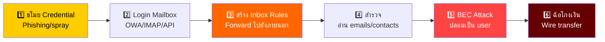
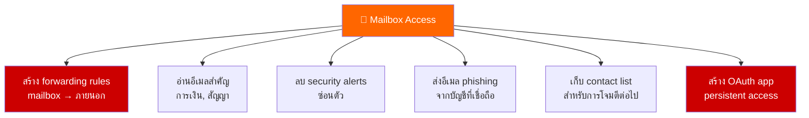
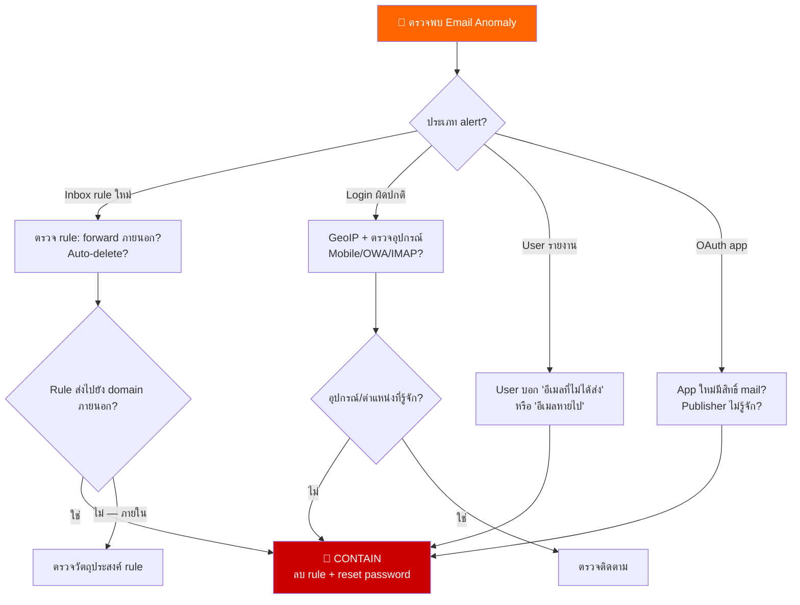
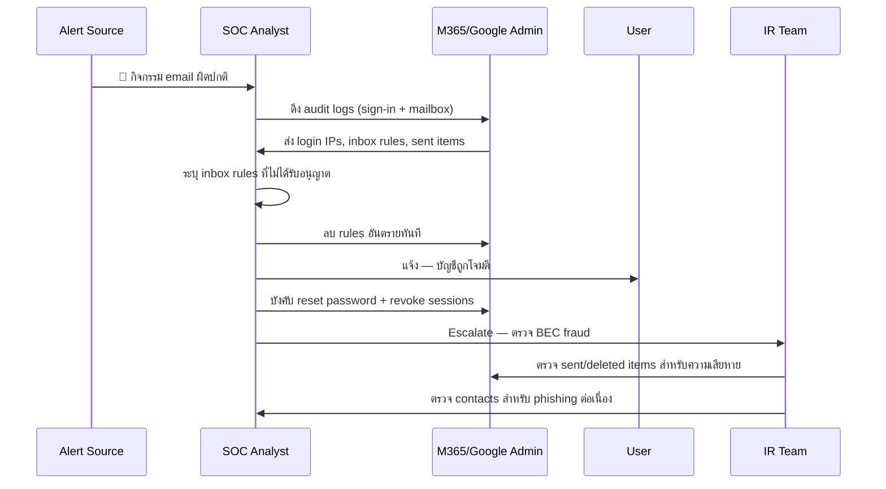
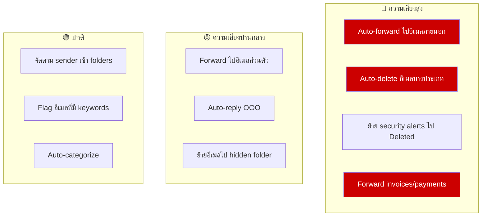
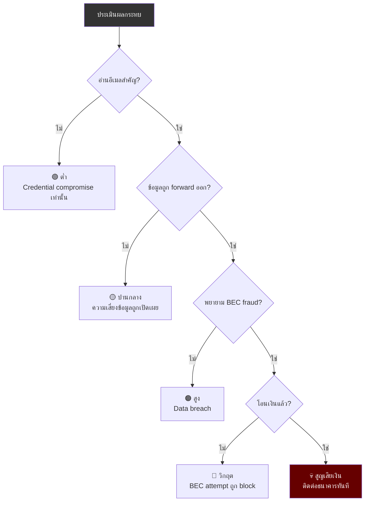

# Playbook: การตอบสนอง Email Account Takeover

**ID**: PB-42
**ความรุนแรง**: สูง | **ประเภท**: Collection / Impact
**MITRE ATT&CK**: [T1114](https://attack.mitre.org/techniques/T1114/) (Email Collection), [T1114.003](https://attack.mitre.org/techniques/T1114/003/) (Email Forwarding Rule)
**Trigger**: User รายงาน (อีเมลที่ไม่ได้ส่ง), SIEM (inbox rule ใหม่), M365/Google alert (impossible travel login ไปยัง mail), DLP (ข้อมูลสำคัญถูก forward)

> ⚠️ **วิกฤต**: Email account takeover เปิดทาง BEC fraud, ขโมยข้อมูลผ่าน forwarding rules, และโจมตี supply chain ผ่าน contacts

### Email Takeover Attack Flow


```mermaid
graph LR
    A["1️⃣ ขโมย Credential\nPhishing/spray"] --> B["2️⃣ Login Mailbox\nOWA/IMAP/API"]
    B --> C["3️⃣ สร้าง Inbox Rules\nForward ไปยังภายนอก"]
    C --> D["4️⃣ สำรวจ\nอ่าน emails/contacts"]
    D --> E["5️⃣ BEC Attack\nปลอมเป็น user"]
    E --> F["6️⃣ ฉ้อโกงเงิน\nWire transfer"]
    style A fill:#ffcc00,color:#000
    style C fill:#ff6600,color:#fff
    style E fill:#ff4444,color:#fff
    style F fill:#660000,color:#fff
```

### กิจกรรมของผู้โจมตีใน Mailbox


```mermaid
graph TD
    Access["📧 Mailbox Access"] --> Rules["สร้าง forwarding rules\nmailbox → ภายนอก"]
    Access --> Read["อ่านอีเมลสำคัญ\nการเงิน, สัญญา"]
    Access --> Delete["ลบ security alerts\nซ่อนตัว"]
    Access --> Send["ส่งอีเมล phishing\nจากบัญชีที่เชื่อถือ"]
    Access --> Contacts["เก็บ contact list\nสำหรับการโจมตีต่อไป"]
    Access --> OAuth["สร้าง OAuth app\npersistent access"]
    style Access fill:#ff6600,color:#fff
    style Rules fill:#cc0000,color:#fff
    style OAuth fill:#cc0000,color:#fff
```

---

## Decision Flow


```mermaid
graph TD
    Alert["🚨 ตรวจพบ Email Anomaly"] --> Type{"ประเภท alert?"}
    Type -->|"Inbox rule ใหม่"| Rule["ตรวจ rule: forward ภายนอก?\nAuto-delete?"]
    Type -->|"Login ผิดปกติ"| Login["GeoIP + ตรวจอุปกรณ์\nMobile/OWA/IMAP?"]
    Type -->|"User รายงาน"| Report["User บอก 'อีเมลที่ไม่ได้ส่ง'\nหรือ 'อีเมลหายไป'"]
    Type -->|"OAuth app"| OAuth["App ใหม่มีสิทธิ์ mail?\nPublisher ไม่รู้จัก?"]
    Rule --> Malicious{"Rule ส่งไปยัง domain ภายนอก?"}
    Malicious -->|ใช่| Contain["🔴 CONTAIN\nลบ rule + reset password"]
    Malicious -->|"ไม่ — ภายใน"| Review["ตรวจวัตถุประสงค์ rule"]
    Login --> Known{"อุปกรณ์/ตำแหน่งที่รู้จัก?"}
    Known -->|ไม่| Contain
    Known -->|ใช่| Monitor["ตรวจติดตาม"]
    Report --> Contain
    OAuth --> Contain
    style Alert fill:#ff6600,color:#fff
    style Contain fill:#cc0000,color:#fff
```

### ขั้นตอนการสืบสวน


```mermaid
sequenceDiagram
    participant Alert as Alert Source
    participant SOC as SOC Analyst
    participant M365 as M365/Google Admin
    participant User
    participant IR as IR Team

    Alert->>SOC: 🚨 กิจกรรม email ผิดปกติ
    SOC->>M365: ดึง audit logs (sign-in + mailbox)
    M365->>SOC: ส่ง login IPs, inbox rules, sent items
    SOC->>SOC: ระบุ inbox rules ที่ไม่ได้รับอนุญาต
    SOC->>M365: ลบ rules อันตรายทันที
    SOC->>User: แจ้ง — บัญชีถูกโจมตี
    SOC->>M365: บังคับ reset password + revoke sessions
    SOC->>IR: Escalate — ตรวจ BEC fraud
    IR->>M365: ตรวจ sent/deleted items สำหรับความเสียหาย
    IR->>SOC: ตรวจ contacts สำหรับ phishing ต่อเนื่อง
```

### ประเภท Email Rules ที่ต้องจับตา


```mermaid
graph TD
    subgraph "🔴 ความเสี่ยงสูง"
        R1["Auto-forward ไปอีเมลภายนอก"]
        R2["Auto-delete อีเมลบางประเภท"]
        R3["ย้าย security alerts ไป Deleted"]
        R4["Forward invoices/payments"]
    end
    subgraph "🟡 ความเสี่ยงปานกลาง"
        R5["Forward ไปอีเมลส่วนตัว"]
        R6["Auto-reply OOO"]
        R7["ย้ายอีเมลไป hidden folder"]
    end
    subgraph "🟢 ปกติ"
        R8["จัดตาม sender เข้า folders"]
        R9["Flag อีเมลที่มี keywords"]
        R10["Auto-categorize"]
    end
    style R1 fill:#cc0000,color:#fff
    style R2 fill:#cc0000,color:#fff
    style R4 fill:#cc0000,color:#fff
```

### การประเมินผลกระทบ


```mermaid
graph TD
    Impact["ประเมินผลกระทบ"] --> DataRead{"อ่านอีเมลสำคัญ?"}
    DataRead -->|ไม่| Low["🟢 ต่ำ\nCredential compromise เท่านั้น"]
    DataRead -->|ใช่| Forward{"ข้อมูลถูก forward ออก?"}
    Forward -->|ไม่| Med["🟡 ปานกลาง\nความเสี่ยงข้อมูลถูกเปิดเผย"]
    Forward -->|ใช่| BEC{"พยายาม BEC fraud?"}
    BEC -->|ไม่| High["🟠 สูง\nData breach"]
    BEC -->|ใช่| Money{"โอนเงินแล้ว?"}
    Money -->|ไม่| VHigh["🔴 วิกฤต\nBEC attempt ถูก block"]
    Money -->|ใช่| Cat["💀 สูญเสียเงิน\nติดต่อธนาคารทันที"]
    style Impact fill:#333,color:#fff
    style Cat fill:#660000,color:#fff
```

### Timeline การตอบสนอง


```mermaid
gantt
    title Email Account Takeover Response
    dateFormat HH:mm
    axisFormat %H:%M
    section Detection
        ได้รับ alert             :a1, 00:00, 5min
        ยืนยันไม่ได้รับอนุญาต   :a2, after a1, 10min
    section Containment
        ลบ inbox rules          :a3, after a2, 5min
        Reset password & MFA    :a4, after a3, 10min
        Revoke OAuth apps       :a5, after a4, 10min
    section Investigation
        Audit mailbox activity  :a6, after a5, 60min
        ตรวจ sent/deleted       :a7, after a6, 30min
        ประเมิน BEC risk        :a8, after a7, 60min
    section Recovery
        แจ้งผู้ที่ได้รับผลกระทบ  :a9, after a8, 30min
```

---

## 1. การดำเนินการทันที (15 นาทีแรก)

| # | การดำเนินการ | ผู้รับผิดชอบ |
|:---|:---|:---|
| 1 | ลบ inbox rules ที่น่าสงสัยทั้งหมด (forwarding, auto-delete) | M365/Google Admin |
| 2 | Reset password ทันที | IAM Team |
| 3 | Revoke active sessions และ tokens ทั้งหมด | M365/Google Admin |
| 4 | Revoke OAuth/app permissions ที่ไม่รู้จัก | M365/Google Admin |
| 5 | Enroll MFA ใหม่ด้วยอุปกรณ์/วิธีใหม่ | IAM Team |
| 6 | ตรวจ Sent และ Deleted Items สำหรับกิจกรรมของผู้โจมตี | SOC T2 |

## 2. รายการตรวจสอบ

### Mailbox Audit
- [ ] Sign-in logs: IP addresses, อุปกรณ์, ตำแหน่ง, timestamps
- [ ] Inbox rules สร้าง/แก้ไข: forwarding destinations
- [ ] Sent Items: อีเมลที่ผู้โจมตีส่ง (phishing, BEC)
- [ ] Deleted Items: security alerts หรือหลักฐานที่ลบ
- [ ] OAuth/App permissions: apps ไม่รู้จักที่มี mail.read scope
- [ ] Delegate access: users อื่นที่เพิ่มเป็น delegates

### การประเมิน BEC
- [ ] มีคำสั่งทางการเงินถูกส่งหรือไม่ (wire transfer, invoice change)?
- [ ] มีการปลอมเป็น vendor/partner หรือไม่?
- [ ] ผู้โจมตีติดตาม email threads เฉพาะ (invoice, contract) หรือไม่?
- [ ] มี contacts ถูก phish จากบัญชีนี้หรือไม่?

## 3. การควบคุม (Containment)

| ขอบเขต | การดำเนินการ |
|:---|:---|
| **Inbox rules** | ลบ forwarding/delete rules ทั้งหมด |
| **Password** | บังคับ reset + MFA re-enrollment |
| **Sessions** | Revoke active sessions/tokens ทั้งหมด |
| **OAuth** | ลบ app permissions ที่ไม่รู้จัก |
| **Delegates** | ลบ delegate access ที่ไม่ได้รับอนุญาต |

### การยืนยันการกู้คืน
- [ ] ยืนยันว่า inbox rules ที่เป็นอันตรายถูกลบ
- [ ] ยืนยัน OAuth apps ที่ไม่ได้รับอนุญาตถูกเพิกถอน
- [ ] ตรวจ login history 7 วันหลังกู้คืน
- [ ] ยืนยัน MFA ทำงานบนทุกช่องทาง
- [ ] แจ้งผู้ติดต่อภายนอกเรื่อง compromise ถ้าจำเป็น

## 4. Evidence Checklist

| ประเภทหลักฐาน | สิ่งที่ต้องเก็บ | แหล่งข้อมูล | เหตุผลที่ต้องเก็บ |
|:---|:---|:---|:---|
| หลักฐาน mailbox | inbox rule, forwarding, delegate, sent/deleted item, audit trail | Mailbox audit / admin console | ใช้ดู persistence และการกระทำของ attacker ใน mailbox |
| หลักฐานด้านตัวตน | sign-in, MFA event, session ID, device, IP, OAuth app | IdP / sign-in logs | ใช้แยก mailbox-only abuse ออกจาก identity compromise เต็มรูปแบบ |
| หลักฐาน message flow | phishing email ที่ส่งออก, recipient list, external forwarding, purge result | Message trace / gateway | ใช้ดู blast radius และผู้ได้รับผลกระทบต่อเนื่อง |
| หลักฐานการเปิดเผยข้อมูล | sensitive mailbox, attachment viewed/downloaded, thread monitoring | Mailbox audit / DLP | ใช้รองรับ legal และ business impact assessment |
| หลักฐาน fraud ทางธุรกิจ | invoice thread, payment request, partner impersonation, callback record | Finance / ticketing / call logs | ใช้ดูว่าเหตุยกระดับไปเป็น BEC หรือ vendor fraud หรือไม่ |

## 5. Minimum Telemetry Required

| แหล่ง Telemetry | ใช้เพื่ออะไร | ความสำคัญ | Blind Spot ถ้าไม่มี |
|:---|:---|:---:|:---|
| Mailbox audit และ message trace | ดู rule, forwarding, sent mail, purge scope, delegate change | Required | scope ของ mailbox abuse ไม่ชัด |
| Identity provider sign-in logs | ดู login source, MFA, session anomaly, OAuth grant | Required | บอกไม่ได้ว่าถูกยึดบัญชีมาอย่างไร |
| Email gateway และ DLP telemetry | ดู outbound phishing, attachment access, sensitive content | Required | ประเมิน downstream impact และ data exposure ไม่ได้ |
| Helpdesk และ finance workflow records | ดู verification control, user-reported anomaly, callback evidence | Recommended | บริบท fraud และ process failure อ่อน |
| Threat intel และ domain monitoring | ดู lookalike domain, campaign overlap, sender reputation | Recommended | มอง broader campaign ช้าลง |

## 6. False Positive และ Tuning Guide

| Scenario | ทำไมจึงดูน่าสงสัย | วิธีตรวจสอบ | Tuning Action | ต้องยกระดับเมื่อ |
|:---|:---|:---|:---|:---|
| forwarding หรือ delegate change ที่ได้รับอนุมัติ | workflow ของผู้บริหารหรือ admin อาจใช้ delegation จริง | ยืนยัน ticket, approver, และ target ที่แน่นอน | suppress เฉพาะ change ที่อนุมัติใน mailbox ที่ระบุ | target เป็น external, ซ่อนอยู่, หรืออยู่นอก workflow |
| ผู้ใช้จัดการ rule ใน mailbox เอง | folder/filter rule บางแบบดูเหมือน abuse | ยืนยันกับผู้ใช้และดูว่าไม่ได้ redirect/delete mail สำคัญ | tune เฉพาะ rule จัดหมวดที่ benign | rule ลบ alert, forward ออกนอกองค์กร, หรือซ่อน invoice/security mail |
| enroll mobile mail client ใหม่ | app consent และ session ใหม่อาจดูเหมือน compromise | ยืนยัน enrollment และ approved app ID | allowlist client app และ enrollment window แบบแคบ | app ขอ scope เสี่ยงหรือ session มาจาก geo/device แปลก |
| การเข้าถึงเพื่อ compliance หรือ eDiscovery | legal review อาจทำให้มี mailbox access จำนวนมาก | ยืนยัน case ID, reviewer identity, และ mailbox scope | ลด severity เฉพาะ workflow ทางกฎหมายที่ documented | access เกิน scope หรือมี external forwarding/export |

## 7. หลังเหตุการณ์ (Post-Incident)

| คำถาม | คำตอบ |
|:---|:---|
| Email credentials ถูกโจมตีอย่างไร? | [Phishing/spray/leak] |
| Inbox rule alerts กำหนดค่าอยู่หรือไม่? | [ใช่/ไม่] |
| Conditional access policy บังคับใช้อยู่หรือไม่? | [สถานะ] |
| มี financial controls (dual approval) หรือไม่? | [สถานะ] |

## 8. Detection Rules (Sigma)

```yaml
title: Suspicious Email Forwarding Rule Created
logsource:
    product: m365
    service: exchange
detection:
    selection:
        Operation: 'New-InboxRule'
        Parameters|contains:
            - 'ForwardTo'
            - 'RedirectTo'
            - 'ForwardAsAttachmentTo'
    condition: selection
    level: high
```

## เอกสารที่เกี่ยวข้อง
- [BEC Playbook](BEC.th.md)
- [Account Compromise Playbook](Account_Compromise.th.md)
- [Phishing Playbook](Phishing.th.md)
- [MFA Bypass Playbook](MFA_Bypass.th.md)

## References
- [MITRE T1114 — Email Collection](https://attack.mitre.org/techniques/T1114/)
- [Microsoft — Detect Email Compromise](https://learn.microsoft.com/en-us/microsoft-365/security/)
