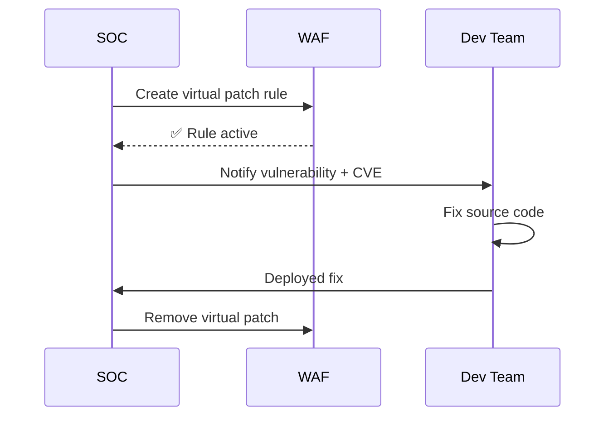
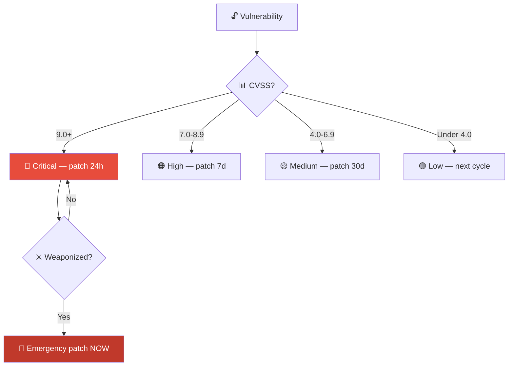
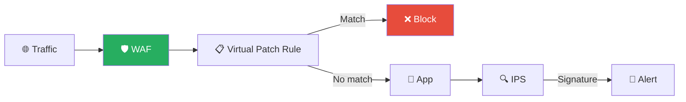

# Playbook: Vulnerability Exploitation

**ID**: PB-18
**Severity**: High/Critical | **Category**: Vulnerability Management
**MITRE ATT&CK**: [T1190](https://attack.mitre.org/techniques/T1190/) (Exploit Public-Facing Application), [T1203](https://attack.mitre.org/techniques/T1203/) (Exploitation for Client Execution)
**Trigger**: IDS/IPS alert, EDR detection, vulnerability scan, TI advisory, WAF block

### Exploit Lifecycle

```mermaid
graph LR
    Disc["🔍 Vuln Discovered"] --> PoC["💻 Public PoC"]
    PoC --> Wild["🌐 In-the-Wild"]
    Wild --> Patch["🩹 Vendor Patch"]
    Patch --> Apply["✅ Patch Applied"]
    style Disc fill:#3498db,color:#fff
    style Wild fill:#e74c3c,color:#fff
    style Apply fill:#27ae60,color:#fff
```

### Virtual Patching Flow

```mermaid
sequenceDiagram
    participant SOC
    participant WAF
    participant Dev as Dev Team
    SOC->>WAF: Create virtual patch rule
    WAF-->>SOC: ✅ Rule active
    SOC->>Dev: Notify vulnerability + CVE
    Dev->>Dev: Fix source code
    Dev->>SOC: Deployed fix
    SOC->>WAF: Remove virtual patch
```

---

## Decision Flow

```mermaid
graph TD
    Alert["🚨 Exploit Attempt Detected"] --> CVE["🔍 Identify CVE"]
    CVE --> Vuln{"🎯 Is Target Vulnerable?"}
    Vuln -->|Patched / Not Affected| Attempt["🟡 Blocked Attempt"]
    Vuln -->|Vulnerable| Response{"📊 Exploit Successful?"}
    Response -->|200 OK / Shell / Payload| Success["🔴 Successful Exploitation"]
    Response -->|Blocked (403/Drop)| Attempt
    Response -->|Error (500)| Partial["🟠 Investigate Further"]
    Attempt --> Block["🚫 Block Attacker IP"]
    Success --> Type{"💥 Exploit Impact?"}
    Type -->|RCE| RCE["🚨 Isolate + Major Response"]
    Type -->|Info Disclosure| Info["🛡️ Block + Patch"]
    Type -->|DoS| DoS["⚙️ Mitigate + Patch"]
    Partial --> Type
    RCE --> FullIR["Full Incident Response"]
```

---

## 1. Analysis

### 1.1 CVE / Vulnerability Identification

| Check | How | Done |
|:---|:---|:---:|
| Identify CVE number from alert/signature | IPS/IDS/WAF | ☐ |
| Check CVSS score and severity | NVD, vendor advisory | ☐ |
| Is it in CISA KEV (Known Exploited Vulnerabilities)? | [CISA KEV](https://www.cisa.gov/known-exploited-vulnerabilities-catalog) | ☐ |
| Is public PoC exploit available? | GitHub, ExploitDB | ☐ |
| Check if active exploitation in the wild | TI feeds, advisories | ☐ |

### 1.2 Target Assessment

| Check | How | Done |
|:---|:---|:---:|
| Is the target system affected? (version/config) | CMDB, vulnerability scanner | ☐ |
| Is the vulnerable service exposed externally? | Firewall rules, Shodan | ☐ |
| What is the asset criticality? | CMDB, business context | ☐ |
| Is the target already patched? | Patch management system | ☐ |
| Were compensating controls in place? (WAF, segmentation) | Security architecture | ☐ |

### 1.3 Exploitation Evidence

| Evidence | What to Look For | Done |
|:---|:---|:---:|
| Network payload | Exploit signature in IPS/IDS logs | ☐ |
| Server response | Success indicators (reverse shell, data leak) | ☐ |
| Process creation | New processes spawned after exploit | ☐ |
| File creation | Web shells, payloads dropped to disk | ☐ |
| Outbound connections | C2 callbacks from exploited server | ☐ |
| Post-exploitation | Credential dumping, lateral movement | ☐ |

---

## 2. Containment

### 2.1 Exploit Attempt (Blocked)

| # | Action | Tool | Done |
|:---:|:---|:---|:---:|
| 1 | Block attacker IP | Firewall | ☐ |
| 2 | Update IPS/WAF signatures | IPS / WAF | ☐ |
| 3 | Alert vulnerability management to prioritize patching | Ticket | ☐ |

### 2.2 Successful Exploitation

| # | Action | Tool | Done |
|:---:|:---|:---|:---:|
| 1 | **Isolate exploited system** immediately | EDR / Firewall | ☐ |
| 2 | Block attacker IP and any C2 indicators | Firewall | ☐ |
| 3 | **Apply virtual patch** at WAF/IPS | WAF / IPS | ☐ |
| 4 | Disable vulnerable service if possible | System admin | ☐ |
| 5 | Capture memory dump and disk image | Forensics | ☐ |
| 6 | Check for lateral movement from exploited host | [PB-12](Lateral_Movement.en.md) | ☐ |

### 2.3 Zero-Day (No Patch Available)

| # | Action | Done |
|:---:|:---|:---:|
| 1 | Apply workaround from vendor advisory (disable feature, config change) | ☐ |
| 2 | Deploy custom WAF/IPS rule for exploit pattern | ☐ |
| 3 | Segment affected systems from network | ☐ |
| 4 | Enable enhanced monitoring / logging | ☐ |
| 5 | Report to vendor and request emergency patch | ☐ |

---

## 3. Eradication

| # | Action | Done |
|:---:|:---|:---:|
| 1 | **Apply official patch** from vendor | ☐ |
| 2 | Remove any web shells, backdoors, or dropped payloads | ☐ |
| 3 | Reset credentials on the exploited system | ☐ |
| 4 | Scan for other vulnerable instances in environment | ☐ |
| 5 | Check for persistence mechanisms installed by attacker | ☐ |

---

## 4. Recovery

| # | Action | Done |
|:---:|:---|:---:|
| 1 | Run vulnerability scan to confirm patch applied | ☐ |
| 2 | Test application functionality after patching | ☐ |
| 3 | Reconnect system to network in stages | ☐ |
| 4 | Monitor for re-exploitation attempts for 72 hours | ☐ |
| 5 | Update asset inventory with patch status | ☐ |

---

## 5. IoC Collection

| Type | Value | Source |
|:---|:---|:---|
| CVE Number | | IPS / Advisory |
| Attacker IP | | Firewall / IPS |
| Exploit Payload | | IPS / WAF logs |
| Target System | | Alert |
| Dropped Files (hash) | | EDR / Forensics |
| C2 Indicators | | Network logs |
| Post-exploitation Tools | | EDR |

---

## 6. Evidence Checklist

| Evidence Type | What to Collect | Source | Why It Matters |
|:---|:---|:---|:---|
| Exploit evidence | CVE, payload, target endpoint, request path, delivery vector | WAF / IPS / app logs | Confirms which vulnerability was used |
| Host evidence | Shells, dropped files, processes, persistence, privilege changes | EDR / forensic tools | Shows whether the exploit led to compromise |
| Scope evidence | Other vulnerable systems, same payload pattern, follow-on hosts | SIEM / vuln scanner | Determines whether this is isolated or widespread |
| Credential and data evidence | Stolen creds, accessed records, post-exploitation actions | IAM / DLP / DB audit | Supports escalation beyond exploit attempt |
| Vendor and patch evidence | Advisory, workaround state, patch availability | Vendor advisory / vuln mgmt | Guides containment and recovery decisions |

---

## 7. Minimum Telemetry Required

| Telemetry Source | Required For | Priority | Blind Spot If Missing |
|:---|:---|:---:|:---|
| WAF, IDS/IPS, and access logs | Payload, source, exploit pattern, blocked/passed status | Required | Cannot validate exploitation attempt characteristics |
| Endpoint and host telemetry | Web shell, dropped files, execution, persistence | Required | Successful compromise may be missed |
| Vulnerability and asset context | Exposure, patch state, affected systems | Required | Cannot scope which systems remain at risk |
| Network telemetry | C2 or follow-on communications after exploit | Recommended | Post-exploitation behavior may remain hidden |
| Change-management records | Planned maintenance and mitigation context | Recommended | Analysts may misread authorized workaround activity |

---

## 8. False Positive and Tuning Guide

| Scenario | Why It Looks Suspicious | How to Validate | Tuning Action | Escalate If |
|:---|:---|:---|:---|:---|
| Vulnerability scan | Scanner payloads look like real exploits | Confirm source, schedule, and target scope | Allowlist scanner sources and headers within approved windows | Payloads hit unapproved systems or trigger shell/persistence indicators |
| Pen test or red-team activity | Controlled exploitation appears real by design | Validate exercise ticket, team, and host list | Suppress only approved team IPs and time window | Activity spreads beyond scope or reaches production data unexpectedly |
| Emergency workaround deployment | Temporary config changes may resemble attacker modifications | Check change ticket and owner | Lower severity only for documented workaround actions | Same system also shows dropped files or unexplained persistence |
| QA validation after patch | Retest payloads may trigger residual alerts | Validate testing owner and release window | Tune by environment, test accounts, and endpoint scope | Attempts continue after test window or from unknown sources |

---

## 9. Escalation Criteria

| Condition | Escalate To |
|:---|:---|
| RCE with confirmed shell | CISO + Major Incident |
| Zero-day (no patch available) | CISO + Vendor + CERT |
| Critical infrastructure (DB, DC) exploited | CISO immediately |
| CISA KEV vulnerability actively exploited | Vulnerability Management + SOC Lead |
| Multiple systems exploited | Major Incident |
| Data breach through exploitation | [PB-08](Data_Exfiltration.en.md) + Legal |

---

### Exploit Severity Classification

```mermaid
graph TD
    Vuln["🔓 Vulnerability"] --> CVSS{"📊 CVSS?"}
    CVSS -->|9.0+| Critical["🔴 Critical — patch 24h"]
    CVSS -->|7.0-8.9| High["🟠 High — patch 7d"]
    CVSS -->|4.0-6.9| Medium["🟡 Medium — patch 30d"]
    CVSS -->|Under 4.0| Low["🟢 Low — next cycle"]
    Critical --> Weaponized{"⚔️ Weaponized?"}
    Weaponized -->|Yes| Emergency["🚨 Emergency patch NOW"]
    Weaponized -->|No| Critical
    style Emergency fill:#c0392b,color:#fff
    style Critical fill:#e74c3c,color:#fff
```

### Virtual Patching Architecture

```mermaid
graph LR
    Traffic["🌐 Traffic"] --> WAF["🛡️ WAF"]
    WAF --> VPatch["📋 Virtual Patch Rule"]
    VPatch -->|Match| Block["❌ Block"]
    VPatch -->|No match| App["📱 App"]
    App --> IPS["🔍 IPS"]
    IPS -->|Signature| Alert["🚨 Alert"]
    style WAF fill:#27ae60,color:#fff
    style Block fill:#e74c3c,color:#fff
```

## Detection Rules (Sigma)

| Rule | File |
|:---|:---|
| WAF Detected Exploit Attempt | [web_waf_exploit.yml](../../08_Detection_Engineering/sigma_rules/web_waf_exploit.yml) |
| Execution from Temp/Downloads | [proc_temp_folder_execution.yml](../../08_Detection_Engineering/sigma_rules/proc_temp_folder_execution.yml) |

## Related Documents

- [IR Framework](../Framework.en.md)
- [Incident Report](../../11_Reporting_Templates/incident_report.en.md)
- [PB-10 Web Attack](Web_Attack.en.md)
- [PB-12 Lateral Movement](Lateral_Movement.en.md)
- [PB-13 C2 Communication](C2_Communication.en.md)

## References

- [MITRE ATT&CK T1190 — Exploit Public-Facing Application](https://attack.mitre.org/techniques/T1190/)
- [CISA Known Exploited Vulnerabilities Catalog](https://www.cisa.gov/known-exploited-vulnerabilities-catalog)
- [NVD — National Vulnerability Database](https://nvd.nist.gov/)
