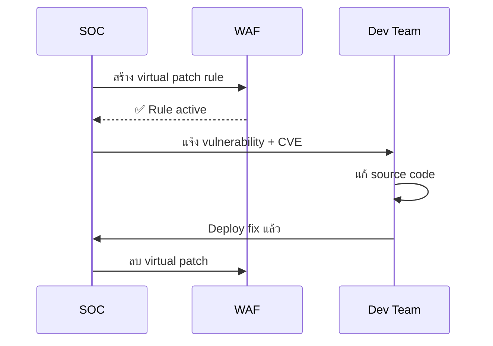
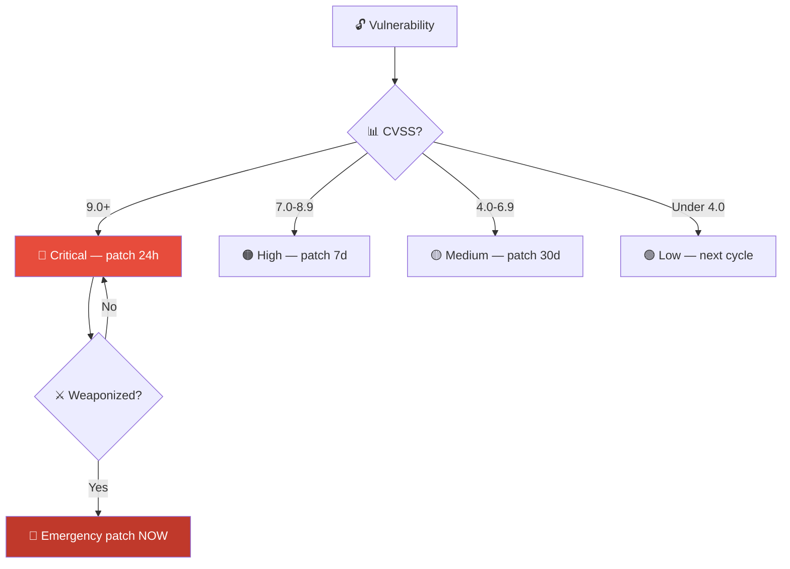
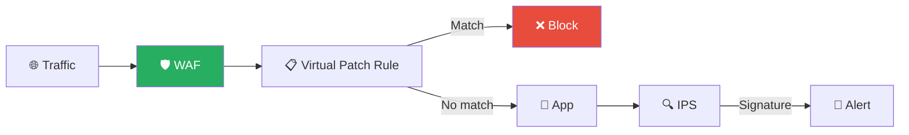

# Playbook: การใช้ช่องโหว่ (Exploit)

**ID**: PB-18
**ระดับความรุนแรง**: สูง/วิกฤต | **หมวดหมู่**: การโจมตีช่องโหว่
**MITRE ATT&CK**: [T1190](https://attack.mitre.org/techniques/T1190/) (Exploit Public-Facing App), [T1203](https://attack.mitre.org/techniques/T1203/) (Exploitation for Client Execution)
**ทริกเกอร์**: IDS/IPS alert, EDR detection, vulnerability scan, TI advisory, WAF block

### ผัง Exploit Timeline


### ผังขั้นตอน Virtual Patching



---

## ผังการตัดสินใจ

```mermaid
graph TD
    Alert["🚨 Exploit Alert"] --> Success{"💥 Exploit สำเร็จ?"}
    Success -->|ใช่| Impact{"📊 ผลกระทบ?"}
    Success -->|ไม่ (attempt)| Block["🔒 Block IP + Monitor"]
    Impact -->|RCE| Critical["🔴 Isolate ทันที"]
    Impact -->|Info Disclosure| High["🟠 Assess Data"]
    Impact -->|DoS| Medium["🟡 Mitigate + Patch"]
    Critical --> Lateral{"🔀 Lateral Movement?"}
    Lateral -->|ใช่| Major["🔴 Major Incident"]
    Lateral -->|ไม่| Contain["🔒 Contain + Patch"]
```

---

## 1. การวิเคราะห์

### 1.1 ประเภทการโจมตีช่องโหว่

| ประเภท | ลักษณะ | ความรุนแรง |
|:---|:---|:---|
| **Remote Code Execution (RCE)** | รันโค้ดจากระยะไกล | 🔴 วิกฤต |
| **Local Privilege Escalation (LPE)** | ยกระดับสิทธิ์ | 🔴 สูง |
| **SQL Injection** | เข้าถึงฐานข้อมูล | 🔴 สูง |
| **Path Traversal** | อ่านไฟล์ระบบ | 🟠 สูง |
| **SSRF** | เข้าถึง internal resources | 🔴 สูง |
| **Deserialization** | Object injection → RCE | 🔴 วิกฤต |
| **Authentication Bypass** | เข้าระบบโดยไม่ต้อง login | 🔴 วิกฤต |

### 1.2 รายการตรวจสอบ

| รายการ | วิธีตรวจสอบ | เสร็จ |
|:---|:---|:---:|
| CVE ID | Advisory / IDS signature | ☐ |
| CVSS score + attack vector | NVD | ☐ |
| ซอฟต์แวร์และเวอร์ชันที่ได้รับผลกระทบ | CMDB | ☐ |
| อยู่ใน CISA KEV? | [KEV catalog](https://www.cisa.gov/known-exploited-vulnerabilities-catalog) | ☐ |
| Exploit สำเร็จ หรือ attempt เท่านั้น? | IDS/EDR analysis | ☐ |
| หาก RCE → process tree ของ exploit | EDR | ☐ |
| มี web shell ถูกวาง? | EDR / File integrity | ☐ |
| มี lateral movement? | SIEM correlation | ☐ |
| มี data access / exfil? | DLP / DB audit logs | ☐ |

---

## 2. การควบคุม

### 2.1 Exploit Attempt (ไม่สำเร็จ)

| # | การดำเนินการ | เสร็จ |
|:---:|:---|:---:|
| 1 | **Block** source IP ที่ WAF/IPS/firewall | ☐ |
| 2 | **ตรวจ** ว่ายังมี attempt อื่นจาก IP เดียวกัน | ☐ |
| 3 | **เพิ่ม** IPS/WAF rule สำหรับ exploit pattern | ☐ |

### 2.2 Exploit สำเร็จ

| # | การดำเนินการ | เสร็จ |
|:---:|:---|:---:|
| 1 | **Isolate** ระบบที่ถูกโจมตี | ☐ |
| 2 | **Virtual patch** — IPS/WAF rule สำหรับ CVE | ☐ |
| 3 | **Block** source IP ที่ firewall | ☐ |
| 4 | **จำกัด network access** ไปยังระบบเดียวกันที่มีช่องโหว่ | ☐ |
| 5 | **ค้นหา web shell** / backdoor | ☐ |

---

## 3. การกำจัด

| # | การดำเนินการ | เสร็จ |
|:---:|:---|:---:|
| 1 | **Patch** ให้เร็วที่สุด (Emergency Change) | ☐ |
| 2 | ลบ web shell / backdoor | ☐ |
| 3 | ลบ persistence ที่สร้างระหว่าง post-exploitation | ☐ |
| 4 | ตรวจ lateral movement → กำจัดบน host อื่น | ☐ |
| 5 | หมุนเวียน credentials ที่อาจถูกขโมย | ☐ |

---

## 4. การฟื้นฟู

| # | การดำเนินการ | เสร็จ |
|:---:|:---|:---:|
| 1 | ยืนยันว่า patch ถูกต้อง (vulnerability scan) | ☐ |
| 2 | **เปิด automated patching** สำหรับ OS / middleware | ☐ |
| 3 | เปิด **WAF** สำหรับ web applications | ☐ |
| 4 | ตั้ง **vulnerability scan** รายสัปดาห์ | ☐ |
| 5 | ลด attack surface (ปิด port/service ที่ไม่ใช้) | ☐ |

---

## 5. เกณฑ์การยกระดับ

| เงื่อนไข | ยกระดับไปยัง |
|:---|:---|
| RCE สำเร็จ → compromise ยืนยัน | Major Incident |
| Web shell พบบน production | SOC Lead + CISO |
| Zero-day (ไม่มี patch) | [PB-24 Zero-Day](Zero_Day_Exploit.th.md) + CISO |
| หลายระบบถูก exploit | Major Incident |
| ข้อมูลถูกเข้าถึง | Legal + DPO |

---

### ผัง Exploit Severity Classification



### ผัง Virtual Patching Architecture



## เอกสารที่เกี่ยวข้อง

- [กรอบการตอบสนองต่อเหตุการณ์](../Framework.th.md)
- [PB-24 Zero-Day Exploit](Zero_Day_Exploit.th.md)
- [PB-10 Web Attack](Web_Attack.th.md)

## อ้างอิง

- [CISA KEV](https://www.cisa.gov/known-exploited-vulnerabilities-catalog)
- [MITRE ATT&CK T1190](https://attack.mitre.org/techniques/T1190/)
