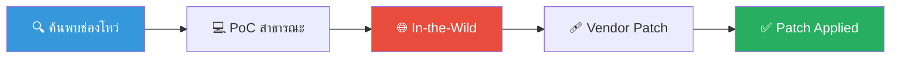
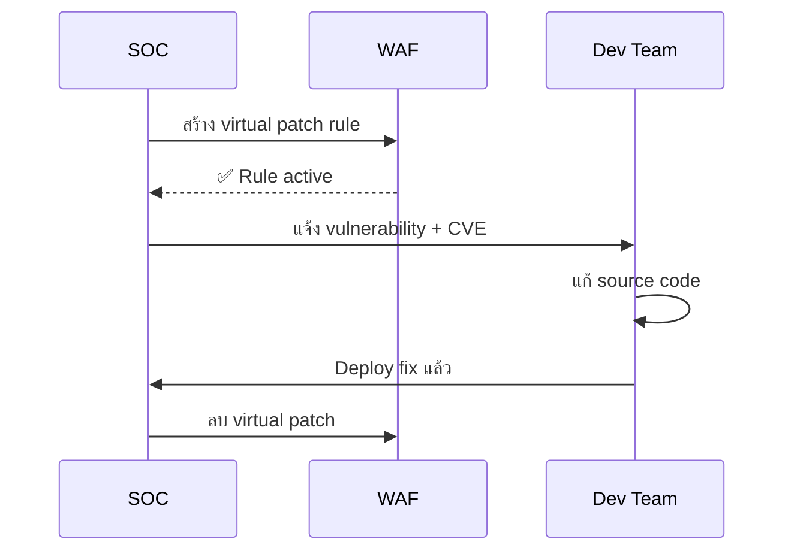
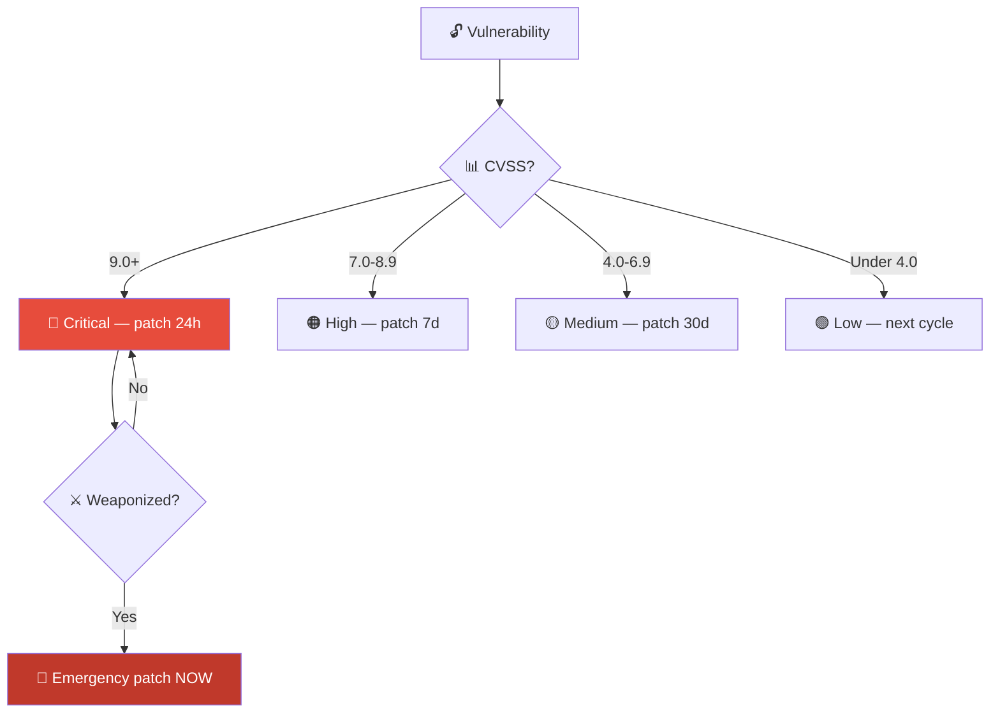
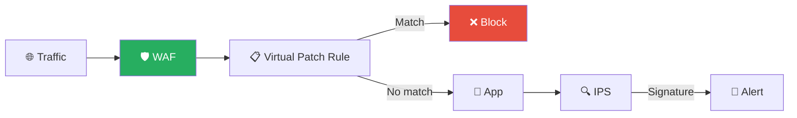

# Playbook: การใช้ช่องโหว่ (Exploit)

**ID**: PB-18
**ระดับความรุนแรง**: สูง/วิกฤต | **หมวดหมู่**: การโจมตีช่องโหว่
**MITRE ATT&CK**: [T1190](https://attack.mitre.org/techniques/T1190/) (Exploit Public-Facing App), [T1203](https://attack.mitre.org/techniques/T1203/) (Exploitation for Client Execution)
**ทริกเกอร์**: IDS/IPS alert, EDR detection, vulnerability scan, TI advisory, WAF block

## หลังเหตุการณ์ (Post-Incident)

- [ ] Patch vulnerability ที่ถูกใช้โจมตี
- [ ] สแกนหา vulnerable systems อื่นๆ ด้วย vulnerability scanner
- [ ] อัพเดท IDS/IPS signatures
- [ ] ใช้ virtual patching ถ้ายังไม่สามารถ patch ได้
- [ ] ทบทวน patch management process
- [ ] จัดทำ [Incident Report](../../11_Reporting_Templates/incident_report.th.md)

### ผัง Exploit Timeline

```mermaid
graph LR
    Disc["🔍 ค้นพบช่องโหว่"] --> PoC["💻 PoC สาธารณะ"]
    PoC --> Wild["🌐 In-the-Wild"]
    Wild --> Patch["🩹 Vendor Patch"]
    Patch --> Apply["✅ Patch Applied"]
    style Disc fill:#3498db,color:#fff
    style Wild fill:#e74c3c,color:#fff
    style Apply fill:#27ae60,color:#fff
```

### ผังขั้นตอน Virtual Patching

```mermaid
sequenceDiagram
    participant SOC
    participant WAF
    participant Dev as Dev Team
    SOC->>WAF: สร้าง virtual patch rule
    WAF-->>SOC: ✅ Rule active
    SOC->>Dev: แจ้ง vulnerability + CVE
    Dev->>Dev: แก้ source code
    Dev->>SOC: Deploy fix แล้ว
    SOC->>WAF: ลบ virtual patch
```

---

## ผังการตัดสินใจ

```mermaid
graph TD
    Alert["🚨 Exploit Alert"] --> Success{"💥 Exploit สำเร็จ?"}
    Success -->|ใช่| Impact{"📊 ผลกระทบ?"}
    Success -->|ไม่ (attempt)| Block["🔒 Block IP + Monitor"]
    Impact -->|RCE| Critical["🔴 Isolate ทันที"]
    Impact -->|Info Disclosure| High["🟠 Assess Data"]
    Impact -->|DoS| Medium["🟡 Mitigate + Patch"]
    Critical --> Lateral{"🔀 Lateral Movement?"}
    Lateral -->|ใช่| Major["🔴 Major Incident"]
    Lateral -->|ไม่| Contain["🔒 Contain + Patch"]
```

---

## 1. การวิเคราะห์

### 1.1 ประเภทการโจมตีช่องโหว่

| ประเภท | ลักษณะ | ความรุนแรง |
|:---|:---|:---|
| **Remote Code Execution (RCE)** | รันโค้ดจากระยะไกล | 🔴 วิกฤต |
| **Local Privilege Escalation (LPE)** | ยกระดับสิทธิ์ | 🔴 สูง |
| **SQL Injection** | เข้าถึงฐานข้อมูล | 🔴 สูง |
| **Path Traversal** | อ่านไฟล์ระบบ | 🟠 สูง |
| **SSRF** | เข้าถึง internal resources | 🔴 สูง |
| **Deserialization** | Object injection → RCE | 🔴 วิกฤต |
| **Authentication Bypass** | เข้าระบบโดยไม่ต้อง login | 🔴 วิกฤต |

### 1.2 รายการตรวจสอบ

| รายการ | วิธีตรวจสอบ | เสร็จ |
|:---|:---|:---:|
| CVE ID | Advisory / IDS signature | ☐ |
| CVSS score + attack vector | NVD | ☐ |
| ซอฟต์แวร์และเวอร์ชันที่ได้รับผลกระทบ | CMDB | ☐ |
| อยู่ใน CISA KEV? | [KEV catalog](https://www.cisa.gov/known-exploited-vulnerabilities-catalog) | ☐ |
| Exploit สำเร็จ หรือ attempt เท่านั้น? | IDS/EDR analysis | ☐ |
| หาก RCE → process tree ของ exploit | EDR | ☐ |
| มี web shell ถูกวาง? | EDR / File integrity | ☐ |
| มี lateral movement? | SIEM correlation | ☐ |
| มี data access / exfil? | DLP / DB audit logs | ☐ |

---

## 2. การควบคุม

### 2.1 Exploit Attempt (ไม่สำเร็จ)

| # | การดำเนินการ | เสร็จ |
|:---:|:---|:---:|
| 1 | **Block** source IP ที่ WAF/IPS/firewall | ☐ |
| 2 | **ตรวจ** ว่ายังมี attempt อื่นจาก IP เดียวกัน | ☐ |
| 3 | **เพิ่ม** IPS/WAF rule สำหรับ exploit pattern | ☐ |

### 2.2 Exploit สำเร็จ

| # | การดำเนินการ | เสร็จ |
|:---:|:---|:---:|
| 1 | **Isolate** ระบบที่ถูกโจมตี | ☐ |
| 2 | **Virtual patch** — IPS/WAF rule สำหรับ CVE | ☐ |
| 3 | **Block** source IP ที่ firewall | ☐ |
| 4 | **จำกัด network access** ไปยังระบบเดียวกันที่มีช่องโหว่ | ☐ |
| 5 | **ค้นหา web shell** / backdoor | ☐ |

---

## 3. การกำจัด

| # | การดำเนินการ | เสร็จ |
|:---:|:---|:---:|
| 1 | **Patch** ให้เร็วที่สุด (Emergency Change) | ☐ |
| 2 | ลบ web shell / backdoor | ☐ |
| 3 | ลบ persistence ที่สร้างระหว่าง post-exploitation | ☐ |
| 4 | ตรวจ lateral movement → กำจัดบน host อื่น | ☐ |
| 5 | หมุนเวียน credentials ที่อาจถูกขโมย | ☐ |

---

## 4. การฟื้นฟู

| # | การดำเนินการ | เสร็จ |
|:---:|:---|:---:|
| 1 | ยืนยันว่า patch ถูกต้อง (vulnerability scan) | ☐ |
| 2 | **เปิด automated patching** สำหรับ OS / middleware | ☐ |
| 3 | เปิด **WAF** สำหรับ web applications | ☐ |
| 4 | ตั้ง **vulnerability scan** รายสัปดาห์ | ☐ |
| 5 | ลด attack surface (ปิด port/service ที่ไม่ใช้) | ☐ |

---

## 5. Evidence Checklist

| ประเภทหลักฐาน | สิ่งที่ต้องเก็บ | แหล่งข้อมูล | เหตุผลที่ต้องเก็บ |
|:---|:---|:---|:---|
| หลักฐาน exploit | CVE, payload, target endpoint, request path, delivery vector | WAF / IPS / app logs | ใช้ยืนยันว่าช่องโหว่ใดถูกใช้ |
| หลักฐานจาก host | shell, dropped file, process, persistence, privilege change | EDR / forensic tools | ใช้ดูว่า exploit นำไปสู่ compromise แล้วหรือไม่ |
| หลักฐานด้านขอบเขต | ระบบอื่นที่เปราะบาง, payload pattern เดียวกัน, host ที่เกี่ยวข้อง | SIEM / vuln scanner | ใช้ดูว่าเป็น isolated case หรือ widespread |
| หลักฐาน credential และข้อมูล | credential ที่ถูกขโมย, record ที่เข้าถึง, post-exploitation action | IAM / DLP / DB audit | ใช้ประกอบการยกระดับเกินกว่า exploit attempt |
| หลักฐาน vendor และ patch | advisory, workaround state, patch availability | Vendor advisory / vuln mgmt | ใช้กำหนด containment และ recovery |

---

## 6. Minimum Telemetry Required

| แหล่ง Telemetry | ใช้เพื่ออะไร | ความสำคัญ | Blind Spot ถ้าไม่มี |
|:---|:---|:---:|:---|
| WAF, IDS/IPS, และ access logs | ดู payload, source, exploit pattern, blocked/passed status | Required | validate ลักษณะ exploit ไม่ได้ |
| Endpoint และ host telemetry | ดู web shell, dropped file, execution, persistence | Required | พลาด successful compromise |
| Vulnerability และ asset context | ดู exposure, patch state, ระบบที่ได้รับผลกระทบ | Required | scope ระบบเสี่ยงไม่ชัด |
| Network telemetry | ดู C2 หรือ traffic หลัง exploit | Recommended | พลาด post-exploitation behavior |
| Change-management records | ดู maintenance หรือ mitigation context | Recommended | อาจตี workaround ที่อนุมัติเป็น incident |

---

## 7. False Positive และ Tuning Guide

| Scenario | ทำไมจึงดูน่าสงสัย | วิธีตรวจสอบ | Tuning Action | ต้องยกระดับเมื่อ |
|:---|:---|:---|:---|:---|
| vulnerability scan | scanner payload ดูเหมือน exploit จริง | ยืนยัน source, schedule, และ target scope | allowlist scanner source/header ในช่วงเวลาที่อนุมัติ | payload โผล่นอกเวลา หรือเกิด shell/persistence |
| pen test หรือ red-team activity | exploitation ที่ควบคุมแล้วยังดูเหมือนจริง | ยืนยัน exercise ticket, team, และ host list | suppress เฉพาะ team IP และ time window ที่อนุมัติ | activity หลุดออกนอก scope หรือแตะข้อมูล production |
| emergency workaround deployment | config change ชั่วคราวอาจดูเหมือน attacker | ตรวจ change ticket และ owner | ลด severity เฉพาะ action ที่ documented | มี dropped file หรือ persistence แปลกเกิดร่วมด้วย |
| QA validation หลัง patch | retest payload อาจ trigger alert ซ้ำ | ยืนยัน testing owner และ release window | tune ตาม environment, test account, และ endpoint scope | มี traffic จาก source ไม่รู้จักหรือนอกเวลา |

---

## 8. เกณฑ์การยกระดับ

| เงื่อนไข | ยกระดับไปยัง |
|:---|:---|
| RCE สำเร็จ → compromise ยืนยัน | Major Incident |
| Web shell พบบน production | SOC Lead + CISO |
| Zero-day (ไม่มี patch) | [PB-24 Zero-Day](Zero_Day_Exploit.th.md) + CISO |
| หลายระบบถูก exploit | Major Incident |
| ข้อมูลถูกเข้าถึง | Legal + DPO |

---

### ผัง Exploit Severity Classification

```mermaid
graph TD
    Vuln["🔓 Vulnerability"] --> CVSS{"📊 CVSS?"}
    CVSS -->|9.0+| Critical["🔴 Critical — patch 24h"]
    CVSS -->|7.0-8.9| High["🟠 High — patch 7d"]
    CVSS -->|4.0-6.9| Medium["🟡 Medium — patch 30d"]
    CVSS -->|Under 4.0| Low["🟢 Low — next cycle"]
    Critical --> Weaponized{"⚔️ Weaponized?"}
    Weaponized -->|Yes| Emergency["🚨 Emergency patch NOW"]
    Weaponized -->|No| Critical
    style Emergency fill:#c0392b,color:#fff
    style Critical fill:#e74c3c,color:#fff
```

### ผัง Virtual Patching Architecture

```mermaid
graph LR
    Traffic["🌐 Traffic"] --> WAF["🛡️ WAF"]
    WAF --> VPatch["📋 Virtual Patch Rule"]
    VPatch -->|Match| Block["❌ Block"]
    VPatch -->|No match| App["📱 App"]
    App --> IPS["🔍 IPS"]
    IPS -->|Signature| Alert["🚨 Alert"]
    style WAF fill:#27ae60,color:#fff
    style Block fill:#e74c3c,color:#fff
```

## กฎตรวจจับ (Sigma)

| กฎ | ไฟล์ |
|:---|:---|
| WAF Detected Exploit Attempt | [web_waf_exploit.yml](../../08_Detection_Engineering/sigma_rules/web_waf_exploit.yml) |
| Execution from Temp/Downloads | [proc_temp_folder_execution.yml](../../08_Detection_Engineering/sigma_rules/proc_temp_folder_execution.yml) |

## เอกสารที่เกี่ยวข้อง

- [กรอบการตอบสนองต่อเหตุการณ์](../Framework.th.md)
- [PB-24 Zero-Day Exploit](Zero_Day_Exploit.th.md)
- [PB-10 Web Attack](Web_Attack.th.md)

## Exploit Classification & Response

| Exploit Type | Severity | Response Time | Mitigation |
|:---|:---|:---|:---|
| Remote Code Execution | Critical | 1 hr | Isolate + Patch |
| Privilege Escalation | High | 4 hrs | Restrict + Monitor |
| Information Disclosure | Medium | 8 hrs | WAF rule |
| Denial of Service | Medium | 4 hrs | Rate limit |

### Exploit Chain Analysis

| Stage | Indicator | Detection Source |
|:---|:---|:---|
| Recon | Scanning activity | IDS/IPS |
| Weaponize | Payload crafting | N/A (pre-attack) |
| Deliver | Exploit attempt | WAF/IDS logs |
| Exploit | Code execution | EDR/Sysmon |
| Install | Persistence mechanism | EDR |
| C2 | Callback to attacker | Network flow |

### Vulnerability Assessment Post-Exploit

| Check | Tool | Action |
|:---|:---|:---|
| Patch status | Scanner | Apply patches |
| Config hardening | CIS benchmark | Remediate gaps |
| Similar systems | Asset inventory | Scan all |

## References

- [CISA KEV](https://www.cisa.gov/known-exploited-vulnerabilities-catalog)
- [MITRE ATT&CK T1190](https://attack.mitre.org/techniques/T1190/)
