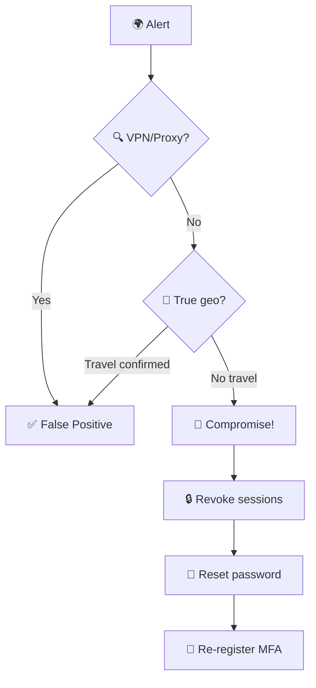
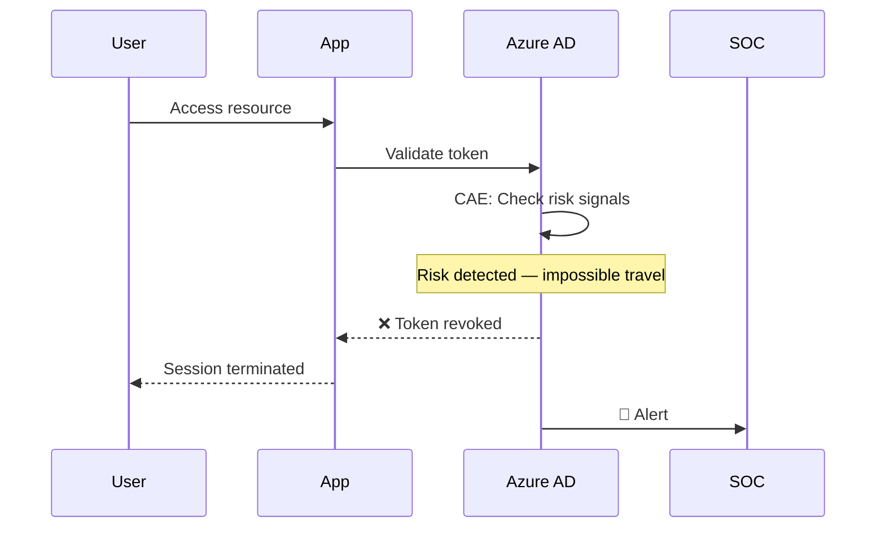
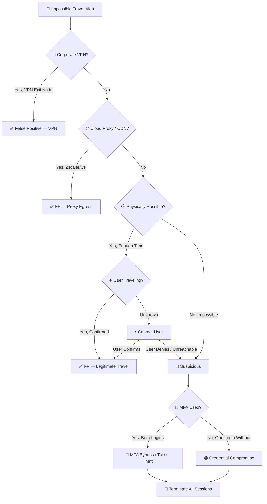
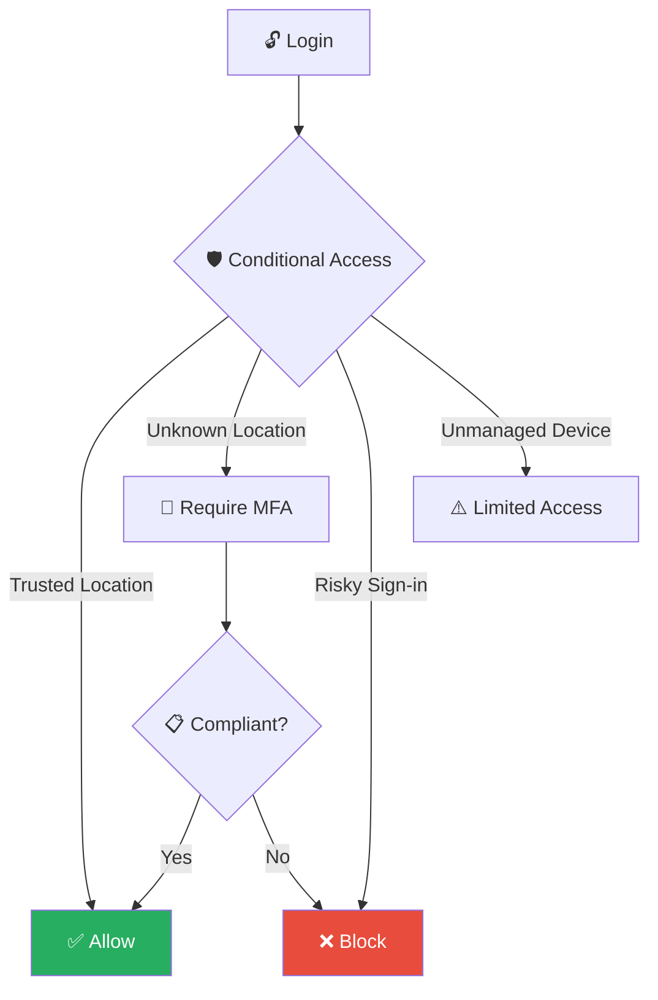
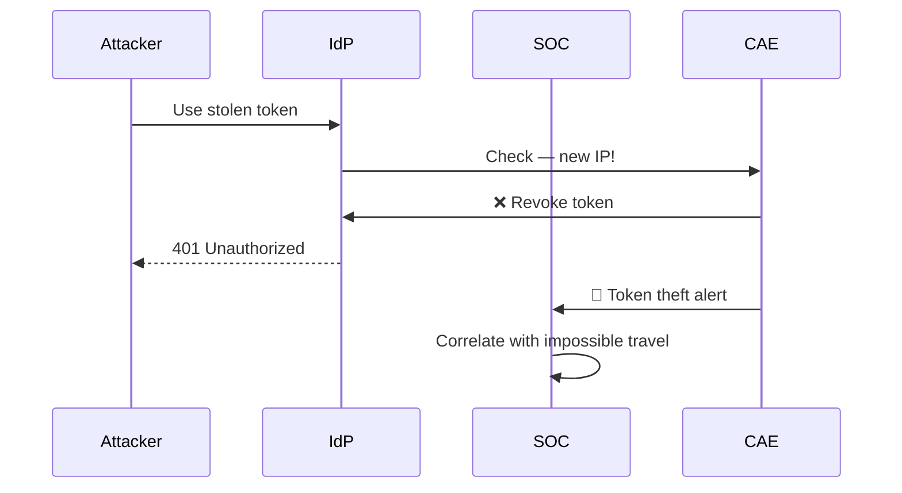

# Playbook: Impossible Travel

**ID**: PB-06
**Severity**: Medium/High | **Category**: Identity & Access
**MITRE ATT&CK**: [T1078](https://attack.mitre.org/techniques/T1078/) (Valid Accounts), [T1078.004](https://attack.mitre.org/techniques/T1078/004/) (Cloud Accounts)
**Trigger**: Identity Protection (impossible travel), SIEM (multiple geographic sign-ins), CASB alert

### Analysis Flow

```mermaid
graph TD
    Alert["🌍 Alert"] --> Check{"🔍 VPN/Proxy?"}
    Check -->|Yes| FP["✅ False Positive"]
    Check -->|No| GeoCheck{"📍 True geo?"}
    GeoCheck -->|Travel confirmed| FP
    GeoCheck -->|No travel| Compromise["🔴 Compromise!"]
    Compromise --> Revoke["🔒 Revoke sessions"]
    Revoke --> Reset["🔑 Reset password"]
    Reset --> MFA["📱 Re-register MFA"]
```

### CAE Token Protection

```mermaid
sequenceDiagram
    participant User
    participant App
    participant IdP as Azure AD
    participant SOC
    User->>App: Access resource
    App->>IdP: Validate token
    IdP->>IdP: CAE: Check risk signals
    Note over IdP: Risk detected — impossible travel
    IdP-->>App: ❌ Token revoked
    App-->>User: Session terminated
    IdP->>SOC: 🚨 Alert
```

---

## Decision Flow

```mermaid
graph TD
    Alert["🚨 Impossible Travel Alert"] --> VPN{"🔗 Corporate VPN?"}
    VPN -->|Yes, VPN Exit Node| FP["✅ False Positive — VPN"]
    VPN -->|No| Proxy{"🌐 Cloud Proxy / CDN?"}
    Proxy -->|Yes, Zscaler/CF| FP2["✅ FP — Proxy Egress"]
    Proxy -->|No| Physics{"⏱️ Physically Possible?"}
    Physics -->|Yes, Enough Time| Travel{"✈️ User Traveling?"}
    Physics -->|No, Impossible| Suspicious["🔴 Suspicious"]
    Travel -->|Yes, Confirmed| FP3["✅ FP — Legitimate Travel"]
    Travel -->|Unknown| Contact["📞 Contact User"]
    Contact -->|User Confirms| FP3
    Contact -->|User Denies / Unreachable| Suspicious
    Suspicious --> MFA{"🔑 MFA Used?"}
    MFA -->|Yes, Both Logins| Advanced["🔴 MFA Bypass / Token Theft"]
    MFA -->|No, One Login Without| Cred["🟠 Credential Compromise"]
    Advanced --> Terminate["🔌 Terminate All Sessions"]
    Cred --> Terminate
```

---

## 1. Analysis

### 1.1 Common False Positive Sources

| Source | How to Identify | Action |
|:---|:---|:---|
| **Corporate VPN** | Source IP is known VPN exit node | Whitelist VPN IPs |
| **Cloud proxy** (Zscaler, Cloudflare) | IP belongs to proxy ASN | Whitelist proxy ranges |
| **Mobile network** | IP geolocates to carrier hub (not user location) | Verify with user |
| **Shared account** | Multiple people using same creds | Enforce personal accounts |
| **VPN split-tunnel** | Some traffic via VPN, some direct | Check VPN config |
| **Cached credentials** | Laptop login vs cloud login timing | Check auth method |

### 1.2 Investigation Checklist

| Check | How | Done |
|:---|:---|:---:|
| Both login locations (city, country, ISP) | SIEM / IdP sign-in logs | ☐ |
| Time between logins | Calculate — physically possible? | ☐ |
| IP reputation of both IPs | AbuseIPDB, VirusTotal | ☐ |
| Were both logins via same protocol? | Console / API / IMAP / ActiveSync | ☐ |
| Was MFA required and passed on both? | IdP MFA logs | ☐ |
| Device fingerprint (browser, OS) | IdP details | ☐ |
| User's known location | HR / Manager / User | ☐ |
| Is the user a frequent traveler? | Travel history, role | ☐ |

### 1.3 Post-Login Activity Analysis

| Check | What to Look For | Done |
|:---|:---|:---:|
| Email access | New inbox rules, mass email read, forwarding | ☐ |
| File access | Bulk downloads from SharePoint/OneDrive | ☐ |
| Admin actions | Role changes, new app registrations | ☐ |
| MFA changes | New MFA method registered | ☐ |
| Password change | Self-service password reset | ☐ |
| OAuth consents | New app permissions granted | ☐ |

---

## 2. Containment

### 2.1 Confirmed Impossible Travel (Not FP)

| # | Action | Tool | Done |
|:---:|:---|:---|:---:|
| 1 | **Terminate all active sessions** | IdP (Revoke Sessions) | ☐ |
| 2 | **Reset password** immediately | AD / IdP | ☐ |
| 3 | **Revoke refresh tokens** (cloud apps) | Azure AD / Okta | ☐ |
| 4 | **Block suspicious IP** at firewall/conditional access | Firewall / IdP | ☐ |
| 5 | **Enforce MFA re-registration** (existing MFA may be compromised) | IdP | ☐ |

### 2.2 If Token Theft Suspected

| # | Action | Done |
|:---:|:---|:---:|
| 1 | Revoke ALL OAuth tokens and app consents | ☐ |
| 2 | Check for adversary-in-the-middle phishing (EvilProxy, Evilginx) | ☐ |
| 3 | Check endpoint for token-stealing malware | ☐ |
| 4 | Enable token protection / CAE (Continuous Access Evaluation) | ☐ |

---

## 3. Investigation

| # | Action | Done |
|:---:|:---|:---:|
| 1 | Determine which login is legitimate and which is attacker | ☐ |
| 2 | Audit all actions from attacker session | ☐ |
| 3 | Check for inbox rules / forwarding created during attacker session | ☐ |
| 4 | Check for data accessed / downloaded during attacker session | ☐ |
| 5 | Search for same attacker IP accessing other accounts | ☐ |

---

## 4. Recovery

| # | Action | Done |
|:---:|:---|:---:|
| 1 | Re-enable account with strong password + MFA | ☐ |
| 2 | Remove any inbox rules / app consents created by attacker | ☐ |
| 3 | Enable Named Locations and block high-risk countries | ☐ |
| 4 | Enforce Conditional Access: compliant device required | ☐ |
| 5 | Monitor account for 30 days | ☐ |

---

## 5. IoC Collection

| Type | Value | Source |
|:---|:---|:---|
| Suspicious login IP | | IdP sign-in logs |
| Geolocation (attacker) | | IP geolocation |
| User-Agent (attacker session) | | IdP details |
| ASN / ISP | | WHOIS |
| Login protocol | | IdP |
| Actions performed from attacker IP | | Cloud audit logs |

---

## 6. Evidence Checklist

| Evidence Type | What to Collect | Source | Why It Matters |
|:---|:---|:---|:---|
| Sign-in evidence | Both login events, timestamps, IPs, geolocation, device/app details | IdP / SIEM | Confirms whether the travel pattern is physically impossible or explainable |
| Identity evidence | User role, MFA status, token/session IDs, account risk state | IAM / IdP | Shows whether a high-risk identity or stolen session is involved |
| Context evidence | VPN/proxy usage, corporate egress IPs, travel approvals, on-call status | VPN logs / HR / ticketing | Helps distinguish benign travel from compromise |
| Activity evidence | Mailbox, file, admin, and cloud actions after the suspicious login | Cloud audit / mailbox audit | Shows whether the attacker used the session for impact |
| Scope evidence | Same IP across other users, repeated country pairings, related detections | SIEM correlation | Determines whether this is a single-user issue or wider campaign |

---

## 7. Minimum Telemetry Required

| Telemetry Source | Required For | Priority | Blind Spot If Missing |
|:---|:---|:---:|:---|
| Identity provider sign-in logs | Compare locations, times, MFA events, and session creation | Required | Cannot validate impossible travel at all |
| VPN, proxy, and known-egress telemetry | Explain corporate exit points and travel-related IP changes | Required | Benign VPN/proxy activity may be escalated as compromise |
| Cloud audit and mailbox activity logs | Assess what happened after suspicious access | Required | Impact after login remains hidden |
| Device posture and endpoint telemetry | Validate managed device, browser, and token context | Recommended | Session theft versus normal device use stays ambiguous |
| HR, travel, and support records | Confirm travel, remote work, or approved exception context | Recommended | Analysts lack business context and over-escalate |

---

## 8. False Positive and Tuning Guide

| Scenario | Why It Looks Suspicious | How to Validate | Tuning Action | Escalate If |
|:---|:---|:---|:---|:---|
| Corporate VPN or cloud proxy egress | Two distant logins may actually be one user through managed egress | Check known egress IP list, ASN, and VPN session timing | Tune impossible-travel logic to recognize approved egress nodes | Post-login abuse or unknown device context appears |
| Legitimate business travel | Real travel can create fast country changes | Confirm itinerary, flight timing, and device continuity | Lower severity when travel is documented and device is compliant | MFA reset, token misuse, or risky actions follow |
| Mobile network or roaming handoff | Cell carriers can change apparent country/region quickly | Validate mobile device ID and prior user pattern | Tune for mobile-client-specific geolocation drift | Same user also appears from desktop or privileged session elsewhere |
| Shared service or automation identity | Non-human accounts should not be evaluated like humans | Check app ID, schedule, and source pattern | Separate service identities into different detections | Service identity performs interactive or user-like actions |

---

## 9. Escalation Criteria

| Condition | Escalate To |
|:---|:---|
| Executive / VIP account | CISO immediately |
| MFA bypass confirmed (token theft) | Tier 2 + Identity team |
| Multiple accounts from same attacker IP | Major Incident |
| Data exfiltration from compromised session | [PB-08](Data_Exfiltration.en.md) + Legal |
| Inbox rules created → BEC follow-up | [PB-17 BEC](BEC.en.md) |
| Admin account compromised | [PB-05](Account_Compromise.en.md) + CISO |

---

### Conditional Access Architecture

```mermaid
graph TD
    Login["🔓 Login"] --> CA{"🛡️ Conditional Access"}
    CA -->|Trusted Location| Allow["✅ Allow"]
    CA -->|Unknown Location| MFA["📱 Require MFA"]
    CA -->|Risky Sign-in| Block["❌ Block"]
    CA -->|Unmanaged Device| Limited["⚠️ Limited Access"]
    MFA --> Compliant{"📋 Compliant?"}
    Compliant -->|Yes| Allow
    Compliant -->|No| Block
    style Block fill:#e74c3c,color:#fff
    style Allow fill:#27ae60,color:#fff
```

### Token Theft Detection

```mermaid
sequenceDiagram
    participant Attacker
    participant IdP
    participant SOC
    participant CAE
    Attacker->>IdP: Use stolen token
    IdP->>CAE: Check — new IP!
    CAE->>IdP: ❌ Revoke token
    IdP-->>Attacker: 401 Unauthorized
    CAE->>SOC: 🚨 Token theft alert
    SOC->>SOC: Correlate with impossible travel
```

## Detection Rules (Sigma)

| Rule | File |
|:---|:---|
| Impossible Travel Detection | [cloud_impossible_travel.yml](../../08_Detection_Engineering/sigma_rules/cloud_impossible_travel.yml) |
| Azure AD Risky Sign-in | [cloud_azure_risky_signin.yml](../../08_Detection_Engineering/sigma_rules/cloud_azure_risky_signin.yml) |

## Related Documents

- [IR Framework](../Framework.en.md)
- [Incident Report](../../11_Reporting_Templates/incident_report.en.md)
- [PB-05 Account Compromise](Account_Compromise.en.md)
- [PB-17 BEC](BEC.en.md)
- [PB-04 Brute Force](Brute_Force.en.md)

## References

- [MITRE ATT&CK T1078 — Valid Accounts](https://attack.mitre.org/techniques/T1078/)
- [Microsoft Identity Protection — Risk Detections](https://learn.microsoft.com/en-us/entra/id-protection/concept-identity-protection-risks)
- [Token Theft Playbook](https://learn.microsoft.com/en-us/security/operations/token-theft-playbook)
