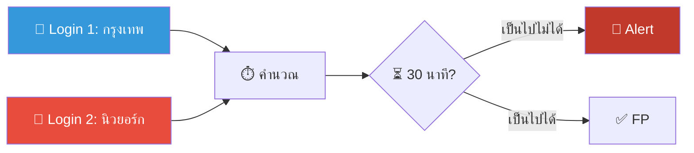
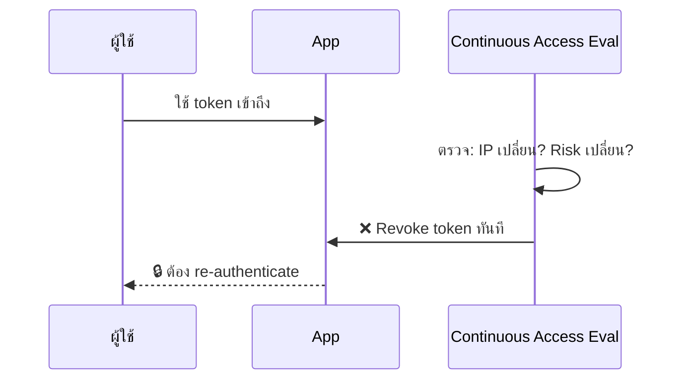
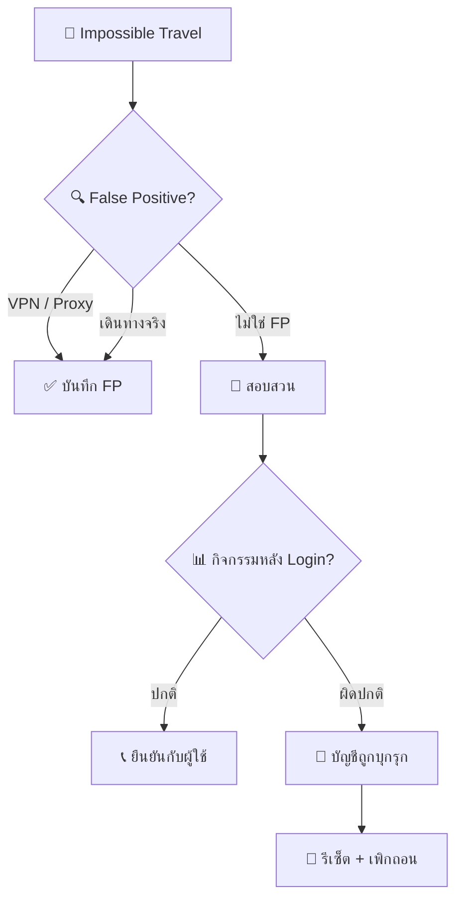
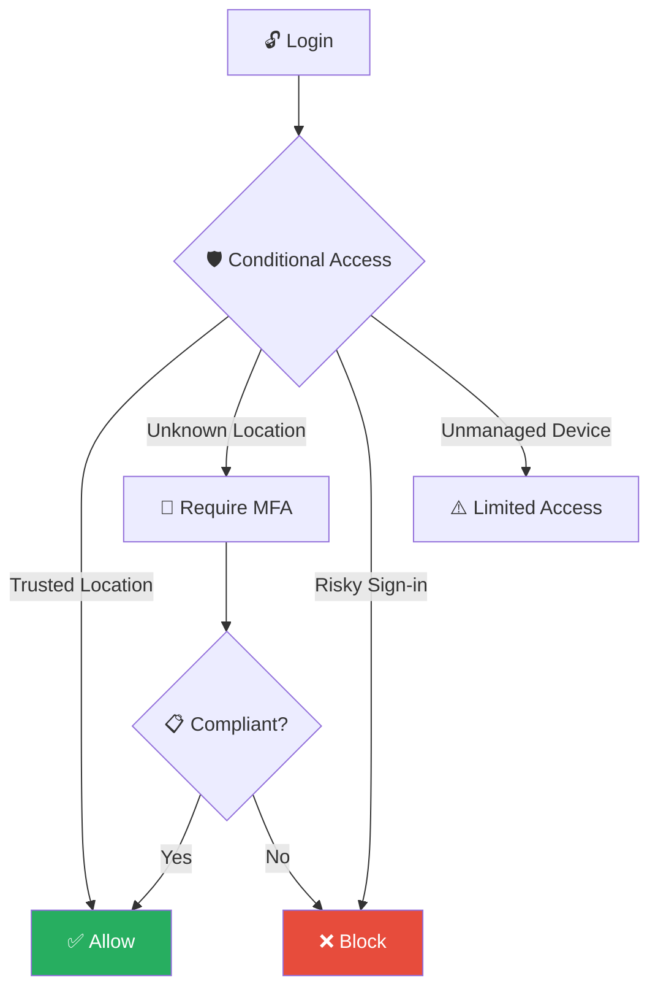
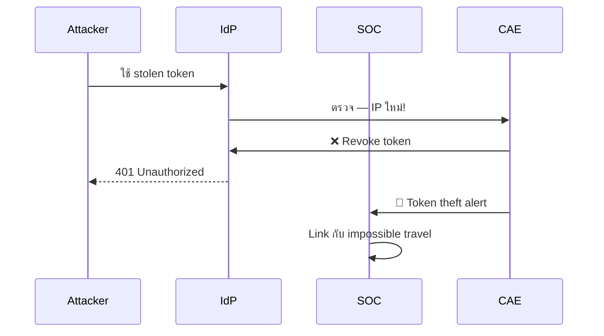

# Playbook: Impossible Travel / การเข้าสู่ระบบจากสถานที่ที่เป็นไปไม่ได้

**ID**: PB-06
**ระดับความรุนแรง**: ปานกลาง/สูง | **หมวดหมู่**: Identity & Access
**MITRE ATT&CK**: [T1078](https://attack.mitre.org/techniques/T1078/) (Valid Accounts)
**ทริกเกอร์**: SIEM/IdP alert (Login จากสองสถานที่ห่างไกลในเวลาสั้น), Identity Protection

### ผังการวิเคราะห์ Impossible Travel

### ผัง CAE Token Protection

---

## ผังการตัดสินใจ

---

## 1. การวิเคราะห์

### 1.1 สาเหตุ False Positive ที่พบบ่อย

| สาเหตุ | วิธีตรวจสอบ | ดำเนินการ | เสร็จ |
|:---|:---|:---|:---:|
| **VPN องค์กร** (exit node ต่างประเทศ) | VPN logs → match IP | Whitelist VPN IPs | ☐ |
| **Cloud proxy / CDN** (Zscaler, Cloudflare) | Proxy logs | Whitelist proxy IPs | ☐ |
| **ผู้ใช้เดินทางจริง** (สนามบิน→ปลายทาง) | สอบถามผู้ใช้/ปฏิทิน | Document + close | ☐ |
| **Mobile network handoff** | ISP analysis | Close | ☐ |
| **Shared account** | IAM audit | ปิด shared account | ☐ |
| **Browser extension / SSO** | User Agent | Close | ☐ |

### 1.2 รายการตรวจสอบ (หากไม่ใช่ FP)

| รายการ | วิธีตรวจสอบ | เสร็จ |
|:---|:---|:---:|
| IP ทั้งสองอยู่ที่ไหน? (GeoIP) | SIEM / GeoIP | ☐ |
| ระยะทางและเวลาระหว่าง login เป็นไปได้? | คำนวณ (km/เวลา) | ☐ |
| Device / User Agent เหมือนกัน? | Sign-in logs | ☐ |
| กิจกรรมหลัง login ที่ location ใหม่ | SIEM / Cloud audit | ☐ |
| ดาวน์โหลดข้อมูล / เข้า SharePoint? | File audit | ☐ |
| สร้าง inbox rules? | Exchange audit | ☐ |
| เปลี่ยน MFA methods? | IdP audit | ☐ |
| OAuth apps ถูก consent? | Enterprise Apps | ☐ |
| Token theft indicators? (AiTM proxy) | Sign-in → token details | ☐ |

---

## 2. การควบคุม

| # | การดำเนินการ | เครื่องมือ | เสร็จ |
|:---:|:---|:---|:---:|
| 1 | **ยกเลิก session** ที่ location ผิดปกติ | IdP admin | ☐ |
| 2 | **รีเซ็ตรหัสผ่าน** (out-of-band) | IdP admin | ☐ |
| 3 | **ติดต่อผู้ใช้** ยืนยันตัวตน (โทรศัพท์!) | Phone call | ☐ |
| 4 | หากยืนยันไม่ได้ → **ล็อกบัญชี** ทันที | IdP admin | ☐ |
| 5 | **ตรวจ inbox rules / delegates** | Exchange admin | ☐ |

---

## 3. การกำจัด

| # | การดำเนินการ | เสร็จ |
|:---:|:---|:---:|
| 1 | ลบ inbox rules / forwarding ที่ผิดปกติ | ☐ |
| 2 | ลบ OAuth apps ที่ consent ระหว่างโจมตี | ☐ |
| 3 | ลงทะเบียน MFA ใหม่ (FIDO2/passkeys) | ☐ |
| 4 | หมุนเวียน refresh tokens | ☐ |

---

## 4. การฟื้นฟู

| # | การดำเนินการ | เสร็จ |
|:---:|:---|:---:|
| 1 | ตั้งค่า **Named Locations** (trusted IPs) ใน IdP | ☐ |
| 2 | บังคับ **Conditional Access** ตาม location + device compliance | ☐ |
| 3 | เปิด **CAE** (Continuous Access Evaluation) | ☐ |
| 4 | ใช้ **Phishing-resistant MFA** (FIDO2) สำหรับ admins | ☐ |
| 5 | Tune impossible travel alert thresholds (ลด FP) | ☐ |

---

## 5. เกณฑ์การยกระดับ

| เงื่อนไข | ยกระดับไปยัง |
|:---|:---|
| Token theft / AiTM ยืนยัน | [PB-26 MFA Bypass](MFA_Bypass.th.md) |
| ข้อมูลถูก access / ดาวน์โหลด | [PB-08 Data Exfil](Data_Exfiltration.th.md) |
| Admin account | CISO ทันที |
| BEC indicators (inbox rules + financial) | [PB-17 BEC](BEC.th.md) |
| หลายบัญชีมี impossible travel พร้อมกัน | Major Incident |

---

### ผัง Conditional Access Architecture

### ผัง Token Theft Detection

## เอกสารที่เกี่ยวข้อง

- [กรอบการตอบสนองต่อเหตุการณ์](../Framework.th.md)
- [PB-05 บัญชีถูกบุกรุก](Account_Compromise.th.md)
- [PB-26 MFA Bypass](MFA_Bypass.th.md)

## อ้างอิง

- [MITRE ATT&CK T1078 — Valid Accounts](https://attack.mitre.org/techniques/T1078/)
