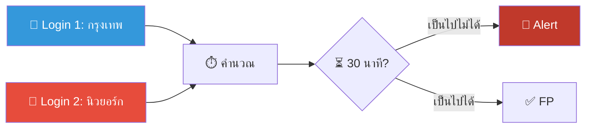
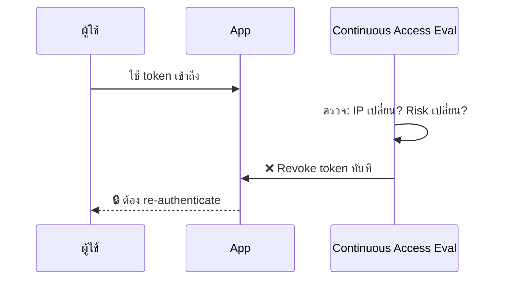
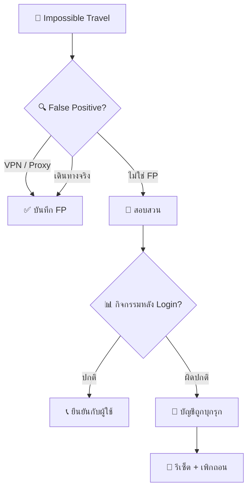
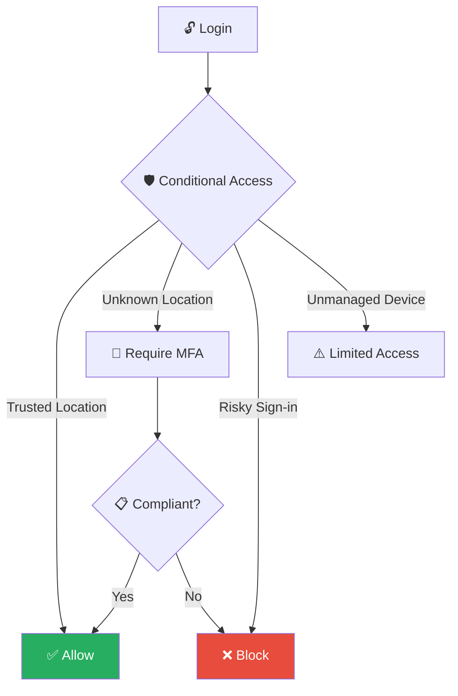
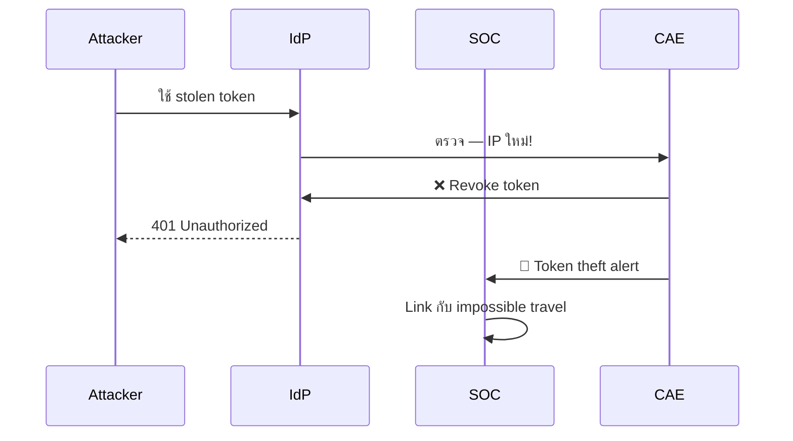

# Playbook: Impossible Travel / การเข้าสู่ระบบจากสถานที่ที่เป็นไปไม่ได้

**ID**: PB-06
**ระดับความรุนแรง**: ปานกลาง/สูง | **หมวดหมู่**: Identity & Access
**MITRE ATT&CK**: [T1078](https://attack.mitre.org/techniques/T1078/) (Valid Accounts)
**ทริกเกอร์**: SIEM/IdP alert (Login จากสองสถานที่ห่างไกลในเวลาสั้น), Identity Protection

## หลังเหตุการณ์ (Post-Incident)

- [ ] ทบทวน Conditional Access policies
- [ ] ใช้ sign-in risk policies (medium/high = block/MFA)
- [ ] ตรวจสอบ token theft indicators
- [ ] ทบทวน named locations configuration
- [ ] สร้าง detection rule สำหรับ suspicious login patterns
- [ ] จัดทำ [Incident Report](../../11_Reporting_Templates/incident_report.th.md)

### ผังการวิเคราะห์ Impossible Travel

```mermaid
graph LR
    L1["📍 Login 1: กรุงเทพ"] --> Calc["⏱️ คำนวณ"]
    L2["📍 Login 2: นิวยอร์ก"] --> Calc
    Calc --> Time{"⏳ 30 นาที?"}
    Time -->|เป็นไปไม่ได้| Alert["🔴 Alert"]
    Time -->|เป็นไปได้| FP["✅ FP"]
    style L1 fill:#3498db,color:#fff
    style L2 fill:#e74c3c,color:#fff
    style Alert fill:#c0392b,color:#fff
```

### ผัง CAE Token Protection

```mermaid
sequenceDiagram
    participant User as ผู้ใช้
    participant App
    participant CAE as Continuous Access Eval
    User->>App: ใช้ token เข้าถึง
    CAE->>CAE: ตรวจ: IP เปลี่ยน? Risk เปลี่ยน?
    CAE->>App: ❌ Revoke token ทันที
    App-->>User: 🔒 ต้อง re-authenticate
```

---

## ผังการตัดสินใจ

```mermaid
graph TD
    Alert["🚨 Impossible Travel"] --> FP{"🔍 False Positive?"}
    FP -->|VPN / Proxy| Close["✅ บันทึก FP"]
    FP -->|เดินทางจริง| Close
    FP -->|ไม่ใช่ FP| Investigate["🔎 สอบสวน"]
    Investigate --> Activity{"📊 กิจกรรมหลัง Login?"}
    Activity -->|ปกติ| User["📞 ยืนยันกับผู้ใช้"]
    Activity -->|ผิดปกติ| Compromise["🔴 บัญชีถูกบุกรุก"]
    Compromise --> Reset["🔐 รีเซ็ต + เพิกถอน"]
```

---

## 1. การวิเคราะห์

### 1.1 สาเหตุ False Positive ที่พบบ่อย

| สาเหตุ | วิธีตรวจสอบ | ดำเนินการ | เสร็จ |
|:---|:---|:---|:---:|
| **VPN องค์กร** (exit node ต่างประเทศ) | VPN logs → match IP | Whitelist VPN IPs | ☐ |
| **Cloud proxy / CDN** (Zscaler, Cloudflare) | Proxy logs | Whitelist proxy IPs | ☐ |
| **ผู้ใช้เดินทางจริง** (สนามบิน→ปลายทาง) | สอบถามผู้ใช้/ปฏิทิน | Document + close | ☐ |
| **Mobile network handoff** | ISP analysis | Close | ☐ |
| **Shared account** | IAM audit | ปิด shared account | ☐ |
| **Browser extension / SSO** | User Agent | Close | ☐ |

### 1.2 รายการตรวจสอบ (หากไม่ใช่ FP)

| รายการ | วิธีตรวจสอบ | เสร็จ |
|:---|:---|:---:|
| IP ทั้งสองอยู่ที่ไหน? (GeoIP) | SIEM / GeoIP | ☐ |
| ระยะทางและเวลาระหว่าง login เป็นไปได้? | คำนวณ (km/เวลา) | ☐ |
| Device / User Agent เหมือนกัน? | Sign-in logs | ☐ |
| กิจกรรมหลัง login ที่ location ใหม่ | SIEM / Cloud audit | ☐ |
| ดาวน์โหลดข้อมูล / เข้า SharePoint? | File audit | ☐ |
| สร้าง inbox rules? | Exchange audit | ☐ |
| เปลี่ยน MFA methods? | IdP audit | ☐ |
| OAuth apps ถูก consent? | Enterprise Apps | ☐ |
| Token theft indicators? (AiTM proxy) | Sign-in → token details | ☐ |

---

## 2. การควบคุม

| # | การดำเนินการ | เครื่องมือ | เสร็จ |
|:---:|:---|:---|:---:|
| 1 | **ยกเลิก session** ที่ location ผิดปกติ | IdP admin | ☐ |
| 2 | **รีเซ็ตรหัสผ่าน** (out-of-band) | IdP admin | ☐ |
| 3 | **ติดต่อผู้ใช้** ยืนยันตัวตน (โทรศัพท์!) | Phone call | ☐ |
| 4 | หากยืนยันไม่ได้ → **ล็อกบัญชี** ทันที | IdP admin | ☐ |
| 5 | **ตรวจ inbox rules / delegates** | Exchange admin | ☐ |

---

## 3. การกำจัด

| # | การดำเนินการ | เสร็จ |
|:---:|:---|:---:|
| 1 | ลบ inbox rules / forwarding ที่ผิดปกติ | ☐ |
| 2 | ลบ OAuth apps ที่ consent ระหว่างโจมตี | ☐ |
| 3 | ลงทะเบียน MFA ใหม่ (FIDO2/passkeys) | ☐ |
| 4 | หมุนเวียน refresh tokens | ☐ |

---

## 4. การฟื้นฟู

| # | การดำเนินการ | เสร็จ |
|:---:|:---|:---:|
| 1 | ตั้งค่า **Named Locations** (trusted IPs) ใน IdP | ☐ |
| 2 | บังคับ **Conditional Access** ตาม location + device compliance | ☐ |
| 3 | เปิด **CAE** (Continuous Access Evaluation) | ☐ |
| 4 | ใช้ **Phishing-resistant MFA** (FIDO2) สำหรับ admins | ☐ |
| 5 | Tune impossible travel alert thresholds (ลด FP) | ☐ |

---

## 5. Evidence Checklist

| ประเภทหลักฐาน | สิ่งที่ต้องเก็บ | แหล่งข้อมูล | เหตุผลที่ต้องเก็บ |
|:---|:---|:---|:---|
| หลักฐานการ login | login ทั้งสองฝั่ง, timestamp, IP, geolocation, device/app detail | IdP / SIEM | ใช้ยืนยันว่าเดินทางไม่ได้จริงหรืออธิบายได้ |
| หลักฐานด้านตัวตน | user role, MFA status, token/session ID, account risk state | IAM / IdP | ใช้ดูว่าบัญชีเสี่ยงสูงหรือ session ถูกขโมยหรือไม่ |
| หลักฐานบริบท | VPN/proxy usage, corporate egress IP, travel approval, on-call status | VPN logs / HR / ticketing | ใช้แยก benign travel ออกจาก compromise |
| หลักฐานกิจกรรมหลัง login | mailbox, file, admin, และ cloud action หลัง suspicious login | Cloud audit / mailbox audit | ใช้ดูผลกระทบหลังผู้โจมตีเข้าได้ |
| หลักฐานด้านขอบเขต | attacker IP เดียวกันกับหลายผู้ใช้, country pair เดิมซ้ำ, alert ที่เกี่ยวข้อง | SIEM correlation | ใช้ดูว่าเป็นเคสเดียวหรือ campaign |

---

## 6. Minimum Telemetry Required

| แหล่ง Telemetry | ใช้เพื่ออะไร | ความสำคัญ | Blind Spot ถ้าไม่มี |
|:---|:---|:---:|:---|
| Identity provider sign-in logs | เทียบ location, เวลา, MFA event, และ session creation | Required | พิสูจน์ impossible travel ไม่ได้เลย |
| VPN, proxy, และ known-egress telemetry | อธิบาย corporate exit point และ IP change จากการเดินทาง | Required | benign VPN/proxy อาจถูกยกระดับเกินจริง |
| Cloud audit และ mailbox activity logs | ใช้ดูว่าเกิดอะไรหลัง suspicious access | Required | มองไม่เห็น impact หลัง login |
| Device posture และ endpoint telemetry | ใช้ยืนยัน managed device, browser, และ token context | Recommended | แยก session theft ออกจากการใช้ device ปกติได้ไม่ชัด |
| HR, travel, และ support records | ใช้ยืนยันการเดินทาง, remote work, หรือ approved exception | Recommended | analyst ขาด business context |

---

## 7. False Positive และ Tuning Guide

| Scenario | ทำไมจึงดูน่าสงสัย | วิธีตรวจสอบ | Tuning Action | ต้องยกระดับเมื่อ |
|:---|:---|:---|:---|:---|
| corporate VPN หรือ cloud proxy egress | login สองประเทศอาจเป็นผู้ใช้เดียวผ่าน egress ขององค์กร | ตรวจ known egress IP list, ASN, และเวลา VPN session | tune impossible-travel ให้รู้จัก egress node ที่อนุมัติ | มี post-login abuse หรือ device context แปลก |
| การเดินทางธุรกิจจริง | เดินทางจริงอาจทำให้ login คนละประเทศเร็ว | ยืนยัน itinerary, เวลาเดินทาง, และความต่อเนื่องของอุปกรณ์ | ลด severity เมื่อมีเอกสารเดินทางและ device compliant | มี MFA reset, token misuse, หรือ risky action ตามมา |
| mobile network หรือ roaming handoff | เครือข่ายมือถืออาจเปลี่ยนประเทศ/region เร็ว | ยืนยัน mobile device ID และ pattern การใช้งานเดิม | tune สำหรับ geolocation drift ของ mobile client | ผู้ใช้เดียวกันยังมี desktop หรือ privileged session ที่อื่น |
| service identity หรือ automation account | non-human account ไม่ควรถูกประเมินแบบผู้ใช้จริง | ตรวจ app ID, schedule, และ source pattern | แยก detection ของ service identity ออกจาก human identity | service identity ไปทำ interactive หรือ user-like action |

---

## 8. เกณฑ์การยกระดับ

| เงื่อนไข | ยกระดับไปยัง |
|:---|:---|
| Token theft / AiTM ยืนยัน | [PB-26 MFA Bypass](MFA_Bypass.th.md) |
| ข้อมูลถูก access / ดาวน์โหลด | [PB-08 Data Exfil](Data_Exfiltration.th.md) |
| Admin account | CISO ทันที |
| BEC indicators (inbox rules + financial) | [PB-17 BEC](BEC.th.md) |
| หลายบัญชีมี impossible travel พร้อมกัน | Major Incident |

---

### ผัง Conditional Access Architecture

```mermaid
graph TD
    Login["🔓 Login"] --> CA{"🛡️ Conditional Access"}
    CA -->|Trusted Location| Allow["✅ Allow"]
    CA -->|Unknown Location| MFA["📱 Require MFA"]
    CA -->|Risky Sign-in| Block["❌ Block"]
    CA -->|Unmanaged Device| Limited["⚠️ Limited Access"]
    MFA --> Compliant{"📋 Compliant?"}
    Compliant -->|Yes| Allow
    Compliant -->|No| Block
    style Block fill:#e74c3c,color:#fff
    style Allow fill:#27ae60,color:#fff
```

### ผัง Token Theft Detection

```mermaid
sequenceDiagram
    participant Attacker
    participant IdP
    participant SOC
    participant CAE
    Attacker->>IdP: ใช้ stolen token
    IdP->>CAE: ตรวจ — IP ใหม่!
    CAE->>IdP: ❌ Revoke token
    IdP-->>Attacker: 401 Unauthorized
    CAE->>SOC: 🚨 Token theft alert
    SOC->>SOC: Link กับ impossible travel
```

## กฎตรวจจับ (Sigma)

| กฎ | ไฟล์ |
|:---|:---|
| Impossible Travel Detection | [cloud_impossible_travel.yml](../../08_Detection_Engineering/sigma_rules/cloud_impossible_travel.yml) |
| Azure AD Risky Sign-in | [cloud_azure_risky_signin.yml](../../08_Detection_Engineering/sigma_rules/cloud_azure_risky_signin.yml) |

## เอกสารที่เกี่ยวข้อง

- [กรอบการตอบสนองต่อเหตุการณ์](../Framework.th.md)
- [PB-05 บัญชีถูกบุกรุก](Account_Compromise.th.md)
- [PB-26 MFA Bypass](MFA_Bypass.th.md)

## False Positive Assessment

| Scenario | Likely FP? | Verification |
|:---|:---|:---|
| VPN + office login | ✅ High | Check VPN logs |
| Mobile + desktop | ✅ Medium | User confirmation |
| Two countries < 2 hrs | ❌ Low | Investigate |
| Service account travel | ❌ Very Low | Alert immediately |

### Velocity Analysis Template

| Login 1 | Login 2 | Distance | Time | Speed | Verdict |
|:---|:---|:---|:---|:---|:---|
| Bangkok | Singapore | 1,400 km | 30 min | Impossible | ⚠️ Alert |
| Bangkok | Chiang Mai | 600 km | 3 hrs | Possible (flight) | ℹ️ Verify |
| Office | Home (VPN) | Same city | 5 min | VPN likely | ✅ FP |

### Investigation Checklist
- [ ] Verify both login sources (IP geolocation)
- [ ] Check for VPN/proxy usage
- [ ] Contact user for confirmation
- [ ] Review session tokens and cookies
- [ ] Check for credential sharing
- [ ] Assess data access during sessions

### VPN/Proxy Identification

| Source | Check | Tool |
|:---|:---|:---|
| Known VPN IPs | Internal VPN logs | SIEM |
| Commercial VPN | IP reputation DB | TI Feed |
| Tor exit nodes | Published list | Auto-block |

### Response Decision Matrix

| Confidence | Action | SLA |
|:---|:---|:---|
| High (no VPN) | Suspend + investigate | 15 min |
| Medium | User verification | 1 hr |
| Low (VPN likely) | Log + monitor | 24 hrs |

## References

- [MITRE ATT&CK T1078 — Valid Accounts](https://attack.mitre.org/techniques/T1078/)
