# Playbook: Insider Threat

**ID**: PB-14
**Severity**: High/Critical | **Category**: Data Protection / HR
**MITRE ATT&CK**: [T1534](https://attack.mitre.org/techniques/T1534/) (Internal Spearphishing), [T1567](https://attack.mitre.org/techniques/T1567/) (Exfiltration Over Web Service), [T1052](https://attack.mitre.org/techniques/T1052/) (Exfiltration Over Physical Medium)
**Trigger**: UEBA alert, DLP alert, HR referral, Whistleblower report, Manager report

### Risk Assessment Flow

```mermaid
graph TD
    Indicator["🚨 Indicator"] --> Risk{"⚖️ Level?"}
    Risk -->|Low: off-hours access| Monitor["👁️ Monitor 30 days"]
    Risk -->|Medium: bulk download| CovertOps["🕵️ Covert Investigation"]
    Risk -->|High: exfil + resignation| Overt["🔴 Overt — Lock Account"]
    CovertOps --> Evidence{"📁 Evidence?"}
    Evidence -->|Yes| HR["👥 HR + Legal"]
    Evidence -->|No| Continue["🔄 Continue Monitoring"]
```

### Coordination Flow

> ⚠️ **IMPORTANT**: Insider threat investigations are highly sensitive. Coordinate with HR and Legal BEFORE taking visible actions. Do NOT alert the subject prematurely.

---

## Decision Flow

```mermaid
graph TD
    Alert["🚨 Insider Threat Indicator"] --> Type{"📋 Indicator Type?"}
    Type -->|UEBA / DLP Alert| Technical["🔍 Technical Investigation"]
    Type -->|HR Referral| HR["📞 HR Coordination First"]
    Type -->|Tip / Report| Context["🔍 Validate Report"]
    Technical --> Status{"👤 Employment Status?"}
    HR --> Status
    Context --> Status
    Status -->|Leaving / Notice Period| HighRisk["🔴 High Risk — Accelerate"]
    Status -->|Active Employee| Assess["⚠️ Assess Behavior"]
    Status -->|Already Departed| Urgent["🚨 Check What Was Taken"]
    HighRisk --> Scope["📊 Scope Assessment"]
    Assess --> Scope
    Urgent --> Scope
    Scope --> Action{"Confirmed Malicious?"}
    Action -->|Yes| Contain["🔒 Contain + Legal"]
    Action -->|Unclear| Monitor["👁️ Enhanced Monitoring"]
```

---

## 1. Analysis

### 1.1 Behavioral Indicators

| Category | Indicators | Detection |
|:---|:---|:---|
| **Data hoarding** | Bulk file downloads, mass email forwards | DLP, CASB |
| **Unusual access** | Accessing files outside job scope | UEBA, file audit |
| **Off-hours activity** | Logins at 2 AM, weekends (unusual for role) | SIEM, UEBA |
| **USB usage** | Large USB transfers, new USB devices | DLP, Endpoint |
| **Cloud uploads** | Large uploads to personal cloud | Proxy, CASB |
| **Email to personal** | Forwarding work email to personal account | Email DLP |
| **Privilege abuse** | Accessing admin tools beyond role needs | SIEM, PAM |
| **Resignation context** | Recent resignation, PIP, conflict | HR referral |
| **Technical evasion** | Disabling monitoring tools, clearing logs | EDR, SIEM |

### 1.2 Employment Context

| Check | Action | Source | Done |
|:---|:---|:---|:---:|
| Employment status | Active / Notice / PIP / Terminated? | HR | ☐ |
| Recent performance issues | Written warnings, conflicts? | HR | ☐ |
| Access level | What systems/data can they access? | IAM / CMDB | ☐ |
| Departure date (if leaving) | How much time remains? | HR | ☐ |
| Known grievances | Labor disputes, denied promotion? | HR (confidential) | ☐ |

### 1.3 Technical Scope Assessment

| Check | How | Done |
|:---|:---|:---:|
| Files accessed in past 30 days | DLP / File audit / Cloud audit | ☐ |
| Email sent to external addresses | Email gateway logs | ☐ |
| USB device connections | Endpoint agent / SIEM | ☐ |
| Cloud uploads (personal services) | Proxy / CASB | ☐ |
| Print jobs (large or sensitive) | Print server logs | ☐ |
| Code repository activity | Git/SVN audit (clones, downloads) | ☐ |
| Screenshots / screen recording | Endpoint monitoring | ☐ |

---

## 2. Containment

### 2.1 Covert Containment (Before Confrontation)

| # | Action | Owner | Done |
|:---:|:---|:---|:---:|
| 1 | Enable enhanced monitoring (DLP, UEBA, email) | SOC | ☐ |
| 2 | Restrict USB ports (silently via GPO) | IT Ops | ☐ |
| 3 | Block personal cloud service URLs | Proxy | ☐ |
| 4 | Capture forensic image of laptop (during maintenance window) | Forensics | ☐ |
| 5 | Place legal hold on email / cloud storage | Legal + IT | ☐ |

### 2.2 Overt Containment (After Decision to Act)

| # | Action | Owner | Done |
|:---:|:---|:---|:---:|
| 1 | Disable all accounts immediately | IT Security | ☐ |
| 2 | Revoke VPN, remote access, badge access | IT + Physical Security | ☐ |
| 3 | Seize company devices (laptop, phone) | HR + Physical Security | ☐ |
| 4 | Escort from premises (if on-site) | Physical Security + HR | ☐ |
| 5 | Disable email / redirect to manager | IT | ☐ |

---

## 3. Investigation (Forensic)

| # | Action | Done |
|:---:|:---|:---:|
| 1 | Create forensic image of all assigned devices | ☐ |
| 2 | Analyze email for data sent to personal accounts | ☐ |
| 3 | Review USB connection history (mounted devices, file copies) | ☐ |
| 4 | Analyze browser history (personal cloud, file sharing) | ☐ |
| 5 | Review print history for sensitive documents | ☐ |
| 6 | Check code repository activity (bulk clone, branch downloads) | ☐ |
| 7 | Analyze deleted files (recycle bin, $Recycle.Bin forensics) | ☐ |
| 8 | Document timeline of all suspicious activities | ☐ |

---

## 4. Recovery & Legal

### 4.1 Immediate

| # | Action | Owner | Done |
|:---:|:---|:---|:---:|
| 1 | Brief HR and Legal on findings | SOC Lead | ☐ |
| 2 | Determine employment action (termination, warning) | HR + Legal | ☐ |
| 3 | Assess data exposure — what was taken? | SOC + Business unit | ☐ |
| 4 | Notify affected parties if PII exposed | Legal / DPO | ☐ |

### 4.2 Long-Term

| # | Action | Done |
|:---:|:---|:---:|
| 1 | Update DLP rules based on exfiltration method used | ☐ |
| 2 | Review access controls for the role (over-provisioned?) | ☐ |
| 3 | Implement/enhance UEBA baselining | ☐ |
| 4 | Conduct security awareness on insider threat indicators | ☐ |

---

## 5. Escalation Criteria

| Condition | Escalate To |
|:---|:---|
| PII or customer data confirmed exfiltrated | Legal + DPO (PDPA 72h) |
| Source code / trade secrets taken | CISO + Legal + Executive |
| Evidence of sabotage (deleting data) | CISO + Legal |
| Armed/threatening behavior | Physical Security + Police |
| Collusion with external party | CISO + Legal + Law enforcement |

---

### Insider Threat Indicators

```mermaid
graph TD
    UEBA["🔍 UEBA"] --> Behav{"🧠 Behavioral?"}
    UEBA --> Tech{"💻 Technical?"}
    Behav --> Resign["📝 Resignation/dissatisfaction"]
    Behav --> Hours["🕐 Behavioral changes"]
    Tech --> Volume["📊 Excessive downloads"]
    Tech --> Access["🔓 Unusual data access"]
    Tech --> USB["💾 USB/Cloud upload"]
    Volume --> Score["⚠️ Risk Score"]
    Access --> Score
    USB --> Score
    style Score fill:#e74c3c,color:#fff
```

### Covert Investigation Process

```mermaid
sequenceDiagram
    participant HR
    participant Legal
    participant SOC
    participant Forensics
    HR->>Legal: Report abnormal behavior
    Legal->>SOC: ✅ Approve covert investigation
    SOC->>Forensics: Collect evidence (covert)
    Forensics->>SOC: 📋 Reports ready
    SOC->>Legal: Present evidence
    Legal->>HR: Take action
    Note over SOC: ⚠️ Do not alert suspect!
```

## Related Documents

- [IR Framework](../Framework.en.md)
- [Incident Report](../../templates/incident_report.en.md)
- [PB-08 Data Exfiltration](Data_Exfiltration.en.md)
- [Data Governance Policy](../../07_Compliance_Privacy/Data_Governance_Policy.en.md)
- [PDPA Compliance](../../07_Compliance_Privacy/PDPA_Compliance.en.md)

## References

- [MITRE ATT&CK T1534 — Internal Spearphishing](https://attack.mitre.org/techniques/T1534/)
- [CISA Insider Threat Mitigation Guide](https://www.cisa.gov/topics/physical-security/insider-threat-mitigation)
- [CERT Insider Threat Center](https://www.sei.cmu.edu/our-work/insider-threat/)
