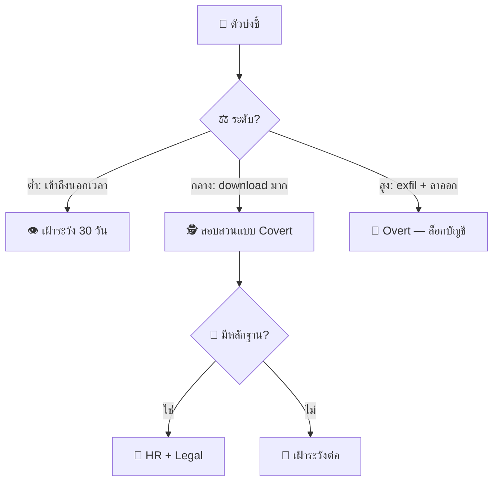
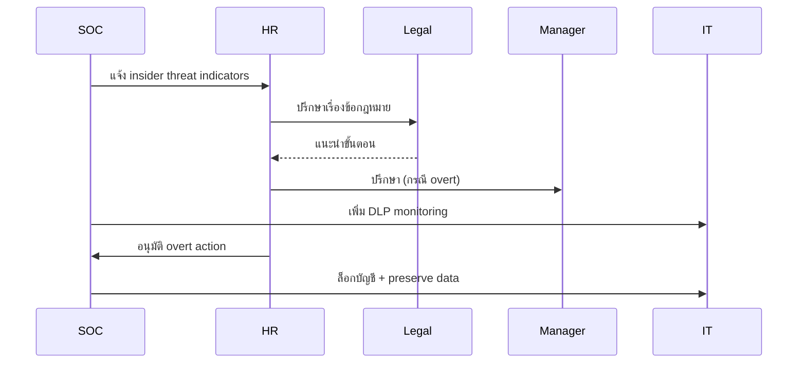
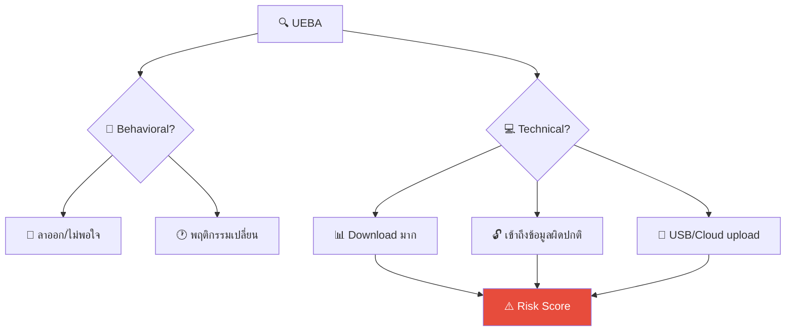
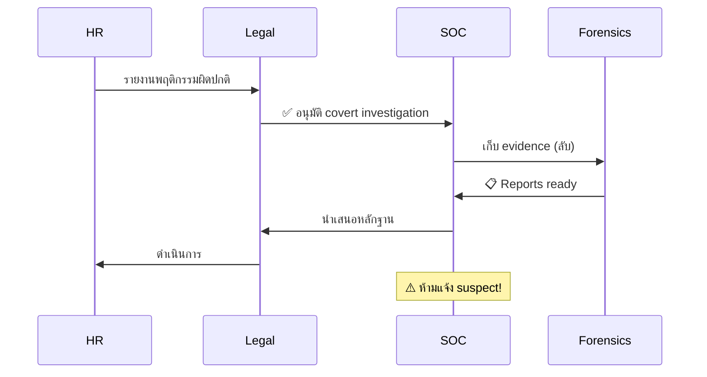

# Playbook: ภัยคุกคามจากภายใน (Insider Threat)

**ID**: PB-14
**ระดับความรุนแรง**: สูง/วิกฤต | **หมวดหมู่**: ภัยจากภายใน
**MITRE ATT&CK**: [T1078](https://attack.mitre.org/techniques/T1078/) (บัญชีที่ถูกต้อง), [T1048](https://attack.mitre.org/techniques/T1048/) (การนำข้อมูลออก)
**ทริกเกอร์**: UEBA alert, DLP alert, HR referral, whistleblower report, ผู้จัดการรายงาน

### แนวทางการประเมินความเสี่ยง



### ผังการประสานงาน



---

## ผังการตัดสินใจ

```mermaid
graph TD
    Alert["🚨 กิจกรรมภายในผิดปกติ"] --> Intent{"🎯 เจตนา?"}
    Intent -->|ร้าย (malicious)| Mal["🔴 สอบสวนลับ"]
    Intent -->|ไม่ตั้งใจ (negligent)| Neg["🟠 ให้ความรู้ + ควบคุม"]
    Intent -->|ถูกบังคับ (coerced)| Coerce["🔴 สอบสวน + ช่วยเหลือ"]
    Mal --> Evidence["📋 รวบรวมหลักฐาน"]
    Coerce --> Evidence
    Evidence --> HRLIT["⚖️ ดำเนินการร่วม HR/Legal"]
```

---

## 1. การวิเคราะห์

### 1.1 ตัวบ่งชี้พฤติกรรม

| ตัวบ่งชี้ | ความเสี่ยง | แหล่ง |
|:---|:---|:---|
| ดาวน์โหลด/คัดลอกข้อมูลจำนวนมาก | 🔴 สูง | DLP / UEBA |
| เข้าถึงข้อมูลนอกขอบเขตหน้าที่ | 🔴 สูง | UEBA |
| ใช้ USB/cloud storage ส่งข้อมูลออก | 🔴 สูง | DLP / EDR |
| เข้าถึงระบบนอกเวลาทำงานบ่อย | 🟡 ปานกลาง | SIEM |
| อยู่ระหว่างลาออก (notice period) | 🔴 สูง | HR |
| ถ่ายรูปหน้าจอ (shoulder surfing) | 🟡 ปานกลาง | รายงานเพื่อนร่วมงาน |
| ติดตั้ง unauthorized tools | 🟠 สูง | EDR |
| เปลี่ยน permissons / สิทธิ์ | 🔴 สูง | IAM audit |
| อ่านข้อมูล competitor / M&A | 🔴 สูง | DLP |

### 1.2 รายการตรวจสอบ (**ลับ**)

| รายการ | วิธีตรวจสอบ | เสร็จ |
|:---|:---|:---:|
| ระบุพนักงานที่เกี่ยวข้อง | UEBA / DLP | ☐ |
| กิจกรรมที่ผิดปกติคืออะไร? | SIEM / DLP | ☐ |
| มีข้อมูลถูกส่งออกหรือไม่? ประเภทอะไร? | DLP / Netflow | ☐ |
| ช่องทางที่ใช้ (USB, email, cloud, print) | DLP / EDR | ☐ |
| มี context จาก HR? (ลาออก, ถูกลงโทษ) | HR | ☐ |
| timeline ของกิจกรรม | SIEM | ☐ |
| มีบุคคลอื่นเกี่ยวข้อง? | UEBA correlation | ☐ |

> ⚠️ **สำคัญ**: ห้ามแจ้งพนักงานจนกว่าจะปรึกษา HR + Legal แล้ว

---

## 2. การควบคุม

### 2.1 สอบสวนลับ (Covert)

| # | การดำเนินการ | เสร็จ |
|:---:|:---|:---:|
| 1 | เพิ่ม UEBA/DLP monitoring ลับ | ☐ |
| 2 | บันทึก forensic image เครื่องที่ใช้ | ☐ |
| 3 | แจ้ง HR + Legal ลับ | ☐ |
| 4 | จำกัด USB access (หากยังไม่มี policy) | ☐ |
| 5 | เฝ้าระวังช่องทางส่งข้อมูลออก | ☐ |

### 2.2 ตอบสนองทันที (Overt — กรณีเร่งด่วน)

| # | การดำเนินการ | เสร็จ |
|:---:|:---|:---:|
| 1 | **ล็อกบัญชี** ทันที | ☐ |
| 2 | **ยึดอุปกรณ์** ร่วมกับ HR | ☐ |
| 3 | **บล็อก VPN/Remote access** | ☐ |
| 4 | **สำรอง forensic evidence** | ☐ |

---

## 3. การกำจัด

| # | การดำเนินการ | เสร็จ |
|:---:|:---|:---:|
| 1 | ลบบัญชี / ปิดสิทธิ์ทั้งหมด | ☐ |
| 2 | หมุนเวียน credentials ที่พนักงานเข้าถึงได้ | ☐ |
| 3 | ตรวจสอบ service accounts / shared accounts | ☐ |
| 4 | ยึดอุปกรณ์และสำรอง forensics ทั้งหมด | ☐ |

---

## 4. การฟื้นฟู

| # | การดำเนินการ | เสร็จ |
|:---:|:---|:---:|
| 1 | ปรับปรุง DLP rules | ☐ |
| 2 | ปรับปรุง offboarding checklist ร่วม HR | ☐ |
| 3 | ใช้ UEBA สำหรับพนักงาน high-risk | ☐ |
| 4 | จำกัด USB / removable media | ☐ |
| 5 | ตรวจสอบสิทธิ์ทุกไตรมาส | ☐ |

---

## 5. เกณฑ์การยกระดับ

| เงื่อนไข | ยกระดับไปยัง |
|:---|:---|
| PII / ข้อมูลลูกค้าถูกส่งออก | Legal + DPO (PDPA 72 ชม.) |
| ทรัพย์สินทางปัญญาถูกขโมย | Legal + CISO |
| ทำร่วมกับบุคคลภายนอก (sabotage/espionage) | Law Enforcement |
| พฤติกรรมคุกคาม (threatening behavior) | HR + Security ทันที |
| Admin abuse | [PB-20 Rogue Admin](Rogue_Admin.th.md) |

---

### ผัง Insider Threat Indicators



### ผัง Covert Investigation Process



## เอกสารที่เกี่ยวข้อง

- [กรอบการตอบสนองต่อเหตุการณ์](../Framework.th.md)
- [แม่แบบรายงานเหตุการณ์](../../templates/incident_report.th.md)
- [PB-20 แอดมินกระทำผิด](Rogue_Admin.th.md)
- [PB-08 การนำข้อมูลออก](Data_Exfiltration.th.md)

## อ้างอิง

- [MITRE ATT&CK — Insider Threat](https://attack.mitre.org/techniques/T1078/)
- [CERT — Common Sense Guide to Insider Threats](https://insights.sei.cmu.edu/library/common-sense-guide-to-mitigating-insider-threats/)
