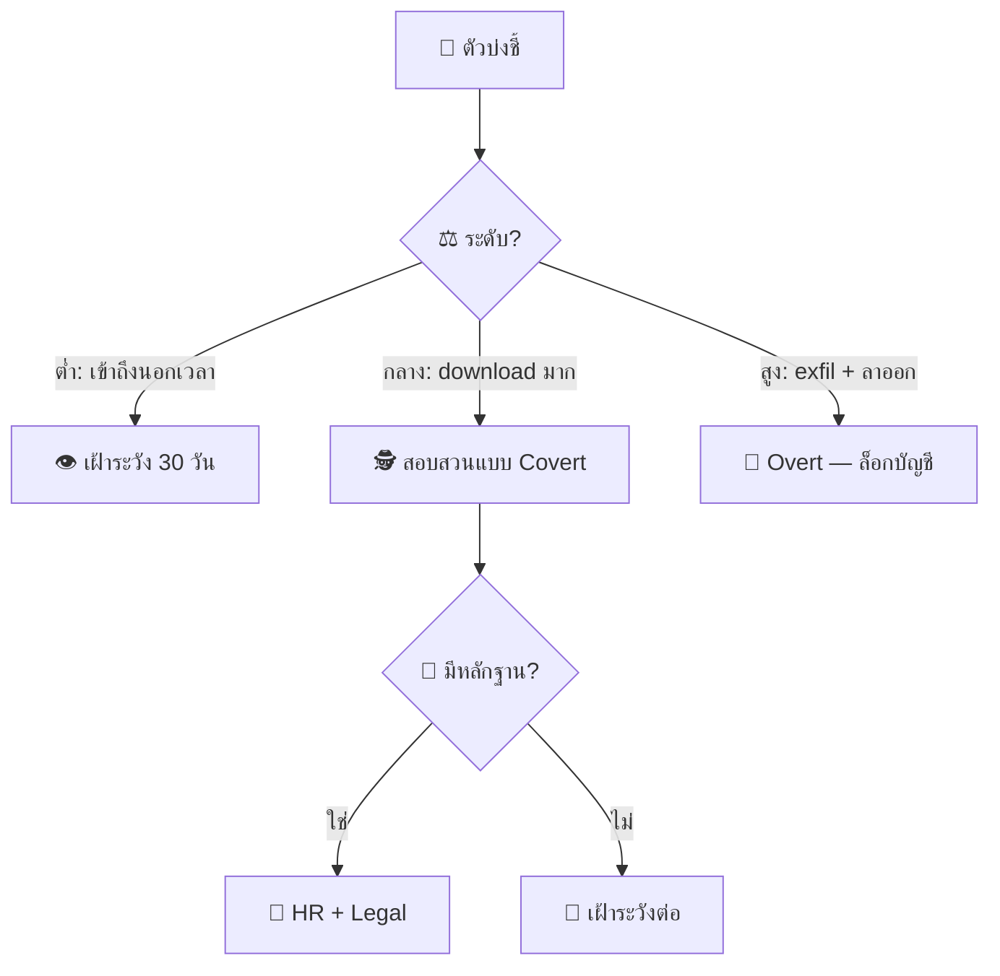
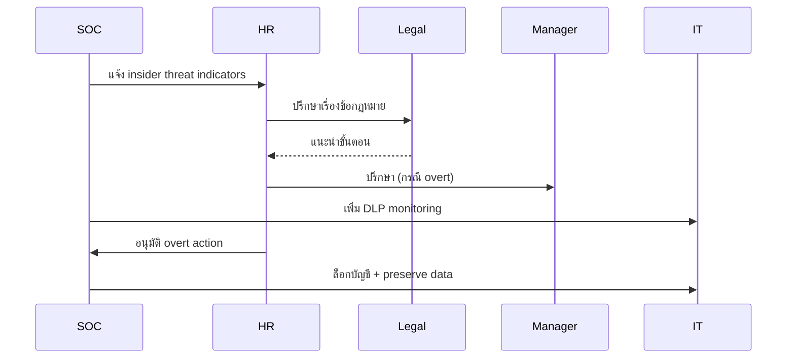
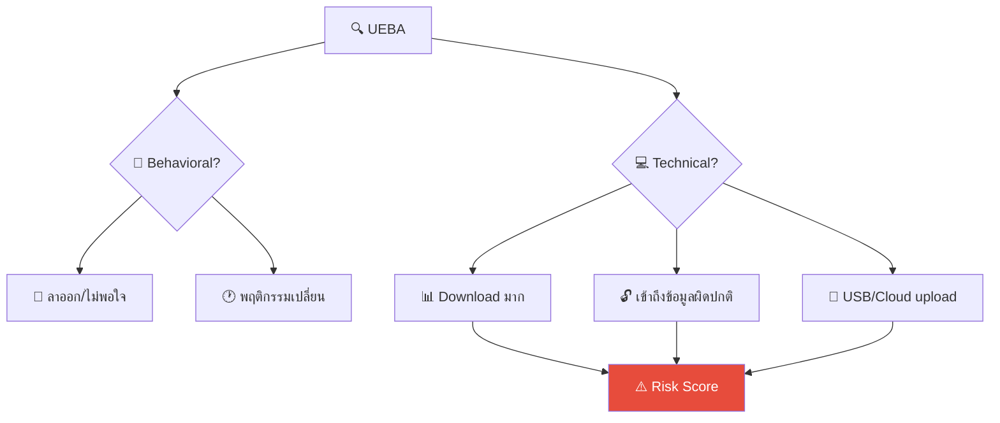
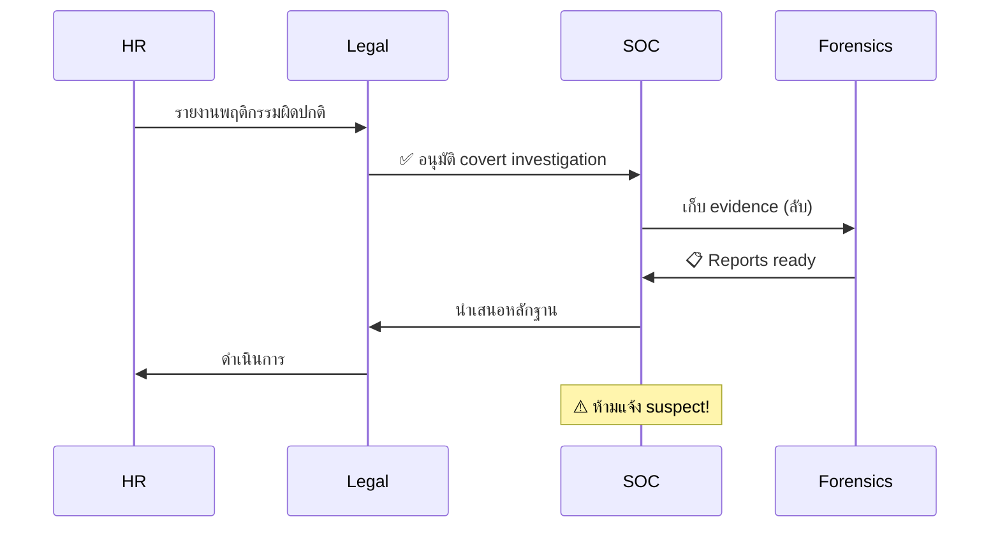

# Playbook: ภัยคุกคามจากภายใน (Insider Threat)

**ID**: PB-14
**ระดับความรุนแรง**: สูง/วิกฤต | **หมวดหมู่**: ภัยจากภายใน
**MITRE ATT&CK**: [T1078](https://attack.mitre.org/techniques/T1078/) (บัญชีที่ถูกต้อง), [T1048](https://attack.mitre.org/techniques/T1048/) (การนำข้อมูลออก)
**ทริกเกอร์**: UEBA alert, DLP alert, HR referral, whistleblower report, ผู้จัดการรายงาน

## หลังเหตุการณ์ (Post-Incident)

- [ ] ทบทวน access controls ตาม least privilege
- [ ] ใช้ UEBA เฝ้า anomalous behavior ต่อเนื่อง
- [ ] อัพเดท DLP policies ตาม insider patterns ที่พบ
- [ ] ประสาน HR สำหรับ disciplinary actions
- [ ] ทบทวน monitoring policies สำหรับ high-risk users
- [ ] จัดทำ [Incident Report](../../11_Reporting_Templates/incident_report.th.md)

### แนวทางการประเมินความเสี่ยง

```mermaid
graph TD
    Indicator["🚨 ตัวบ่งชี้"] --> Risk{"⚖️ ระดับ?"}
    Risk -->|ต่ำ: เข้าถึงนอกเวลา| Monitor["👁️ เฝ้าระวัง 30 วัน"]
    Risk -->|กลาง: download มาก| CovertOps["🕵️ สอบสวนแบบ Covert"]
    Risk -->|สูง: exfil + ลาออก| Overt["🔴 Overt — ล็อกบัญชี"]
    CovertOps --> Evidence{"📁 มีหลักฐาน?"}
    Evidence -->|ใช่| HR["👥 HR + Legal"]
    Evidence -->|ไม่| Continue["🔄 เฝ้าระวังต่อ"]
```

### ผังการประสานงาน

```mermaid
sequenceDiagram
    participant SOC
    participant HR
    participant Legal
    participant Manager
    participant IT
    SOC->>HR: แจ้ง insider threat indicators
    HR->>Legal: ปรึกษาเรื่องข้อกฎหมาย
    Legal-->>HR: แนะนำขั้นตอน
    HR->>Manager: ปรึกษา (กรณี overt)
    SOC->>IT: เพิ่ม DLP monitoring
    HR->>SOC: อนุมัติ overt action
    SOC->>IT: ล็อกบัญชี + preserve data
```

---

## ผังการตัดสินใจ

```mermaid
graph TD
    Alert["🚨 กิจกรรมภายในผิดปกติ"] --> Intent{"🎯 เจตนา?"}
    Intent -->|ร้าย (malicious)| Mal["🔴 สอบสวนลับ"]
    Intent -->|ไม่ตั้งใจ (negligent)| Neg["🟠 ให้ความรู้ + ควบคุม"]
    Intent -->|ถูกบังคับ (coerced)| Coerce["🔴 สอบสวน + ช่วยเหลือ"]
    Mal --> Evidence["📋 รวบรวมหลักฐาน"]
    Coerce --> Evidence
    Evidence --> HRLIT["⚖️ ดำเนินการร่วม HR/Legal"]
```

---

## 1. การวิเคราะห์

### 1.1 ตัวบ่งชี้พฤติกรรม

| ตัวบ่งชี้ | ความเสี่ยง | แหล่ง |
|:---|:---|:---|
| ดาวน์โหลด/คัดลอกข้อมูลจำนวนมาก | 🔴 สูง | DLP / UEBA |
| เข้าถึงข้อมูลนอกขอบเขตหน้าที่ | 🔴 สูง | UEBA |
| ใช้ USB/cloud storage ส่งข้อมูลออก | 🔴 สูง | DLP / EDR |
| เข้าถึงระบบนอกเวลาทำงานบ่อย | 🟡 ปานกลาง | SIEM |
| อยู่ระหว่างลาออก (notice period) | 🔴 สูง | HR |
| ถ่ายรูปหน้าจอ (shoulder surfing) | 🟡 ปานกลาง | รายงานเพื่อนร่วมงาน |
| ติดตั้ง unauthorized tools | 🟠 สูง | EDR |
| เปลี่ยน permissons / สิทธิ์ | 🔴 สูง | IAM audit |
| อ่านข้อมูล competitor / M&A | 🔴 สูง | DLP |

### 1.2 รายการตรวจสอบ (**ลับ**)

| รายการ | วิธีตรวจสอบ | เสร็จ |
|:---|:---|:---:|
| ระบุพนักงานที่เกี่ยวข้อง | UEBA / DLP | ☐ |
| กิจกรรมที่ผิดปกติคืออะไร? | SIEM / DLP | ☐ |
| มีข้อมูลถูกส่งออกหรือไม่? ประเภทอะไร? | DLP / Netflow | ☐ |
| ช่องทางที่ใช้ (USB, email, cloud, print) | DLP / EDR | ☐ |
| มี context จาก HR? (ลาออก, ถูกลงโทษ) | HR | ☐ |
| timeline ของกิจกรรม | SIEM | ☐ |
| มีบุคคลอื่นเกี่ยวข้อง? | UEBA correlation | ☐ |

> ⚠️ **สำคัญ**: ห้ามแจ้งพนักงานจนกว่าจะปรึกษา HR + Legal แล้ว

---

## 2. การควบคุม

### 2.1 สอบสวนลับ (Covert)

| # | การดำเนินการ | เสร็จ |
|:---:|:---|:---:|
| 1 | เพิ่ม UEBA/DLP monitoring ลับ | ☐ |
| 2 | บันทึก forensic image เครื่องที่ใช้ | ☐ |
| 3 | แจ้ง HR + Legal ลับ | ☐ |
| 4 | จำกัด USB access (หากยังไม่มี policy) | ☐ |
| 5 | เฝ้าระวังช่องทางส่งข้อมูลออก | ☐ |

### 2.2 ตอบสนองทันที (Overt — กรณีเร่งด่วน)

| # | การดำเนินการ | เสร็จ |
|:---:|:---|:---:|
| 1 | **ล็อกบัญชี** ทันที | ☐ |
| 2 | **ยึดอุปกรณ์** ร่วมกับ HR | ☐ |
| 3 | **บล็อก VPN/Remote access** | ☐ |
| 4 | **สำรอง forensic evidence** | ☐ |

---

## 3. การกำจัด

| # | การดำเนินการ | เสร็จ |
|:---:|:---|:---:|
| 1 | ลบบัญชี / ปิดสิทธิ์ทั้งหมด | ☐ |
| 2 | หมุนเวียน credentials ที่พนักงานเข้าถึงได้ | ☐ |
| 3 | ตรวจสอบ service accounts / shared accounts | ☐ |
| 4 | ยึดอุปกรณ์และสำรอง forensics ทั้งหมด | ☐ |

---

## 4. การฟื้นฟู

| # | การดำเนินการ | เสร็จ |
|:---:|:---|:---:|
| 1 | ปรับปรุง DLP rules | ☐ |
| 2 | ปรับปรุง offboarding checklist ร่วม HR | ☐ |
| 3 | ใช้ UEBA สำหรับพนักงาน high-risk | ☐ |
| 4 | จำกัด USB / removable media | ☐ |
| 5 | ตรวจสอบสิทธิ์ทุกไตรมาส | ☐ |

---

## 5. Evidence Checklist

| ประเภทหลักฐาน | สิ่งที่ต้องเก็บ | แหล่งข้อมูล | เหตุผลที่ต้องเก็บ |
|:---|:---|:---|:---|
| หลักฐานการเข้าถึง | file access ผิดปกติ, data export, repo activity, print job | SIEM / DLP / repo audit / print logs | ใช้ดูว่าผู้ต้องสงสัยแตะข้อมูลอะไรไปบ้าง |
| หลักฐานจากอุปกรณ์ | USB history, browser/cloud-sync activity, forensic image, deleted file | Endpoint forensics / EDR | ใช้พิสูจน์ staging, copying, หรือการทำลายข้อมูล |
| หลักฐานด้านตัวตน | user role, privilege change ล่าสุด, shared-account use, badge/VPN access | IAM / HR / physical security | ใช้ผูกกิจกรรมเข้ากับสิทธิ์ที่มีจริง |
| หลักฐานเชิงพฤติกรรมและคดี | HR concern, resignation status, warning, manager report, legal hold | HR / legal / case records | ใช้ประกอบบริบทและการดำเนินการที่ถูกต้องตามกฎหมาย |
| หลักฐาน timeline | ลำดับเหตุการณ์ทางเทคนิคและธุรกิจทั้งหมด | Case notes / SIEM / forensics | สำคัญมากสำหรับ legal review และ executive decision |

---

## 6. Minimum Telemetry Required

| แหล่ง Telemetry | ใช้เพื่ออะไร | ความสำคัญ | Blind Spot ถ้าไม่มี |
|:---|:---|:---:|:---|
| DLP, file, และ repository telemetry | ดู bulk access, copying, external sharing, source-code activity | Required | วัด exfiltration หรือ sabotage ไม่ได้ |
| Endpoint และ USB telemetry | ดู removable media, browser upload, local staging, deleted file | Required | มองไม่เห็นการ copy ทางกายภาพและการ staging บนเครื่อง |
| Identity, badge, และ remote-access telemetry | ดู access path, after-hours entry, VPN, privilege use | Required | ผูก insider activity กับบริบทการเข้าถึงไม่ได้ |
| HR และ legal case context | ดู employment action, resignation, และ approved investigation scope | Required | อ่านความหมายของ technical finding ผิดได้ง่าย |
| Print, email, และ cloud-collaboration logs | ดูช่องทางนำข้อมูลออกที่ไม่ใช่ USB/download | Recommended | พลาดเส้นทาง exfiltration ทางอ้อม |

---

## 7. False Positive และ Tuning Guide

| Scenario | ทำไมจึงดูน่าสงสัย | วิธีตรวจสอบ | Tuning Action | ต้องยกระดับเมื่อ |
|:---|:---|:---|:---|:---|
| งาน export จำนวนมากหรือส่งมอบ project ที่ได้รับอนุมัติ | data access ปริมาณมากดูเหมือน theft | ยืนยัน ticket, project owner, destination, และ business need | tune เฉพาะ user/project/destination ที่อนุมัติ | export มีข้อมูลอ่อนไหวที่ไม่เกี่ยวข้องหรือส่งไป personal destination |
| developer clone repo หรือ backup ตามปกติ | sync source code จำนวนมากดูเหมือน exfiltration | ยืนยัน device, branch, repo owner, และเวลางาน | baseline expected engineering sync pattern แบบแคบ | user เดียวกันใช้ USB, personal cloud, หรือเข้าถึงนอกเวลาปกติร่วมด้วย |
| งานหลังเวลางานของ HR หรือ finance | การเข้าถึงข้อมูลอ่อนไหวกลางคืนดูน่าสงสัย | ยืนยันรอบงาน, การอนุมัติจากหัวหน้า, และชุดข้อมูลที่เกี่ยวข้อง | ลด severity สำหรับ workflow ที่เกิดเป็นรอบตาม business cycle | การเข้าถึงขยายเกิน role หรือเกิดพร้อม resignation concern |
| การเก็บข้อมูลเพื่อ legal หรือ security investigation | bulk access แบบเงียบอาจดูเหมือน insider action | ยืนยัน legal hold ID และ collector identity | suppress เฉพาะ account และช่วงเวลาที่ documented | การเก็บข้อมูลไปยังปลายทางที่ไม่ควบคุมหรือใช้ personal account |

---

## 8. เกณฑ์การยกระดับ

| เงื่อนไข | ยกระดับไปยัง |
|:---|:---|
| PII / ข้อมูลลูกค้าถูกส่งออก | Legal + DPO (PDPA 72 ชม.) |
| ทรัพย์สินทางปัญญาถูกขโมย | Legal + CISO |
| ทำร่วมกับบุคคลภายนอก (sabotage/espionage) | Law Enforcement |
| พฤติกรรมคุกคาม (threatening behavior) | HR + Security ทันที |
| Admin abuse | [PB-15 Rogue Admin](Rogue_Admin.th.md) |

---

### ผัง Insider Threat Indicators

```mermaid
graph TD
    UEBA["🔍 UEBA"] --> Behav{"🧠 Behavioral?"}
    UEBA --> Tech{"💻 Technical?"}
    Behav --> Resign["📝 ลาออก/ไม่พอใจ"]
    Behav --> Hours["🕐 พฤติกรรมเปลี่ยน"]
    Tech --> Volume["📊 Download มาก"]
    Tech --> Access["🔓 เข้าถึงข้อมูลผิดปกติ"]
    Tech --> USB["💾 USB/Cloud upload"]
    Volume --> Score["⚠️ Risk Score"]
    Access --> Score
    USB --> Score
    style Score fill:#e74c3c,color:#fff
```

### ผัง Covert Investigation Process

```mermaid
sequenceDiagram
    participant HR
    participant Legal
    participant SOC
    participant Forensics
    HR->>Legal: รายงานพฤติกรรมผิดปกติ
    Legal->>SOC: ✅ อนุมัติ covert investigation
    SOC->>Forensics: เก็บ evidence (ลับ)
    Forensics->>SOC: 📋 Reports ready
    SOC->>Legal: นำเสนอหลักฐาน
    Legal->>HR: ดำเนินการ
    Note over SOC: ​⚠️ ห้ามแจ้ง suspect!
```

## กฎตรวจจับ (Sigma)

| กฎ | ไฟล์ |
|:---|:---|
| Bulk File Copy to USB | [file_bulk_usb_copy.yml](../../08_Detection_Engineering/sigma_rules/file_bulk_usb_copy.yml) |
| Large Upload to External IP | [net_large_upload.yml](../../08_Detection_Engineering/sigma_rules/net_large_upload.yml) |
| Suspicious Inbox Rule Created | [cloud_email_inbox_rule.yml](../../08_Detection_Engineering/sigma_rules/cloud_email_inbox_rule.yml) |

## เอกสารที่เกี่ยวข้อง

- [กรอบการตอบสนองต่อเหตุการณ์](../Framework.th.md)
- [แม่แบบรายงานเหตุการณ์](../../11_Reporting_Templates/incident_report.th.md)
- [PB-20 แอดมินกระทำผิด](Rogue_Admin.th.md)
- [PB-08 การนำข้อมูลออก](Data_Exfiltration.th.md)

## Insider Threat Indicators Correlation

| Category | Behavioral | Technical | Combined Risk |
|:---|:---|:---|:---|
| Pre-resignation | Notice given | Mass download | 🔴 Critical |
| Disgruntled | Performance issues | After-hours access | 🟠 High |
| Negligent | Policy violations | Unpatched system | 🟡 Medium |
| Compromised | Phished | Unusual C2 traffic | 🔴 Critical |

### Investigation without Alerting Subject

| Step | Method | Precaution |
|:---|:---|:---|
| Monitor activity | Silent DLP/UEBA | Need-to-know only |
| Review access logs | Backend query | No user-facing alerts |
| Capture evidence | Forensic copy | Legal hold |
| Coordinate HR/Legal | Offline meeting | Secure channel |

### Data Impact Classification

| Data Accessed | Severity | Notification |
|:---|:---|:---|
| Customer PII | Critical | PDPA required |
| Financial data | High | CFO + Legal |
| Source code | High | CTO |
| General internal | Medium | SOC Manager |

## References

- [MITRE ATT&CK — Insider Threat](https://attack.mitre.org/techniques/T1078/)
- [CERT — Common Sense Guide to Insider Threats](https://insights.sei.cmu.edu/library/common-sense-guide-to-mitigating-insider-threats/)
