# Playbook: Lateral Movement

**ID**: PB-12
**Severity**: High/Critical | **Category**: Network / Endpoint
**MITRE ATT&CK**: [T1021](https://attack.mitre.org/techniques/T1021/) (Remote Services), [T1570](https://attack.mitre.org/techniques/T1570/) (Lateral Tool Transfer), [T1550](https://attack.mitre.org/techniques/T1550/) (Use Alternate Authentication Material)
**Trigger**: EDR alert (PsExec, WMI lateral), SIEM (Event 4648/4624 Type 3/10), Honey token, AD anomaly

### Attack Path

### Protocol-Based Detection

```mermaid
graph TD
    LM["🔀 Lateral Movement"] --> Proto{"📡 Protocol?"}
    Proto -->|SMB/PsExec| SMB["Event 7045 + 5145"]
    Proto -->|WMI| WMI["Event 4648 + WMI logs"]
    Proto -->|RDP| RDP["Event 4624 Type 10"]
    Proto -->|WinRM| WinRM["Event 4648 + 91"]
    Proto -->|SSH| SSH["auth.log + key events"]
    SMB --> Hunt["🎯 Threat Hunt"]
    WMI --> Hunt
    RDP --> Hunt
    WinRM --> Hunt
    SSH --> Hunt
```

---

## Decision Flow

```mermaid
graph TD
    Alert["🚨 Lateral Movement Alert"] --> Source["🔍 Identify Source Host"]
    Source --> Auth{"🔑 Which Account?"}
    Auth -->|Authorized IT Admin| Ticket{"📋 Change Request / Patching?"}
    Auth -->|Non-Admin / Unknown| Suspicious["🔴 Suspicious"]
    Auth -->|Service Account| SvcCheck{"Expected Behavior?"}
    Ticket -->|Yes| FP["✅ False Positive"]
    Ticket -->|No| Suspicious
    SvcCheck -->|Yes| FP
    SvcCheck -->|No| Suspicious
    Suspicious --> Method{"⚙️ Movement Method?"}
    Method -->|RDP| RDPCheck["Check RDP Session Logs"]
    Method -->|PsExec/WMI/WinRM| ToolCheck["Check Process Creation"]
    Method -->|SMB File Copy| FileCheck["Check Transferred Files"]
    Method -->|Pass-the-Hash/Ticket| CredCheck["🔴 Credential Theft"]
    RDPCheck --> Scope["📊 Scope Assessment"]
    ToolCheck --> Scope
    FileCheck --> Scope
    CredCheck --> Scope
    Scope --> Isolate["🔌 Isolate Source + Destinations"]
```

---

## 1. Analysis

### 1.1 Identify Movement Method

| Method | Detection Source | Event IDs / Artifacts |
|:---|:---|:---|
| **RDP** | Windows Event Logs, SIEM | 4624 (Type 10), 4778/4779 |
| **PsExec** | Sysmon, EDR | 7045 (service install), named pipes |
| **WMI** | Sysmon, SIEM | 4648 (explicit creds), WMI process |
| **WinRM/PowerShell** | PowerShell logs, SIEM | 4648, 91/168 (WinRM) |
| **SMB file copy** | File system, Sysmon | File create in admin shares |
| **SSH** | Auth logs, SIEM | sshd entries, 4624 (Type 3) |
| **Pass-the-Hash** | EDR, SIEM | 4624 (Type 3) NTLM without 4776 |
| **Pass-the-Ticket** | EDR, SIEM | 4768/4769 anomalies |
| **DCOM** | Sysmon, SIEM | COM object invocation, mmc.exe |

### 1.2 Source Host Investigation

| Check | How | Done |
|:---|:---|:---:|
| Is the source host compromised? | Check EDR alerts on source host | ☐ |
| How was the source host compromised? | Trace initial access (phishing, exploit, etc.) | ☐ |
| Which credentials are being used? | Event ID 4624 — account name and logon type | ☐ |
| Were credentials dumped? | Check for LSASS access, Mimikatz artifacts | ☐ |
| How many destinations? | SIEM query — unique destination IPs from source | ☐ |

### 1.3 Destination Hosts Investigation

| Check | How | Done |
|:---|:---|:---:|
| What actions were taken on destination? | EDR timeline, process creation | ☐ |
| Were files dropped/executed? | File creation events, Sysmon | ☐ |
| Was persistence established? | New services, scheduled tasks, registry | ☐ |
| Was data accessed? | File access logs, DLP | ☐ |
| Were logs cleared on destination? | [PB-20 Log Clearing](Log_Clearing.en.md) | ☐ |

---

## 2. Containment

### 2.1 Immediate Actions (within 10 minutes)

| # | Action | Tool | Done |
|:---:|:---|:---|:---:|
| 1 | **Isolate source host** | EDR | ☐ |
| 2 | **Disable compromised account(s)** | AD / IdP | ☐ |
| 3 | **Isolate all confirmed destination hosts** | EDR | ☐ |
| 4 | **Block lateral protocols** for affected segment (SMB 445, RDP 3389) | Firewall / Microseg | ☐ |

### 2.2 If Active Directory Compromise Suspected

| # | Action | Done |
|:---:|:---|:---:|
| 1 | Reset password of compromised accounts | ☐ |
| 2 | Check for Golden Ticket — reset KRBTGT twice (12h apart) | ☐ |
| 3 | Audit Domain Admins group — any new members? | ☐ |
| 4 | Check for DCSync indicators (Event ID 4662 with replication rights) | ☐ |
| 5 | Disable RDP at host firewall across non-admin workstations | ☐ |

---

## 3. Eradication

| # | Action | Done |
|:---:|:---|:---:|
| 1 | Trace the full attack path from Patient Zero to all touched hosts | ☐ |
| 2 | Scan/clean all destination hosts | ☐ |
| 3 | Remove persistence on all affected hosts | ☐ |
| 4 | Re-image hosts if cleaning is uncertain | ☐ |
| 5 | Reset all credentials that may have been harvested | ☐ |

---

## 4. Recovery

| # | Action | Done |
|:---:|:---|:---:|
| 1 | Reconnect cleaned hosts in stages | ☐ |
| 2 | Verify monitoring is active on all recovered hosts | ☐ |
| 3 | Review network segmentation — block workstation-to-workstation communication | ☐ |
| 4 | Implement LAPS (Local Administrator Password Solution) if not already | ☐ |
| 5 | Enable Windows Credential Guard | ☐ |
| 6 | Monitor all recovered hosts and accounts for 72 hours | ☐ |

---

## 5. IoC Collection

| Type | Value | Source |
|:---|:---|:---|
| Source Host | | SIEM / EDR |
| Compromised Account(s) | | Event logs |
| Destination Hosts | | SIEM query |
| Movement Method | | EDR / Event IDs |
| Tools Used (PsExec, etc.) | | Process creation |
| File Hashes (dropped) | | EDR |
| Credential Harvest Tool | | EDR / Forensics |

---

## 6. Escalation Criteria

| Condition | Escalate To |
|:---|:---|
| Domain Admin credentials compromised | CISO + External IR |
| More than 5 hosts reached | Major Incident |
| Domain controller accessed | CISO immediately |
| Pass-the-Hash / Pass-the-Ticket confirmed | Tier 2 + Identity team |
| Data exfiltration from destination hosts | [PB-08](Data_Exfiltration.en.md) + Legal |
| Ransomware deployment after lateral movement | [PB-02](Ransomware.en.md) — Major Incident |

---

### Network Segmentation

```mermaid
graph TD
    Corp["🏢 Corporate"] --> FW1["🔥 FW"]
    FW1 --> DC["🏰 DC Segment"]
    Corp --> FW2["🔥 FW"]
    FW2 --> Server["🖥️ Server Farm"]
    Corp --> FW3["🔥 FW"]
    FW3 --> User["💻 User VLAN"]
    DC -.->|❌ No direct access| User
    style DC fill:#e74c3c,color:#fff
    style FW1 fill:#f39c12,color:#fff
    style FW2 fill:#f39c12,color:#fff
    style FW3 fill:#f39c12,color:#fff
```

### Credential Theft Detection

```mermaid
sequenceDiagram
    participant Attacker
    participant LSASS
    participant EDR
    participant SOC
    Attacker->>LSASS: Access lsass.exe memory
    EDR->>EDR: 🚨 LSASS access detected
    EDR->>SOC: Alert: credential dumping
    SOC->>EDR: Isolate source host
    SOC->>SOC: Check for lateral movement
```

## Related Documents

- [IR Framework](../Framework.en.md)
- [Incident Report](../../templates/incident_report.en.md)
- [PB-02 Ransomware](Ransomware.en.md)
- [PB-05 Account Compromise](Account_Compromise.en.md)
- [PB-13 C2 Communication](C2_Communication.en.md)
- [PB-15 Rogue Admin](Rogue_Admin.en.md)
- [PB-20 Log Clearing](Log_Clearing.en.md)

## References

- [MITRE ATT&CK T1021 — Remote Services](https://attack.mitre.org/techniques/T1021/)
- [JPCERT Lateral Movement Guide](https://www.jpcert.or.jp/english/pub/sr/20170612ac-ir_research_en.pdf)
- [Microsoft LAPS](https://learn.microsoft.com/en-us/windows-server/identity/laps/laps-overview)
