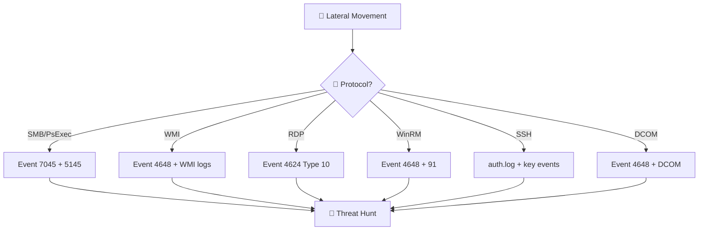
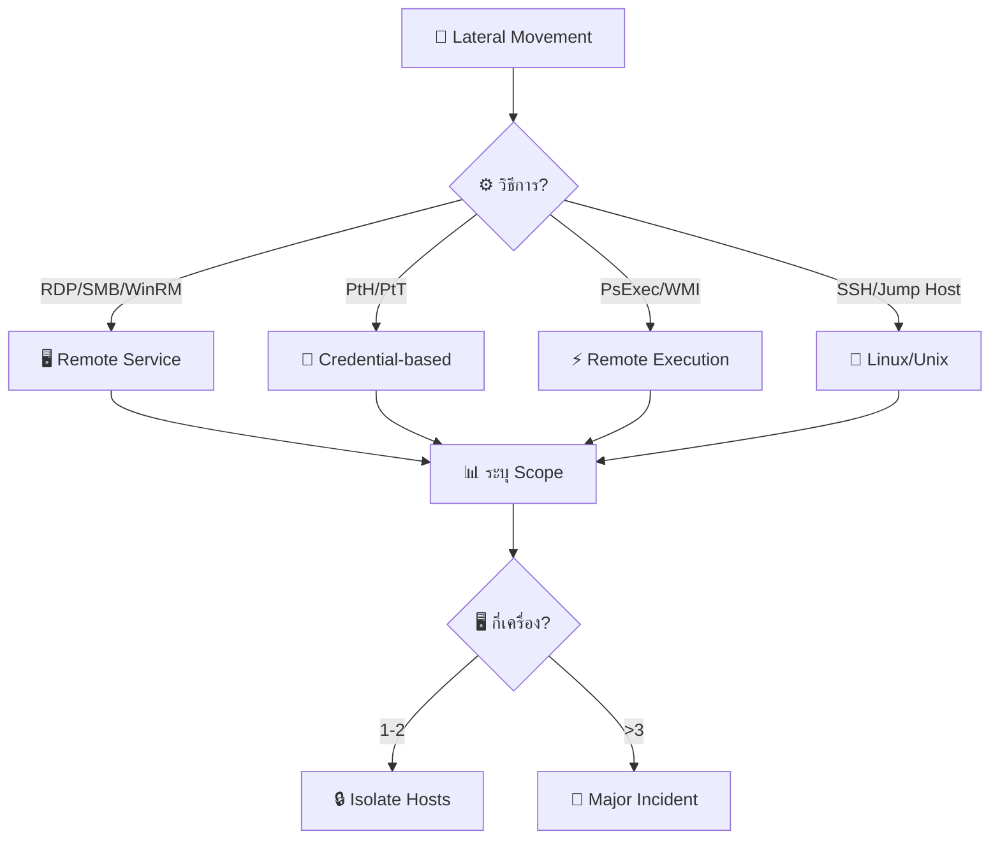
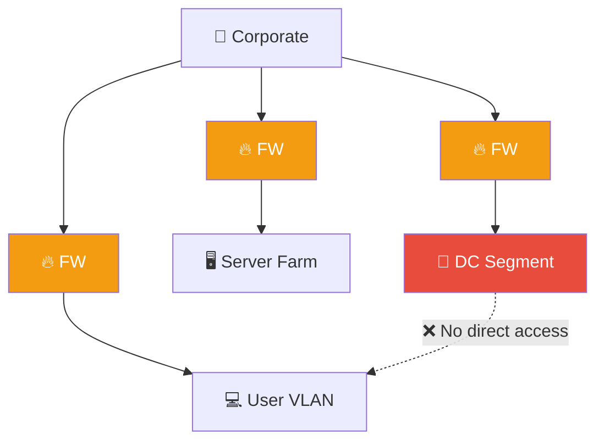
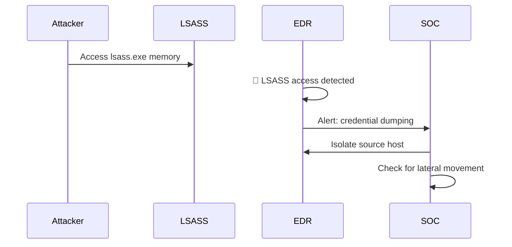

# Playbook: การเคลื่อนไหว ด้านข้าง (Lateral Movement)

**ID**: PB-12
**ระดับความรุนแรง**: สูง/วิกฤต | **หมวดหมู่**: การโจมตี / Post-Exploitation
**MITRE ATT&CK**: [T1021](https://attack.mitre.org/techniques/T1021/) (Remote Services), [T1550](https://attack.mitre.org/techniques/T1550/) (Use Alternate Authentication Material)
**ทริกเกอร์**: EDR alert (PsExec, WMI, RDP), SIEM (Event 4648/4624 Type 3), Honey token triggered


## หลังเหตุการณ์ (Post-Incident)

- [ ] ทบทวน network segmentation
- [ ] ใช้ credential guard / LSA protection
- [ ] Disable NTLM ที่เป็นไปได้
- [ ] ทบทวน admin account tiering (Tier 0/1/2)
- [ ] สร้าง detection rule สำหรับ technique ที่พบ
- [ ] จัดทำ [Incident Report](../../11_Reporting_Templates/incident_report.th.md)

### ผังเส้นทางการโจมตี


```mermaid
graph LR
    Entry["🎯 Initial Access"] --> Recon["🔍 AD Recon"]
    Recon --> CredTheft["🔑 Credential Theft"]
    CredTheft --> Move["🔀 Lateral Movement"]
    Move --> PrivEsc["👑 Priv Escalation"]
    PrivEsc --> DC["🏰 Domain Controller"]
    DC --> Objective["💀 Objective"]
    style Entry fill:#e74c3c,color:#fff
    style CredTheft fill:#f39c12,color:#fff
    style DC fill:#8e44ad,color:#fff
    style Objective fill:#c0392b,color:#fff
```

### ผังการตรวจจับตาม Protocol


```mermaid
graph TD
    LM["🔀 Lateral Movement"] --> Proto{"📡 Protocol?"}
    Proto -->|SMB/PsExec| SMB["Event 7045 + 5145"]
    Proto -->|WMI| WMI["Event 4648 + WMI logs"]
    Proto -->|RDP| RDP["Event 4624 Type 10"]
    Proto -->|WinRM| WinRM["Event 4648 + 91"]
    Proto -->|SSH| SSH["auth.log + key events"]
    Proto -->|DCOM| DCOM["Event 4648 + DCOM"]
    SMB --> Hunt["🎯 Threat Hunt"]
    WMI --> Hunt
    RDP --> Hunt
    WinRM --> Hunt
    SSH --> Hunt
    DCOM --> Hunt
```

---

## ผังการตัดสินใจ


```mermaid
graph TD
    Alert["🚨 Lateral Movement"] --> Method{"⚙️ วิธีการ?"}
    Method -->|RDP/SMB/WinRM| Remote["🖥️ Remote Service"]
    Method -->|PtH/PtT| Cred["🔑 Credential-based"]
    Method -->|PsExec/WMI| Exec["⚡ Remote Execution"]
    Method -->|SSH/Jump Host| SSH["🐧 Linux/Unix"]
    Remote --> Scope["📊 ระบุ Scope"]
    Cred --> Scope
    Exec --> Scope
    SSH --> Scope
    Scope --> Multi{"🖥️ กี่เครื่อง?"}
    Multi -->|1-2| Contain["🔒 Isolate Hosts"]
    Multi -->|>3| Major["🔴 Major Incident"]
```

---

## 1. การวิเคราะห์

### 1.1 วิธี Lateral Movement

| วิธี | Windows Event ID | ตัวบ่งชี้ |
|:---|:---|:---|
| **RDP** | 4624 (Type 10) | RDP จาก server-to-server |
| **SMB/Admin Share** | 5140, 5145 | Access \\C$ \\ADMIN$ |
| **PsExec** | 7045 (service install) | PSEXESVC service |
| **WMI** | 4648 + WMI provider | WmiPrvSE.exe child |
| **Pass-the-Hash** | 4624 (NTLM, Type 3) | NTLM จาก workstation |
| **Pass-the-Ticket** | 4768/4769 anomaly | TGT/TGS ผิดปกติ |
| **SSH** | sshd auth.log | Key-based ผิดปกติ |

### 1.2 รายการตรวจสอบ

| รายการ | วิธีตรวจสอบ | เสร็จ |
|:---|:---|:---:|
| Source host (patient zero) | EDR / SIEM | ☐ |
| Destination hosts ทั้งหมด | SIEM lateral search | ☐ |
| บัญชีที่ใช้ (user / service / admin) | AD logs | ☐ |
| วิธีการ (RDP/PsExec/WMI/PtH) | EDR / Event ID | ☐ |
| เวลาและ pattern | SIEM timeline | ☐ |
| Tools ที่ใช้ (Mimikatz, Impacket, etc.) | EDR | ☐ |
| ข้อมูลที่เข้าถึงบน destination hosts | EDR / file audit | ☐ |

---

## 2. การควบคุม

| # | การดำเนินการ | เสร็จ |
|:---:|:---|:---:|
| 1 | **Isolate** ทุก host ที่ได้รับผลกระทบ | ☐ |
| 2 | **รีเซ็ตรหัสผ่าน** บัญชีที่ถูกใช้ | ☐ |
| 3 | **ปิดบัญชี** service accounts ที่ถูกใช้ | ☐ |
| 4 | **Block** lateral movement tools ที่ EDR | ☐ |
| 5 | **จำกัด RDP / SMB** ระหว่าง workstations | ☐ |
| 6 | **เพิ่ม monitoring** บน AD (Event 4624, 4648) | ☐ |

---

## 3. การกำจัด

| # | การดำเนินการ | เสร็จ |
|:---:|:---|:---:|
| 1 | ลบ malware/implant จากทุก host | ☐ |
| 2 | ลบ persistence ทั้งหมด | ☐ |
| 3 | รีเซ็ต KRBTGT 2 ครั้ง (หาก Golden Ticket) | ☐ |
| 4 | หมุนเวียน service account credentials | ☐ |

---

## 4. การฟื้นฟู

| # | การดำเนินการ | เสร็จ |
|:---:|:---|:---:|
| 1 | ใช้ LAPS สำหรับ local admin passwords | ☐ |
| 2 | บังคับ network segmentation | ☐ |
| 3 | ปิด RDP/SMB ระหว่าง workstations (peer-to-peer) | ☐ |
| 4 | ใช้ Credential Guard / Protected Users group | ☐ |
| 5 | ติดตาม 30 วัน | ☐ |

---

## 5. Evidence Checklist

| ประเภทหลักฐาน | สิ่งที่ต้องเก็บ | แหล่งข้อมูล | เหตุผลที่ต้องเก็บ |
|:---|:---|:---|:---|
| หลักฐานการเคลื่อนที่ | source host, destination host, method, port, service creation, RDP/WinRM/SMB log | SIEM / EDR / Windows logs | ใช้ reconstruct เส้นทางการโจมตีข้าม host |
| หลักฐาน credential | account ที่ถูกใช้, ticket abuse, hash, LSASS access, privileged group | IdP / AD / EDR | ใช้ดู credential ชุดใดทำให้ movement เกิดขึ้น |
| หลักฐานจาก host | dropped tool, remote service, scheduled task, persistence บนเครื่องปลายทาง | EDR / forensics | ใช้กำหนดขอบเขต cleanup ในแต่ละ host |
| หลักฐานด้านขอบเขต | จำนวน host ที่แตะ, การเข้าถึง DC/server, sequence timing | SIEM correlation | ใช้กำหนด severity และลำดับการ contain |
| หลักฐานผลกระทบ | data staging, admin access, ransomware prep, service disruption | DLP / app logs / ticketing | ใช้ดูว่ามี business impact แล้วหรือยัง |

---

## 6. Minimum Telemetry Required

| แหล่ง Telemetry | ใช้เพื่ออะไร | ความสำคัญ | Blind Spot ถ้าไม่มี |
|:---|:---|:---:|:---|
| Endpoint และ EDR telemetry | ดู remote service creation, process execution, dropped tool | Required | พิสูจน์ remote execution บนเครื่องปลายทางไม่ได้ |
| Windows, AD, และ auth logs | ดู logon type, Kerberos/NTLM activity, admin share use | Required | movement ที่ขับเคลื่อนด้วย credential ไม่ชัด |
| Network telemetry | ดู RDP/SMB/WinRM/WMI path และ east-west traffic | Required | เส้นทาง multi-host ไม่ครบ |
| SIEM correlation ข้ามหลาย host | ดู sequence และ blast radius | Required | มองภาพรวมของ chain ไม่ออก |
| Asset criticality และ segmentation context | ใช้จัดลำดับการ contain | Recommended | อาจ isolate ระบบผิดลำดับ |

---

## 7. False Positive และ Tuning Guide

| Scenario | ทำไมจึงดูน่าสงสัย | วิธีตรวจสอบ | Tuning Action | ต้องยกระดับเมื่อ |
|:---|:---|:---|:---|:---|
| software deployment หรือ patching ที่อนุมัติ | PsExec/WinRM/service creation ดูเหมือน attacker movement | ยืนยัน deployment tool, admin identity, และ maintenance window | allowlist management server และ service name ที่อนุมัติแบบแคบ | tool ไปแตะ host นอก scope หรือเกิดนอก change window |
| admin troubleshooting ข้ามหลาย server | RDP/SMB access pattern ดูเหมือน manual lateral movement | ยืนยัน admin ticket, target set, และ jump-host use | ลด severity สำหรับ admin path และ jump host ที่อนุมัติ | account เดียวกันไปแตะ DC หรือ user workstation แบบผิดปกติ |
| backup หรือ monitoring agent rollout | service ใหม่และ SMB connection spike อาจ noisy | ยืนยัน package, owner, และ rollout schedule | tune signature ของ agent และ destination set ที่คาดไว้ | มี binary แปลกหรือ credential dumping ร่วมด้วย |
| IR หรือ red-team exercise | multi-host access โดยตั้งใจดูเหมือนจริง | ยืนยัน exercise scope และ credential ที่ใช้ | suppress เฉพาะ account/host ใน exercise ที่อนุมัติ | activity หลุดนอกขอบเขตหรือกระทบ production user |

---

## 8. เกณฑ์การยกระดับ

| เงื่อนไข | ยกระดับไปยัง |
|:---|:---|
| Domain Admin credentials ถูกขโมย | CISO + Major Incident |
| >3 hosts ถูกบุกรุก | Major Incident |
| Golden Ticket / DCSync | [PB-07 Priv Escalation](Privilege_Escalation.th.md) |
| ข้อมูลถูก staging/exfiltrate | [PB-08 Data Exfiltration](Data_Exfiltration.th.md) |

---

### ผัง Network Segmentation


```mermaid
graph TD
    Corp["🏢 Corporate"] --> FW1["🔥 FW"]
    FW1 --> DC["🏰 DC Segment"]
    Corp --> FW2["🔥 FW"]
    FW2 --> Server["🖥️ Server Farm"]
    Corp --> FW3["🔥 FW"]
    FW3 --> User["💻 User VLAN"]
    DC -.->|❌ No direct access| User
    style DC fill:#e74c3c,color:#fff
    style FW1 fill:#f39c12,color:#fff
    style FW2 fill:#f39c12,color:#fff
    style FW3 fill:#f39c12,color:#fff
```

### ผัง Credential Theft Detection


```mermaid
sequenceDiagram
    participant Attacker
    participant LSASS
    participant EDR
    participant SOC
    Attacker->>LSASS: Access lsass.exe memory
    EDR->>EDR: 🚨 LSASS access detected
    EDR->>SOC: Alert: credential dumping
    SOC->>EDR: Isolate source host
    SOC->>SOC: Check for lateral movement
```

## กฎตรวจจับ (Sigma)

| กฎ | ไฟล์ |
|:---|:---|
| Access to Admin Shares (C$) | [win_admin_share_access.yml](../../08_Detection_Engineering/sigma_rules/win_admin_share_access.yml) |
| User Added to Domain Admins | [win_domain_admin_group_add.yml](../../08_Detection_Engineering/sigma_rules/win_domain_admin_group_add.yml) |
| Network Discovery Activity | [sigma/win_network_discovery.yml](../../08_Detection_Engineering/sigma_rules/win_network_discovery.yml) |

## เอกสารที่เกี่ยวข้อง

- [กรอบการตอบสนองต่อเหตุการณ์](../Framework.th.md)
- [PB-07 การยกระดับสิทธิ์](Privilege_Escalation.th.md)
- [PB-13 C2](C2_Communication.th.md)

## Detection Correlation Matrix

| Technique | Data Source | Detection Logic |
|:---|:---|:---|
| PsExec | Windows Event 7045 | New service + remote IP |
| WMI | Sysmon Event 1 | wmiprvse.exe spawn |
| RDP | Event 4624 Type 10 | Unusual src→dst pair |
| SMB | Zeek smb_files.log | Admin share access |
| WinRM | Event 4656 | Remote PowerShell |

### Lateral Movement Timeline Reconstruction

```
Time    Source        Destination    Method     Evidence
━━━━━━━━━━━━━━━━━━━━━━━━━━━━━━━━━━━━━━━━━━━━━━━━━━━
T+0     Workstation1  Server-A      PsExec     Event 7045
T+5min  Server-A      Server-B      WMI        Sysmon 1
T+12min Server-B      DC-01         RDP        Event 4624
T+15min DC-01         File-Server   SMB        smb_files
━━━━━━━━━━━━━━━━━━━━━━━━━━━━━━━━━━━━━━━━━━━━━━━━━━━
```

### Containment Priority

| Target | Action | Priority |
|:---|:---|:---|
| Source host | Isolate | P1 |
| Compromised creds | Disable | P1 |
| Accessed servers | Monitor | P2 |
| Network segment | Restrict | P2 |

### Credential Reset Matrix

| Compromised Level | Reset Scope |
|:---|:---|
| User account | Single user |
| Local admin | All hosts with same pwd |
| Domain admin | Entire domain |
| Service account | Application + dependencies |

## References

- [MITRE ATT&CK — Lateral Movement](https://attack.mitre.org/tactics/TA0008/)
