# Playbook: การเคลื่อนไหว ด้านข้าง (Lateral Movement)

**ID**: PB-09
**ระดับความรุนแรง**: สูง/วิกฤต | **หมวดหมู่**: การโจมตี / Post-Exploitation
**MITRE ATT&CK**: [T1021](https://attack.mitre.org/techniques/T1021/) (Remote Services), [T1550](https://attack.mitre.org/techniques/T1550/) (Use Alternate Authentication Material)
**ทริกเกอร์**: EDR alert (PsExec, WMI, RDP), SIEM (Event 4648/4624 Type 3), Honey token triggered

### ผังเส้นทางการโจมตี

### ผังการตรวจจับตาม Protocol

```mermaid
graph TD
    LM["🔀 Lateral Movement"] --> Proto{"📡 Protocol?"}
    Proto -->|SMB/PsExec| SMB["Event 7045 + 5145"]
    Proto -->|WMI| WMI["Event 4648 + WMI logs"]
    Proto -->|RDP| RDP["Event 4624 Type 10"]
    Proto -->|WinRM| WinRM["Event 4648 + 91"]
    Proto -->|SSH| SSH["auth.log + key events"]
    Proto -->|DCOM| DCOM["Event 4648 + DCOM"]
    SMB --> Hunt["🎯 Threat Hunt"]
    WMI --> Hunt
    RDP --> Hunt
    WinRM --> Hunt
    SSH --> Hunt
    DCOM --> Hunt
```

---

## ผังการตัดสินใจ

```mermaid
graph TD
    Alert["🚨 Lateral Movement"] --> Method{"⚙️ วิธีการ?"}
    Method -->|RDP/SMB/WinRM| Remote["🖥️ Remote Service"]
    Method -->|PtH/PtT| Cred["🔑 Credential-based"]
    Method -->|PsExec/WMI| Exec["⚡ Remote Execution"]
    Method -->|SSH/Jump Host| SSH["🐧 Linux/Unix"]
    Remote --> Scope["📊 ระบุ Scope"]
    Cred --> Scope
    Exec --> Scope
    SSH --> Scope
    Scope --> Multi{"🖥️ กี่เครื่อง?"}
    Multi -->|1-2| Contain["🔒 Isolate Hosts"]
    Multi -->|>3| Major["🔴 Major Incident"]
```

---

## 1. การวิเคราะห์

### 1.1 วิธี Lateral Movement

| วิธี | Windows Event ID | ตัวบ่งชี้ |
|:---|:---|:---|
| **RDP** | 4624 (Type 10) | RDP จาก server-to-server |
| **SMB/Admin Share** | 5140, 5145 | Access \\C$ \\ADMIN$ |
| **PsExec** | 7045 (service install) | PSEXESVC service |
| **WMI** | 4648 + WMI provider | WmiPrvSE.exe child |
| **Pass-the-Hash** | 4624 (NTLM, Type 3) | NTLM จาก workstation |
| **Pass-the-Ticket** | 4768/4769 anomaly | TGT/TGS ผิดปกติ |
| **SSH** | sshd auth.log | Key-based ผิดปกติ |

### 1.2 รายการตรวจสอบ

| รายการ | วิธีตรวจสอบ | เสร็จ |
|:---|:---|:---:|
| Source host (patient zero) | EDR / SIEM | ☐ |
| Destination hosts ทั้งหมด | SIEM lateral search | ☐ |
| บัญชีที่ใช้ (user / service / admin) | AD logs | ☐ |
| วิธีการ (RDP/PsExec/WMI/PtH) | EDR / Event ID | ☐ |
| เวลาและ pattern | SIEM timeline | ☐ |
| Tools ที่ใช้ (Mimikatz, Impacket, etc.) | EDR | ☐ |
| ข้อมูลที่เข้าถึงบน destination hosts | EDR / file audit | ☐ |

---

## 2. การควบคุม

| # | การดำเนินการ | เสร็จ |
|:---:|:---|:---:|
| 1 | **Isolate** ทุก host ที่ได้รับผลกระทบ | ☐ |
| 2 | **รีเซ็ตรหัสผ่าน** บัญชีที่ถูกใช้ | ☐ |
| 3 | **ปิดบัญชี** service accounts ที่ถูกใช้ | ☐ |
| 4 | **Block** lateral movement tools ที่ EDR | ☐ |
| 5 | **จำกัด RDP / SMB** ระหว่าง workstations | ☐ |
| 6 | **เพิ่ม monitoring** บน AD (Event 4624, 4648) | ☐ |

---

## 3. การกำจัด

| # | การดำเนินการ | เสร็จ |
|:---:|:---|:---:|
| 1 | ลบ malware/implant จากทุก host | ☐ |
| 2 | ลบ persistence ทั้งหมด | ☐ |
| 3 | รีเซ็ต KRBTGT 2 ครั้ง (หาก Golden Ticket) | ☐ |
| 4 | หมุนเวียน service account credentials | ☐ |

---

## 4. การฟื้นฟู

| # | การดำเนินการ | เสร็จ |
|:---:|:---|:---:|
| 1 | ใช้ LAPS สำหรับ local admin passwords | ☐ |
| 2 | บังคับ network segmentation | ☐ |
| 3 | ปิด RDP/SMB ระหว่าง workstations (peer-to-peer) | ☐ |
| 4 | ใช้ Credential Guard / Protected Users group | ☐ |
| 5 | ติดตาม 30 วัน | ☐ |

---

## 5. เกณฑ์การยกระดับ

| เงื่อนไข | ยกระดับไปยัง |
|:---|:---|
| Domain Admin credentials ถูกขโมย | CISO + Major Incident |
| >3 hosts ถูกบุกรุก | Major Incident |
| Golden Ticket / DCSync | [PB-07 Priv Escalation](Privilege_Escalation.th.md) |
| ข้อมูลถูก staging/exfiltrate | [PB-08 Data Exfiltration](Data_Exfiltration.th.md) |

---

### ผัง Network Segmentation

```mermaid
graph TD
    Corp["🏢 Corporate"] --> FW1["🔥 FW"]
    FW1 --> DC["🏰 DC Segment"]
    Corp --> FW2["🔥 FW"]
    FW2 --> Server["🖥️ Server Farm"]
    Corp --> FW3["🔥 FW"]
    FW3 --> User["💻 User VLAN"]
    DC -.->|❌ No direct access| User
    style DC fill:#e74c3c,color:#fff
    style FW1 fill:#f39c12,color:#fff
    style FW2 fill:#f39c12,color:#fff
    style FW3 fill:#f39c12,color:#fff
```

### ผัง Credential Theft Detection

```mermaid
sequenceDiagram
    participant Attacker
    participant LSASS
    participant EDR
    participant SOC
    Attacker->>LSASS: Access lsass.exe memory
    EDR->>EDR: 🚨 LSASS access detected
    EDR->>SOC: Alert: credential dumping
    SOC->>EDR: Isolate source host
    SOC->>SOC: Check for lateral movement
```

## เอกสารที่เกี่ยวข้อง

- [กรอบการตอบสนองต่อเหตุการณ์](../Framework.th.md)
- [PB-07 การยกระดับสิทธิ์](Privilege_Escalation.th.md)
- [PB-13 C2](C2_Communication.th.md)

## อ้างอิง

- [MITRE ATT&CK — Lateral Movement](https://attack.mitre.org/tactics/TA0008/)
