# Playbook: Living Off The Land (LOLBins) Response

**ID**: PB-39
**Severity**: High | **Category**: Defense Evasion / Execution
**MITRE ATT&CK**: [T1059](https://attack.mitre.org/techniques/T1059/) (Command and Scripting), [T1218](https://attack.mitre.org/techniques/T1218/) (System Binary Proxy Execution), [T1197](https://attack.mitre.org/techniques/T1197/) (BITS Jobs)
**Trigger**: EDR alert (suspicious LOLBin usage), SIEM (unusual process chains), behavioral anomaly detection

> ⚠️ **WARNING**: LOLBin attacks use legitimate Windows tools — they bypass traditional AV/EDR signature detection. Process behavior analysis is essential.

### What Are LOLBins?


### LOLBin Attack Chain

```mermaid
graph LR
    A["1️⃣ Initial Access\nPhishing email"] --> B["2️⃣ Execution\nmshta.exe / wscript"]
    B --> C["3️⃣ Download\ncertutil -urlcache"]
    C --> D["4️⃣ Persistence\nschtasks /create"]
    D --> E["5️⃣ C2 Comm\nPowerShell IEX"]
    E --> F["6️⃣ Actions\nData theft"]
    style A fill:#ffcc00,color:#000
    style B fill:#ff9900,color:#fff
    style C fill:#ff6600,color:#fff
    style D fill:#ff4444,color:#fff
    style E fill:#cc0000,color:#fff
    style F fill:#660000,color:#fff
```



---

## Decision Flow

```mermaid
graph TD
    Alert["🚨 Suspicious LOLBin Activity"] --> Binary{"Which binary?"}
    Binary -->|PowerShell| PS["Check: encoded cmds?\ndownload cradle?\nIEX/Invoke-Expression?"]
    Binary -->|certutil| Cert["Check: -urlcache?\n-decode?\n-encode?"]
    Binary -->|mshta/wscript| Script["Check: remote URL?\nVBS execution?"]
    Binary -->|rundll32/regsvr32| DLL["Check: loading remote DLL?\nAppLocker bypass?"]
    PS --> Context{"Normal admin activity?"}
    Cert --> Context
    Script --> Context
    DLL --> Context
    Context -->|"No — Suspicious"| Investigate["🔴 Investigate process chain"]
    Context -->|"Yes — Expected"| FP["Log context for baseline"]
    Investigate --> Parent{"Parent process?"}
    Parent -->|"Office app (Word/Excel)"| Macro["🔴 Likely macro malware"]
    Parent -->|"explorer.exe"| User["User-initiated — check user"]
    Parent -->|"svchost/services"| Service["Persistence mechanism"]
    Macro --> Contain["CONTAIN IMMEDIATELY"]
    style Alert fill:#ff6600,color:#fff
    style Contain fill:#cc0000,color:#fff
```



### Common LOLBin Process Trees


### Investigation Workflow

```mermaid
sequenceDiagram
    participant EDR
    participant SOC as SOC Analyst
    participant TI as Threat Intel
    participant IR as IR Team

    EDR->>SOC: 🚨 Suspicious LOLBin execution
    SOC->>EDR: Pull full process tree (parent → child → grandchild)
    SOC->>EDR: Get command line arguments
    SOC->>SOC: Check: encoded commands? Remote URLs?
    SOC->>TI: Query URL/domain reputation
    TI->>SOC: Malicious domain confirmed
    SOC->>IR: Escalate — LOLBin attack confirmed
    IR->>EDR: Sweep all endpoints for same process chain
    IR->>SOC: Check for persistence (schtasks, registry)
```



### LOLBin Risk Matrix


### Response Timeline


---

## 1. Immediate Actions (First 15 Minutes)

| # | Action | Owner |
|:---|:---|:---|
| 1 | Capture full process tree with command lines | SOC T1 |
| 2 | Isolate endpoint if malicious activity confirmed | SOC T1 |
| 3 | Block any external URLs/domains in command lines | SOC T2 |
| 4 | Check for encoded/obfuscated commands (Base64, XOR) | SOC T2 |
| 5 | Search for same LOLBin pattern across all endpoints | SOC T2 |
| 6 | Preserve PowerShell transcription/Script Block logs | SOC T2 |

## 2. Investigation Checklist

### Process Analysis
- [ ] Full process tree: parent → LOLBin → children
- [ ] Command line arguments (look for encoding, remote URLs)
- [ ] Process execution time and duration
- [ ] User context (SYSTEM, admin, or standard user?)
- [ ] Working directory of the process
- [ ] Network connections made by the process

### Persistence Check
- [ ] Scheduled tasks: `schtasks /query /v /fo LIST`
- [ ] Registry Run keys: `HKLM/HKCU\...\Run`
- [ ] Startup folder contents
- [ ] WMI subscriptions: `Get-WMIObject -Class __FilterToConsumerBinding`
- [ ] Services created or modified recently

### Common Suspicious Indicators
| LOLBin | Suspicious Usage | Normal Usage |
|:---|:---|:---|
| PowerShell | `-enc`, `-nop`, `IEX`, `Invoke-WebRequest` | Admin scripts with clear text |
| certutil | `-urlcache -split -f`, `-decode` | Certificate management |
| mshta | `http://` URL argument | Opening local `.hta` files |
| rundll32 | Loading DLL from `%TEMP%` or URL | Standard DLL loading |
| bitsadmin | `/transfer` to download EXE | Windows Update |
| wmic | `process call create` remote | System inventory queries |

## 3. Containment

| Scope | Action | Details |
|:---|:---|:---|
| **Endpoint** | Isolate via EDR | Block all network except EDR |
| **Network** | Block C2 domains/IPs | DNS sinkhole + firewall |
| **Execution** | AppLocker / WDAC rules | Block unsigned scripts |
| **Persistence** | Remove scheduled tasks | Delete malicious tasks |

## 4. Eradication & Recovery

### Immediate
1. Remove all persistence mechanisms (tasks, registry, WMI)
2. Delete downloaded payloads from disk
3. Clear PowerShell transcript logs after collection
4. Reimage if extensive compromise suspected

### Long-term Hardening
1. **PowerShell Constrained Language Mode** for non-admin users
2. **Script Block Logging** enabled (`EnableScriptBlockLogging`)
3. **AppLocker / WDAC** policies to restrict LOLBin execution
4. **Disable unused LOLBins** (mshta, cscript, wscript) via policy
5. **Credential Guard** to prevent credential theft via LOLBins

## 5. Post-Incident

### Lessons Learned
| Question | Answer |
|:---|:---|
| Which LOLBin was used and why wasn't it blocked? | [Document] |
| Was PowerShell logging enabled? | [Yes/No] |
| Are AppLocker/WDAC policies deployed? | [Status] |
| Was the attack detected by behavior or signature? | [Method] |

## 6. Detection Rules (Sigma)

```yaml
title: Suspicious Certutil Download
logsource:
    product: windows
    category: process_creation
detection:
    selection:
        Image|endswith: '\certutil.exe'
        CommandLine|contains:
            - 'urlcache'
            - '-decode'
            - '-encode'
            - '-split'
    condition: selection
    level: high
```

```yaml
title: Encoded PowerShell Command
logsource:
    product: windows
    category: process_creation
detection:
    selection:
        Image|endswith: '\powershell.exe'
        CommandLine|contains:
            - '-enc'
            - '-EncodedCommand'
            - 'FromBase64String'
            - '-nop -w hidden'
    condition: selection
    level: high
```

## Related Documents
- [IR Framework](../Framework.en.md)
- [Sigma Rules Index](../../08_Detection_Engineering/sigma_rules/)
- [Suspicious Script Playbook](Suspicious_Script.en.md)
- [Malware Infection Playbook](Malware_Infection.en.md)
- [Privilege Escalation Playbook](Privilege_Escalation.en.md)
- [Tier 2 Runbook](../Runbooks/Tier2_Runbook.en.md)

## References
- [LOLBAS Project](https://lolbas-project.github.io/)
- [MITRE T1218 — System Binary Proxy Execution](https://attack.mitre.org/techniques/T1218/)
- [SANS — Detecting LOLBins](https://www.sans.org/white-papers/)
