# Playbook: Audit Log Clearing (Defense Evasion)

**ID**: PB-20
**Severity**: Critical | **Category**: Defense Evasion
**MITRE ATT&CK**: [T1070](https://attack.mitre.org/techniques/T1070/) (Indicator Removal), [T1070.001](https://attack.mitre.org/techniques/T1070/001/) (Clear Windows Event Logs)
**Trigger**: SIEM gap detection, Event ID 1102/104, File integrity monitoring alert

### Backup Log Sources

```mermaid
graph TD
    Cleared["🗑️ Logs Cleared"] --> Backup{"💾 Backup?"}
    Backup -->|SIEM| SIEM["📊 SIEM retained"]
    Backup -->|Syslog| Syslog["📋 Syslog copy"]
    Backup -->|Cloud| Cloud["☁️ CloudWatch/LA"]
    Backup -->|WORM| WORM["🔒 Immutable storage"]
    SIEM --> Recover["♻️ Recover timeline"]
    Syslog --> Recover
    Cloud --> Recover
    WORM --> Recover
```

### Attack Timeline

```mermaid
sequenceDiagram
    participant Attacker
    participant System
    participant SIEM
    participant SOC
    Attacker->>System: 🔨 Compromise
    Attacker->>System: 🗑️ Clear Event Logs
    System->>SIEM: (gap detected!)
    SIEM->>SOC: 🚨 Log gap alert
    SOC->>SIEM: Check logs before deletion
    SOC->>SOC: Reconstruct timeline from backups
```

> ⚠️ **CRITICAL**: Log clearing is almost never benign. Assume the host is compromised until proven otherwise.

---

## Decision Flow

```mermaid
graph TD
    Alert["🚨 Log Cleared / Audit Disabled"] --> Who{"👤 Who Performed It?"}
    Who -->|SYSTEM Account| Maint{"🔧 Scheduled Maintenance?"}
    Who -->|User Account| Ticket{"📋 Change Request?"}
    Who -->|Unknown / Service Acct| Suspicious["🔴 Highly Suspicious"]
    Maint -->|Yes, Documented| FP["✅ False Positive"]
    Maint -->|No| Suspicious
    Ticket -->|Yes, Valid| FP
    Ticket -->|No| Suspicious
    Suspicious --> Context["🔍 What Happened Before/After?"]
    Context --> Malware{"Malware / Lateral Movement?"}
    Malware -->|Yes| Breach["🚨 Confirmed Breach"]
    Malware -->|Cannot Determine| Assume["⚠️ Assume Breach"]
    Breach --> Isolate["🔌 Isolate Immediately"]
    Assume --> Isolate
```

---

## 1. Analysis

### 1.1 Key Event IDs

| Event ID | Source | Description |
|:---:|:---|:---|
| **1102** | Security | Security log was cleared |
| **104** | System | Other log was cleared (Application, System) |
| **4719** | Security | System audit policy was changed |
| **7036** | System | Windows Event Log service stopped |
| **7040** | System | Event Log service start type changed |
| **4688** | Security | `wevtutil cl` or `Clear-EventLog` process created |

### 1.2 Investigation Checklist

| Check | How | Done |
|:---|:---|:---:|
| Account that performed the clearing | Event ID 1102 contains the username | ☐ |
| Source workstation | Event log or remote access logs | ☐ |
| Time of log clearing | Event timestamp | ☐ |
| What happened BEFORE the clear? | SIEM (logs forwarded before local delete) | ☐ |
| What happened AFTER the clear? | SIEM + EDR timeline | ☐ |
| Was `wevtutil cl` or PowerShell used? | Process creation logs (Event ID 4688) | ☐ |
| Were Sysmon logs cleared too? | Sysmon log status | ☐ |

### 1.3 Correlation — What Was the Attacker Hiding?

| Common Pre-Clearing Activities | MITRE ID | Detection |
|:---|:---|:---|
| Malware execution | T1204 | EDR alerts before blind spot |
| Credential dumping | T1003 | LSASS access before clearing |
| Lateral movement | T1021 | RDP/SMB connections before clearing |
| Privilege escalation | T1068 | New admin accounts before clearing |
| Data exfiltration | T1048 | Large outbound transfers before clearing |
| Backdoor installation | T1543 | New services/scheduled tasks |

---

## 2. Containment

### 2.1 Immediate Actions

| # | Action | Tool | Done |
|:---:|:---|:---|:---:|
| 1 | **Isolate host** — assume full compromise | EDR | ☐ |
| 2 | **Disable user account** that performed the clearing | AD / IdP | ☐ |
| 3 | **Preserve SIEM copies** of forwarded logs (critical evidence) | SIEM | ☐ |
| 4 | **Block outbound** from isolated host (in case C2 active) | Firewall | ☐ |

### 2.2 Evidence Preservation

| # | Action | Done |
|:---:|:---|:---:|
| 1 | Capture memory dump before remediation | ☐ |
| 2 | Image the disk for forensic analysis | ☐ |
| 3 | Export SIEM logs for the affected host (past 7 days) | ☐ |
| 4 | Collect $MFT, $UsnJrnl, Prefetch, Amcache artifacts | ☐ |

---

## 3. Investigation

### 3.1 Recover the "Blind Spot"

| Source | What It Shows | Tool |
|:---|:---|:---|
| **SIEM** (forwarded logs) | Events that were sent before local deletion | SIEM query |
| **$MFT / NTFS journal** | File creation/deletion during blind spot | Forensic tools (MFTECmd) |
| **Prefetch files** | Executables run during blind spot | PECmd |
| **Amcache / ShimCache** | Program execution artifacts | Registry analysis |
| **Sysmon logs** (if separate) | Process creation, network connections | SIEM / local Sysmon |
| **EDR telemetry** | Endpoint activity (often separate from Event Logs) | EDR console |
| **Registry Run keys** | Persistence created during blind spot | RECmd |

### 3.2 Lateral Movement from This Host

- [ ] Did the user/host connect to other systems via RDP/SMB/WMI?
- [ ] Were any other hosts' logs also cleared?
- [ ] Were credentials used from this host on other systems?

---

## 4. Recovery

| # | Action | Done |
|:---:|:---|:---:|
| 1 | **Re-image the host** — a system with cleared logs cannot be trusted | ☐ |
| 2 | Restore from clean backup / fresh image | ☐ |
| 3 | Re-enable logging and verify forwarding to SIEM | ☐ |
| 4 | Verify audit policy is applied via GPO (prevent local override) | ☐ |
| 5 | Monitor rebuilt host for 72 hours | ☐ |

---

## 5. IoC Collection

| Type | Value | Source |
|:---|:---|:---|
| Account used to clear logs | | Event ID 1102 |
| Source workstation | | Event log |
| Clearing timestamp | | Event log |
| Pre-clearing activity | | SIEM |
| Processes run during blind spot | | Prefetch / Amcache |
| Malware hashes (if found) | | EDR / Forensics |

---

## 6. Escalation Criteria

| Condition | Escalate To |
|:---|:---|
| Domain Admin account used to clear logs | CISO immediately |
| Multiple hosts had logs cleared | Major Incident — likely breach |
| Credential dumping detected before clearing | Tier 2 + Identity team |
| Unable to recover blind spot activity | External forensics |
| Critical server (DC, DB) had logs cleared | CISO + External IR |

---

### Log Protection Architecture

```mermaid
graph TD
    Source["📝 Log Source"] --> Agent["📡 Agent forward"]
    Agent --> SIEM["📊 SIEM (immutable)"]
    Agent --> WORM["🔒 WORM storage"]
    Source --> Local["💽 Local (vulnerable)"]
    Local -.->|❌ Deleted| Attacker["🔴 Attacker"]
    SIEM -.->|✅ Preserved| SOC["🎯 SOC"]
    style WORM fill:#27ae60,color:#fff
    style SIEM fill:#3498db,color:#fff
    style Local fill:#e74c3c,color:#fff
```

### Log Source Priority

## Related Documents

- [IR Framework](../Framework.en.md)
- [Incident Report](../../templates/incident_report.en.md)
- [PB-15 Rogue Admin](Rogue_Admin.en.md)
- [PB-12 Lateral Movement](Lateral_Movement.en.md)
- [PB-07 Privilege Escalation](Privilege_Escalation.en.md)

## References

- [MITRE ATT&CK T1070 — Indicator Removal](https://attack.mitre.org/techniques/T1070/)
- [Sigma: Security Event Log Cleared](https://github.com/SigmaHQ/sigma/blob/master/rules/windows/builtin/security/win_security_event_log_cleared.yml)
- [SANS DFIR: Windows Artifact Analysis](https://www.sans.org/white-papers/36842/)
