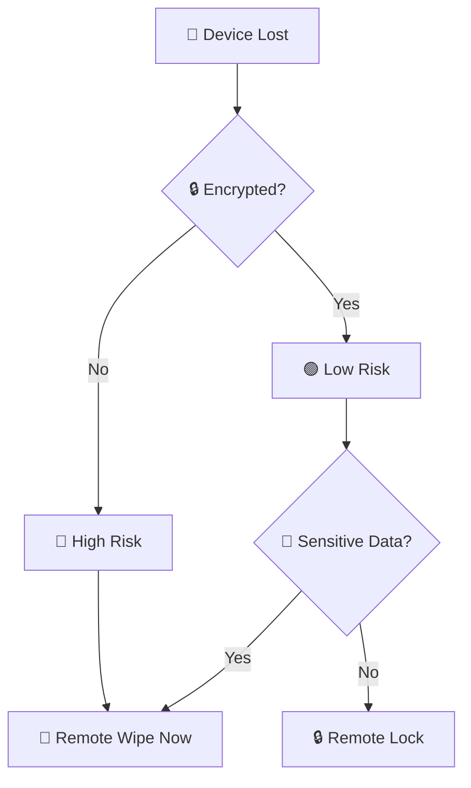
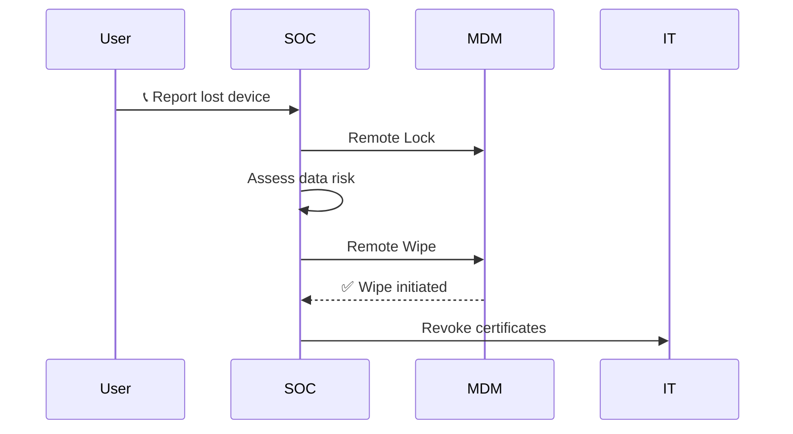
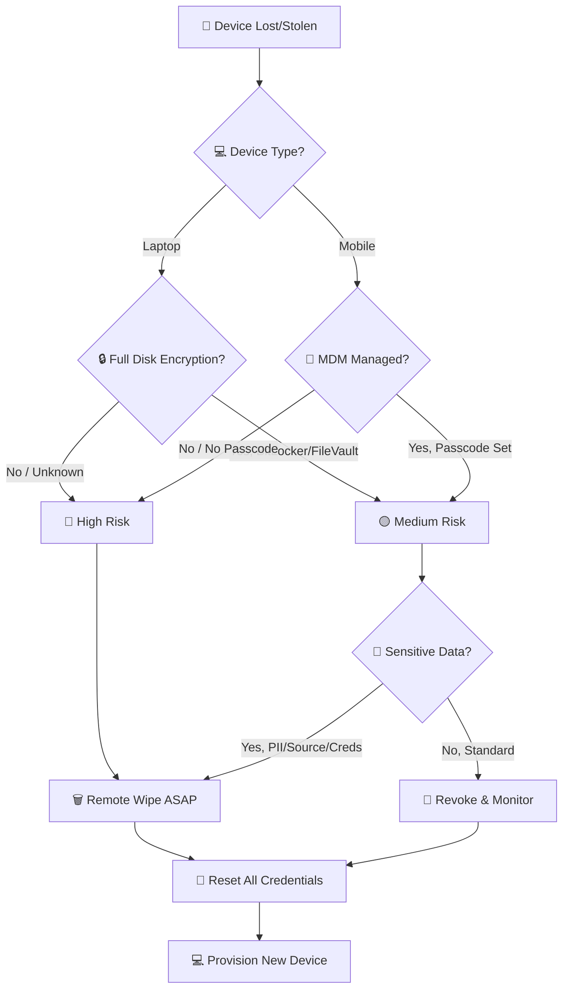
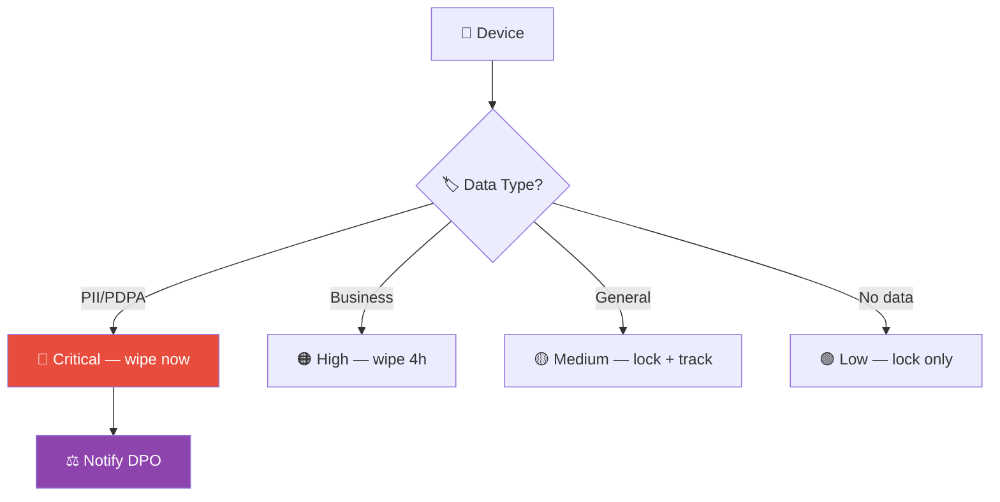

# Playbook: Lost/Stolen Device

**ID**: PB-19
**Severity**: Medium/High | **Category**: Physical Security / Data Protection
**MITRE ATT&CK**: [T1025](https://attack.mitre.org/techniques/T1025/) (Data from Removable Media), [T1552](https://attack.mitre.org/techniques/T1552/) (Unsecured Credentials)
**Trigger**: Employee report (device lost/stolen), MDM non-check-in alert, Asset mismatch

### Risk Assessment

### Remote Wipe Flow

---

## Decision Flow

---

## 1. Analysis

### 1.1 Initial Assessment

| Question | Answer | Done |
|:---|:---|:---:|
| What type of device? (laptop, phone, tablet) | | ☐ |
| Make/model/serial number | | ☐ |
| When was it last seen/used? | | ☐ |
| Where was it lost? (office, travel, public) | | ☐ |
| Was it lost or stolen? (theft vs misplaced) | | ☐ |
| Full disk encryption enabled? (BitLocker/FileVault/LUKS) | | ☐ |
| Device passcode/PIN set? | | ☐ |
| MDM enrolled? | | ☐ |
| Last MDM check-in time? | | ☐ |

### 1.2 Data Risk Assessment

| Data Category | Present on Device? | Classification |
|:---|:---|:---|
| Source code / IP | ☐ Yes ☐ No | L3/L4 |
| Customer PII | ☐ Yes ☐ No | L4 |
| Financial data | ☐ Yes ☐ No | L4 |
| Credentials / SSH keys | ☐ Yes ☐ No | L4 |
| Email / chat history | ☐ Yes ☐ No | L2/L3 |
| VPN certificates / config | ☐ Yes ☐ No | L3 |
| Browser saved passwords | ☐ Yes ☐ No | L4 |
| Cloud sync (OneDrive/Dropbox) | ☐ Yes ☐ No | L2-L4 |

---

## 2. Containment

### 2.1 Immediate Actions (within 30 minutes)

| # | Action | Tool | Done |
|:---:|:---|:---|:---:|
| 1 | **Remote wipe** command | Intune / Jamf / Google Workspace | ☐ |
| 2 | **Lock device** (if wipe fails or pending) | MDM | ☐ |
| 3 | **Reset domain password** | AD / IdP | ☐ |
| 4 | **Revoke VPN / Wi-Fi certificates** | Certificate authority | ☐ |
| 5 | **Revoke OAuth tokens / active sessions** | IdP session management | ☐ |
| 6 | **Disable device in Azure AD / IdP** | Azure AD / Okta | ☐ |

### 2.2 If Device Is Unencrypted or Stolen (High Risk)

| # | Additional Action | Done |
|:---:|:---|:---:|
| 1 | Reset ALL passwords the user may have saved in browser | ☐ |
| 2 | Rotate SSH keys, API tokens, certificates on the device | ☐ |
| 3 | Revoke cloud sync app tokens (OneDrive, Dropbox, iCloud) | ☐ |
| 4 | Check for sensitive files in recent activity | ☐ |
| 5 | Notify Legal if PII was on the device | ☐ |

---

## 3. Investigation

| Check | How | Done |
|:---|:---|:---:|
| Any login attempts from device after loss? | SIEM — filter by device serial/hostname | ☐ |
| Any VPN connections from device? | VPN logs | ☐ |
| MDM wipe confirmed? | MDM console — wipe status | ☐ |
| Location tracking available? | MDM / Find My Device | ☐ |
| Police report filed? (if stolen) | Physical security / User | ☐ |

---

## 4. Recovery

| # | Action | Owner | Done |
|:---:|:---|:---|:---:|
| 1 | Provision new device with current SOE image | IT Operations | ☐ |
| 2 | Restore user data from cloud backup | IT / User | ☐ |
| 3 | Re-enroll new device in MDM | IT Operations | ☐ |
| 4 | Issue new certificates (VPN, Wi-Fi) | IT Security | ☐ |
| 5 | Verify all credential resets are complete | SOC | ☐ |
| 6 | Remove old device from asset inventory | Asset Management | ☐ |
| 7 | Monitor for old device serial in logs for 30 days | SOC | ☐ |

---

## 5. Escalation Criteria

| Condition | Escalate To |
|:---|:---|
| Unencrypted device with PII | Legal + DPO (PDPA 72h) |
| Executive / VIP device stolen | CISO + Physical Security |
| Device shows login activity after reported lost | Tier 2 — treat as active compromise |
| Source code or credentials on device | CISO + Engineering lead |
| Multiple devices lost (pattern) | Physical Security + HR |

---

### MDM Lifecycle

### Device Data Classification

## Related Documents

- [IR Framework](../Framework.en.md)
- [Incident Report](../../templates/incident_report.en.md)
- [PB-05 Account Compromise](Account_Compromise.en.md)
- [Data Governance Policy](../../07_Compliance_Privacy/Data_Governance_Policy.en.md)
- [PDPA Compliance](../../07_Compliance_Privacy/PDPA_Compliance.en.md)

## References

- [NIST SP 800-46 — Telework and Remote Access Security](https://csrc.nist.gov/publications/detail/sp/800-46/rev-2/final)
- [MITRE ATT&CK T1025 — Data from Removable Media](https://attack.mitre.org/techniques/T1025/)
