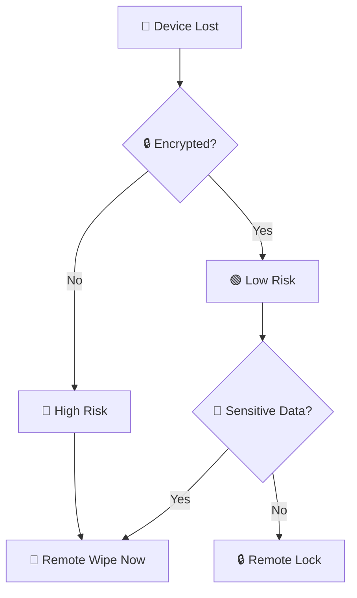
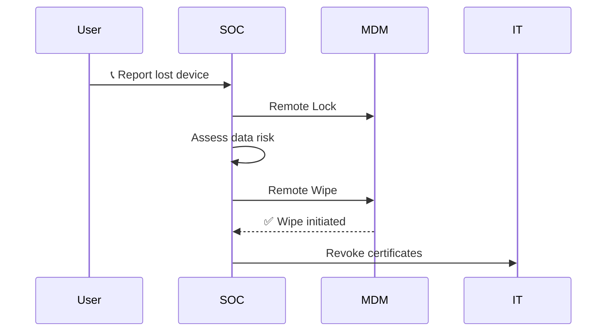
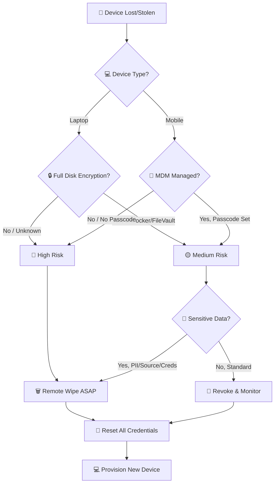
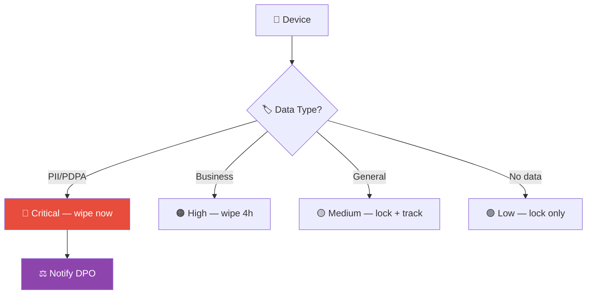

# Playbook: Lost/Stolen Device

**ID**: PB-19
**Severity**: Medium/High | **Category**: Physical Security / Data Protection
**MITRE ATT&CK**: [T1025](https://attack.mitre.org/techniques/T1025/) (Data from Removable Media), [T1552](https://attack.mitre.org/techniques/T1552/) (Unsecured Credentials)
**Trigger**: Employee report (device lost/stolen), MDM non-check-in alert, Asset mismatch

### Risk Assessment

```mermaid
graph TD
    Lost["📱 Device Lost"] --> Encrypt{"🔒 Encrypted?"}
    Encrypt -->|Yes| Low["🟢 Low Risk"]
    Encrypt -->|No| High["🔴 High Risk"]
    Low --> Data{"📁 Sensitive Data?"}
    High --> Wipe["📲 Remote Wipe Now"]
    Data -->|Yes| Wipe
    Data -->|No| Lock["🔒 Remote Lock"]
```

### Remote Wipe Flow

```mermaid
sequenceDiagram
    participant User
    participant SOC
    participant MDM
    participant IT
    User->>SOC: 📞 Report lost device
    SOC->>MDM: Remote Lock
    SOC->>SOC: Assess data risk
    SOC->>MDM: Remote Wipe
    MDM-->>SOC: ✅ Wipe initiated
    SOC->>IT: Revoke certificates
```

---

## Decision Flow

```mermaid
graph TD
    Report["📱 Device Lost/Stolen"] --> Type{"💻 Device Type?"}
    Type -->|Laptop| Encrypt{"🔒 Full Disk Encryption?"}
    Type -->|Mobile| MDM{"📲 MDM Managed?"}
    Encrypt -->|Yes, BitLocker/FileVault| MedRisk["🟡 Medium Risk"]
    Encrypt -->|No / Unknown| HighRisk["🔴 High Risk"]
    MDM -->|Yes, Passcode Set| MedRisk
    MDM -->|No / No Passcode| HighRisk
    MedRisk --> Data{"📄 Sensitive Data?"}
    HighRisk --> Wipe["🗑️ Remote Wipe ASAP"]
    Data -->|Yes, PII/Source/Creds| Wipe
    Data -->|No, Standard| Revoke["🔑 Revoke & Monitor"]
    Wipe --> Creds["🔄 Reset All Credentials"]
    Revoke --> Creds
    Creds --> Replace["💻 Provision New Device"]
```

---

## 1. Analysis

### 1.1 Initial Assessment

| Question | Answer | Done |
|:---|:---|:---:|
| What type of device? (laptop, phone, tablet) | | ☐ |
| Make/model/serial number | | ☐ |
| When was it last seen/used? | | ☐ |
| Where was it lost? (office, travel, public) | | ☐ |
| Was it lost or stolen? (theft vs misplaced) | | ☐ |
| Full disk encryption enabled? (BitLocker/FileVault/LUKS) | | ☐ |
| Device passcode/PIN set? | | ☐ |
| MDM enrolled? | | ☐ |
| Last MDM check-in time? | | ☐ |

### 1.2 Data Risk Assessment

| Data Category | Present on Device? | Classification |
|:---|:---|:---|
| Source code / IP | ☐ Yes ☐ No | L3/L4 |
| Customer PII | ☐ Yes ☐ No | L4 |
| Financial data | ☐ Yes ☐ No | L4 |
| Credentials / SSH keys | ☐ Yes ☐ No | L4 |
| Email / chat history | ☐ Yes ☐ No | L2/L3 |
| VPN certificates / config | ☐ Yes ☐ No | L3 |
| Browser saved passwords | ☐ Yes ☐ No | L4 |
| Cloud sync (OneDrive/Dropbox) | ☐ Yes ☐ No | L2-L4 |

---

## 2. Containment

### 2.1 Immediate Actions (within 30 minutes)

| # | Action | Tool | Done |
|:---:|:---|:---|:---:|
| 1 | **Remote wipe** command | Intune / Jamf / Google Workspace | ☐ |
| 2 | **Lock device** (if wipe fails or pending) | MDM | ☐ |
| 3 | **Reset domain password** | AD / IdP | ☐ |
| 4 | **Revoke VPN / Wi-Fi certificates** | Certificate authority | ☐ |
| 5 | **Revoke OAuth tokens / active sessions** | IdP session management | ☐ |
| 6 | **Disable device in Azure AD / IdP** | Azure AD / Okta | ☐ |

### 2.2 If Device Is Unencrypted or Stolen (High Risk)

| # | Additional Action | Done |
|:---:|:---|:---:|
| 1 | Reset ALL passwords the user may have saved in browser | ☐ |
| 2 | Rotate SSH keys, API tokens, certificates on the device | ☐ |
| 3 | Revoke cloud sync app tokens (OneDrive, Dropbox, iCloud) | ☐ |
| 4 | Check for sensitive files in recent activity | ☐ |
| 5 | Notify Legal if PII was on the device | ☐ |

---

## 3. Investigation

| Check | How | Done |
|:---|:---|:---:|
| Any login attempts from device after loss? | SIEM — filter by device serial/hostname | ☐ |
| Any VPN connections from device? | VPN logs | ☐ |
| MDM wipe confirmed? | MDM console — wipe status | ☐ |
| Location tracking available? | MDM / Find My Device | ☐ |
| Police report filed? (if stolen) | Physical security / User | ☐ |

---

## 4. Recovery

| # | Action | Owner | Done |
|:---:|:---|:---|:---:|
| 1 | Provision new device with current SOE image | IT Operations | ☐ |
| 2 | Restore user data from cloud backup | IT / User | ☐ |
| 3 | Re-enroll new device in MDM | IT Operations | ☐ |
| 4 | Issue new certificates (VPN, Wi-Fi) | IT Security | ☐ |
| 5 | Verify all credential resets are complete | SOC | ☐ |
| 6 | Remove old device from asset inventory | Asset Management | ☐ |
| 7 | Monitor for old device serial in logs for 30 days | SOC | ☐ |

---

## 5. Evidence Checklist

| Evidence Type | What to Collect | Source | Why It Matters |
|:---|:---|:---|:---|
| Asset evidence | Serial number, asset tag, device type, owner, encryption status | Asset inventory / MDM | Defines whether the event is administrative loss or data-breach risk |
| Access evidence | Last sign-in, VPN use, certificate use, cloud-app access after loss | IdP / VPN / app logs | Shows whether the missing device became active compromise |
| Location evidence | Last check-in, GPS, Wi-Fi AP, IP, remote-lock/wipe status | MDM / network logs | Supports recovery attempts and timing of exposure |
| Data exposure evidence | Cached mail, local files, stored credentials, removable media use | MDM / DLP / endpoint inventory | Determines breach and notification impact |
| Incident context evidence | User statement, theft report, police report, travel context | Ticketing / HR / physical security | Distinguishes theft, negligence, and possible targeted activity |

---

## 6. Minimum Telemetry Required

| Telemetry Source | Required For | Priority | Blind Spot If Missing |
|:---|:---|:---:|:---|
| MDM and asset telemetry | Device state, encryption, remote actions, inventory | Required | Cannot confirm whether the device is protected or wiped |
| Identity and application access logs | Sign-ins, token use, cert usage, cloud app access after loss | Required | Cannot detect misuse of the device after it was reported missing |
| VPN and network telemetry | Remote access attempts, last internal connectivity, unusual source IPs | Required | Device-enabled remote compromise may be missed |
| DLP and data classification telemetry | Sensitive data likely stored on the device | Recommended | Breach assessment becomes guesswork |
| Physical security and HR records | Theft details, location, user travel, police follow-up | Recommended | Context for targeted theft or insider angle is weak |

---

## 7. False Positive and Tuning Guide

| Scenario | Why It Looks Suspicious | How to Validate | Tuning Action | Escalate If |
|:---|:---|:---|:---|:---|
| Device temporarily offline or battery dead | Missed check-ins can look like theft or tampering | Confirm user location, travel, and later MDM heartbeat | Tune offline-duration alerts by device class and travel pattern | Device comes back online with unexpected sign-ins or location |
| Device in repair or IT staging | Asset removal from normal use can resemble loss | Check repair ticket, custodian, and storage location | Suppress only for approved repair/staging workflows | Device is powered on or used outside authorized handling flow |
| BYOD selective wipe or unenroll | Ownership changes can create noisy MDM events | Validate BYOD offboarding request and user confirmation | Separate BYOD workflows from corporate-owned device alerts | Corporate tokens stay active or sensitive data remains reachable |
| Travel-related customs or airport hold | Long offline periods and odd geolocation may look malicious | Confirm itinerary and no access attempts during hold | Lower severity when travel is documented and device remains encrypted | VPN, certificate, or cloud-app use appears after report time |

---

## 8. Escalation Criteria

| Condition | Escalate To |
|:---|:---|
| Unencrypted device with PII | Legal + DPO (PDPA 72h) |
| Executive / VIP device stolen | CISO + Physical Security |
| Device shows login activity after reported lost | Tier 2 — treat as active compromise |
| Source code or credentials on device | CISO + Engineering lead |
| Multiple devices lost (pattern) | Physical Security + HR |

---

## 9. IoC Collection

| Type | Value | Source |
|:---|:---|:---|
| Device serial / asset tag | | Asset management |
| Last known IP | | MDM / DHCP logs |
| Last known Wi-Fi AP | | MDM / network logs |
| Last GPS coordinates | | MDM (if enabled) |
| User account | | HR / AD |
| Last sign-in time | | Azure AD / Okta |
| Corporate apps installed | | MDM inventory |
| VPN connection history | | VPN gateway logs |

## 10. Post-Incident

- [ ] Update asset management system (mark device as lost/stolen)
- [ ] Review and update device encryption enforcement policy
- [ ] Verify MDM enrollment compliance (are all devices enrolled?)
- [ ] Issue replacement device with pre-configured security baseline
- [ ] Conduct awareness training on physical device security
- [ ] Review insurance coverage for lost/stolen equipment
- [ ] Document findings in [Incident Report](../../11_Reporting_Templates/incident_report.en.md)

---

### MDM Lifecycle

```mermaid
graph LR
    Enroll["📲 Enroll"] --> Policy["📋 Policy Push"]
    Policy --> Monitor["👁️ Monitor"]
    Monitor --> Alert["🚨 Lost/Stolen"]
    Alert --> Lock["🔒 Remote Lock"]
    Lock --> Wipe["🗑️ Selective Wipe"]
    Wipe --> Retire["♻️ Retire"]
    style Alert fill:#e74c3c,color:#fff
    style Wipe fill:#c0392b,color:#fff
```

### Device Data Classification

```mermaid
graph TD
    Device["📱 Device"] --> Type{"🏷️ Data Type?"}
    Type -->|PII/PDPA| Critical["🔴 Critical — wipe now"]
    Type -->|Business| High["🟠 High — wipe 4h"]
    Type -->|General| Medium["🟡 Medium — lock + track"]
    Type -->|No data| Low["🟢 Low — lock only"]
    Critical --> Legal["⚖️ Notify DPO"]
    style Critical fill:#e74c3c,color:#fff
    style Legal fill:#8e44ad,color:#fff
```

## Detection Rules (Sigma)

| Rule | File |
|:---|:---|
| Device Offline for Extended Period | [mdm_device_offline.yml](../../08_Detection_Engineering/sigma_rules/mdm_device_offline.yml) |

## Related Documents

- [IR Framework](../Framework.en.md)
- [Incident Report](../../11_Reporting_Templates/incident_report.en.md)
- [PB-05 Account Compromise](Account_Compromise.en.md)
- [Data Governance Policy](../../07_Compliance_Privacy/Data_Governance_Policy.en.md)
- [PDPA Compliance](../../07_Compliance_Privacy/PDPA_Compliance.en.md)

## References

- [NIST SP 800-46 — Telework and Remote Access Security](https://csrc.nist.gov/publications/detail/sp/800-46/rev-2/final)
- [MITRE ATT&CK T1025 — Data from Removable Media](https://attack.mitre.org/techniques/T1025/)
