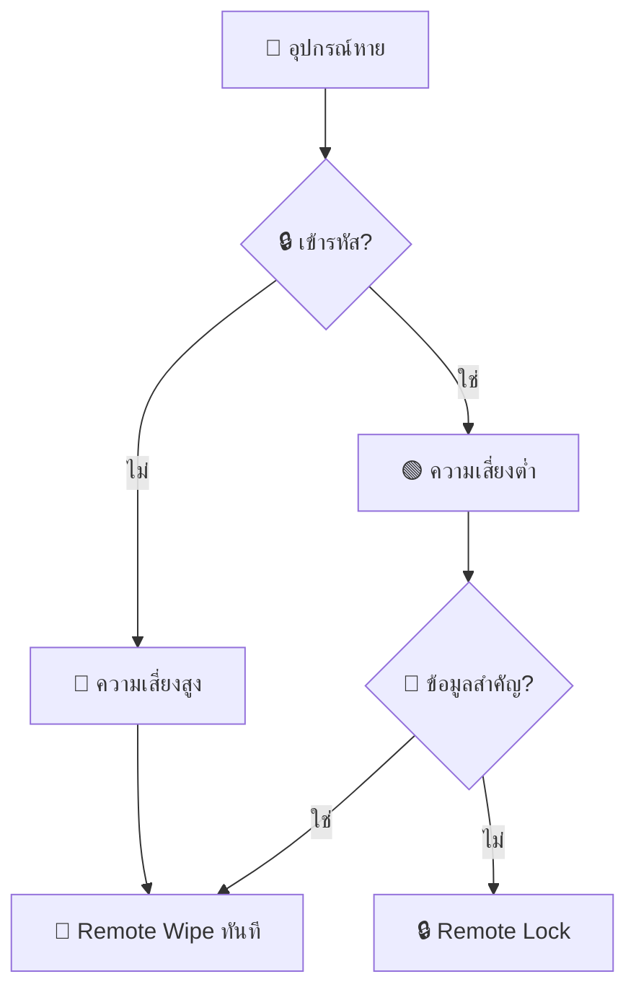
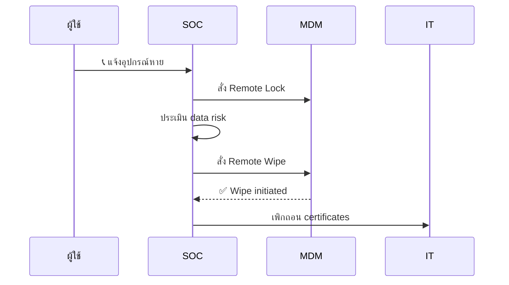
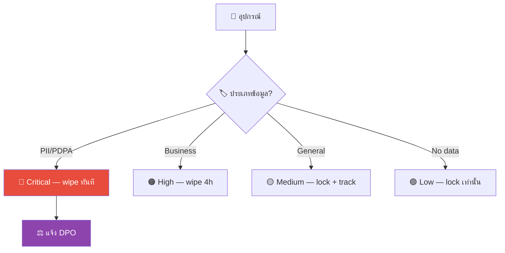

# Playbook: อุปกรณ์สูญหายหรือถูกขโมย

**ID**: PB-19
**ระดับความรุนแรง**: ปานกลาง/สูง | **หมวดหมู่**: ความปลอดภัยทางกายภาพ
**MITRE ATT&CK**: [T1078](https://attack.mitre.org/techniques/T1078/) (บัญชีที่ถูกต้อง), [T1530](https://attack.mitre.org/techniques/T1530/) (ข้อมูลจากที่เก็บคลาวด์)
**ทริกเกอร์**: ผู้ใช้รายงานอุปกรณ์หาย/ถูกขโมย, MDM offline alert, ทรัพย์สินไม่ตรง

## หลังเหตุการณ์ (Post-Incident)

- [ ] อัพเดท asset management (สถานะ lost/stolen)
- [ ] ทบทวน device encryption enforcement policy
- [ ] ตรวจ MDM enrollment compliance
- [ ] ออกอุปกรณ์ทดแทนพร้อม security baseline
- [ ] จัด awareness training เรื่อง physical security
- [ ] จัดทำ [Incident Report](../../11_Reporting_Templates/incident_report.th.md)

### ผังการประเมินความเสี่ยง

```mermaid
graph TD
    Lost["📱 อุปกรณ์หาย"] --> Encrypt{"🔒 เข้ารหัส?"}
    Encrypt -->|ใช่| Low["🟢 ความเสี่ยงต่ำ"]
    Encrypt -->|ไม่| High["🔴 ความเสี่ยงสูง"]
    Low --> Data{"📁 ข้อมูลสำคัญ?"}
    High --> Wipe["📲 Remote Wipe ทันที"]
    Data -->|ใช่| Wipe
    Data -->|ไม่| Lock["🔒 Remote Lock"]
```

### ผังขั้นตอน Remote Wipe

```mermaid
sequenceDiagram
    participant User as ผู้ใช้
    participant SOC
    participant MDM
    participant IT
    User->>SOC: 📞 แจ้งอุปกรณ์หาย
    SOC->>MDM: สั่ง Remote Lock
    SOC->>SOC: ประเมิน data risk
    SOC->>MDM: สั่ง Remote Wipe
    MDM-->>SOC: ✅ Wipe initiated
    SOC->>IT: เพิกถอน certificates
```

---

## ผังการตัดสินใจ

```mermaid
graph TD
    Report["📞 แจ้งอุปกรณ์สูญหาย"] --> Type{"📱 ประเภทอุปกรณ์?"}
    Type -->|โน้ตบุ๊ก| Laptop["💻 โน้ตบุ๊ก"]
    Type -->|มือถือ/แท็บเล็ต| Mobile["📱 มือถือ"]
    Type -->|USB/HDD| USB["💾 สื่อจัดเก็บ"]
    Laptop --> Encrypted{"🔒 เข้ารหัสเต็มดิสก์?"}
    Mobile --> MDM{"📲 มี MDM?"}
    USB --> Classify["📁 จำแนกข้อมูลในอุปกรณ์"]
    Encrypted -->|ใช่ (BitLocker/FileVault)| LowRisk["🟡 ความเสี่ยงต่ำ — ล็อก + ติดตาม"]
    Encrypted -->|ไม่| HighRisk["🔴 ความเสี่ยงสูง — Wipe ทันที"]
    MDM -->|ใช่| Wipe["📱 Selective/Full Wipe"]
    MDM -->|ไม่| HighRisk
    Classify -->|ข้อมูลสำคัญ| HighRisk
    HighRisk --> FullResponse["🔒 ตอบสนองเต็มรูปแบบ"]
```

---

## 1. การวิเคราะห์

### 1.1 การประเมินข้อมูลที่เสี่ยง

| ประเภทข้อมูล | มีอยู่ในอุปกรณ์? | เข้ารหัส? | ความเสี่ยง |
|:---|:---|:---|:---|
| อีเมลองค์กร | ☐ ใช่ ☐ ไม่ | ☐ ใช่ ☐ ไม่ | |
| เอกสาร / ไฟล์งาน | ☐ ใช่ ☐ ไม่ | ☐ ใช่ ☐ ไม่ | |
| ซอร์สโค้ด | ☐ ใช่ ☐ ไม่ | ☐ ใช่ ☐ ไม่ | |
| PII ลูกค้า | ☐ ใช่ ☐ ไม่ | ☐ ใช่ ☐ ไม่ | |
| Credentials / Keys / Tokens | ☐ ใช่ ☐ ไม่ | ☐ ใช่ ☐ ไม่ | |
| VPN / Network access | ☐ ใช่ ☐ ไม่ | ☐ ใช่ ☐ ไม่ | |
| ข้อมูลการเงิน | ☐ ใช่ ☐ ไม่ | ☐ ใช่ ☐ ไม่ | |

### 1.2 รายการตรวจสอบ

| รายการ | วิธีตรวจสอบ | เสร็จ |
|:---|:---|:---:|
| สูญหายเมื่อไหร่/ที่ไหน? | สัมภาษณ์ผู้ใช้ | ☐ |
| แจ้งตำรวจแล้วหรือไม่? | ผู้ใช้ | ☐ |
| มีรหัสผ่าน/PIN ล็อกอุปกรณ์? | MDM / ผู้ใช้ | ☐ |
| เปิด Full Disk Encryption? (BitLocker/FileVault) | MDM | ☐ |
| อุปกรณ์ลงทะเบียนใน MDM? | Intune / Jamf | ☐ |
| เปิด Find My Device? | Apple / Google | ☐ |
| ล็อกอินอัตโนมัติ (cached credentials) | ผู้ใช้ | ☐ |

---

## 2. การควบคุม

### 2.1 การดำเนินการทันที

| # | การดำเนินการ | เครื่องมือ | เสร็จ |
|:---:|:---|:---|:---:|
| 1 | **ล็อกอุปกรณ์** ระยะไกล | MDM / Find My | ☐ |
| 2 | **รีเซ็ตรหัสผ่าน** บัญชีผู้ใช้ (AD, M365, ทั้งหมด) | AD / IdP | ☐ |
| 3 | **เพิกถอน sessions** และ tokens ทั้งหมด | IdP | ☐ |
| 4 | **บล็อก** อุปกรณ์ใน Conditional Access | IdP / MDM | ☐ |
| 5 | **ตัดการเชื่อมต่อ VPN** | VPN management | ☐ |
| 6 | **หมุนเวียน API keys / SSH keys** ที่เก็บในอุปกรณ์ | ผู้ใช้ + IT | ☐ |

### 2.2 การ Wipe

| ข้อมูล | อุปกรณ์ BYOD | อุปกรณ์องค์กร |
|:---|:---|:---|
| **Selective Wipe** (ข้อมูลองค์กรเท่านั้น) | ✅ แนะนำ | ☐ ทางเลือก |
| **Full Wipe** | ☐ ต้องการความยินยอม | ✅ แนะนำ |

---

## 3. การกำจัด

| # | การดำเนินการ | เสร็จ |
|:---:|:---|:---:|
| 1 | หมุนเวียน credentials ทั้งหมดที่อาจ cached ในอุปกรณ์ | ☐ |
| 2 | เพิกถอน certificates ที่ออกให้อุปกรณ์ | ☐ |
| 3 | ยกเลิกเครื่องออกจาก Intune/Jamf | ☐ |
| 4 | ย้ายอุปกรณ์ไป "Lost" group ใน AD | ☐ |

---

## 4. การฟื้นฟู

| # | การดำเนินการ | เสร็จ |
|:---:|:---|:---:|
| 1 | ออกอุปกรณ์ใหม่ให้ผู้ใช้ | ☐ |
| 2 | ตั้งค่า MDM + disk encryption ในอุปกรณ์ใหม่ | ☐ |
| 3 | ลงทะเบียน MFA ใหม่ | ☐ |
| 4 | ตรวจว่ามีกิจกรรมผิดปกติในบัญชีระหว่างสูญหาย | ☐ |
| 5 | อัปเดตทะเบียนทรัพย์สิน | ☐ |

---

## 5. Evidence Checklist

| ประเภทหลักฐาน | สิ่งที่ต้องเก็บ | แหล่งข้อมูล | เหตุผลที่ต้องเก็บ |
|:---|:---|:---|:---|
| หลักฐานทรัพย์สิน | serial number, asset tag, device type, owner, encryption status | Asset inventory / MDM | ใช้แยกว่าเป็นงาน admin ปกติหรือมีความเสี่ยงข้อมูลรั่ว |
| หลักฐานการเข้าถึง | last sign-in, VPN use, certificate use, cloud-app access หลังสูญหาย | IdP / VPN / app logs | ใช้ดูว่าอุปกรณ์ที่หายถูกนำไปใช้ต่อหรือไม่ |
| หลักฐานตำแหน่ง | last check-in, GPS, Wi-Fi AP, IP, สถานะ remote lock/wipe | MDM / network logs | ใช้ช่วยกู้คืนและประเมินเวลาเริ่มเสี่ยง |
| หลักฐานการเปิดเผยข้อมูล | cached mail, local file, saved credential, removable media use | MDM / DLP / endpoint inventory | ใช้ประเมิน breach และการแจ้งเตือน |
| หลักฐานบริบทของเหตุการณ์ | คำให้การผู้ใช้, theft report, police report, travel context | Ticketing / HR / physical security | ใช้แยก theft, negligence, หรือ targeted activity |

---

## 6. Minimum Telemetry Required

| แหล่ง Telemetry | ใช้เพื่ออะไร | ความสำคัญ | Blind Spot ถ้าไม่มี |
|:---|:---|:---:|:---|
| MDM และ asset telemetry | ดู device state, encryption, remote action, inventory | Required | ยืนยันไม่ได้ว่าเครื่องถูกป้องกันหรือ wipe แล้วหรือยัง |
| Identity และ application access logs | ดู sign-in, token use, cert use, cloud app access หลังสูญหาย | Required | มองไม่เห็นการใช้งานอุปกรณ์หลังรายงานหาย |
| VPN และ network telemetry | ดู remote access attempt, last connectivity, source IP แปลก | Required | พลาด device-enabled remote compromise |
| DLP และ data classification telemetry | ดูความอ่อนไหวของข้อมูลที่อาจอยู่บนเครื่อง | Recommended | breach assessment กลายเป็นการคาดเดา |
| Physical security และ HR records | ดูรายละเอียดการหาย, ตำแหน่ง, การเดินทาง, police follow-up | Recommended | บริบทเรื่อง targeted theft หรือ insider angle ไม่ชัด |

---

## 7. False Positive และ Tuning Guide

| Scenario | ทำไมจึงดูน่าสงสัย | วิธีตรวจสอบ | Tuning Action | ต้องยกระดับเมื่อ |
|:---|:---|:---|:---|:---|
| อุปกรณ์ offline ชั่วคราวหรือแบตหมด | missed check-in ดูเหมือน theft หรือ tampering | ยืนยันตำแหน่งผู้ใช้ การเดินทาง และ heartbeat ภายหลัง | tune ระยะเวลา offline ตามชนิดอุปกรณ์และ pattern การเดินทาง | เครื่องกลับมา online พร้อม sign-in หรือ location ที่ไม่คาดคิด |
| อุปกรณ์อยู่ระหว่างซ่อมหรือ IT staging | อุปกรณ์หายจากการใช้งานปกติดูเหมือนสูญหาย | ตรวจ repair ticket, custodian, และที่เก็บ | suppress เฉพาะ workflow ซ่อม/เตรียมเครื่องที่อนุมัติ | อุปกรณ์ถูกเปิดใช้หรือนำออกนอก flow ที่กำหนด |
| BYOD selective wipe หรือ unenroll | MDM event บางอย่างดูเหมือน loss event | ยืนยันคำขอ BYOD offboarding และการยืนยันจากผู้ใช้ | แยก workflow ของ BYOD ออกจาก corporate-owned | corporate token ยัง active หรือข้อมูลสำคัญยังเข้าถึงได้ |
| การเดินทางหรือด่านสนามบินทำให้ offline นาน | offline นานและ geolocation แปลกดูน่าสงสัย | ยืนยัน itinerary และไม่พบ access ระหว่างนั้น | ลด severity เมื่อมีเอกสารเดินทางและเครื่องยัง encrypted | มี VPN, certificate, หรือ cloud-app use หลังเวลารายงานหาย |

---

## 8. เกณฑ์การยกระดับ

| เงื่อนไข | ยกระดับไปยัง |
|:---|:---|
| PII ลูกค้าในอุปกรณ์ที่ไม่เข้ารหัส | Legal + DPO (PDPA 72 ชม.) |
| อุปกรณ์ผู้บริหารหรือ admin | CISO ทันที |
| มีหลักฐานว่าอุปกรณ์ถูกเข้าถึงหลังสูญหาย | Major Incident |
| อุปกรณ์หลายเครื่องสูญหาย (รูปแบบ) | Security + HR |
| อุปกรณ์ถูกขโมยอย่างเจาะจง | Law Enforcement |

---

### ผัง MDM Lifecycle

```mermaid
graph LR
    Enroll["📲 Enroll"] --> Policy["📋 Policy Push"]
    Policy --> Monitor["👁️ Monitor"]
    Monitor --> Alert["🚨 Lost/Stolen"]
    Alert --> Lock["🔒 Remote Lock"]
    Lock --> Wipe["🗑️ Selective Wipe"]
    Wipe --> Retire["♻️ Retire"]
    style Alert fill:#e74c3c,color:#fff
    style Wipe fill:#c0392b,color:#fff
```

### ผัง Device Data Classification

```mermaid
graph TD
    Device["📱 อุปกรณ์"] --> Type{"🏷️ ประเภทข้อมูล?"}
    Type -->|PII/PDPA| Critical["🔴 Critical — wipe ทันที"]
    Type -->|Business| High["🟠 High — wipe 4h"]
    Type -->|General| Medium["🟡 Medium — lock + track"]
    Type -->|No data| Low["🟢 Low — lock เท่านั้น"]
    Critical --> Legal["⚖️ แจ้ง DPO"]
    style Critical fill:#e74c3c,color:#fff
    style Legal fill:#8e44ad,color:#fff
```

## กฎตรวจจับ (Sigma)

| กฎ | ไฟล์ |
|:---|:---|
| Device Offline for Extended Period | [mdm_device_offline.yml](../../08_Detection_Engineering/sigma_rules/mdm_device_offline.yml) |

## เอกสารที่เกี่ยวข้อง

- [กรอบการตอบสนองต่อเหตุการณ์](../Framework.th.md)
- [แม่แบบรายงานเหตุการณ์](../../11_Reporting_Templates/incident_report.th.md)
- [PB-28 อุปกรณ์มือถือถูกบุกรุก](Mobile_Compromise.th.md)

## 9. Device Type Response Matrix

| Device Type | Remote Wipe | Data Risk | Priority |
|:---|:---|:---|:---|
| Laptop (encrypted) | ✅ MDM | Low | Medium |
| Laptop (unencrypted) | ✅ MDM | Critical | Urgent |
| Mobile (managed) | ✅ MDM | Low | Medium |
| Mobile (BYOD) | Limited | Medium | High |
| USB/External drive | ❌ N/A | High | High |

### Lost Device Checklist

| Step | Action | Timeline | Owner |
|:---|:---|:---|:---|
| 1 | Report to SOC | Immediately | User |
| 2 | Revoke access tokens | 15 min | SOC |
| 3 | Change passwords | 30 min | User + IT |
| 4 | Remote wipe (if possible) | 1 hr | MDM Admin |
| 5 | File police report | 24 hrs | User |
| 6 | Assess data exposure | 48 hrs | Security |

### Device Data Risk Assessment

| Data Type | Encrypted? | Risk |
|:---|:---|:---|
| Email cache | Check policy | Medium-High |
| VPN credentials | Usually | Medium |
| Saved passwords | Browser-dependent | High |

## References

- [NIST SP 800-124r2 — Mobile Device Management](https://csrc.nist.gov/publications/detail/sp/800-124/rev-2/final)
