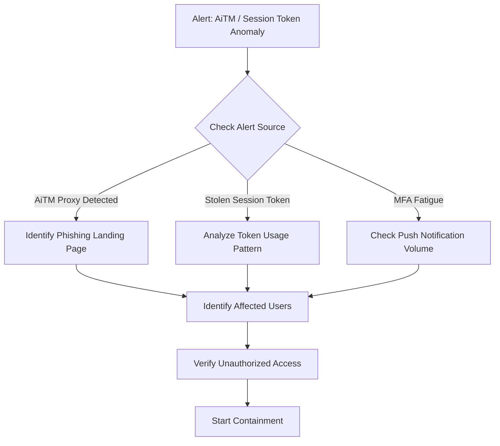

# Playbook: MFA Bypass / Token Theft (PB-26)

**Severity**: High | **Category**: Identity & Access | **MITRE**: T1556.006, T1539

## 1. Analysis (Triage)

-   **Identify Attack Type**: AiTM (Adversary-in-the-Middle) proxy, MFA fatigue bombing, SIM swap, or session cookie theft.
-   **Check Identity Logs**: Review Azure AD / Okta sign-in logs for suspicious token replay — different IP but same session ID, impossible geo.
-   **Unusual OAuth Grants**: Check for newly added OAuth app permissions or consent grants.
-   **Email Rules**: Look for inbox forwarding rules or delegates added post-compromise.

## 2. Containment
-   **Revoke All Sessions**: Force sign-out from all devices via IdP (Azure AD: `Revoke-AzureADUserAllRefreshToken`).
-   **Block Compromised Token**: If session cookie identified, add to blocklist.
-   **Disable Account Temporarily**: If active abuse confirmed.
-   **Block AiTM Infrastructure**: Add phishing proxy domain/IP to firewall and proxy blocklist.
-   **Quarantine Email**: Remove phishing email from all mailboxes.

## 3. Remediation
-   **Reset Credentials**: Force password change with verified alternate channel.
-   **Re-enroll MFA**: Remove existing MFA factors, re-register from verified device with FIDO2/phishing-resistant method.
-   **Remove Malicious OAuth Apps**: Revoke any suspicious app consent (Enterprise Applications → Permissions).
-   **Remove Email Rules**: Delete forwarding rules, delegates, and mail flow rules created by attacker.
-   **Review Audit Trail**: Check for data access, file downloads, or privilege changes during compromised period.

## 4. Recovery
-   **Upgrade to Phishing-Resistant MFA**: Migrate to FIDO2 security keys or passkeys.
-   **Conditional Access**: Enforce compliant device + managed app requirements.
-   **Token Lifetime**: Reduce token lifetime and enable Continuous Access Evaluation (CAE).
-   **Monitor**: Enhanced monitoring for 30 days on affected accounts.

## 5. Lessons Learned
-   **MFA Method Assessment**: Evaluate vulnerability of current MFA methods to AiTM attacks.
-   **User Training**: Train users to recognize AiTM proxy phishing pages (look for URL discrepancies).
-   **Detection Gap**: Add Sigma rules for session token anomalies and AiTM proxy indicators.

## References
-   [MITRE ATT&CK T1556.006 — MFA Modification](https://attack.mitre.org/techniques/T1556/006/)
-   [MITRE ATT&CK T1539 — Steal Web Session Cookie](https://attack.mitre.org/techniques/T1539/)
-   [Microsoft — Token theft playbook](https://learn.microsoft.com/en-us/security/operations/token-theft-playbook)
