# Playbook: MFA Bypass / Token Theft

**ID**: PB-26
**Severity**: High/Critical | **Category**: Identity & Access
**MITRE ATT&CK**: [T1556.006](https://attack.mitre.org/techniques/T1556/006/) (MFA Modification), [T1539](https://attack.mitre.org/techniques/T1539/) (Steal Web Session Cookie), [T1111](https://attack.mitre.org/techniques/T1111/) (Multi-Factor Authentication Interception)
**Trigger**: AiTM proxy detection, session token anomaly, MFA fatigue (push spam), IdP risk alert

> ⚠️ **CRITICAL**: MFA bypass means the attacker defeated your strongest control — act immediately.

### AiTM (Adversary-in-the-Middle) Attack

```mermaid
sequenceDiagram
    participant Victim
    participant Proxy as Phishing Proxy
    participant IdP as Azure AD
    Victim->>Proxy: 1. Click phishing link
    Proxy->>IdP: 2. Forward credentials
    IdP-->>Proxy: 3. MFA challenge
    Proxy-->>Victim: 4. Show MFA prompt
    Victim->>Proxy: 5. Complete MFA
    Proxy->>IdP: 6. Send MFA response
    IdP-->>Proxy: 7. Session cookie
    Note over Proxy: 🎯 Stolen session cookie!
    Proxy->>Proxy: 8. Access account with cookie
```

### MFA Security Levels

```mermaid
graph LR
    SMS["📱 SMS OTP"] --> TOTP["📲 TOTP App"]
    TOTP --> Push["🔔 Push Notification"]
    Push --> NumberMatch["🔢 Number Matching"]
    NumberMatch --> FIDO["🔑 FIDO2/Passkey"]
    style SMS fill:#e74c3c,color:#fff
    style TOTP fill:#f39c12,color:#fff
    style Push fill:#f1c40f,color:#000
    style NumberMatch fill:#2ecc71,color:#fff
    style FIDO fill:#27ae60,color:#fff
```

---

## Decision Flow

```mermaid
graph TD
    Alert["🚨 MFA Bypass / Token Anomaly"] --> Method{"⚙️ Attack Method?"}
    Method -->|AiTM Proxy| AiTM["🎣 Adversary-in-the-Middle"]
    Method -->|MFA Fatigue| Fatigue["📲 Push Spam / Bombing"]
    Method -->|Token Theft| Token["🍪 Session Cookie Stolen"]
    Method -->|SIM Swap| SIM["📞 SMS MFA Hijacked"]
    Method -->|Device Compromise| Device["💻 Malware Stealing Tokens"]
    AiTM --> Phish["🔍 Find Phishing Page"]
    Fatigue --> Contact["📞 Contact User"]
    Token --> Replay["🔍 Identify Token Replay"]
    SIM --> Carrier["📞 Contact Carrier"]
    Device --> EDR["🔍 Check Endpoint"]
    Phish --> Revoke["🔒 Revoke All Sessions"]
    Contact -->|User Accepted Push| Revoke
    Contact -->|User Didn't Accept| FP["✅ MFA Held — Monitor"]
    Replay --> Revoke
    Carrier --> Revoke
    EDR --> Revoke
```

---

## 1. Analysis

### 1.1 MFA Bypass Methods

| Method | How It Works | Detection |
|:---|:---|:---|
| **AiTM Proxy** (EvilProxy, Evilginx) | Phishing page proxies real login, captures session token | URL mismatch, certificate analysis, TI feeds |
| **MFA Fatigue / Push Bombing** | Spam MFA push notifications until user accepts | Multiple denied pushes then accept, SIEM correlation |
| **Session Token Theft** | Malware/script steals browser cookies | Different IP using same session ID, impossible geo |
| **SIM Swap** | Attacker takes over phone number for SMS OTP | User loses signal, carrier reports, auth logs |
| **Device Compromise** | Malware ex filtrates TOTP seeds or session cookies | EDR alerts, browser extension analysis |
| **Social Engineering** | Helpdesk tricked into resetting MFA | Reset without ticket, call recording review |

### 1.2 Investigation Checklist

| Check | How | Done |
|:---|:---|:---:|
| Identify the bypass method used | Sign-in logs, phishing analysis, user interview | ☐ |
| Review sign-in logs for anomalies | Azure AD / Okta — IP, location, device, risk | ☐ |
| Check for session token replay | Same session ID from different IPs | ☐ |
| MFA push notification history | IdP MFA logs — denied then accepted? | ☐ |
| Newly registered MFA methods | IdP audit — new phone, new authenticator? | ☐ |
| OAuth app consents since compromise | Enterprise Applications audit | ☐ |
| Inbox forwarding rules created | Exchange audit, `Get-InboxRule` | ☐ |
| Data accessed during compromised session | Cloud audit logs, file activity | ☐ |

### 1.3 Post-Compromise Activity (What Did Attacker Do?)

| Activity | Check | Done |
|:---|:---|:---:|
| Email access / forwarding | Inbox rules, message trace | ☐ |
| File downloads | SharePoint / OneDrive audit | ☐ |
| MFA method changes | IdP authentication methods audit | ☐ |
| Password changes | Directory audit | ☐ |
| Privilege changes | Role assignments, group changes | ☐ |
| OAuth app consents | Enterprise app permissions | ☐ |
| Internal phishing sent | Outbox / sent items | ☐ |

---

## 2. Containment

### 2.1 Immediate Actions (within 5 minutes)

| # | Action | Tool | Done |
|:---:|:---|:---|:---:|
| 1 | **Revoke ALL sessions** and refresh tokens | IdP (`Revoke-AzureADUserAllRefreshToken`) | ☐ |
| 2 | **Block compromised session** cookie/token | IdP / WAF | ☐ |
| 3 | **Disable account** temporarily | IdP | ☐ |
| 4 | **Block AiTM infrastructure** (phishing domain/IP) | Firewall / DNS / Proxy | ☐ |
| 5 | **Remove phishing email** from all mailboxes | Exchange / M365 | ☐ |

### 2.2 Extended Containment

| # | Action | Done |
|:---:|:---|:---:|
| 1 | Search for same phishing email across all users | ☐ |
| 2 | Check if other users visited the AiTM proxy | ☐ |
| 3 | Revoke malicious OAuth app consents | ☐ |
| 4 | Remove attacker-created inbox rules / delegates | ☐ |
| 5 | Remove attacker-registered MFA methods | ☐ |

---

## 3. Eradication

| # | Action | Done |
|:---:|:---|:---:|
| 1 | **Reset password** via verified alternate channel | ☐ |
| 2 | **Clear ALL MFA factors** and re-register from verified device | ☐ |
| 3 | Use **phishing-resistant MFA** for re-enrollment (FIDO2/passkey) | ☐ |
| 4 | Revoke ALL OAuth app consents and re-authorize only needed apps | ☐ |
| 5 | Delete forwarding rules, delegates, and mail flow rules | ☐ |
| 6 | Scan user's device for infostealers / token-stealing malware | ☐ |

---

## 4. Recovery

| # | Action | Done |
|:---:|:---|:---:|
| 1 | Re-enable account with phishing-resistant MFA (FIDO2 / passkeys) | ☐ |
| 2 | Enforce Conditional Access: compliant device + managed app required | ☐ |
| 3 | Reduce token lifetime and enable CAE (Continuous Access Evaluation) | ☐ |
| 4 | Enable token protection (token binding) if supported | ☐ |
| 5 | Block legacy authentication protocols | ☐ |
| 6 | Deploy number matching for push MFA (prevent fatigue attacks) | ☐ |
| 7 | Monitor account for 30 days | ☐ |

---

## 5. IoC Collection

| Type | Value | Source |
|:---|:---|:---|
| AiTM phishing URL / domain | | Email / TI |
| AiTM proxy IP | | DNS / Proxy logs |
| Compromised session token ID | | Sign-in logs |
| Attacker IP(s) | | Sign-in logs |
| Malicious OAuth app ID | | Enterprise Apps |
| Inbox rules created | | Exchange audit |
| MFA methods registered by attacker | | IdP audit |

---

## 6. Escalation Criteria

| Condition | Escalate To |
|:---|:---|
| Executive / admin account bypassed | CISO immediately |
| Multiple users compromised via AiTM | Major Incident |
| Data exfiltration during compromised session | Legal + DPO (PDPA 72h) |
| Attacker registered persistent MFA method | Tier 2 + Identity team |
| BEC follow-up from compromised account | [PB-17 BEC](BEC.en.md) |
| Helpdesk social engineering confirmed | CISO + HR |

---

### MFA Rollout Strategy

```mermaid
graph TD
    Plan["📋 MFA Rollout"] --> Admin["👑 Phase 1: Admin"]
    Admin --> VIP["🏢 Phase 2: VIP/Finance"]
    VIP --> All["👥 Phase 3: All users"]
    All --> FIDO["🔑 Phase 4: FIDO2"]
    Admin --> Enforce["🔒 Enforce"]
    VIP --> Enforce
    All --> Enforce
    style Admin fill:#e74c3c,color:#fff
    style FIDO fill:#27ae60,color:#fff
```

### Phishing-Resistant MFA Comparison

```mermaid
graph LR
    MFA{"📱 MFA Type"} --> SMS["📲 SMS — ❌ SIM swap"]
    MFA --> TOTP["🔢 TOTP — ⚠️ Phishable"]
    MFA --> Push["🔔 Push — ⚠️ Fatigue"]
    MFA --> Number["🔢 Number Match — ✅ Better"]
    MFA --> FIDO["🔑 FIDO2 — ✅ Best"]
    style SMS fill:#e74c3c,color:#fff
    style TOTP fill:#f39c12,color:#fff
    style Push fill:#f39c12,color:#fff
    style Number fill:#2ecc71,color:#fff
    style FIDO fill:#27ae60,color:#fff
```

## Related Documents

- [IR Framework](../Framework.en.md)
- [Incident Report](../../templates/incident_report.en.md)
- [PB-01 Phishing](Phishing.en.md)
- [PB-05 Account Compromise](Account_Compromise.en.md)
- [PB-06 Impossible Travel](Impossible_Travel.en.md)
- [PB-17 BEC](BEC.en.md)

## References

- [MITRE ATT&CK T1556.006 — MFA Modification](https://attack.mitre.org/techniques/T1556/006/)
- [MITRE ATT&CK T1539 — Steal Web Session Cookie](https://attack.mitre.org/techniques/T1539/)
- [Microsoft — Token Theft Playbook](https://learn.microsoft.com/en-us/security/operations/token-theft-playbook)
