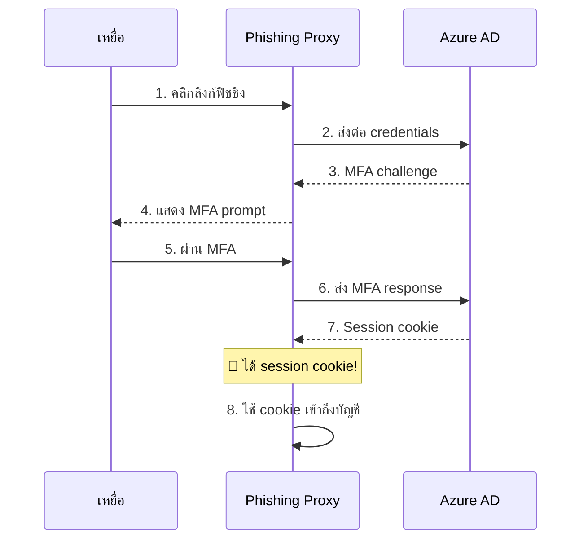
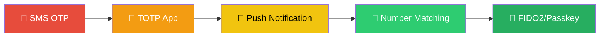
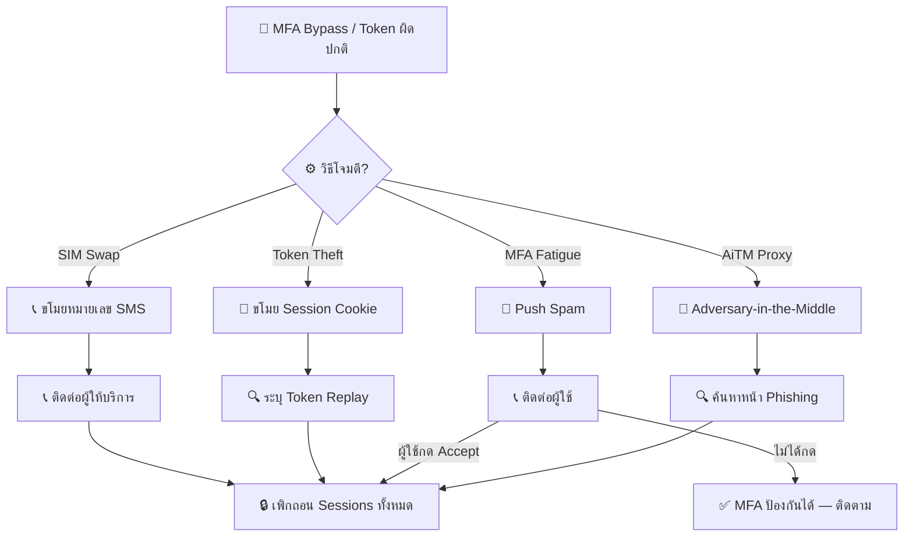
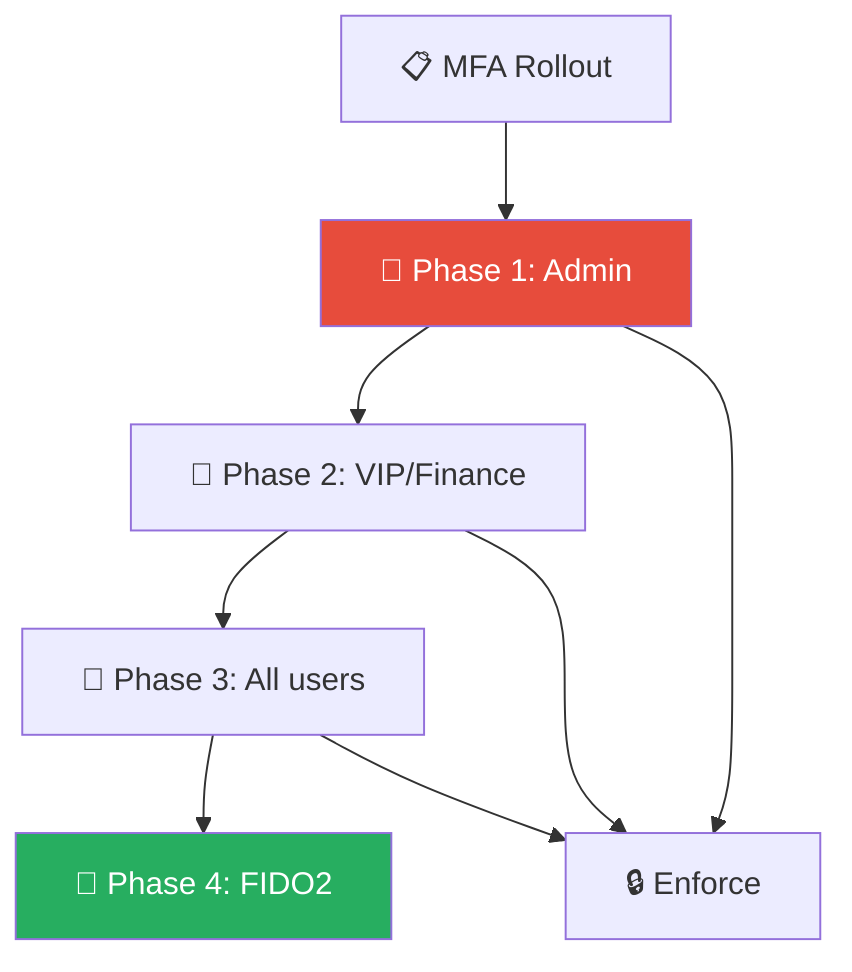
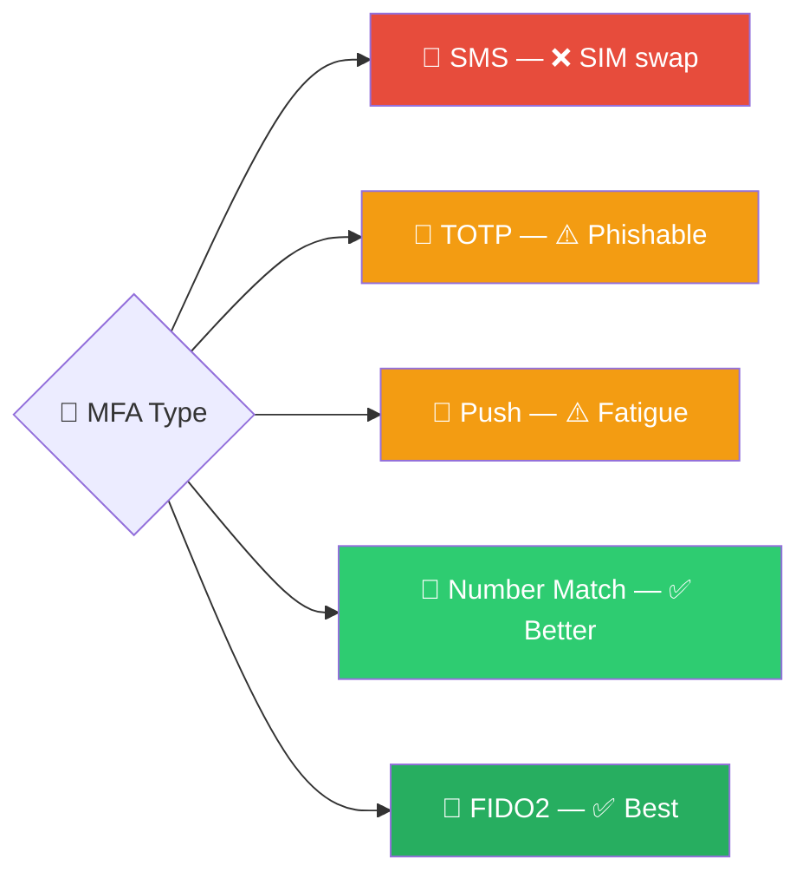

# Playbook: การหลีกเลี่ยง MFA / การขโมย Token

**ID**: PB-26
**ระดับความรุนแรง**: สูง/วิกฤต | **หมวดหมู่**: Identity & Access
**MITRE ATT&CK**: [T1556.006](https://attack.mitre.org/techniques/T1556/006/) (MFA Modification), [T1539](https://attack.mitre.org/techniques/T1539/) (Steal Web Session Cookie)
**ทริกเกอร์**: Identity Protection alert, Conditional Access anomaly, ผู้ใช้รายงาน MFA prompt ไม่ได้ขอ

### ผัง AiTM (Adversary-in-the-Middle) Attack

### ผังระดับความปลอดภัย MFA

> ⚠️ **วิกฤต**: MFA bypass หมายความว่าผู้โจมตีเอาชนะการควบคุมที่แข็งแกร่งที่สุดแล้ว — ดำเนินการทันที

---

## ผังการตัดสินใจ

---

## 1. การวิเคราะห์

### 1.1 วิธีการหลีกเลี่ยง MFA

| วิธี | วิธีทำงาน | การตรวจจับ |
|:---|:---|:---|
| **AiTM Proxy** (EvilProxy, Evilginx) | หน้า phishing proxy ล็อกอินจริง จับ session token | URL ไม่ตรง, TI feeds |
| **MFA Fatigue** | สแปมการแจ้งเตือน push จนผู้ใช้กด accept | หลาย deny แล้ว accept, SIEM |
| **Session Token Theft** | มัลแวร์ขโมย browser cookies | IP ต่าง session เดียวกัน |
| **SIM Swap** | ผู้โจมตียึดหมายเลขโทรศัพท์ | สูญเสียสัญญาณ, ผู้ให้บริการ |
| **Social Engineering** | หลอก helpdesk รีเซ็ต MFA | รีเซ็ตไม่มี ticket |

### 1.2 รายการตรวจสอบ

| รายการ | วิธีตรวจสอบ | เสร็จ |
|:---|:---|:---:|
| ระบุวิธี bypass ที่ใช้ | Sign-in logs, phishing analysis | ☐ |
| ตรวจ sign-in logs สำหรับความผิดปกติ | Azure AD / Okta | ☐ |
| ตรวจ session token replay | Session ID เดียวกันจาก IP ต่าง | ☐ |
| ประวัติ MFA push | IdP MFA logs — deny แล้ว accept? | ☐ |
| MFA methods ที่ลงทะเบียนใหม่ | IdP audit | ☐ |
| OAuth app consents ตั้งแต่ถูกบุกรุก | Enterprise Applications | ☐ |
| กฎ inbox forwarding ที่สร้างขึ้น | Exchange audit | ☐ |
| ข้อมูลที่เข้าถึงระหว่าง session ที่ถูกบุกรุก | Cloud audit logs | ☐ |

### 1.3 กิจกรรมหลังถูกบุกรุก

| กิจกรรม | ตรวจสอบ | เสร็จ |
|:---|:---|:---:|
| เข้าถึง/ส่งต่ออีเมล | Inbox rules, message trace | ☐ |
| ดาวน์โหลดไฟล์ | SharePoint / OneDrive audit | ☐ |
| เปลี่ยน MFA method | Authentication methods | ☐ |
| เปลี่ยนรหัสผ่าน | Directory audit | ☐ |
| เปลี่ยนสิทธิ์ | Role assignments | ☐ |
| ส่ง phishing ภายใน | Outbox / sent items | ☐ |

---

## 2. การควบคุม

### 2.1 การดำเนินการทันที (ภายใน 5 นาที)

| # | การดำเนินการ | เครื่องมือ | เสร็จ |
|:---:|:---|:---|:---:|
| 1 | **เพิกถอน sessions ทั้งหมด** และ refresh tokens | IdP | ☐ |
| 2 | **บล็อก session cookie/token** ที่ถูกบุกรุก | IdP / WAF | ☐ |
| 3 | **ปิดบัญชี** ชั่วคราว | IdP | ☐ |
| 4 | **บล็อก AiTM infrastructure** (โดเมน/IP phishing) | Firewall / DNS | ☐ |
| 5 | **ลบอีเมล phishing** จากทุก mailbox | Exchange / M365 | ☐ |

### 2.2 การควบคุมเพิ่มเติม

| # | การดำเนินการ | เสร็จ |
|:---:|:---|:---:|
| 1 | ค้นหาอีเมล phishing เดียวกันทุกผู้ใช้ | ☐ |
| 2 | ตรวจว่าผู้ใช้อื่นเข้า AiTM proxy หรือไม่ | ☐ |
| 3 | เพิกถอน OAuth app consents ที่อันตราย | ☐ |
| 4 | ลบ inbox rules / delegates ที่ผู้โจมตีสร้าง | ☐ |
| 5 | ลบ MFA methods ที่ผู้โจมตีลงทะเบียน | ☐ |

---

## 3. การกำจัด

| # | การดำเนินการ | เสร็จ |
|:---:|:---|:---:|
| 1 | **รีเซ็ตรหัสผ่าน** ผ่านช่องทางที่ยืนยันแล้ว | ☐ |
| 2 | **ล้าง MFA ทั้งหมด** และลงทะเบียนใหม่ด้วย **FIDO2/passkey** | ☐ |
| 3 | เพิกถอน OAuth app consents ทั้งหมดและอนุมัติใหม่เฉพาะที่จำเป็น | ☐ |
| 4 | ลบ forwarding rules, delegates, mail flow rules | ☐ |
| 5 | สแกนอุปกรณ์ผู้ใช้หา infostealer / มัลแวร์ | ☐ |

---

## 4. การฟื้นฟู

| # | การดำเนินการ | เสร็จ |
|:---:|:---|:---:|
| 1 | เปิดบัญชีด้วย MFA ที่ต้านทาน phishing (FIDO2 / passkeys) | ☐ |
| 2 | บังคับ Conditional Access: อุปกรณ์ที่ compliant เท่านั้น | ☐ |
| 3 | ลด token lifetime และเปิด CAE (Continuous Access Evaluation) | ☐ |
| 4 | บล็อก legacy authentication protocols | ☐ |
| 5 | Deploy number matching สำหรับ push MFA | ☐ |
| 6 | ติดตามบัญชี 30 วัน | ☐ |

---

## 5. เกณฑ์การยกระดับ

| เงื่อนไข | ยกระดับไปยัง |
|:---|:---|
| บัญชีผู้บริหาร / admin ถูก bypass | CISO ทันที |
| หลายบัญชีถูกบุกรุกผ่าน AiTM | Major Incident |
| ข้อมูลถูกนำออกระหว่าง session | Legal + DPO (PDPA 72 ชม.) |
| BEC ตาม follow-up จากบัญชีที่ถูกบุกรุก | [PB-17 BEC](BEC.th.md) |
| Social engineering helpdesk ยืนยัน | CISO + HR |

---

### ผัง MFA Rollout Strategy

### ผัง Phishing-Resistant MFA Comparison

## เอกสารที่เกี่ยวข้อง

- [กรอบการตอบสนองต่อเหตุการณ์](../Framework.th.md)
- [แม่แบบรายงานเหตุการณ์](../../templates/incident_report.th.md)
- [PB-01 ฟิชชิง](Phishing.th.md)
- [PB-05 บัญชีถูกบุกรุก](Account_Compromise.th.md)
- [PB-17 BEC](BEC.th.md)

## อ้างอิง

- [MITRE ATT&CK T1556.006 — MFA Modification](https://attack.mitre.org/techniques/T1556/006/)
- [Microsoft — Token Theft Playbook](https://learn.microsoft.com/en-us/security/operations/token-theft-playbook)
