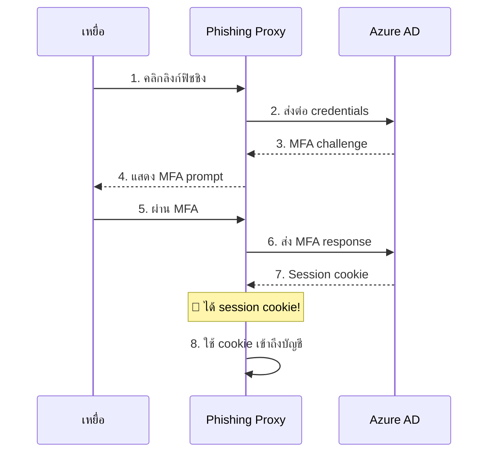
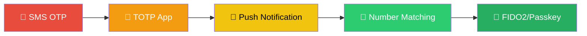
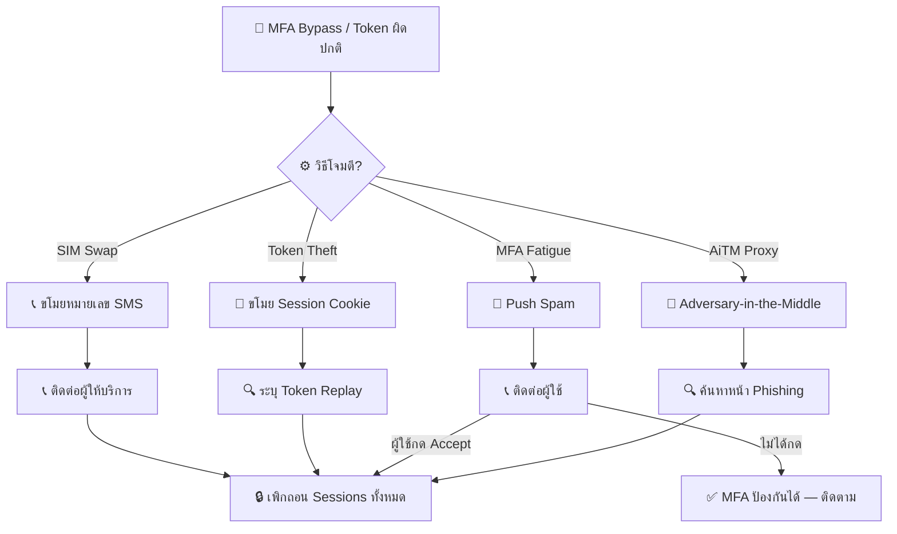
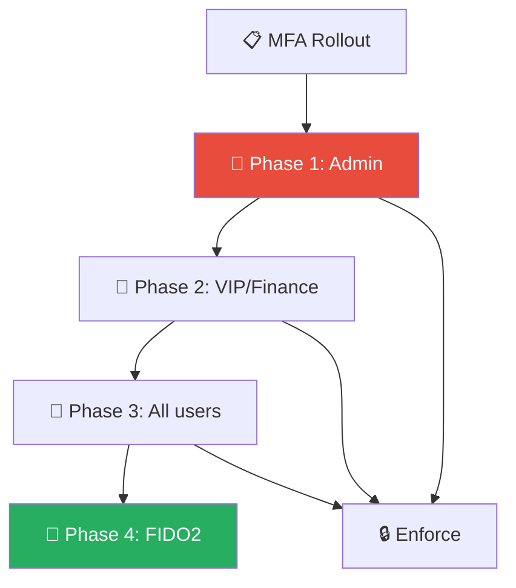
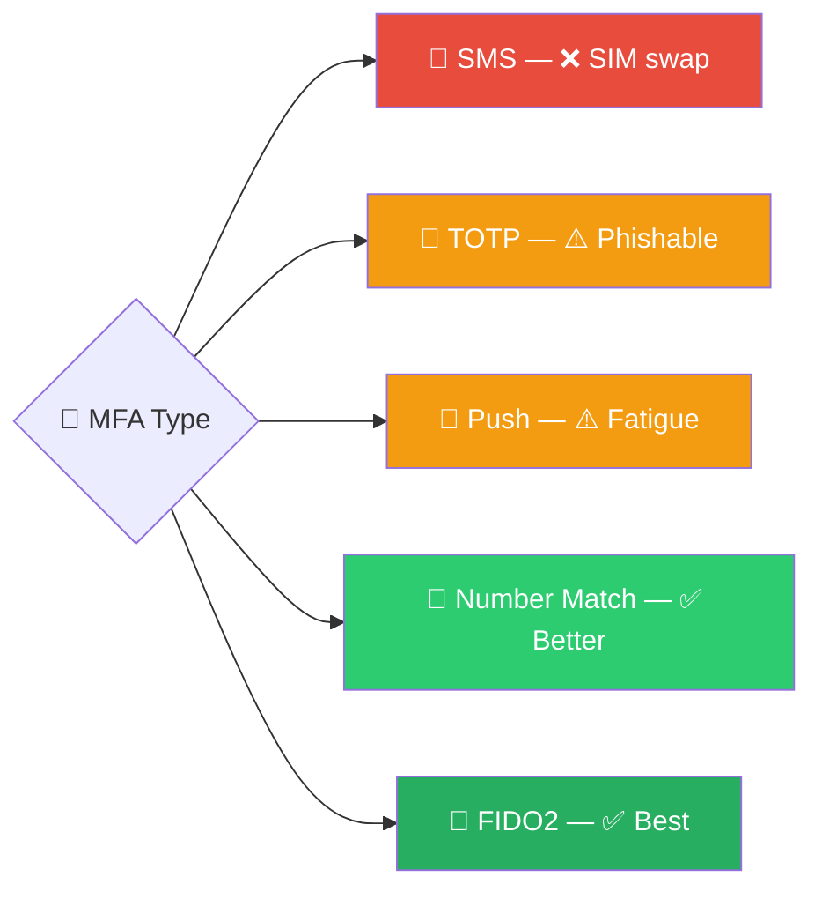

# Playbook: การหลีกเลี่ยง MFA / การขโมย Token

**ID**: PB-26
**ระดับความรุนแรง**: สูง/วิกฤต | **หมวดหมู่**: Identity & Access
**MITRE ATT&CK**: [T1556.006](https://attack.mitre.org/techniques/T1556/006/) (MFA Modification), [T1539](https://attack.mitre.org/techniques/T1539/) (Steal Web Session Cookie)
**ทริกเกอร์**: Identity Protection alert, Conditional Access anomaly, ผู้ใช้รายงาน MFA prompt ไม่ได้ขอ

## หลังเหตุการณ์ (Post-Incident)

- [ ] อัพเกรดเป็น Phishing-resistant MFA (FIDO2/passkeys)
- [ ] ปิด SMS/Voice MFA ถ้าเป็นไปได้
- [ ] ใช้ number matching สำหรับ push notifications
- [ ] ทบทวน MFA registration policies
- [ ] ใช้ token protection (token binding)
- [ ] จัดทำ [Incident Report](../../11_Reporting_Templates/incident_report.th.md)

### ผัง AiTM (Adversary-in-the-Middle) Attack

```mermaid
sequenceDiagram
    participant Victim as เหยื่อ
    participant Proxy as Phishing Proxy
    participant IdP as Azure AD
    Victim->>Proxy: 1. คลิกลิงก์ฟิชชิง
    Proxy->>IdP: 2. ส่งต่อ credentials
    IdP-->>Proxy: 3. MFA challenge
    Proxy-->>Victim: 4. แสดง MFA prompt
    Victim->>Proxy: 5. ผ่าน MFA
    Proxy->>IdP: 6. ส่ง MFA response
    IdP-->>Proxy: 7. Session cookie
    Note over Proxy: 🎯 ได้ session cookie!
    Proxy->>Proxy: 8. ใช้ cookie เข้าถึงบัญชี
```

### ผังระดับความปลอดภัย MFA

```mermaid
graph LR
    SMS["📱 SMS OTP"] --> TOTP["📲 TOTP App"]
    TOTP --> Push["🔔 Push Notification"]
    Push --> NumberMatch["🔢 Number Matching"]
    NumberMatch --> FIDO["🔑 FIDO2/Passkey"]
    style SMS fill:#e74c3c,color:#fff
    style TOTP fill:#f39c12,color:#fff
    style Push fill:#f1c40f,color:#000
    style NumberMatch fill:#2ecc71,color:#fff
    style FIDO fill:#27ae60,color:#fff
```
> ⚠️ **วิกฤต**: MFA bypass หมายความว่าผู้โจมตีเอาชนะการควบคุมที่แข็งแกร่งที่สุดแล้ว — ดำเนินการทันที

---

## ผังการตัดสินใจ

```mermaid
graph TD
    Alert["🚨 MFA Bypass / Token ผิดปกติ"] --> Method{"⚙️ วิธีโจมตี?"}
    Method -->|AiTM Proxy| AiTM["🎣 Adversary-in-the-Middle"]
    Method -->|MFA Fatigue| Fatigue["📲 Push Spam"]
    Method -->|Token Theft| Token["🍪 ขโมย Session Cookie"]
    Method -->|SIM Swap| SIM["📞 ขโมยหมายเลข SMS"]
    AiTM --> Phish["🔍 ค้นหาหน้า Phishing"]
    Fatigue --> Contact["📞 ติดต่อผู้ใช้"]
    Token --> Replay["🔍 ระบุ Token Replay"]
    SIM --> Carrier["📞 ติดต่อผู้ให้บริการ"]
    Phish --> Revoke["🔒 เพิกถอน Sessions ทั้งหมด"]
    Contact -->|ผู้ใช้กด Accept| Revoke
    Contact -->|ไม่ได้กด| FP["✅ MFA ป้องกันได้ — ติดตาม"]
    Replay --> Revoke
    Carrier --> Revoke
```

---

## 1. การวิเคราะห์

### 1.1 วิธีการหลีกเลี่ยง MFA

| วิธี | วิธีทำงาน | การตรวจจับ |
|:---|:---|:---|
| **AiTM Proxy** (EvilProxy, Evilginx) | หน้า phishing proxy ล็อกอินจริง จับ session token | URL ไม่ตรง, TI feeds |
| **MFA Fatigue** | สแปมการแจ้งเตือน push จนผู้ใช้กด accept | หลาย deny แล้ว accept, SIEM |
| **Session Token Theft** | มัลแวร์ขโมย browser cookies | IP ต่าง session เดียวกัน |
| **SIM Swap** | ผู้โจมตียึดหมายเลขโทรศัพท์ | สูญเสียสัญญาณ, ผู้ให้บริการ |
| **Social Engineering** | หลอก helpdesk รีเซ็ต MFA | รีเซ็ตไม่มี ticket |

### 1.2 รายการตรวจสอบ

| รายการ | วิธีตรวจสอบ | เสร็จ |
|:---|:---|:---:|
| ระบุวิธี bypass ที่ใช้ | Sign-in logs, phishing analysis | ☐ |
| ตรวจ sign-in logs สำหรับความผิดปกติ | Azure AD / Okta | ☐ |
| ตรวจ session token replay | Session ID เดียวกันจาก IP ต่าง | ☐ |
| ประวัติ MFA push | IdP MFA logs — deny แล้ว accept? | ☐ |
| MFA methods ที่ลงทะเบียนใหม่ | IdP audit | ☐ |
| OAuth app consents ตั้งแต่ถูกบุกรุก | Enterprise Applications | ☐ |
| กฎ inbox forwarding ที่สร้างขึ้น | Exchange audit | ☐ |
| ข้อมูลที่เข้าถึงระหว่าง session ที่ถูกบุกรุก | Cloud audit logs | ☐ |

### 1.3 กิจกรรมหลังถูกบุกรุก

| กิจกรรม | ตรวจสอบ | เสร็จ |
|:---|:---|:---:|
| เข้าถึง/ส่งต่ออีเมล | Inbox rules, message trace | ☐ |
| ดาวน์โหลดไฟล์ | SharePoint / OneDrive audit | ☐ |
| เปลี่ยน MFA method | Authentication methods | ☐ |
| เปลี่ยนรหัสผ่าน | Directory audit | ☐ |
| เปลี่ยนสิทธิ์ | Role assignments | ☐ |
| ส่ง phishing ภายใน | Outbox / sent items | ☐ |

---

## 2. การควบคุม

### 2.1 การดำเนินการทันที (ภายใน 5 นาที)

| # | การดำเนินการ | เครื่องมือ | เสร็จ |
|:---:|:---|:---|:---:|
| 1 | **เพิกถอน sessions ทั้งหมด** และ refresh tokens | IdP | ☐ |
| 2 | **บล็อก session cookie/token** ที่ถูกบุกรุก | IdP / WAF | ☐ |
| 3 | **ปิดบัญชี** ชั่วคราว | IdP | ☐ |
| 4 | **บล็อก AiTM infrastructure** (โดเมน/IP phishing) | Firewall / DNS | ☐ |
| 5 | **ลบอีเมล phishing** จากทุก mailbox | Exchange / M365 | ☐ |

### 2.2 การควบคุมเพิ่มเติม

| # | การดำเนินการ | เสร็จ |
|:---:|:---|:---:|
| 1 | ค้นหาอีเมล phishing เดียวกันทุกผู้ใช้ | ☐ |
| 2 | ตรวจว่าผู้ใช้อื่นเข้า AiTM proxy หรือไม่ | ☐ |
| 3 | เพิกถอน OAuth app consents ที่อันตราย | ☐ |
| 4 | ลบ inbox rules / delegates ที่ผู้โจมตีสร้าง | ☐ |
| 5 | ลบ MFA methods ที่ผู้โจมตีลงทะเบียน | ☐ |

---

## 3. การกำจัด

| # | การดำเนินการ | เสร็จ |
|:---:|:---|:---:|
| 1 | **รีเซ็ตรหัสผ่าน** ผ่านช่องทางที่ยืนยันแล้ว | ☐ |
| 2 | **ล้าง MFA ทั้งหมด** และลงทะเบียนใหม่ด้วย **FIDO2/passkey** | ☐ |
| 3 | เพิกถอน OAuth app consents ทั้งหมดและอนุมัติใหม่เฉพาะที่จำเป็น | ☐ |
| 4 | ลบ forwarding rules, delegates, mail flow rules | ☐ |
| 5 | สแกนอุปกรณ์ผู้ใช้หา infostealer / มัลแวร์ | ☐ |

---

## 4. การฟื้นฟู

| # | การดำเนินการ | เสร็จ |
|:---:|:---|:---:|
| 1 | เปิดบัญชีด้วย MFA ที่ต้านทาน phishing (FIDO2 / passkeys) | ☐ |
| 2 | บังคับ Conditional Access: อุปกรณ์ที่ compliant เท่านั้น | ☐ |
| 3 | ลด token lifetime และเปิด CAE (Continuous Access Evaluation) | ☐ |
| 4 | บล็อก legacy authentication protocols | ☐ |
| 5 | Deploy number matching สำหรับ push MFA | ☐ |
| 6 | ติดตามบัญชี 30 วัน | ☐ |

---

## 5. Evidence Checklist

| ประเภทหลักฐาน | สิ่งที่ต้องเก็บ | แหล่งข้อมูล | เหตุผลที่ต้องเก็บ |
|:---|:---|:---|:---|
| หลักฐาน session | token/session ID, auth method, IP, timestamp, device/app context | IdP / sign-in logs | ใช้พิสูจน์ว่าผู้โจมตีผ่าน MFA แล้วจริงและอย่างไร |
| หลักฐาน phishing หรือ AiTM | URL, proxy domain/IP, redirect chain, phishing email, TLS detail | Email / proxy / DNS / TI | ใช้ระบุ bypass path และขอบเขตของแคมเปญ |
| หลักฐานด้านตัวตน | MFA method ที่ลงทะเบียน, recovery change, risk flag, account role | IdP / IAM | ใช้ดูว่าผู้โจมตีสร้าง persistence หรือเล็งบัญชี privileged หรือไม่ |
| หลักฐาน mailbox และ cloud activity | inbox rule, OAuth grant, file access, admin action | Exchange / cloud audit | ใช้ดูว่าผู้โจมตีทำอะไรต่อหลัง bypass |
| หลักฐาน endpoint | browser artifact, infostealer sign, session-cookie theft indicator | Endpoint / EDR / browser forensics | ใช้แยก AiTM ออกจาก local token theft |

---

## 6. Minimum Telemetry Required

| แหล่ง Telemetry | ใช้เพื่ออะไร | ความสำคัญ | Blind Spot ถ้าไม่มี |
|:---|:---|:---:|:---|
| Identity provider sign-in และ token telemetry | ดู auth method, token reuse, MFA result, session anomaly | Required | พิสูจน์ MFA bypass ไม่ได้ |
| Mailbox และ cloud audit logs | ดู post-login abuse, OAuth grant, data access, admin change | Required | มองไม่เห็นผลกระทบหลัง compromise |
| Email, proxy, และ DNS telemetry | ดู AiTM domain, phishing path, user interaction, redirect chain | Required | ไม่รู้ source และวิธี bypass |
| Endpoint telemetry | ดู browser theft, infostealer, device compromise indicator | Recommended | local token theft อาจพลาดไปเลย |
| Helpdesk และ admin workflow logs | ดู MFA reset, recovery action, social-engineering trace | Recommended | helpdesk-assisted bypass อาจถูกมองข้าม |

---

## 7. False Positive และ Tuning Guide

| Scenario | ทำไมจึงดูน่าสงสัย | วิธีตรวจสอบ | Tuning Action | ต้องยกระดับเมื่อ |
|:---|:---|:---|:---|:---|
| ผู้ใช้ลงทะเบียน MFA ใหม่หลังเปลี่ยนอุปกรณ์ | MFA method change และ session reset ดูเหมือน malicious | ตรวจ helpdesk ticket และ enrollment source ที่อนุมัติ | suppress เฉพาะ workflow ที่อนุมัติในช่วงสั้น | มี MFA method ใหม่จาก IP แปลกหรือมี risky session ตามมา |
| Admin เปลี่ยน OAuth consent ตามงานจริง | app rollout อาจเพิ่ม consent record ใหม่ | ยืนยัน change ticket, app owner, และ admin identity | allowlist เฉพาะ app ID และ change window ที่อนุมัติ | app ขอ scope สูงผิดปกติหรือไปโผล่ใน user context แปลก |
| Conditional Access หรือ auth policy rollout | token revocation และ prompt spike อาจสูงผิดปกติ | ยืนยัน rollout plan และผู้ใช้ที่ได้รับผล | ลด severity ใน rollout window ที่อนุมัติ | ผู้ใช้เดียวกันโดน AiTM domain หรือ session anomaly ร่วมด้วย |
| ผู้ใช้โดน MFA prompt ซ้ำแต่ยังไม่ถูกยึดบัญชี | app retry loop หรือ network issue อาจทำให้ prompt เยอะ | ตรวจ behavior ของ app/device และไม่พบ post-auth abuse | tune ตาม app signature และ retry pattern ที่ยืนยันแล้ว | มี MFA accept จากแหล่งแปลกหรือเกิด session takeover ตามมา |

---

## 8. เกณฑ์การยกระดับ

| เงื่อนไข | ยกระดับไปยัง |
|:---|:---|
| บัญชีผู้บริหาร / admin ถูก bypass | CISO ทันที |
| หลายบัญชีถูกบุกรุกผ่าน AiTM | Major Incident |
| ข้อมูลถูกนำออกระหว่าง session | Legal + DPO (PDPA 72 ชม.) |
| BEC ตาม follow-up จากบัญชีที่ถูกบุกรุก | [PB-17 BEC](BEC.th.md) |
| Social engineering helpdesk ยืนยัน | CISO + HR |

---

### ผัง MFA Rollout Strategy

```mermaid
graph TD
    Plan["📋 MFA Rollout"] --> Admin["👑 Phase 1: Admin"]
    Admin --> VIP["🏢 Phase 2: VIP/Finance"]
    VIP --> All["👥 Phase 3: All users"]
    All --> FIDO["🔑 Phase 4: FIDO2"]
    Admin --> Enforce["🔒 Enforce"]
    VIP --> Enforce
    All --> Enforce
    style Admin fill:#e74c3c,color:#fff
    style FIDO fill:#27ae60,color:#fff
```

### ผัง Phishing-Resistant MFA Comparison

```mermaid
graph LR
    MFA{"📱 MFA Type"} --> SMS["📲 SMS — ❌ SIM swap"]
    MFA --> TOTP["🔢 TOTP — ⚠️ Phishable"]
    MFA --> Push["🔔 Push — ⚠️ Fatigue"]
    MFA --> Number["🔢 Number Match — ✅ Better"]
    MFA --> FIDO["🔑 FIDO2 — ✅ Best"]
    style SMS fill:#e74c3c,color:#fff
    style TOTP fill:#f39c12,color:#fff
    style Push fill:#f39c12,color:#fff
    style Number fill:#2ecc71,color:#fff
    style FIDO fill:#27ae60,color:#fff
```

## กฎตรวจจับ (Sigma)

| กฎ | ไฟล์ |
|:---|:---|
| MFA Bypass / Token Theft Detection | [cloud_mfa_bypass.yml](../../08_Detection_Engineering/sigma_rules/cloud_mfa_bypass.yml) |
| Impossible Travel Detection | [cloud_impossible_travel.yml](../../08_Detection_Engineering/sigma_rules/cloud_impossible_travel.yml) |

## เอกสารที่เกี่ยวข้อง

- [กรอบการตอบสนองต่อเหตุการณ์](../Framework.th.md)
- [แม่แบบรายงานเหตุการณ์](../../11_Reporting_Templates/incident_report.th.md)
- [PB-01 ฟิชชิง](Phishing.th.md)
- [PB-05 บัญชีถูกบุกรุก](Account_Compromise.th.md)
- [PB-17 BEC](BEC.th.md)

## MFA Bypass Techniques & Detection

| Technique | Detection | Prevention |
|:---|:---|:---|
| SIM swap | Phone number change alert | Hardware tokens |
| Prompt bombing | Multiple push denials | Number matching |
| Token theft | Session anomaly | Binding to device |
| Adversary-in-the-middle | TLS cert anomaly | FIDO2/WebAuthn |

### MFA Hardening Recommendations

| Current MFA | Upgrade To | Priority |
|:---|:---|:---|
| SMS OTP | Authenticator app | High |
| Push notification | Number matching | High |
| Software token | FIDO2 hardware key | Critical |
| No MFA | Any MFA | Critical |

## References

- [MITRE ATT&CK T1556.006 — MFA Modification](https://attack.mitre.org/techniques/T1556/006/)
- [Microsoft — Token Theft Playbook](https://learn.microsoft.com/en-us/security/operations/token-theft-playbook)
