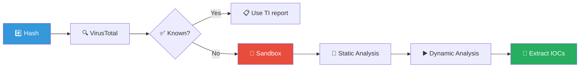
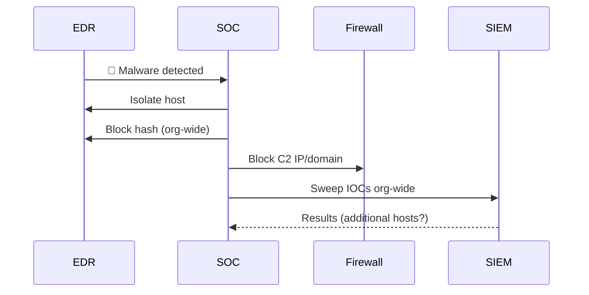
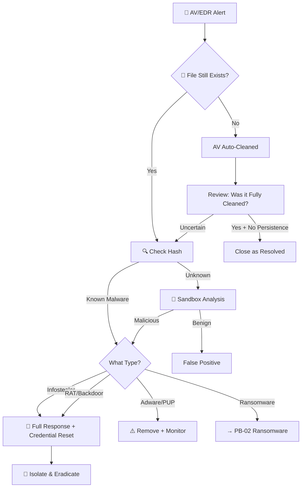
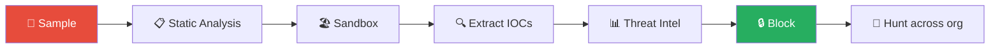
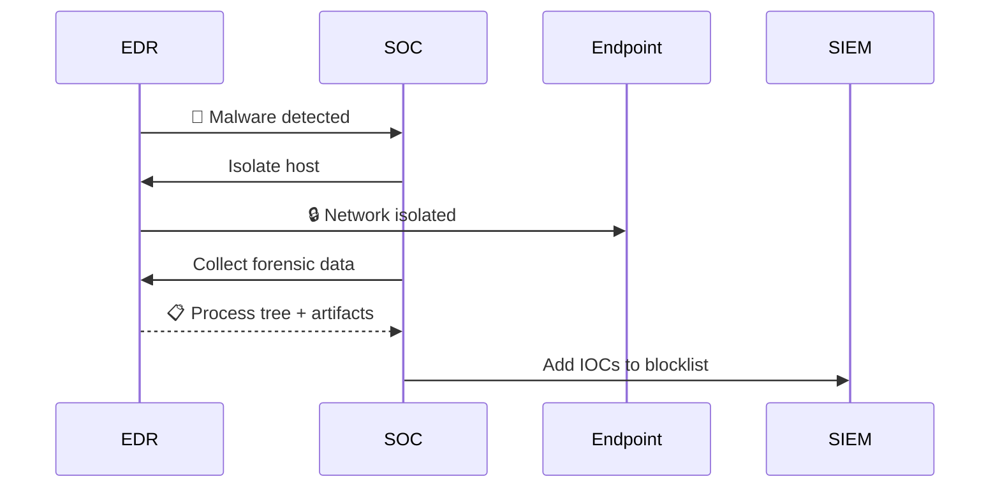

# Playbook: Malware Infection

**ID**: PB-03
**Severity**: Medium/High | **Category**: Endpoint Security
**MITRE ATT&CK**: [T1204](https://attack.mitre.org/techniques/T1204/) (User Execution), [T1059](https://attack.mitre.org/techniques/T1059/) (Command and Scripting Interpreter)
**Trigger**: EDR alert, AV detection, SIEM correlation, User report

### Malware Analysis Pipeline

```mermaid
graph LR
    Hash["#️⃣ Hash"] --> VT["🔍 VirusTotal"]
    VT --> Known{"✅ Known?"}
    Known -->|Yes| Report["📋 Use TI report"]
    Known -->|No| Sandbox["🧪 Sandbox"]
    Sandbox --> Static["📝 Static Analysis"]
    Static --> Dynamic["▶️ Dynamic Analysis"]
    Dynamic --> IOC["🎯 Extract IOCs"]
    style Hash fill:#3498db,color:#fff
    style Sandbox fill:#e74c3c,color:#fff
    style IOC fill:#27ae60,color:#fff
```

### Containment Workflow

```mermaid
sequenceDiagram
    participant EDR
    participant SOC
    participant FW as Firewall
    participant SIEM
    EDR->>SOC: 🚨 Malware detected
    SOC->>EDR: Isolate host
    SOC->>EDR: Block hash (org-wide)
    SOC->>FW: Block C2 IP/domain
    SOC->>SIEM: Sweep IOCs org-wide
    SIEM-->>SOC: Results (additional hosts?)
```

---

## Decision Flow

```mermaid
graph TD
    Alert["🚨 AV/EDR Alert"] --> Verify{"📁 File Still Exists?"}
    Verify -->|No| AutoClean["AV Auto-Cleaned"]
    Verify -->|Yes| Hash["🔍 Check Hash"]
    AutoClean --> Review["Review: Was it Fully Cleaned?"]
    Review -->|Yes + No Persistence| Close["Close as Resolved"]
    Review -->|Uncertain| Hash
    Hash -->|Known Malware| Type{"What Type?"}
    Hash -->|Unknown| Sandbox["🧪 Sandbox Analysis"]
    Sandbox -->|Malicious| Type
    Sandbox -->|Benign| FP["False Positive"]
    Type -->|Infostealer| FullResponse["🚨 Full Response + Credential Reset"]
    Type -->|RAT/Backdoor| FullResponse
    Type -->|Adware/PUP| Limited["⚠️ Remove + Monitor"]
    Type -->|Ransomware| Ransomware["→ PB-02 Ransomware"]
    FullResponse --> Isolate["🔌 Isolate & Eradicate"]
```

---

## 1. Analysis (Triage)

### 1.1 Initial Checks

| # | Check | How | Done |
|:---:|:---|:---|:---:|
| 1 | Verify file path | EDR console — is it in `%TEMP%`, `Downloads`, `System32`? | ☐ |
| 2 | Check file hash | VirusTotal, ThreatFox — known malware? | ☐ |
| 3 | Identify user | Who executed/downloaded the file? | ☐ |
| 4 | Determine delivery method | Email attachment, web download, USB? | ☐ |
| 5 | Check execution | Did the file execute or just land on disk? | ☐ |

### 1.2 Malware Classification

| Type | Risk | Additional Actions |
|:---|:---|:---|
| **Ransomware** | Critical | Escalate to [PB-02](Ransomware.en.md) immediately |
| **RAT / Backdoor** | High | Full IR — check C2, lateral movement |
| **Infostealer** | High | Reset all user credentials, check exfil |
| **Trojan Dropper** | High | Find all dropped payloads |
| **Cryptominer** | Medium | Remove, check for persistence |
| **Adware / PUP** | Low | Remove, tune AV rule |

### 1.3 Scope Assessment

- [ ] Any other hosts with the same file hash?
- [ ] Any network connections from the malware (C2)?
- [ ] Signs of lateral movement from this host?
- [ ] Any data exfiltration indicators?

---

## 2. Containment

| # | Action | Tool | Done |
|:---:|:---|:---|:---:|
| 1 | Network isolate the host | EDR | ☐ |
| 2 | Kill malicious process(es) | EDR / Task Manager | ☐ |
| 3 | Block file hash across all endpoints | EDR global blacklist | ☐ |
| 4 | Block C2 IP/domain at firewall/proxy | Firewall, Proxy | ☐ |
| 5 | Disable user account (if credential theft suspected) | AD / IdP | ☐ |

---

## 3. Eradication

| # | Action | Done |
|:---:|:---|:---:|
| 1 | Delete malicious file(s) from disk | ☐ |
| 2 | Remove persistence mechanisms: | |
|   | - Registry Run keys (`HKCU\...\Run`, `HKLM\...\Run`) | ☐ |
|   | - Scheduled Tasks | ☐ |
|   | - Startup folder shortcuts | ☐ |
|   | - Services | ☐ |
|   | - WMI event subscriptions | ☐ |
| 3 | Run full system AV/EDR scan | ☐ |
| 4 | Check for additional dropped files | ☐ |
| 5 | Verify no rootkits (if RAT/backdoor) | ☐ |

---

## 4. Recovery

| # | Action | Done |
|:---:|:---|:---:|
| 1 | Verify endpoint is clean (no alerts for 24h) | ☐ |
| 2 | Un-isolate host from network | ☐ |
| 3 | Reset user credentials (if Infostealer) | ☐ |
| 4 | Monitor endpoint for 48 hours post-recovery | ☐ |
| 5 | Confirm user awareness (how was it delivered?) | ☐ |

---

## 5. IoC Collection

| Type | Value | Source |
|:---|:---|:---|
| File Name | | EDR / AV |
| File Path | | EDR |
| File Hash (SHA256) | | EDR / Sandbox |
| C2 IP/Domain | | Network logs |
| Process Name | | EDR |
| Parent Process | | EDR |
| Delivery Method | | Email / Proxy logs |
| Dropped Files | | Sandbox |

---

## 6. Evidence Checklist

| Evidence Type | What to Collect | Source | Why It Matters |
|:---|:---|:---|:---|
| Malware sample evidence | Filename, hash, path, compile info, sandbox verdict | EDR / sandbox / forensic tools | Supports classification, blocking, and hunting |
| Execution evidence | Parent process, command line, user context, persistence artifacts | EDR / system logs | Shows how the malware started and whether it can return |
| Network evidence | C2 domains/IPs, ports, DNS lookups, transfer volume | Proxy / firewall / DNS / NetFlow | Confirms remote control or exfiltration behavior |
| Delivery evidence | Email, download URL, removable media, installer source | Mail gateway / proxy / browser logs | Identifies the initial access path and prevention gap |
| Business impact evidence | Affected hosts, user population, credentials at risk, critical services | Asset inventory / IAM / ticketing | Supports escalation and recovery prioritization |

---

## 7. Minimum Telemetry Required

| Telemetry Source | Required For | Priority | Blind Spot If Missing |
|:---|:---|:---:|:---|
| Endpoint detection telemetry | Process lineage, file activity, persistence, isolation actions | Required | Cannot confirm execution or containment on the host |
| Sandbox or malware analysis telemetry | Sample verdict, dropped files, secondary behavior | Required | Malware family and follow-on actions remain unclear |
| Network and DNS telemetry | C2, download sites, exfiltration, propagation clues | Required | Remote control and spread path remain hidden |
| Email, proxy, or web gateway logs | Delivery method and user interaction | Required | Initial access root cause cannot be established |
| Asset and identity inventory | Criticality, owner, user role, privileged status | Recommended | Recovery and communication decisions degrade |

---

## 8. False Positive and Tuning Guide

| Scenario | Why It Looks Suspicious | How to Validate | Tuning Action | Escalate If |
|:---|:---|:---|:---|:---|
| Legitimate admin tool or packaging utility | Dual-use tools can resemble malware execution | Confirm signed binary, expected path, and admin owner | Suppress by signed publisher and approved path only | Same process reaches suspicious destinations or persists abnormally |
| Security scanner or EDR remediation | Tool actions may drop files or spawn scripts | Validate tool identity, job ID, and console action history | Allowlist known tool process chains in approved maintenance windows | Unknown payloads or user-context execution appears alongside the tool |
| Software installer or updater | Temp-folder execution and child processes can look malicious | Verify publisher, hash reputation, and user intent | Tune for approved installer hashes and update services | Network destinations, persistence, or lateral movement are abnormal |
| Lab or malware analysis environment | Intentional detonation looks like real infection | Validate asset tag, isolated network, and analyst ownership | Limit exceptions to isolated lab assets only | Behavior reaches production systems or identities |

---

## 9. Escalation Criteria

| Condition | Escalate To |
|:---|:---|
| Ransomware variant | [PB-02 Ransomware](Ransomware.en.md) |
| RAT/backdoor with active C2 | Tier 2 + Threat Hunt |
| Multiple hosts infected | SOC Lead — Major Incident |
| Infostealer confirmed | Tier 2 + Identity team |
| Data exfiltration evidence | [PB-08 Data Exfiltration](Data_Exfiltration.en.md) |

---

## 10. Post-Incident

- [ ] Verify all malware artifacts have been removed from affected hosts
- [ ] Update antivirus / EDR signatures with new indicators
- [ ] Submit samples to threat intelligence platforms (VirusTotal, MWDB)
- [ ] Create Sigma detection rule for observed malware behavior
- [ ] Review endpoint hardening (disable macros, restrict PowerShell)
- [ ] Conduct user awareness training if initial access was via phishing
- [ ] Review application control policies for bypassed executables
- [ ] Document findings in [Incident Report](../../11_Reporting_Templates/incident_report.en.md)

---

### Malware Analysis Pipeline

```mermaid
graph LR
    Sample["🦠 Sample"] --> Static["📋 Static Analysis"]
    Static --> Sandbox["🏖️ Sandbox"]
    Sandbox --> IOC["🔍 Extract IOCs"]
    IOC --> TI["📊 Threat Intel"]
    TI --> Block["🔒 Block"]
    Block --> Hunt["🎯 Hunt across org"]
    style Sample fill:#e74c3c,color:#fff
    style Block fill:#27ae60,color:#fff
```

### EDR Response Flow

```mermaid
sequenceDiagram
    participant EDR
    participant SOC
    participant Endpoint
    participant SIEM
    EDR->>SOC: 🚨 Malware detected
    SOC->>EDR: Isolate host
    EDR->>Endpoint: 🔒 Network isolated
    SOC->>EDR: Collect forensic data
    EDR-->>SOC: 📋 Process tree + artifacts
    SOC->>SIEM: Add IOCs to blocklist
```

## Detection Rules (Sigma)

| Rule | File |
|:---|:---|
| Office Spawning PowerShell | [proc_office_spawn_powershell.yml](../../08_Detection_Engineering/sigma_rules/proc_office_spawn_powershell.yml) |
| Execution from Temp/Downloads | [proc_temp_folder_execution.yml](../../08_Detection_Engineering/sigma_rules/proc_temp_folder_execution.yml) |
| PowerShell Encoded Command | [proc_powershell_encoded.yml](../../08_Detection_Engineering/sigma_rules/proc_powershell_encoded.yml) |
| Ransomware Bulk Renaming | [file_bulk_renaming_ransomware.yml](../../08_Detection_Engineering/sigma_rules/file_bulk_renaming_ransomware.yml) |

## Related Documents

- [IR Framework](../Framework.en.md)
- [Incident Report](../../11_Reporting_Templates/incident_report.en.md)
- [PB-02 Ransomware](Ransomware.en.md)
- [PB-08 Data Exfiltration](Data_Exfiltration.en.md)
- [PB-11 Suspicious Script](Suspicious_Script.en.md)

## References

- [MITRE ATT&CK T1204 — User Execution](https://attack.mitre.org/techniques/T1204/)
- [NIST SP 800-83r1 — Malware Incident Prevention and Handling](https://csrc.nist.gov/publications/detail/sp/800-83/rev-1/final)
