# Playbook: Malware Infection

**ID**: PB-03
**Severity**: Medium/High | **Category**: Endpoint Security
**MITRE ATT&CK**: [T1204](https://attack.mitre.org/techniques/T1204/) (User Execution), [T1059](https://attack.mitre.org/techniques/T1059/) (Command and Scripting Interpreter)
**Trigger**: EDR alert ("Malicious File Detected"), AV quarantine alert, User report

---

## Decision Flow

```mermaid
graph TD
    Alert["🚨 AV/EDR Alert"] --> Verify{"📁 File Still Exists?"}
    Verify -->|No| AutoClean["AV Auto-Cleaned"]
    Verify -->|Yes| Hash["🔍 Check Hash"]
    AutoClean --> Review["Review: Was it Fully Cleaned?"]
    Review -->|Yes + No Persistence| Close["Close as Resolved"]
    Review -->|Uncertain| Hash
    Hash -->|Known Malware| Type{"What Type?"}
    Hash -->|Unknown| Sandbox["🧪 Sandbox Analysis"]
    Sandbox -->|Malicious| Type
    Sandbox -->|Benign| FP["False Positive"]
    Type -->|Infostealer| FullResponse["🚨 Full Response + Credential Reset"]
    Type -->|RAT/Backdoor| FullResponse
    Type -->|Adware/PUP| Limited["⚠️ Remove + Monitor"]
    Type -->|Ransomware| Ransomware["→ PB-02 Ransomware"]
    FullResponse --> Isolate["🔌 Isolate & Eradicate"]
```

---

## 1. Analysis (Triage)

### 1.1 Initial Checks

| # | Check | How | Done |
|:---:|:---|:---|:---:|
| 1 | Verify file path | EDR console — is it in `%TEMP%`, `Downloads`, `System32`? | ☐ |
| 2 | Check file hash | VirusTotal, ThreatFox — known malware? | ☐ |
| 3 | Identify user | Who executed/downloaded the file? | ☐ |
| 4 | Determine delivery method | Email attachment, web download, USB? | ☐ |
| 5 | Check execution | Did the file execute or just land on disk? | ☐ |

### 1.2 Malware Classification

| Type | Risk | Additional Actions |
|:---|:---|:---|
| **Ransomware** | Critical | Escalate to [PB-02](Ransomware.en.md) immediately |
| **RAT / Backdoor** | High | Full IR — check C2, lateral movement |
| **Infostealer** | High | Reset all user credentials, check exfil |
| **Trojan Dropper** | High | Find all dropped payloads |
| **Cryptominer** | Medium | Remove, check for persistence |
| **Adware / PUP** | Low | Remove, tune AV rule |

### 1.3 Scope Assessment

- [ ] Any other hosts with the same file hash?
- [ ] Any network connections from the malware (C2)?
- [ ] Signs of lateral movement from this host?
- [ ] Any data exfiltration indicators?

---

## 2. Containment

| # | Action | Tool | Done |
|:---:|:---|:---|:---:|
| 1 | Network isolate the host | EDR | ☐ |
| 2 | Kill malicious process(es) | EDR / Task Manager | ☐ |
| 3 | Block file hash across all endpoints | EDR global blacklist | ☐ |
| 4 | Block C2 IP/domain at firewall/proxy | Firewall, Proxy | ☐ |
| 5 | Disable user account (if credential theft suspected) | AD / IdP | ☐ |

---

## 3. Eradication

| # | Action | Done |
|:---:|:---|:---:|
| 1 | Delete malicious file(s) from disk | ☐ |
| 2 | Remove persistence mechanisms: | |
|   | - Registry Run keys (`HKCU\...\Run`, `HKLM\...\Run`) | ☐ |
|   | - Scheduled Tasks | ☐ |
|   | - Startup folder shortcuts | ☐ |
|   | - Services | ☐ |
|   | - WMI event subscriptions | ☐ |
| 3 | Run full system AV/EDR scan | ☐ |
| 4 | Check for additional dropped files | ☐ |
| 5 | Verify no rootkits (if RAT/backdoor) | ☐ |

---

## 4. Recovery

| # | Action | Done |
|:---:|:---|:---:|
| 1 | Verify endpoint is clean (no alerts for 24h) | ☐ |
| 2 | Un-isolate host from network | ☐ |
| 3 | Reset user credentials (if Infostealer) | ☐ |
| 4 | Monitor endpoint for 48 hours post-recovery | ☐ |
| 5 | Confirm user awareness (how was it delivered?) | ☐ |

---

## 5. IoC Collection

| Type | Value | Source |
|:---|:---|:---|
| File Name | | EDR / AV |
| File Path | | EDR |
| File Hash (SHA256) | | EDR / Sandbox |
| C2 IP/Domain | | Network logs |
| Process Name | | EDR |
| Parent Process | | EDR |
| Delivery Method | | Email / Proxy logs |
| Dropped Files | | Sandbox |

---

## 6. Escalation Criteria

| Condition | Escalate To |
|:---|:---|
| Ransomware variant | [PB-02 Ransomware](Ransomware.en.md) |
| RAT/backdoor with active C2 | Tier 2 + Threat Hunt |
| Multiple hosts infected | SOC Lead — Major Incident |
| Infostealer confirmed | Tier 2 + Identity team |
| Data exfiltration evidence | [PB-08 Data Exfiltration](Data_Exfiltration.en.md) |

---

## Related Documents

- [IR Framework](../Framework.en.md)
- [Incident Report](../../templates/incident_report.en.md)
- [PB-02 Ransomware](Ransomware.en.md)
- [PB-08 Data Exfiltration](Data_Exfiltration.en.md)
- [PB-11 Suspicious Script](Suspicious_Script.en.md)

## References

- [MITRE ATT&CK T1204 — User Execution](https://attack.mitre.org/techniques/T1204/)
- [NIST SP 800-83r1 — Malware Incident Prevention and Handling](https://csrc.nist.gov/publications/detail/sp/800-83/rev-1/final)
