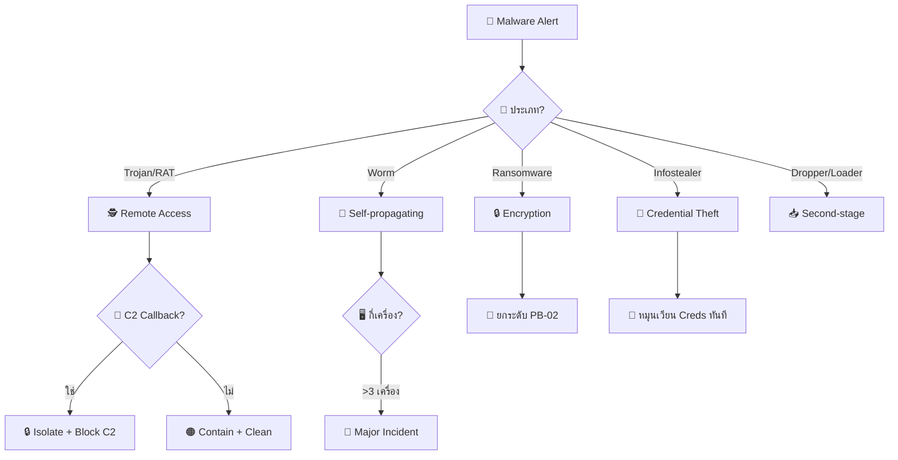
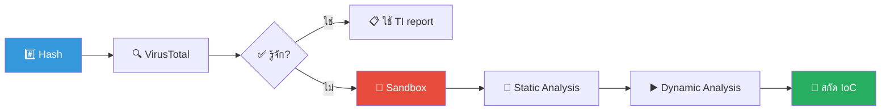
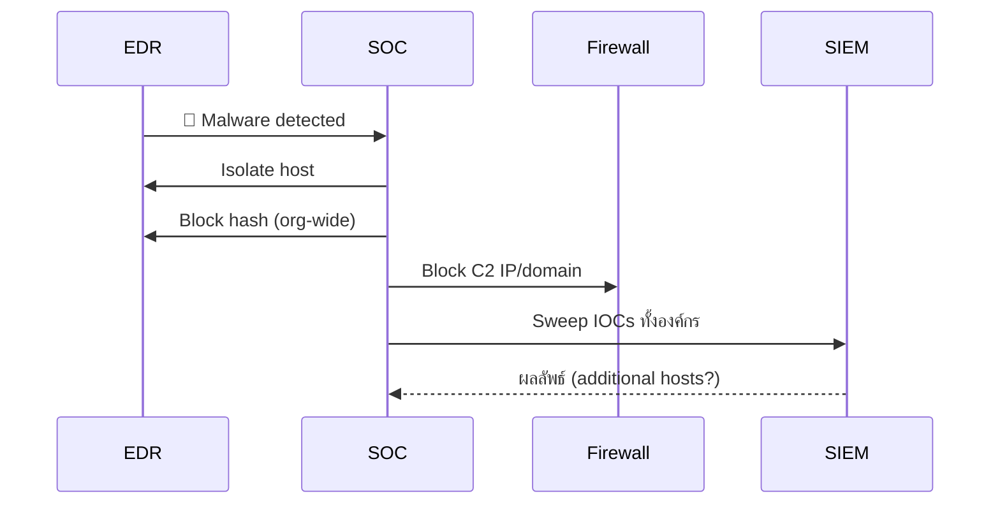
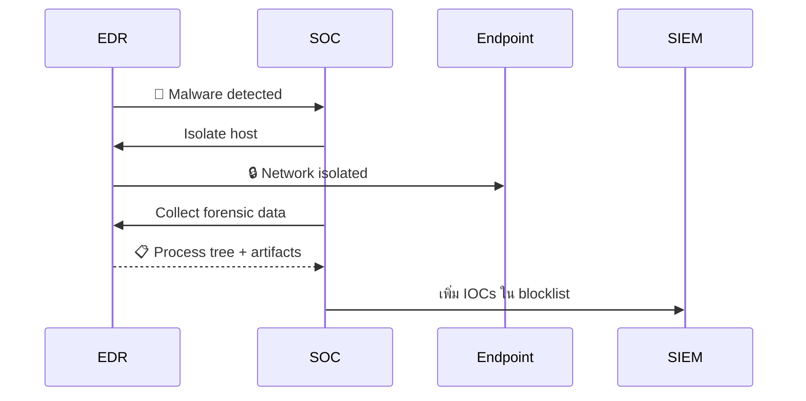

# Playbook: มัลแวร์ (Malware Infection)

**ID**: PB-03
**ระดับความรุนแรง**: สูง | **หมวดหมู่**: Endpoint Security
**MITRE ATT&CK**: [T1204](https://attack.mitre.org/techniques/T1204/) (User Execution), [T1059](https://attack.mitre.org/techniques/T1059/) (Command & Scripting Interpreter)
**ทริกเกอร์**: EDR alert, AV detection, sandbox result, ผู้ใช้รายงานอาการผิดปกติ

---

## ผังการตัดสินใจ

---

## 1. การวิเคราะห์

### 1.1 ประเภทมัลแวร์

| ประเภท | ลักษณะ | ความรุนแรง |
|:---|:---|:---|
| **Trojan/RAT** | Remote access, keylogger | 🔴 สูง |
| **Worm** | Self-replicating, network spread | 🔴 สูง |
| **Ransomware** | เข้ารหัสไฟล์, ransom note | 🔴 วิกฤต |
| **Infostealer** | ขโมย browser passwords, cookies | 🔴 สูง |
| **Dropper/Loader** | ดาวน์โหลด payload เพิ่มเติม | 🟠 สูง |
| **Rootkit** | ซ่อน process, kernel-level | 🔴 วิกฤต |
| **Cryptominer** | ใช้ CPU/GPU mining | 🟠 ปานกลาง |

### 1.2 รายการตรวจสอบ

| รายการ | วิธีตรวจสอบ | เสร็จ |
|:---|:---|:---:|
| ประเภทมัลแวร์ | EDR classification | ☐ |
| File hash (SHA256) | EDR | ☐ |
| VT / TI lookup | VirusTotal, OTX | ☐ |
| Entry vector (email/USB/download/exploit) | EDR timeline | ☐ |
| Parent process chain | EDR process tree | ☐ |
| มี C2 callback? | EDR network events | ☐ |
| มี lateral movement? | SIEM correlation | ☐ |
| มี persistence? (registry, scheduled task, service) | EDR / Autoruns | ☐ |
| มีข้อมูลถูกนำออก? | DLP / Netflow | ☐ |
| มี host อื่นติดเชื้อ? | SIEM IoC search | ☐ |

---

### ผังกระบวนการวิเคราะห์มัลแวร์

### ผังขั้นตอนการควบคุม

---

## 2. การควบคุม

| # | การดำเนินการ | เครื่องมือ | เสร็จ |
|:---:|:---|:---|:---:|
| 1 | **Isolate** host ทันที (network quarantine) | EDR | ☐ |
| 2 | **Kill** malicious process | EDR | ☐ |
| 3 | **Block** file hash ทั้งองค์กร | EDR policy | ☐ |
| 4 | **Block** C2 domain/IP ที่ proxy, firewall, DNS | All | ☐ |
| 5 | **ค้นหา IoC** (hash, IP, domain) ใน host อื่น | SIEM | ☐ |
| 6 | **บล็อก entry vector** (email attachment hash, URL) | Mail gateway | ☐ |

---

## 3. การกำจัด

| # | การดำเนินการ | เสร็จ |
|:---:|:---|:---:|
| 1 | ลบ malware binary + dropped files | ☐ |
| 2 | ลบ persistence ทั้งหมด (registry, task, service, cron) | ☐ |
| 3 | หมุนเวียน credentials ที่อาจถูกขโมย | ☐ |
| 4 | หาก worm → ตรวจทุก host ใน segment | ☐ |
| 5 | หาก rootkit → **rebuild จาก clean image** (ไม่ clean ได้) | ☐ |

---

## 4. การฟื้นฟู

| # | การดำเนินการ | เสร็จ |
|:---:|:---|:---:|
| 1 | Rebuild/restore host จาก known-good image | ☐ |
| 2 | อัปเดต EDR signatures + detection rules | ☐ |
| 3 | ปรับ email gateway rules (block attachment types) | ☐ |
| 4 | อัปเดต firewall/proxy blocklists | ☐ |
| 5 | อบรมผู้ใช้ (หาก entry vector = phishing/download) | ☐ |
| 6 | ติดตาม 14 วัน | ☐ |

---

## 5. เกณฑ์การยกระดับ

| เงื่อนไข | ยกระดับไปยัง |
|:---|:---|
| **Ransomware** ยืนยัน | [PB-02 Ransomware](Ransomware.th.md) ทันที |
| **C2 confirmed** | [PB-13 C2](C2_Communication.th.md) |
| **Worm** — หลาย host ติดเชื้อ | Major Incident |
| **Data exfiltration** | [PB-08 Data Exfil](Data_Exfiltration.th.md) + Legal |
| **Infostealer** — credentials ถูกขโมย | [PB-05 Account Compromise](Account_Compromise.th.md) |
| **Server/DC** ติดเชื้อ | CISO ทันที |

---

### ผัง Malware Analysis Pipeline

### ผัง EDR Response Flow

## เอกสารที่เกี่ยวข้อง

- [กรอบการตอบสนองต่อเหตุการณ์](../Framework.th.md)
- [แม่แบบรายงานเหตุการณ์](../../templates/incident_report.th.md)
- [PB-02 Ransomware](Ransomware.th.md)
- [PB-13 C2 Communication](C2_Communication.th.md)

## อ้างอิง

- [MITRE ATT&CK T1204 — User Execution](https://attack.mitre.org/techniques/T1204/)
