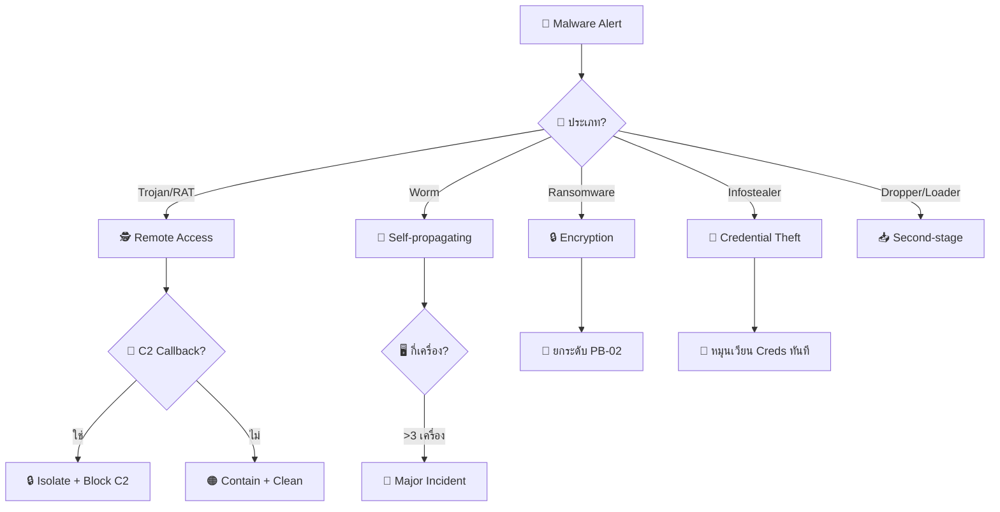
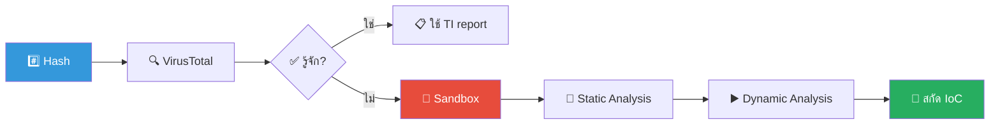
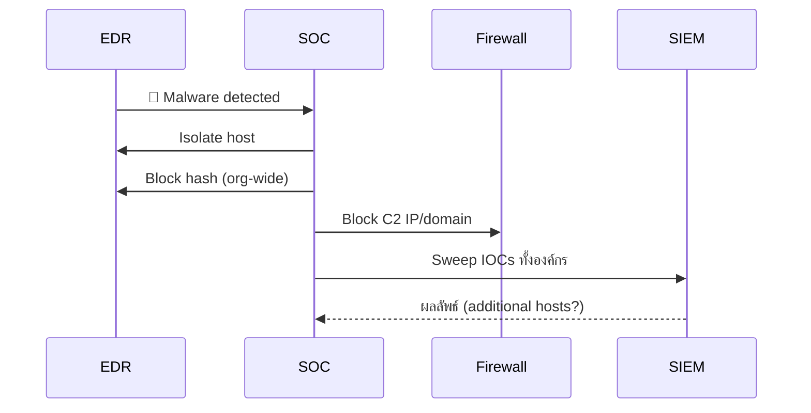
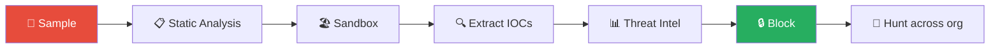
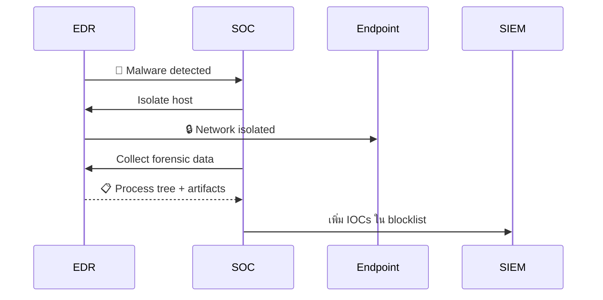

# Playbook: มัลแวร์ (Malware Infection)

**ID**: PB-03
**ระดับความรุนแรง**: สูง | **หมวดหมู่**: Endpoint Security
**MITRE ATT&CK**: [T1204](https://attack.mitre.org/techniques/T1204/) (User Execution), [T1059](https://attack.mitre.org/techniques/T1059/) (Command & Scripting Interpreter)
**ทริกเกอร์**: EDR alert, AV detection, sandbox result, ผู้ใช้รายงานอาการผิดปกติ

---

## ผังการตัดสินใจ

```mermaid
graph TD
    Alert["🚨 Malware Alert"] --> Type{"🦠 ประเภท?"}
    Type -->|Trojan/RAT| RAT["🕵️ Remote Access"]
    Type -->|Worm| Worm["🐛 Self-propagating"]
    Type -->|Ransomware| Ransom["🔒 Encryption"]
    Type -->|Infostealer| Stealer["🔑 Credential Theft"]
    Type -->|Dropper/Loader| Drop["📥 Second-stage"]
    RAT --> C2{"📡 C2 Callback?"}
    Worm --> Lateral{"🖥️ กี่เครื่อง?"}
    Ransom --> Escalate["🔴 ยกระดับ PB-02"]
    Stealer --> Creds["🔐 หมุนเวียน Creds ทันที"]
    C2 -->|ใช่| Isolate["🔒 Isolate + Block C2"]
    C2 -->|ไม่| Contain["🟠 Contain + Clean"]
    Lateral -->|>3 เครื่อง| Major["🔴 Major Incident"]
```

---

## หลังเหตุการณ์ (Post-Incident)

- [ ] ตรวจสอบว่า malware artifacts ถูกลบจากทุก host แล้ว
- [ ] อัพเดท AV/EDR signatures ด้วย indicators ใหม่
- [ ] ส่ง samples ไปยัง threat intel platforms
- [ ] สร้าง Sigma rule สำหรับ malware behavior ที่พบ
- [ ] ทบทวน endpoint hardening (macros, PowerShell)
- [ ] จัดทำ [Incident Report](../../11_Reporting_Templates/incident_report.th.md)

## 1. การวิเคราะห์

### 1.1 ประเภทมัลแวร์

| ประเภท | ลักษณะ | ความรุนแรง |
|:---|:---|:---|
| **Trojan/RAT** | Remote access, keylogger | 🔴 สูง |
| **Worm** | Self-replicating, network spread | 🔴 สูง |
| **Ransomware** | เข้ารหัสไฟล์, ransom note | 🔴 วิกฤต |
| **Infostealer** | ขโมย browser passwords, cookies | 🔴 สูง |
| **Dropper/Loader** | ดาวน์โหลด payload เพิ่มเติม | 🟠 สูง |
| **Rootkit** | ซ่อน process, kernel-level | 🔴 วิกฤต |
| **Cryptominer** | ใช้ CPU/GPU mining | 🟠 ปานกลาง |

### 1.2 รายการตรวจสอบ

| รายการ | วิธีตรวจสอบ | เสร็จ |
|:---|:---|:---:|
| ประเภทมัลแวร์ | EDR classification | ☐ |
| File hash (SHA256) | EDR | ☐ |
| VT / TI lookup | VirusTotal, OTX | ☐ |
| Entry vector (email/USB/download/exploit) | EDR timeline | ☐ |
| Parent process chain | EDR process tree | ☐ |
| มี C2 callback? | EDR network events | ☐ |
| มี lateral movement? | SIEM correlation | ☐ |
| มี persistence? (registry, scheduled task, service) | EDR / Autoruns | ☐ |
| มีข้อมูลถูกนำออก? | DLP / Netflow | ☐ |
| มี host อื่นติดเชื้อ? | SIEM IoC search | ☐ |

---

### ผังกระบวนการวิเคราะห์มัลแวร์

```mermaid
graph LR
    Hash["#️⃣ Hash"] --> VT["🔍 VirusTotal"]
    VT --> Known{"✅ รู้จัก?"}
    Known -->|ใช่| Report["📋 ใช้ TI report"]
    Known -->|ไม่| Sandbox["🧪 Sandbox"]
    Sandbox --> Static["📝 Static Analysis"]
    Static --> Dynamic["▶️ Dynamic Analysis"]
    Dynamic --> IOC["🎯 สกัด IoC"]
    style Hash fill:#3498db,color:#fff
    style Sandbox fill:#e74c3c,color:#fff
    style IOC fill:#27ae60,color:#fff
```

### ผังขั้นตอนการควบคุม

```mermaid
sequenceDiagram
    participant EDR
    participant SOC
    participant FW as Firewall
    participant SIEM
    EDR->>SOC: 🚨 Malware detected
    SOC->>EDR: Isolate host
    SOC->>EDR: Block hash (org-wide)
    SOC->>FW: Block C2 IP/domain
    SOC->>SIEM: Sweep IOCs ทั้งองค์กร
    SIEM-->>SOC: ผลลัพธ์ (additional hosts?)
```

---

## 2. การควบคุม

| # | การดำเนินการ | เครื่องมือ | เสร็จ |
|:---:|:---|:---|:---:|
| 1 | **Isolate** host ทันที (network quarantine) | EDR | ☐ |
| 2 | **Kill** malicious process | EDR | ☐ |
| 3 | **Block** file hash ทั้งองค์กร | EDR policy | ☐ |
| 4 | **Block** C2 domain/IP ที่ proxy, firewall, DNS | All | ☐ |
| 5 | **ค้นหา IoC** (hash, IP, domain) ใน host อื่น | SIEM | ☐ |
| 6 | **บล็อก entry vector** (email attachment hash, URL) | Mail gateway | ☐ |

---

## 3. การกำจัด

| # | การดำเนินการ | เสร็จ |
|:---:|:---|:---:|
| 1 | ลบ malware binary + dropped files | ☐ |
| 2 | ลบ persistence ทั้งหมด (registry, task, service, cron) | ☐ |
| 3 | หมุนเวียน credentials ที่อาจถูกขโมย | ☐ |
| 4 | หาก worm → ตรวจทุก host ใน segment | ☐ |
| 5 | หาก rootkit → **rebuild จาก clean image** (ไม่ clean ได้) | ☐ |

---

## 4. การฟื้นฟู

| # | การดำเนินการ | เสร็จ |
|:---:|:---|:---:|
| 1 | Rebuild/restore host จาก known-good image | ☐ |
| 2 | อัปเดต EDR signatures + detection rules | ☐ |
| 3 | ปรับ email gateway rules (block attachment types) | ☐ |
| 4 | อัปเดต firewall/proxy blocklists | ☐ |
| 5 | อบรมผู้ใช้ (หาก entry vector = phishing/download) | ☐ |
| 6 | ติดตาม 14 วัน | ☐ |

---

## 5. เกณฑ์การยกระดับ

| เงื่อนไข | ยกระดับไปยัง |
|:---|:---|
| **Ransomware** ยืนยัน | [PB-02 Ransomware](Ransomware.th.md) ทันที |
| **C2 confirmed** | [PB-13 C2](C2_Communication.th.md) |
| **Worm** — หลาย host ติดเชื้อ | Major Incident |
| **Data exfiltration** | [PB-08 Data Exfil](Data_Exfiltration.th.md) + Legal |
| **Infostealer** — credentials ถูกขโมย | [PB-05 Account Compromise](Account_Compromise.th.md) |
| **Server/DC** ติดเชื้อ | CISO ทันที |

---

## 6. Evidence Checklist

| ประเภทหลักฐาน | สิ่งที่ต้องเก็บ | แหล่งข้อมูล | เหตุผลที่ต้องเก็บ |
|:---|:---|:---|:---|
| หลักฐาน sample มัลแวร์ | filename, hash, path, compile info, sandbox verdict | EDR / sandbox / forensic tools | ใช้จัดประเภทและ block / hunt ต่อ |
| หลักฐานการทำงาน | parent process, command line, user context, persistence artifact | EDR / system logs | ใช้ดูว่าเริ่มอย่างไรและกลับมาได้หรือไม่ |
| หลักฐานเครือข่าย | C2 domain/IP, port, DNS lookup, transfer volume | Proxy / firewall / DNS / NetFlow | ใช้ยืนยัน remote control หรือ exfiltration |
| หลักฐานช่องทางนำเข้า | email, download URL, removable media, installer source | Mail gateway / proxy / browser logs | ใช้หา initial access path และช่องว่างในการป้องกัน |
| หลักฐานผลกระทบธุรกิจ | host ที่ได้รับผลกระทบ, ผู้ใช้, credential ที่เสี่ยง, critical service | Asset inventory / IAM / ticketing | ใช้ประกอบการยกระดับและลำดับการกู้คืน |

---

## 7. Minimum Telemetry Required

| แหล่ง Telemetry | ใช้เพื่ออะไร | ความสำคัญ | Blind Spot ถ้าไม่มี |
|:---|:---|:---:|:---|
| Endpoint detection telemetry | ดู process lineage, file activity, persistence, isolation action | Required | ยืนยัน execution หรือ containment บนเครื่องไม่ได้ |
| Sandbox หรือ malware analysis telemetry | ดู verdict, dropped file, secondary behavior | Required | malware family และพฤติกรรมต่อเนื่องไม่ชัด |
| Network และ DNS telemetry | ดู C2, download site, exfiltration, propagation clue | Required | มองไม่เห็น remote control และเส้นทางการกระจาย |
| Email, proxy, หรือ web gateway logs | ดู delivery method และ user interaction | Required | หา initial access root cause ไม่ได้ |
| Asset และ identity inventory | ดู criticality, owner, user role, privileged status | Recommended | การกู้คืนและสื่อสารช้าลง |

---

## 8. False Positive และ Tuning Guide

| Scenario | ทำไมจึงดูน่าสงสัย | วิธีตรวจสอบ | Tuning Action | ต้องยกระดับเมื่อ |
|:---|:---|:---|:---|:---|
| admin tool หรือ utility ที่ใช้ได้สองทาง | dual-use tool อาจดูเหมือน malware | ยืนยัน signed binary, path, และ admin owner | suppress ตาม publisher และ approved path เท่านั้น | process เดียวกันไปยังปลายทางเสี่ยงหรือมี persistence แปลก |
| Security scanner หรือ EDR remediation | เครื่องมืออาจ drop file หรือ spawn script | ยืนยัน tool identity, job ID, และ console action | allowlist process chain ของเครื่องมือใน maintenance window | มี unknown payload หรือ user-context execution ร่วมด้วย |
| software installer หรือ updater | temp-folder execution ดูอันตรายได้ | ตรวจ publisher, hash reputation, และเจตนาการใช้งาน | tune ตาม installer hash และ update service ที่อนุมัติ | destination network, persistence, หรือ lateral movement ผิดปกติ |
| lab หรือ malware analysis environment | การ detonate sample โดยตั้งใจดูเหมือนติดเชื้อจริง | ยืนยัน asset tag, isolated network, และ analyst owner | จำกัด exception เฉพาะ lab assets | พฤติกรรมหลุดไปแตะ production systems หรือ identities |

---

### ผัง Malware Analysis Pipeline

```mermaid
graph LR
    Sample["🦠 Sample"] --> Static["📋 Static Analysis"]
    Static --> Sandbox["🏖️ Sandbox"]
    Sandbox --> IOC["🔍 Extract IOCs"]
    IOC --> TI["📊 Threat Intel"]
    TI --> Block["🔒 Block"]
    Block --> Hunt["🎯 Hunt across org"]
    style Sample fill:#e74c3c,color:#fff
    style Block fill:#27ae60,color:#fff
```

### ผัง EDR Response Flow

```mermaid
sequenceDiagram
    participant EDR
    participant SOC
    participant Endpoint
    participant SIEM
    EDR->>SOC: 🚨 Malware detected
    SOC->>EDR: Isolate host
    EDR->>Endpoint: 🔒 Network isolated
    SOC->>EDR: Collect forensic data
    EDR-->>SOC: 📋 Process tree + artifacts
    SOC->>SIEM: เพิ่ม IOCs ใน blocklist
```

## กฎตรวจจับ (Sigma)

| กฎ | ไฟล์ |
|:---|:---|
| Office Spawning PowerShell | [proc_office_spawn_powershell.yml](../../08_Detection_Engineering/sigma_rules/proc_office_spawn_powershell.yml) |
| Execution from Temp/Downloads | [proc_temp_folder_execution.yml](../../08_Detection_Engineering/sigma_rules/proc_temp_folder_execution.yml) |
| PowerShell Encoded Command | [proc_powershell_encoded.yml](../../08_Detection_Engineering/sigma_rules/proc_powershell_encoded.yml) |
| Ransomware Bulk Renaming | [file_bulk_renaming_ransomware.yml](../../08_Detection_Engineering/sigma_rules/file_bulk_renaming_ransomware.yml) |

## เอกสารที่เกี่ยวข้อง

- [กรอบการตอบสนองต่อเหตุการณ์](../Framework.th.md)
- [แม่แบบรายงานเหตุการณ์](../../11_Reporting_Templates/incident_report.th.md)
- [PB-02 Ransomware](Ransomware.th.md)
- [PB-13 C2 Communication](C2_Communication.th.md)

## Malware Family Classification

| Category | Behavior | Priority | Example |
|:---|:---|:---|:---|
| Ransomware | File encryption | Critical | LockBit, BlackCat |
| RAT | Remote control | Critical | Cobalt Strike |
| Worm | Self-propagation | High | Emotet |
| Trojan | Disguised payload | High | Trickbot |
| Cryptominer | Resource hijacking | Medium | XMRig |

### Containment Decision Matrix

| Factor | Isolate | Monitor | Full Wipe |
|:---|:---|:---|:---|
| Single endpoint | ✅ | - | If persistent |
| Server | ✅ | Short-term | After backup |
| Domain controller | ✅ | ❌ | After DSRM |
| Multiple hosts | Network segment | ❌ | Phased |

### Malware Sample Handling

| Step | Action |
|:---|:---|
| 1 | Calculate SHA256 hash |
| 2 | Check VirusTotal reputation |
| 3 | Submit to sandbox (if unknown) |

## References

- [MITRE ATT&CK T1204 — User Execution](https://attack.mitre.org/techniques/T1204/)
