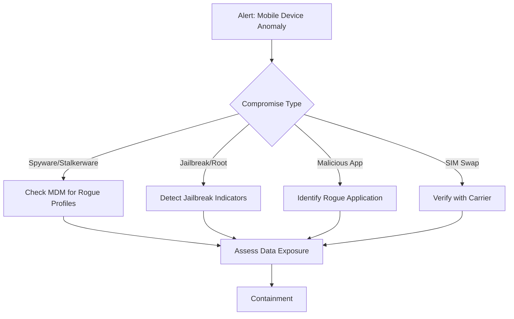

# Playbook: Mobile Device Compromise (PB-28)

**Severity**: High | **Category**: Endpoint Security | **MITRE**: T1456, T1474

## 1. Analysis (Triage)

-   **MDM Telemetry**: Check MDM (Intune, Jamf, VMware WS1) for non-compliant device status, new profiles, or jailbreak detection.
-   **App Analysis**: Identify unknown or sideloaded apps not from official app stores.
-   **Network Activity**: Review unusual data transfers, connections to suspicious IPs from mobile device.
-   **Account Access**: Check corporate email, VPN, and SaaS access logs from the device.

## 2. Containment
-   **Remote Lock**: Lock the device via MDM immediately.
-   **Revoke Corporate Access**: Remove device from conditional access / compliance policies.
-   **Disable Corporate Apps**: Selective wipe of corporate data (Intune App Protection).
-   **Block Network**: Remove device from corporate WiFi and VPN.
-   **SIM Swap**: If SIM swap confirmed, work with carrier to restore number and lock account.

## 3. Remediation
-   **Full Device Wipe**: If spyware/rootkit confirmed, factory reset the device.
-   **Re-enroll**: Fresh enrollment into MDM with security policies applied.
-   **Credential Reset**: Reset all corporate credentials used on the device.
-   **MFA Re-enrollment**: Remove device from MFA trusted devices, re-enroll.
-   **App Vetting**: Review approved app list in MDM.

## 4. Recovery
-   **Restore from Backup**: Only restore user data (not apps) from known-clean backup.
-   **Enhanced MDM Policies**: Enforce app allowlisting, block sideloading, require OS updates.
-   **Monitoring**: 30-day enhanced monitoring on restored device.

## 5. Lessons Learned
-   Evaluate MDM coverage for all BYOD and corporate devices.
-   Implement mobile threat defense (MTD) solution.
-   User training on mobile security (sideloading risks, public WiFi).

## References
-   [MITRE ATT&CK Mobile — T1456](https://attack.mitre.org/techniques/T1456/)
-   [NIST SP 800-124 — Guidelines for Managing Mobile Devices](https://csrc.nist.gov/publications/detail/sp/800-124/rev-2/final)
