# Playbook: อุปกรณ์มือถือถูกบุกรุก

**ID**: PB-28
**ระดับความรุนแรง**: สูง | **หมวดหมู่**: ความปลอดภัยอุปกรณ์ปลายทาง
**MITRE ATT&CK**: [T1456](https://attack.mitre.org/techniques/T1456/) (Drive-By Compromise — Mobile), [T1474](https://attack.mitre.org/techniques/T1474/) (Supply Chain Compromise — Mobile)
**ทริกเกอร์**: MTD alert (malicious app), MDM compliance violation, ผู้ใช้รายงาน SIM swap, phishing on mobile

### ผังตรวจจับภัยคุกคามมือถือ

```mermaid
graph TD
    MTD["🔍 MTD"] --> Type{"📱 ประเภท?"}
    Type -->|Malicious App| App["🦠 ลบ App"]
    Type -->|Jailbreak/Root| JB["⚠️ Block Access"]
    Type -->|Network Attack| Net["🌐 VPN Force"]
    Type -->|SIM Swap| SIM["📞 ติดต่อ Carrier"]
    App --> MDM["📲 MDM Action"]
    JB --> MDM
    Net --> MDM
```

### ผังขั้นตอนควบคุม BYOD

```mermaid
sequenceDiagram
    participant User as ผู้ใช้
    participant MDM
    participant SOC
    participant IT
    MDM->>SOC: 🚨 Compliance violation
    SOC->>MDM: Block corporate access
    SOC->>User: แจ้ง + คำแนะนำ
    User->>IT: นำอุปกรณ์มาตรวจ
    IT->>MDM: Remediate / Re-enroll
    MDM-->>SOC: ✅ Compliant
```

---

## ผังการตัดสินใจ

```mermaid
graph TD
    Alert["🚨 มือถือผิดปกติ"] --> Type{"📱 ประเภทการบุกรุก?"}
    Type -->|Spyware| Spy["🕵️ โปรไฟล์/แอปอันตราย"]
    Type -->|Jailbreak/Root| JB["🔓 ความสมบูรณ์ของอุปกรณ์ถูกทำลาย"]
    Type -->|แอปอันตราย| App["📦 แอปที่ไม่น่าเชื่อถือ"]
    Type -->|SIM Swap| SIM["📞 หมายเลขถูกขโมย"]
    Type -->|Smishing| Smish["📩 คลิกลิงก์ SMS"]
    Spy --> Scope["📊 ประเมินข้อมูลที่เปิดเผย"]
    JB --> Scope
    App --> Scope
    SIM --> Urgent["🔴 ด่วน — MFA/Auth เสี่ยง"]
    Scope --> Corp{"💼 เข้าถึงข้อมูลองค์กร?"}
    Corp -->|ใช่| Contain["🔒 ควบคุมเต็มรูปแบบ"]
    Corp -->|ไม่| Monitor["👁️ ติดตาม + ให้ความรู้"]
    Urgent --> Contain
```

---

## 1. การวิเคราะห์

### 1.1 ประเภทการบุกรุก

| ประเภท | ตัวบ่งชี้ | การตรวจจับ |
|:---|:---|:---|
| **Spyware/Stalkerware** | MDM profiles แปลก, แบตเตอรี่หมดเร็ว | MDM, MTD |
| **Jailbreak/Root** | Cydia, Magisk, SuperSU | MDM jailbreak detection |
| **แอปอันตราย** | APK/IPA ที่ sideload | MTD, MDM app inventory |
| **SIM Swap** | สูญเสียสัญญาณ, ไม่ได้รับ OTP | รายงานผู้ใช้, ผู้ให้บริการ |
| **Smishing** | คลิกลิงก์ SMS ที่น่าสงสัย | รายงานผู้ใช้, MTD |
| **การโจมตีเครือข่าย** | Wi-Fi ปลอม, MITM | MTD |

### 1.2 รายการตรวจสอบ

| รายการ | วิธีตรวจสอบ | เสร็จ |
|:---|:---|:---:|
| สถานะ MDM compliance | Intune / Jamf / WS1 | ☐ |
| App inventory — มีแอปที่ sideload? | MDM | ☐ |
| Configuration profiles — มีโปรไฟล์แปลก? | MDM | ☐ |
| การเชื่อมต่อเครือข่าย — IP ที่น่าสงสัย? | MTD | ☐ |
| เข้าถึงอีเมลองค์กรจากอุปกรณ์? | Exchange / M365 | ☐ |
| VPN connections จากอุปกรณ์? | VPN logs | ☐ |
| OS อัปเดตล่าสุดหรือไม่? | MDM | ☐ |

### 1.3 การประเมินข้อมูลที่เปิดเผย

| ประเภทข้อมูล | เข้าถึงได้จากอุปกรณ์? | รั่วไหล? |
|:---|:---|:---|
| อีเมลองค์กรและไฟล์แนบ | ☐ ใช่ ☐ ไม่ | ☐ |
| ปฏิทินและผู้ติดต่อ | ☐ ใช่ ☐ ไม่ | ☐ |
| Cloud storage (OneDrive/GDrive) | ☐ ใช่ ☐ ไม่ | ☐ |
| VPN access ไปเครือข่ายภายใน | ☐ ใช่ ☐ ไม่ | ☐ |
| Authenticator/MFA tokens | ☐ ใช่ ☐ ไม่ | ☐ |

---

## 2. การควบคุม

### 2.1 การดำเนินการทันที

| # | การดำเนินการ | เครื่องมือ | เสร็จ |
|:---:|:---|:---|:---:|
| 1 | **ล็อกอุปกรณ์** ระยะไกล | MDM | ☐ |
| 2 | **ลบข้อมูลองค์กร** (Selective Wipe) | MDM (Intune) | ☐ |
| 3 | **ถอดอุปกรณ์** จาก Conditional Access | IdP | ☐ |
| 4 | **บล็อกเครือข่าย** (Wi-Fi, VPN) | Wi-Fi / VPN | ☐ |
| 5 | **รีเซ็ตรหัสผ่าน** ผู้ใช้ | AD / IdP | ☐ |
| 6 | **เพิกถอน OAuth tokens** | IdP | ☐ |

### 2.2 กรณี SIM Swap

| # | การดำเนินการ | เสร็จ |
|:---:|:---|:---:|
| 1 | ติดต่อผู้ให้บริการทันทีเพื่อกู้หมายเลข | ☐ |
| 2 | เปลี่ยน MFA จาก SMS เป็น authenticator app / FIDO2 | ☐ |
| 3 | รีเซ็ตรหัสผ่าน **ทุกบัญชี** ที่ใช้ SMS MFA | ☐ |
| 4 | ตรวจสอบการเข้าถึงที่ไม่ได้รับอนุญาตระหว่าง SIM swap | ☐ |

---

## 3. การกำจัด

| # | การดำเนินการ | เสร็จ |
|:---:|:---|:---:|
| 1 | **Factory reset** อุปกรณ์ (หากยืนยัน spyware/rootkit) | ☐ |
| 2 | ลบโปรไฟล์และแอปอันตราย | ☐ |
| 3 | อัปเดต OS ล่าสุด | ☐ |
| 4 | ลงทะเบียนอุปกรณ์ใหม่ใน MDM | ☐ |

---

## 4. การฟื้นฟู

| # | การดำเนินการ | เสร็จ |
|:---:|:---|:---:|
| 1 | กู้คืนข้อมูลจาก backup ที่สะอาด (**ไม่รวมแอป**) | ☐ |
| 2 | ลงทะเบียน MFA ใหม่จากอุปกรณ์ที่สะอาด | ☐ |
| 3 | บังคับนโยบาย MDM: app allowlist, บล็อก sideloading | ☐ |
| 4 | เปิดใช้ MTD หากยังไม่ได้ deploy | ☐ |
| 5 | ติดตามอุปกรณ์ 30 วัน | ☐ |

---

## 5. เกณฑ์การยกระดับ

| เงื่อนไข | ยกระดับไปยัง |
|:---|:---|
| อุปกรณ์ผู้บริหารถูกบุกรุก | CISO ทันที |
| SIM swap กับ admin/VIP | CISO + ทีม Identity |
| ข้อมูลองค์กรถูกนำออกจากอุปกรณ์ | Legal + DPO (PDPA 72 ชม.) |
| อุปกรณ์หลายเครื่องถูกบุกรุก (แคมเปญ) | Major Incident |

---

### ผัง Mobile Threat Classification

```mermaid
graph TD
    Threat["📱 Mobile Threat"] --> App["📦 Malicious App"]
    Threat --> Network["🌐 Network attack"]
    Threat --> OS["⚙️ OS exploit"]
    Threat --> Phish["🎣 Mobile phishing"]
    App --> MDM["🛡️ MDM block"]
    Network --> VPN["🔒 VPN enforce"]
    OS --> Update["🔄 Force update"]
    Phish --> Training["📚 Training"]
    style Threat fill:#e74c3c,color:#fff
```

### ผัง BYOD Security Architecture

```mermaid
graph LR
    Personal["📱 BYOD"] --> Enroll["📲 MDM enroll"]
    Enroll --> Container["🔒 Work container"]
    Container --> Access["📁 Corporate data"]
    Container --> Policy["📋 DLP policy"]
    Access --> Encrypt["🔐 Encrypted"]
    Policy --> Wipe["🗑️ Selective wipe"]
    style Container fill:#27ae60,color:#fff
    style Wipe fill:#e74c3c,color:#fff
```

## เอกสารที่เกี่ยวข้อง

- [กรอบการตอบสนองต่อเหตุการณ์](../Framework.th.md)
- [แม่แบบรายงานเหตุการณ์](../../templates/incident_report.th.md)
- [PB-05 บัญชีถูกบุกรุก](Account_Compromise.th.md)
- [PB-19 อุปกรณ์สูญหาย](Lost_Device.th.md)

## อ้างอิง

- [MITRE ATT&CK Mobile — T1456](https://attack.mitre.org/techniques/T1456/)
- [NIST SP 800-124r2 — Guidelines for Managing Mobile Devices](https://csrc.nist.gov/publications/detail/sp/800-124/rev-2/final)
