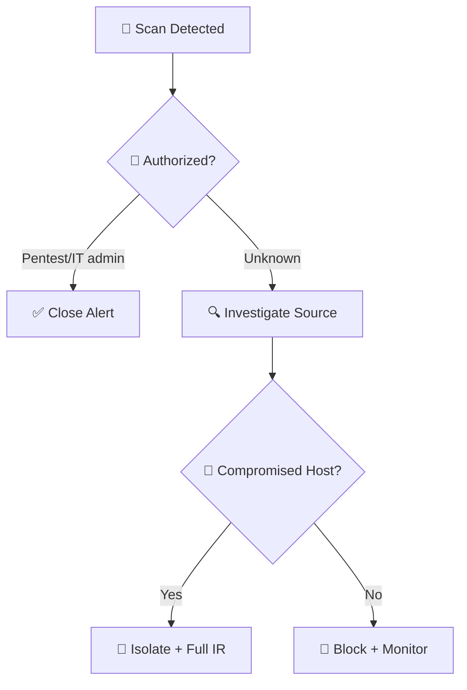
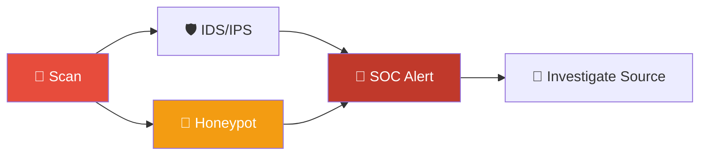
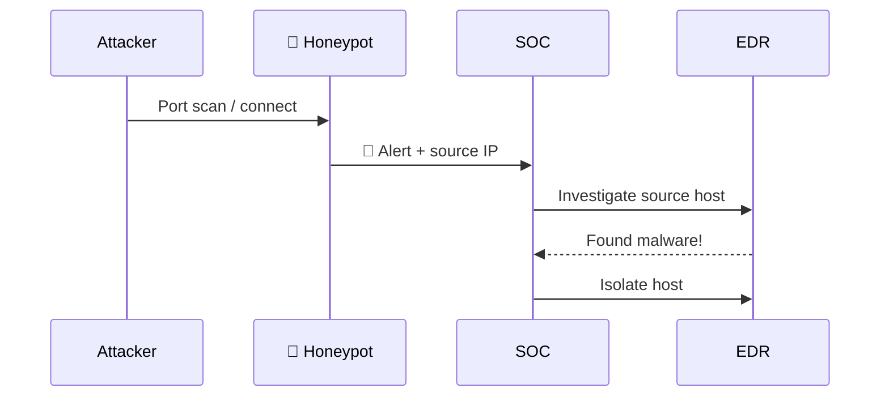
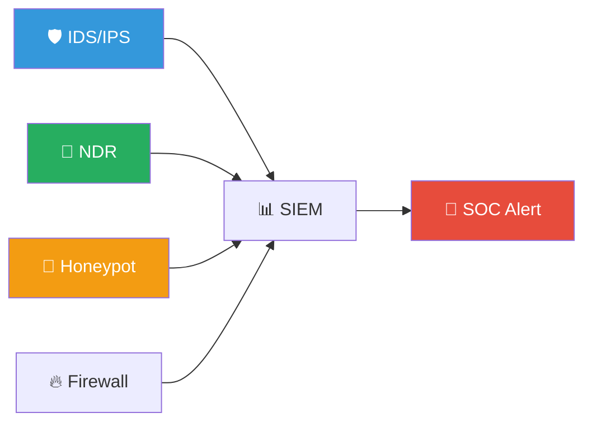
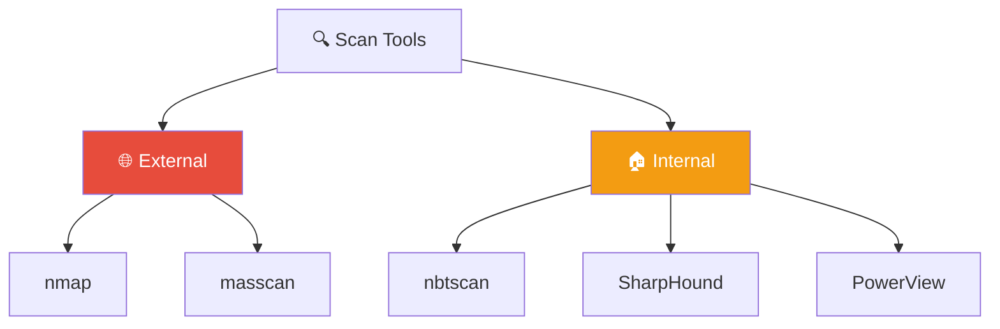

# Playbook PB-34: Suspicious Network Discovery

**ID**: PB-34
**Severity**: Medium–High | **Category**: Discovery | **MITRE**: T1046, T1135, T1018, T1016, T1049, T1082

---

## Decision Flow

```mermaid
graph TD
    Alert["🚨 Scan Detected"] --> Auth{"🔑 Authorized?"}
    Auth -->|Pentest/IT admin| Close["✅ Close Alert"]
    Auth -->|Unknown| Investigate["🔍 Investigate Source"]
    Investigate --> Compromised{"🦠 Compromised Host?"}
    Compromised -->|Yes| Isolate["🔌 Isolate + Full IR"]
    Compromised -->|No| Block["🚫 Block + Monitor"]
```

### Scan Detection Flow

```mermaid
graph LR
    Scanner["📡 Scan"] --> IDS["🛡️ IDS/IPS"]
    IDS --> Alert["🚨 SOC Alert"]
    Scanner --> Honeypot["🍯 Honeypot"]
    Honeypot --> Alert
    Alert --> Investigate["🔎 Investigate Source"]
    style Scanner fill:#e74c3c,color:#fff
    style Honeypot fill:#f39c12,color:#fff
    style Alert fill:#c0392b,color:#fff
```

### Honeypot Trigger Flow

```mermaid
sequenceDiagram
    participant Attacker
    participant Honeypot as 🍯 Honeypot
    participant SOC
    participant EDR
    Attacker->>Honeypot: Port scan / connect
    Honeypot->>SOC: 🚨 Alert + source IP
    SOC->>EDR: Investigate source host
    EDR-->>SOC: Found malware!
    SOC->>EDR: Isolate host
```

## Description

An attacker conducts internal reconnaissance to map the network topology, identify live hosts, discover file shares, and enumerate services. This information enables lateral movement, privilege escalation, and data exfiltration. Discovery often follows initial access and precedes lateral movement.

## Detection Sources

| Source | Alert Examples |
|:---|:---|
| **EDR** | Port scanning tools (nmap, Advanced IP Scanner), network enumeration commands |
| **SIEM** | High volume of failed connections, ICMP sweeps, SMB share enumeration |
| **Network** | Unusual ARP requests, rapid sequential connections to multiple hosts |
| **Domain Controller** | LDAP queries for all computers/users, BloodHound activity |

## Triage Checklist

| # | Step | Action |
|:---:|:---|:---|
| 1 | **Identify the source** | Who is running discovery commands? Normal admin or compromised account? |
| 2 | **Check context** | Is this part of scheduled IT operations (patching, inventory)? |
| 3 | **Review commands** | Look for: `net view`, `net share`, `nltest`, `arp -a`, `nmap`, `ping sweep`, PowerShell AD cmdlets |
| 4 | **Check device** | Is the source a workstation or server? Domain-joined? Expected user? |
| 5 | **Timeline** | When did activity start? Does it correlate with initial access alerts? |
| 6 | **Volume** | How many hosts/ports targeted? Rapid scanning = likely automated |

## Response Actions

### Tier 1

1. Document the source host, user, and commands observed
2. Check if user has legitimate reason for network scanning (IT admin, authorized pentest)
3. If unauthorized → Escalate to Tier 2

### Tier 2

4. Investigate the source host for signs of compromise (malware, unauthorized access)
5. Check for preceding initial access indicators (phishing click, exploit)
6. Search for follow-up activity: lateral movement, credential dumping
7. If confirmed malicious:
   - **Isolate** the source host via EDR
   - **Disable** the compromised account
   - **Block** scanning tools via endpoint policy

### Tier 3

8. Conduct full forensic investigation of the source host
9. Map the full attack chain: initial access → discovery → next stages
10. Review network segmentation — could the attacker reach critical assets?
11. Update detection rules for discovery techniques observed

## Containment

| Action | Method | Approval |
|:---|:---|:---|
| Isolate source host | EDR network isolation | SOC Lead |
| Disable user account | Active Directory / IAM | SOC Lead |
| Block scanning tools | Application control / EDR policy | Change request |
| Restrict network access | Firewall / microsegmentation | Network team + SOC Lead |
| Enable enhanced logging | SIEM + EDR verbose mode | SOC Lead |

## Eradication

| # | Action | Done |
|:---:|:---|:---:|
| 1 | Remove scanning tools and scripts from endpoint | ☐ |
| 2 | Kill active scanning processes | ☐ |
| 3 | Remove persistence mechanisms (scheduled tasks, services) | ☐ |
| 4 | Reset compromised credentials (if applicable) | ☐ |
| 5 | Patch exploited vulnerability used for initial access | ☐ |
| 6 | Clear attacker's cached AD/LDAP query results | ☐ |

## IoC Collection

| Type | Value | Source |
|:---|:---|:---|
| Source IP / hostname | | EDR / SIEM |
| User account | | AD logs |
| Scanning tool name | | Process logs |
| Scan targets (IP ranges) | | Network logs |
| Commands executed | | EDR command history |
| Scan output files | | Forensic image |
| Associated malware hash | | EDR / sandbox |
| C2 domain (if post-exploitation) | | DNS / proxy logs |

## Evidence Checklist

| Evidence Type | What to Collect | Source | Why It Matters |
|:---|:---|:---|:---|
| Discovery evidence | Commands, tool names, target ranges, protocols, timing | EDR / SIEM / NDR | Shows intent and scale of reconnaissance |
| Source evidence | Hostname, user, privilege level, parent process, malware linkage | EDR / IAM / SIEM | Distinguishes admin work from attacker-led discovery |
| Network evidence | Sequential scans, ARP/SMB/LDAP/DNS patterns, admin share access | NDR / firewall / Zeek / AD logs | Confirms the type of discovery performed |
| Scope evidence | Critical systems targeted, BloodHound collection, output files | SIEM / forensic image | Indicates likely next-stage objectives |
| Context evidence | Change window, authorized scanner, helpdesk or admin task | Ticketing / scanner inventory | Supports false-positive closure |

## Minimum Telemetry Required

| Telemetry Source | Required For | Priority | Blind Spot If Missing |
|:---|:---|:---:|:---|
| Endpoint and process telemetry | Tool execution, commands, output files | Required | Cannot identify discovery tools on the source host |
| NDR, IDS/IPS, and firewall telemetry | Port sweeps, host sweeps, SMB/LDAP/DNS patterns | Required | Network-wide scanning patterns remain invisible |
| AD and identity logs | LDAP queries, share access, privileged user context | Required | Directory-focused discovery and privilege context are missed |
| Scanner inventory and change records | Approved admin/scanner activity context | Recommended | Analysts may over-escalate legitimate scans |
| Honeypot or deception telemetry | High-confidence malicious probing | Recommended | Early internal recon signals weaken |

## False Positive and Tuning Guide

| Scenario | Why It Looks Suspicious | How to Validate | Tuning Action | Escalate If |
|:---|:---|:---|:---|:---|
| Approved vulnerability scan | Port sweeps and enumeration resemble attacker recon | Confirm scanner IP, schedule, and approved scope | Allowlist scanner sources and exact ranges only | Scan hits out-of-scope targets or uses exploit payloads |
| IT admin troubleshooting | `net view`, LDAP lookups, or share checks can look hostile | Validate admin identity, ticket, and target systems | Lower severity for approved admin commands in limited scope | Activity expands to broad subnet sweeps or off-hours access |
| Asset inventory tooling | Routine host enumeration may be noisy | Confirm inventory tool, service account, and cadence | Tune for known inventory processes and management subnets | Same host also executes attacker tooling or lateral movement steps |
| Red-team or tabletop discovery | Intentional recon appears malicious by design | Validate exercise scope and dates | Suppress approved exercise hosts only | Discovery continues outside exercise window |

## Escalation Criteria

| Condition | Escalate To |
|:---|:---|
| Scanning from compromised host (malware confirmed) | Tier 2 + IR Lead |
| Discovery activity followed by lateral movement | Tier 3 + CISO |
| Domain controller or critical server targeted | SOC Manager + System Owners |
| BloodHound / SharpHound collection detected | Tier 3 + AD Security |
| Scanning originates from external IP | Tier 2 + Network Team |
| > 100 hosts or > 1,000 ports scanned | SOC Lead |

## Recovery

- [ ] Rebuild source host if compromised (re-image with clean baseline)
- [ ] Re-enable user account after credential reset and MFA re-enrollment
- [ ] Verify network segmentation blocks unauthorized scanning
- [ ] Confirm no lateral movement succeeded from the discovery phase
- [ ] Restore any services disrupted during containment
- [ ] Validate enhanced monitoring rules are in place

## Post-Incident

- [ ] Update IDS/IPS signatures for observed discovery techniques
- [ ] Deploy honeypots in high-value network segments
- [ ] Review and tighten application control policies (scanning tools)
- [ ] Create Sigma detection rule for new discovery patterns observed
- [ ] Conduct tabletop exercise for discovery → lateral movement scenarios
- [ ] Document findings in [Incident Report](../../11_Reporting_Templates/incident_report.en.md)

## Key Indicators

| Indicator | Example |
|:---|:---|
| **Processes** | nmap, masscan, Advanced IP Scanner, arp-scan, nbtscan |
| **Commands** | `net view /domain`, `nltest /dclist:`, `Get-ADComputer`, `arp -a`, `nslookup` |
| **Network** | ICMP sweep, TCP SYN to sequential IPs, excessive SMB (445) connections |
| **AD Queries** | LDAP `objectCategory=computer`, BloodHound's `SharpHound` collector |

### Network Visibility Stack

```mermaid
graph LR
    IDS["🛡️ IDS/IPS"] --> SIEM["📊 SIEM"]
    NDR["📡 NDR"] --> SIEM
    Honeypot["🍯 Honeypot"] --> SIEM
    FW["🔥 Firewall"] --> SIEM
    SIEM --> SOC["🎯 SOC Alert"]
    style IDS fill:#3498db,color:#fff
    style NDR fill:#27ae60,color:#fff
    style Honeypot fill:#f39c12,color:#fff
    style SOC fill:#e74c3c,color:#fff
```

### Scan Tool Classification

```mermaid
graph TD
    Tools["🔍 Scan Tools"] --> External["🌐 External"]
    Tools --> Internal["🏠 Internal"]
    External --> Nmap["nmap"]
    External --> Masscan["masscan"]
    Internal --> NBTScan["nbtscan"]
    Internal --> BloodHound["SharpHound"]
    Internal --> PowerView["PowerView"]
    style External fill:#e74c3c,color:#fff
    style Internal fill:#f39c12,color:#fff
```

## Detection Rules (Sigma)

| Rule | File |
|:---|:---|
| Network Discovery Activity | [sigma/win_network_discovery.yml](../../08_Detection_Engineering/sigma_rules/win_network_discovery.yml) |
| Access to Admin Shares (C$) | [win_admin_share_access.yml](../../08_Detection_Engineering/sigma_rules/win_admin_share_access.yml) |

## Related Documents

- [Lateral Movement Playbook](Lateral_Movement.en.md)
- [Privilege Escalation Playbook](Privilege_Escalation.en.md)
- [IR Framework](../Framework.en.md)

## References

- [MITRE ATT&CK — Discovery](https://attack.mitre.org/tactics/TA0007/)
- [MITRE T1046 — Network Service Discovery](https://attack.mitre.org/techniques/T1046/)
- [MITRE T1135 — Network Share Discovery](https://attack.mitre.org/techniques/T1135/)
- [MITRE T1018 — Remote System Discovery](https://attack.mitre.org/techniques/T1018/)
