# Playbook PB-34: Suspicious Network Discovery

**Severity**: Medium–High | **Category**: Discovery | **MITRE**: T1046, T1135, T1018, T1016, T1049, T1082

---

## Decision Flow

```mermaid
graph TD
    Alert["🚨 Scan Detected"] --> Auth{"🔑 Authorized?"}
    Auth -->|Pentest/IT admin| Close["✅ Close Alert"]
    Auth -->|Unknown| Investigate["🔍 Investigate Source"]
    Investigate --> Compromised{"🦠 Compromised Host?"}
    Compromised -->|Yes| Isolate["🔌 Isolate + Full IR"]
    Compromised -->|No| Block["🚫 Block + Monitor"]
```

### Scan Detection Flow

```mermaid
graph LR
    Scanner["📡 Scan"] --> IDS["🛡️ IDS/IPS"]
    IDS --> Alert["🚨 SOC Alert"]
    Scanner --> Honeypot["🍯 Honeypot"]
    Honeypot --> Alert
    Alert --> Investigate["🔎 Investigate Source"]
    style Scanner fill:#e74c3c,color:#fff
    style Honeypot fill:#f39c12,color:#fff
    style Alert fill:#c0392b,color:#fff
```

### Honeypot Trigger Flow

```mermaid
sequenceDiagram
    participant Attacker
    participant Honeypot as 🍯 Honeypot
    participant SOC
    participant EDR
    Attacker->>Honeypot: Port scan / connect
    Honeypot->>SOC: 🚨 Alert + source IP
    SOC->>EDR: Investigate source host
    EDR-->>SOC: Found malware!
    SOC->>EDR: Isolate host
```

## Description

An attacker conducts internal reconnaissance to map the network topology, identify live hosts, discover file shares, and enumerate services. This information enables lateral movement, privilege escalation, and data exfiltration. Discovery often follows initial access and precedes lateral movement.

## Detection Sources

| Source | Alert Examples |
|:---|:---|
| **EDR** | Port scanning tools (nmap, Advanced IP Scanner), network enumeration commands |
| **SIEM** | High volume of failed connections, ICMP sweeps, SMB share enumeration |
| **Network** | Unusual ARP requests, rapid sequential connections to multiple hosts |
| **Domain Controller** | LDAP queries for all computers/users, BloodHound activity |

## Triage Checklist

| # | Step | Action |
|:---:|:---|:---|
| 1 | **Identify the source** | Who is running discovery commands? Normal admin or compromised account? |
| 2 | **Check context** | Is this part of scheduled IT operations (patching, inventory)? |
| 3 | **Review commands** | Look for: `net view`, `net share`, `nltest`, `arp -a`, `nmap`, `ping sweep`, PowerShell AD cmdlets |
| 4 | **Check device** | Is the source a workstation or server? Domain-joined? Expected user? |
| 5 | **Timeline** | When did activity start? Does it correlate with initial access alerts? |
| 6 | **Volume** | How many hosts/ports targeted? Rapid scanning = likely automated |

## Response Actions

### Tier 1

1. Document the source host, user, and commands observed
2. Check if user has legitimate reason for network scanning (IT admin, authorized pentest)
3. If unauthorized → Escalate to Tier 2

### Tier 2

4. Investigate the source host for signs of compromise (malware, unauthorized access)
5. Check for preceding initial access indicators (phishing click, exploit)
6. Search for follow-up activity: lateral movement, credential dumping
7. If confirmed malicious:
   - **Isolate** the source host via EDR
   - **Disable** the compromised account
   - **Block** scanning tools via endpoint policy

### Tier 3

8. Conduct full forensic investigation of the source host
9. Map the full attack chain: initial access → discovery → next stages
10. Review network segmentation — could the attacker reach critical assets?
11. Update detection rules for discovery techniques observed

## Containment

| Action | Method | Approval |
|:---|:---|:---|
| Isolate source host | EDR network isolation | SOC Lead |
| Disable user account | Active Directory / IAM | SOC Lead |
| Block scanning tools | Application control / EDR policy | Change request |
| Restrict network access | Firewall / microsegmentation | Network team + SOC Lead |

## Key Indicators

| Indicator | Example |
|:---|:---|
| **Processes** | nmap, masscan, Advanced IP Scanner, arp-scan, nbtscan |
| **Commands** | `net view /domain`, `nltest /dclist:`, `Get-ADComputer`, `arp -a`, `nslookup` |
| **Network** | ICMP sweep, TCP SYN to sequential IPs, excessive SMB (445) connections |
| **AD Queries** | LDAP `objectCategory=computer`, BloodHound's `SharpHound` collector |

### Network Visibility Stack

```mermaid
graph LR
    IDS["🛡️ IDS/IPS"] --> SIEM["📊 SIEM"]
    NDR["📡 NDR"] --> SIEM
    Honeypot["🍯 Honeypot"] --> SIEM
    FW["🔥 Firewall"] --> SIEM
    SIEM --> SOC["🎯 SOC Alert"]
    style IDS fill:#3498db,color:#fff
    style NDR fill:#27ae60,color:#fff
    style Honeypot fill:#f39c12,color:#fff
    style SOC fill:#e74c3c,color:#fff
```

### Scan Tool Classification

## Related Documents

- [Lateral Movement Playbook](Lateral_Movement.en.md)
- [Privilege Escalation Playbook](Privilege_Escalation.en.md)
- [IR Framework](../Framework.en.md)

## References

- [MITRE ATT&CK — Discovery](https://attack.mitre.org/tactics/TA0007/)
- [MITRE T1046 — Network Service Discovery](https://attack.mitre.org/techniques/T1046/)
- [MITRE T1135 — Network Share Discovery](https://attack.mitre.org/techniques/T1135/)
- [MITRE T1018 — Remote System Discovery](https://attack.mitre.org/techniques/T1018/)
