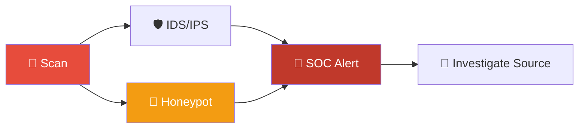
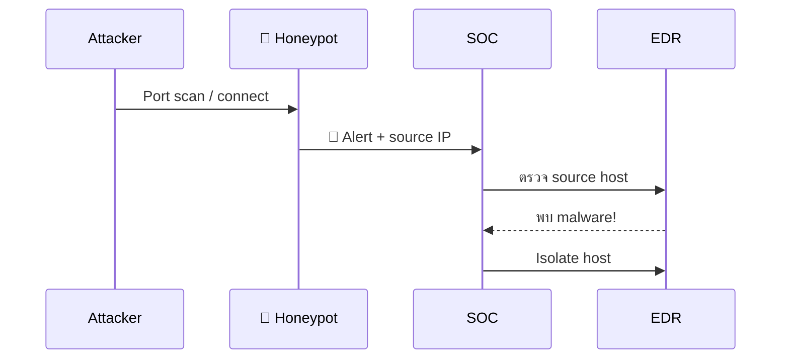
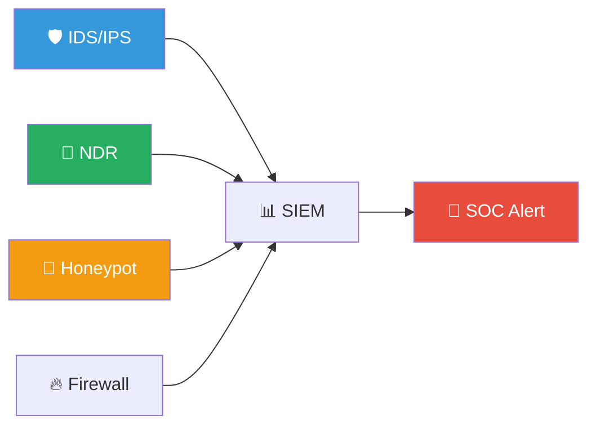
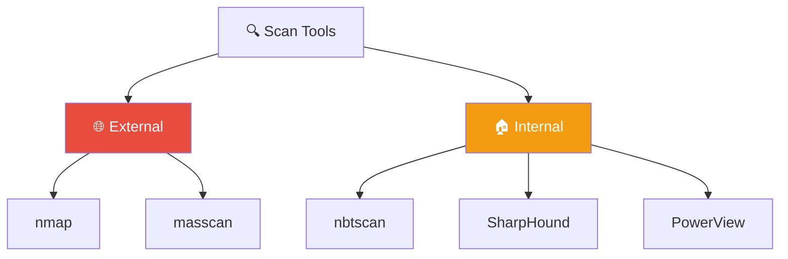

# Playbook: Network Discovery / การสแกนเครือข่าย

**ID**: PB-19
**ระดับความรุนแรง**: ปานกลาง/สูง | **หมวดหมู่**: การลาดตระเวน
**MITRE ATT&CK**: [T1046](https://attack.mitre.org/techniques/T1046/) (Network Service Discovery), [T1018](https://attack.mitre.org/techniques/T1018/) (Remote System Discovery)
**ทริกเกอร์**: IDS alert (port scan), SIEM (Nmap/Masscan signature), Honeypot trigger, firewall deny spike

### ผังขั้นตอนตรวจจับ



### ผัง Honeypot Trigger



---

## ผังการตัดสินใจ

```mermaid
graph TD
    Alert["🚨 Network Scan Detected"] --> Source{"📍 แหล่งที่มา?"}
    Source -->|External IP| Ext["🌐 Internet Scan"]
    Source -->|Internal IP| Int["🏢 Internal Scan"]
    Ext --> Block["🔒 Block IP + Monitor"]
    Int --> Auth{"✅ ได้รับอนุมัติ?"}
    Auth -->|ใช่ (Pen Test, VM)| FP["✅ False Positive"]
    Auth -->|ไม่| Investigate["🔎 ตรวจ Host ต้นทาง"]
    Investigate --> Compromise{"🦠 Host ถูกบุกรุก?"}
    Compromise -->|ใช่| IR["🔴 Full IR"]
    Compromise -->|ไม่ (Shadow IT/Tool)| Policy["🟠 Policy Violation"]
```

---

## 1. การวิเคราะห์

### 1.1 ประเภทการสแกน

| ประเภท | ลักษณะ | เครื่องมือที่ใช้ | ความรุนแรง |
|:---|:---|:---|:---|
| **Port Scan** (TCP SYN/Connect) | สแกน port ทั่วไป | Nmap, Masscan | 🟡 ปานกลาง |
| **Service Enumeration** | Banner grab, version detection | Nmap -sV | 🟠 สูง |
| **Vulnerability Scan** | Exploit attempt after discovery | Nessus, OpenVAS | 🟠 สูง |
| **ARP Scan / Host Discovery** | สแกนเครือข่าย local | arp-scan, ping sweep | 🟡 ปานกลาง |
| **AD Enumeration** | BloodHound, SharpHound, ldapsearch | BloodHound | 🔴 สูง |
| **SMB/RPC Enumeration** | Share/user enumeration | enum4linux, CrackMapExec | 🔴 สูง |

### 1.2 รายการตรวจสอบ

| รายการ | วิธีตรวจสอบ | เสร็จ |
|:---|:---|:---:|
| Source IP / hostname | IDS / SIEM | ☐ |
| Scan type (port/service/vuln/AD) | IDS signature | ☐ |
| Scan scope (กี่ hosts/ports?) | Firewall / flow data | ☐ |
| Source = internal หรือ external? | Network analysis | ☐ |
| มี Change Request / Pen Test scheduled? | ITSM / SOC calendar | ☐ |
| Process ที่ทำ scan (ถ้า internal) | EDR on source host | ☐ |
| มี follow-up exploit attempts? | IDS / SIEM | ☐ |
| Honeypot ถูก trigger? | Honeypot logs | ☐ |

---

## 2. การควบคุม

### 2.1 External Scan

| # | การดำเนินการ | เสร็จ |
|:---:|:---|:---:|
| 1 | **Block** source IP ที่ firewall | ☐ |
| 2 | **ตรวจ** ว่ามี exploit attempts ตามมา | ☐ |
| 3 | **เพิ่ม** IPS rules ถ้าพบ pattern | ☐ |

### 2.2 Internal Scan (ไม่ได้รับอนุมัติ)

| # | การดำเนินการ | เสร็จ |
|:---:|:---|:---:|
| 1 | **Isolate** source host | ☐ |
| 2 | **ตรวจ** host สำหรับ malware/compromise | ☐ |
| 3 | **ตรวจ** user account (authorized or compromised?) | ☐ |
| 4 | หาก **BloodHound/SharpHound** → ยกระดับทันที | ☐ |

---

## 3. การกำจัด

| # | การดำเนินการ | เสร็จ |
|:---:|:---|:---:|
| 1 | ลบ scanning tools จาก host | ☐ |
| 2 | ลบ malware ที่ใช้ scan (ถ้าเป็น automated) | ☐ |
| 3 | หมุนเวียน credentials (ถ้าถูกบุกรุก) | ☐ |
| 4 | ลบ BloodHound data (cached AD structure) | ☐ |

---

## 4. การฟื้นฟู

| # | การดำเนินการ | เสร็จ |
|:---:|:---|:---:|
| 1 | Deploy **honeypots** สำหรับ early detection | ☐ |
| 2 | เปิด **network segmentation** (microsegmentation) | ☐ |
| 3 | ปิด **unnecessary ports/services** | ☐ |
| 4 | เปิด **IDS/IPS** ใน internal segments | ☐ |
| 5 | ตรวจสอบ **firewall rules** ทุกไตรมาส | ☐ |

---

## 5. เกณฑ์การยกระดับ

| เงื่อนไข | ยกระดับไปยัง |
|:---|:---|
| AD enumeration (BloodHound) | CISO + Major Incident |
| Internal scan + host compromised | Full IR process |
| Follow-up exploitation | [PB-18 Exploit](Exploit.th.md) |
| Large-scale external scan (>1000 ports) | SOC Lead |

---

### ผัง Network Visibility Stack



### ผัง Scan Tool Classification



## เอกสารที่เกี่ยวข้อง

- [กรอบการตอบสนองต่อเหตุการณ์](../Framework.th.md)
- [PB-18 Exploit](Exploit.th.md)
- [PB-09 Lateral Movement](Lateral_Movement.th.md)

## อ้างอิง

- [MITRE ATT&CK T1046 — Network Service Discovery](https://attack.mitre.org/techniques/T1046/)
