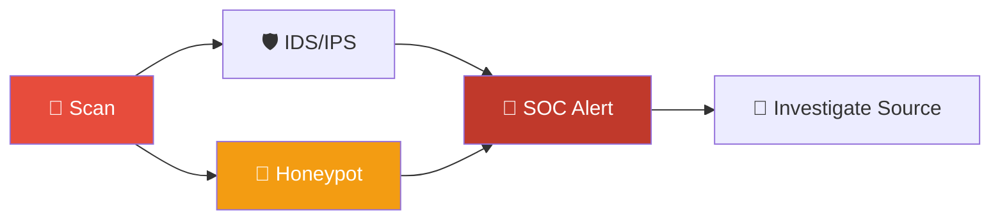
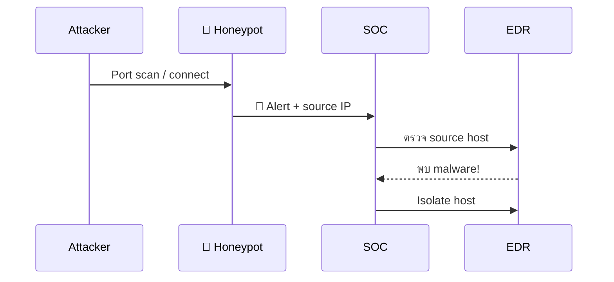
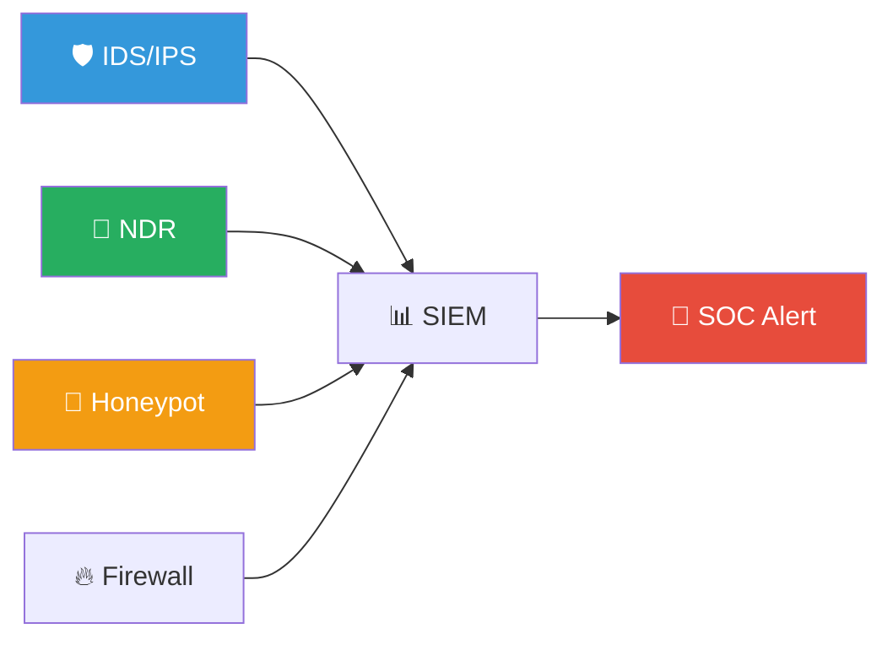
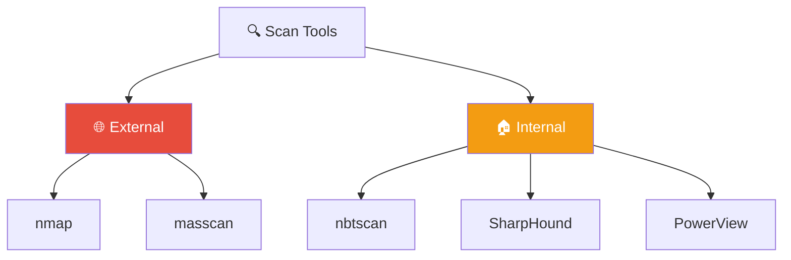

# Playbook: Network Discovery / การสแกนเครือข่าย

**ID**: PB-34
**ระดับความรุนแรง**: ปานกลาง/สูง | **หมวดหมู่**: การลาดตระเวน
**MITRE ATT&CK**: [T1046](https://attack.mitre.org/techniques/T1046/) (Network Service Discovery), [T1018](https://attack.mitre.org/techniques/T1018/) (Remote System Discovery)
**ทริกเกอร์**: IDS alert (port scan), SIEM (Nmap/Masscan signature), Honeypot trigger, firewall deny spike

## หลังเหตุการณ์ (Post-Incident)

- [ ] อัพเดท IDS/IPS signatures สำหรับ discovery techniques
- [ ] ติดตั้ง honeypots ใน high-value network segments
- [ ] ทบทวน application control policies (scanning tools)
- [ ] สร้าง Sigma rule สำหรับ discovery patterns ใหม่
- [ ] ทำ tabletop exercise: discovery → lateral movement
- [ ] จัดทำ [Incident Report](../../11_Reporting_Templates/incident_report.th.md)

### ผังขั้นตอนตรวจจับ

```mermaid
graph LR
    Scanner["📡 Scan"] --> IDS["🛡️ IDS/IPS"]
    IDS --> Alert["🚨 SOC Alert"]
    Scanner --> Honeypot["🍯 Honeypot"]
    Honeypot --> Alert
    Alert --> Investigate["🔎 Investigate Source"]
    style Scanner fill:#e74c3c,color:#fff
    style Honeypot fill:#f39c12,color:#fff
    style Alert fill:#c0392b,color:#fff
```

### ผัง Honeypot Trigger

```mermaid
sequenceDiagram
    participant Attacker
    participant Honeypot as 🍯 Honeypot
    participant SOC
    participant EDR
    Attacker->>Honeypot: Port scan / connect
    Honeypot->>SOC: 🚨 Alert + source IP
    SOC->>EDR: ตรวจ source host
    EDR-->>SOC: พบ malware!
    SOC->>EDR: Isolate host
```

---

## ผังการตัดสินใจ

```mermaid
graph TD
    Alert["🚨 Network Scan Detected"] --> Source{"📍 แหล่งที่มา?"}
    Source -->|External IP| Ext["🌐 Internet Scan"]
    Source -->|Internal IP| Int["🏢 Internal Scan"]
    Ext --> Block["🔒 Block IP + Monitor"]
    Int --> Auth{"✅ ได้รับอนุมัติ?"}
    Auth -->|ใช่ (Pen Test, VM)| FP["✅ False Positive"]
    Auth -->|ไม่| Investigate["🔎 ตรวจ Host ต้นทาง"]
    Investigate --> Compromise{"🦠 Host ถูกบุกรุก?"}
    Compromise -->|ใช่| IR["🔴 Full IR"]
    Compromise -->|ไม่ (Shadow IT/Tool)| Policy["🟠 Policy Violation"]
```

---

## 1. การวิเคราะห์

### 1.1 ประเภทการสแกน

| ประเภท | ลักษณะ | เครื่องมือที่ใช้ | ความรุนแรง |
|:---|:---|:---|:---|
| **Port Scan** (TCP SYN/Connect) | สแกน port ทั่วไป | Nmap, Masscan | 🟡 ปานกลาง |
| **Service Enumeration** | Banner grab, version detection | Nmap -sV | 🟠 สูง |
| **Vulnerability Scan** | Exploit attempt after discovery | Nessus, OpenVAS | 🟠 สูง |
| **ARP Scan / Host Discovery** | สแกนเครือข่าย local | arp-scan, ping sweep | 🟡 ปานกลาง |
| **AD Enumeration** | BloodHound, SharpHound, ldapsearch | BloodHound | 🔴 สูง |
| **SMB/RPC Enumeration** | Share/user enumeration | enum4linux, CrackMapExec | 🔴 สูง |

### 1.2 รายการตรวจสอบ

| รายการ | วิธีตรวจสอบ | เสร็จ |
|:---|:---|:---:|
| Source IP / hostname | IDS / SIEM | ☐ |
| Scan type (port/service/vuln/AD) | IDS signature | ☐ |
| Scan scope (กี่ hosts/ports?) | Firewall / flow data | ☐ |
| Source = internal หรือ external? | Network analysis | ☐ |
| มี Change Request / Pen Test scheduled? | ITSM / SOC calendar | ☐ |
| Process ที่ทำ scan (ถ้า internal) | EDR on source host | ☐ |
| มี follow-up exploit attempts? | IDS / SIEM | ☐ |
| Honeypot ถูก trigger? | Honeypot logs | ☐ |

---

## 2. การควบคุม

### 2.1 External Scan

| # | การดำเนินการ | เสร็จ |
|:---:|:---|:---:|
| 1 | **Block** source IP ที่ firewall | ☐ |
| 2 | **ตรวจ** ว่ามี exploit attempts ตามมา | ☐ |
| 3 | **เพิ่ม** IPS rules ถ้าพบ pattern | ☐ |

### 2.2 Internal Scan (ไม่ได้รับอนุมัติ)

| # | การดำเนินการ | เสร็จ |
|:---:|:---|:---:|
| 1 | **Isolate** source host | ☐ |
| 2 | **ตรวจ** host สำหรับ malware/compromise | ☐ |
| 3 | **ตรวจ** user account (authorized or compromised?) | ☐ |
| 4 | หาก **BloodHound/SharpHound** → ยกระดับทันที | ☐ |

---

## 3. การกำจัด

| # | การดำเนินการ | เสร็จ |
|:---:|:---|:---:|
| 1 | ลบ scanning tools จาก host | ☐ |
| 2 | ลบ malware ที่ใช้ scan (ถ้าเป็น automated) | ☐ |
| 3 | หมุนเวียน credentials (ถ้าถูกบุกรุก) | ☐ |
| 4 | ลบ BloodHound data (cached AD structure) | ☐ |

---

## 4. การฟื้นฟู

| # | การดำเนินการ | เสร็จ |
|:---:|:---|:---:|
| 1 | Deploy **honeypots** สำหรับ early detection | ☐ |
| 2 | เปิด **network segmentation** (microsegmentation) | ☐ |
| 3 | ปิด **unnecessary ports/services** | ☐ |
| 4 | เปิด **IDS/IPS** ใน internal segments | ☐ |
| 5 | ตรวจสอบ **firewall rules** ทุกไตรมาส | ☐ |

---

## 5. Evidence Checklist

| ประเภทหลักฐาน | สิ่งที่ต้องเก็บ | แหล่งข้อมูล | เหตุผลที่ต้องเก็บ |
|:---|:---|:---|:---|
| หลักฐาน discovery | command, tool name, target range, protocol, timing | EDR / SIEM / NDR | ใช้ดูเจตนาและขอบเขตของการสแกน |
| หลักฐานต้นทาง | hostname, user, privilege level, parent process, malware linkage | EDR / IAM / SIEM | ใช้แยกงาน admin ออกจาก attacker recon |
| หลักฐานเครือข่าย | sequential scan, ARP/SMB/LDAP/DNS pattern, admin share access | NDR / firewall / Zeek / AD logs | ใช้ยืนยันชนิดของ discovery |
| หลักฐานด้านขอบเขต | critical system ที่ถูก target, BloodHound collection, output file | SIEM / forensic image | ใช้ดูเป้าหมายในขั้นถัดไป |
| หลักฐานบริบท | change window, authorized scanner, helpdesk/admin task | Ticketing / scanner inventory | ใช้ปิด false positive อย่างอธิบายได้ |

---

## 6. Minimum Telemetry Required

| แหล่ง Telemetry | ใช้เพื่ออะไร | ความสำคัญ | Blind Spot ถ้าไม่มี |
|:---|:---|:---:|:---|
| Endpoint และ process telemetry | ดู tool execution, command, output file | Required | มองไม่เห็นเครื่องมือ discovery บนเครื่องต้นทาง |
| NDR, IDS/IPS, และ firewall telemetry | ดู port sweep, host sweep, SMB/LDAP/DNS pattern | Required | มองไม่เห็น scanning pattern ระดับเครือข่าย |
| AD และ identity logs | ดู LDAP query, share access, privileged context | Required | พลาด directory-focused discovery |
| Scanner inventory และ change records | ใช้เทียบกิจกรรม admin/scanner ที่ได้รับอนุมัติ | Recommended | analyst อาจ over-escalate งานสแกนที่ถูกต้อง |
| Honeypot หรือ deception telemetry | early signal ของ malicious probing | Recommended | early recon signal อ่อนลง |

---

## 7. False Positive และ Tuning Guide

| Scenario | ทำไมจึงดูน่าสงสัย | วิธีตรวจสอบ | Tuning Action | ต้องยกระดับเมื่อ |
|:---|:---|:---|:---|:---|
| vulnerability scan ที่ได้รับอนุมัติ | port sweep และ enumeration ดูเหมือน attacker recon | ยืนยัน scanner IP, schedule, และ scope | allowlist source และ range ที่อนุมัติเท่านั้น | scan ไปโดนเป้าหมายนอก scope หรือใช้ payload แนว exploit |
| IT admin troubleshooting | `net view`, LDAP lookup, หรือ share check ดูน่าสงสัยได้ | ยืนยัน admin identity, ticket, และ target system | ลด severity สำหรับคำสั่ง admin ที่อยู่ใน scope จำกัด | activity ขยายเป็น broad subnet sweep หรือเกิดนอกเวลา |
| asset inventory tooling | host enumeration ตามรอบอาจ noisy | ยืนยัน inventory tool, service account, และ cadence | tune ตาม process และ management subnet ที่รู้จัก | host เดียวกันรัน attacker tooling หรือมี lateral movement ต่อ |
| red-team หรือ tabletop discovery | recon โดยตั้งใจทำให้ดูเหมือนจริง | ยืนยัน exercise scope และวันที่ | suppress เฉพาะ host ของ exercise ที่อนุมัติ | discovery เกิดต่อหลัง exercise window |

---

## 8. เกณฑ์การยกระดับ

| เงื่อนไข | ยกระดับไปยัง |
|:---|:---|
| AD enumeration (BloodHound) | CISO + Major Incident |
| Internal scan + host compromised | Full IR process |
| Follow-up exploitation | [PB-18 Exploit](Exploit.th.md) |
| Large-scale external scan (>1000 ports) | SOC Lead |

---

### ผัง Network Visibility Stack

```mermaid
graph LR
    IDS["🛡️ IDS/IPS"] --> SIEM["📊 SIEM"]
    NDR["📡 NDR"] --> SIEM
    Honeypot["🍯 Honeypot"] --> SIEM
    FW["🔥 Firewall"] --> SIEM
    SIEM --> SOC["🎯 SOC Alert"]
    style IDS fill:#3498db,color:#fff
    style NDR fill:#27ae60,color:#fff
    style Honeypot fill:#f39c12,color:#fff
    style SOC fill:#e74c3c,color:#fff
```

### ผัง Scan Tool Classification

```mermaid
graph TD
    Tools["🔍 Scan Tools"] --> External["🌐 External"]
    Tools --> Internal["🏠 Internal"]
    External --> Nmap["nmap"]
    External --> Masscan["masscan"]
    Internal --> NBTScan["nbtscan"]
    Internal --> BloodHound["SharpHound"]
    Internal --> PowerView["PowerView"]
    style External fill:#e74c3c,color:#fff
    style Internal fill:#f39c12,color:#fff
```

## กฎตรวจจับ (Sigma)

| กฎ | ไฟล์ |
|:---|:---|
| Network Discovery Activity | [sigma/win_network_discovery.yml](../../08_Detection_Engineering/sigma_rules/win_network_discovery.yml) |
| Access to Admin Shares (C$) | [win_admin_share_access.yml](../../08_Detection_Engineering/sigma_rules/win_admin_share_access.yml) |

## เอกสารที่เกี่ยวข้อง

- [กรอบการตอบสนองต่อเหตุการณ์](../Framework.th.md)
- [PB-18 Exploit](Exploit.th.md)
- [PB-09 Lateral Movement](Lateral_Movement.th.md)

## Network Discovery TTPs

| Technique | Tool | Detection |
|:---|:---|:---|
| Port scanning | nmap, masscan | IDS + flow analysis |
| ARP scanning | arp-scan | ARP anomaly |
| Service enumeration | nmap -sV | Unusual connections |
| SNMP sweep | snmpwalk | SNMP traps |
| DNS zone transfer | dig axfr | DNS query logs |

### Normal vs Suspicious Scanning

| Attribute | Normal (IT Admin) | Suspicious (Threat) |
|:---|:---|:---|
| Source | Known mgmt subnet | User workstation |
| Time | Business hours | After hours |
| Scope | Specific subnet | Entire network |
| Tools | Authorized scanner | Unknown binary |

## References

- [MITRE ATT&CK T1046 — Network Service Discovery](https://attack.mitre.org/techniques/T1046/)
