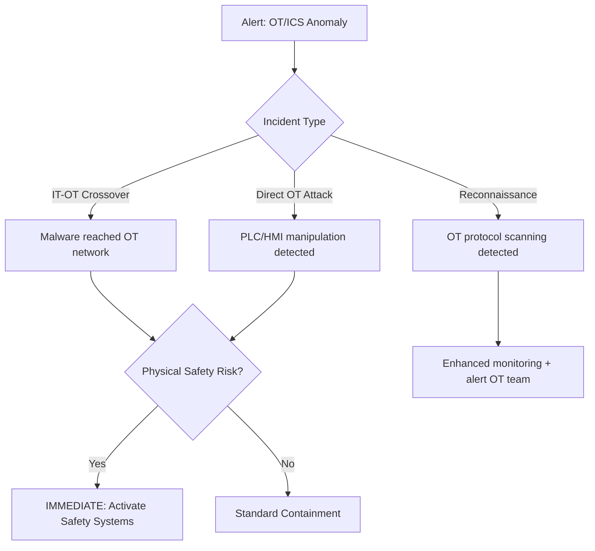

# Playbook: OT/ICS Security Incident (PB-30)

**Severity**: Critical | **Category**: Operational Technology | **MITRE ICS**: T0813, T0831

## 1. Analysis (Triage)

> ⚠️ **CRITICAL**: In OT/ICS incidents, **physical safety takes absolute priority** over investigation. If there is any risk to human life, equipment, or environment — activate safety instrumented systems (SIS) first.

-   **Identify Affected Systems**: PLCs, HMIs, SCADA servers, RTUs, engineering workstations.
-   **IT-OT Boundary**: Determine if the threat crossed from IT to OT or originated in OT.
-   **Safety Assessment**: Is there physical safety risk? Check safety instrumented systems.
-   **OT Protocol Analysis**: Review OT-specific protocols (Modbus, DNP3, OPC UA, EtherNet/IP) for anomalous commands.

## 2. Containment
-   **⚡ Safety First**: If physical process risk, activate emergency shutdown or manual override.
-   **Isolate IT-OT Boundary**: Disable/restrict the IT-OT DMZ firewall connections.
-   **Do NOT Patch OT In-Place**: Avoid rebooting or patching OT systems during active incident — may cause process disruption.
-   **Network Segmentation**: Isolate affected OT zones (Purdue Model Level segregation).
-   **Preserve Evidence**: Capture network traffic (PCAP) on OT network — do NOT install agents on PLCs.

## 3. Remediation
-   **Restore from Known-Good**: Use verified PLC programs and HMI configurations from offline backups.
-   **Validate Logic**: Compare PLC ladder logic / function blocks against golden baseline.
-   **Credential Rotation**: Change default and compromised credentials on OT devices.
-   **Firmware Verification**: Verify firmware integrity on PLCs and RTUs.
-   **IT-Side Cleanup**: Address the IT-side root cause (malware, compromised jump host, etc.).

## 4. Recovery
-   **Staged Restart**: Restore OT processes in phases with OT engineers supervising.
-   **Continuous Monitoring**: Deploy OT-specific monitoring (Claroty, Nozomi, Dragos) if not already in place.
-   **IT-OT Firewall Hardening**: Review and restrict firewall rules between IT and OT networks.

## 5. Lessons Learned
-   **Purdue Model Review**: Ensure proper network segmentation between IT and OT.
-   **OT Asset Inventory**: Maintain complete inventory of all OT devices, firmware versions, and PLC programs.
-   **Joint Tabletop**: Conduct IT+OT joint incident response exercises.
-   **Detection Gaps**: Deploy OT-specific IDS for protocol anomaly detection.

## Important Contacts
| Role | When to Engage |
|:---|:---|
| OT/Plant Engineer | Immediately — all OT incidents |
| Safety Officer | If physical safety risk |
| Vendor Support | PLC/SCADA vendor for firmware/logic validation |
| Regulator | If critical infrastructure (energy, water, transport) |

## References
-   [MITRE ATT&CK for ICS](https://attack.mitre.org/matrices/ics/)
-   [NIST SP 800-82 — Guide to ICS Security](https://csrc.nist.gov/publications/detail/sp/800-82/rev-3/final)
-   [IEC 62443 — Industrial Cybersecurity Standard](https://www.iec.ch/cyber-security)
-   [CISA — ICS-CERT Advisories](https://www.cisa.gov/topics/industrial-control-systems)
