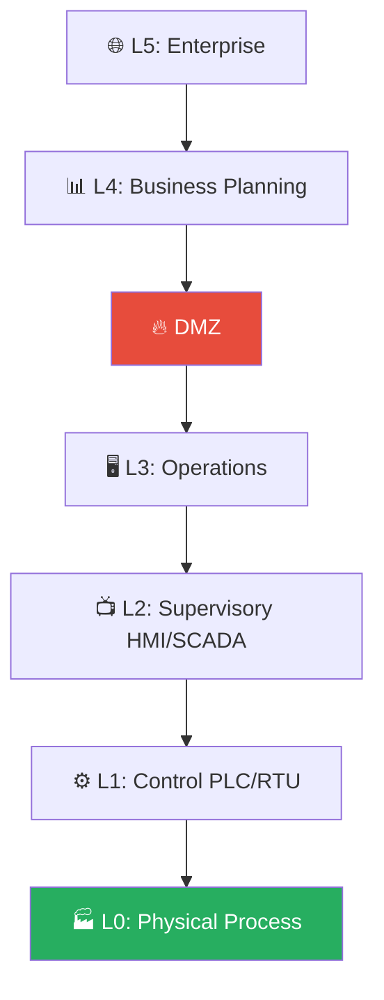
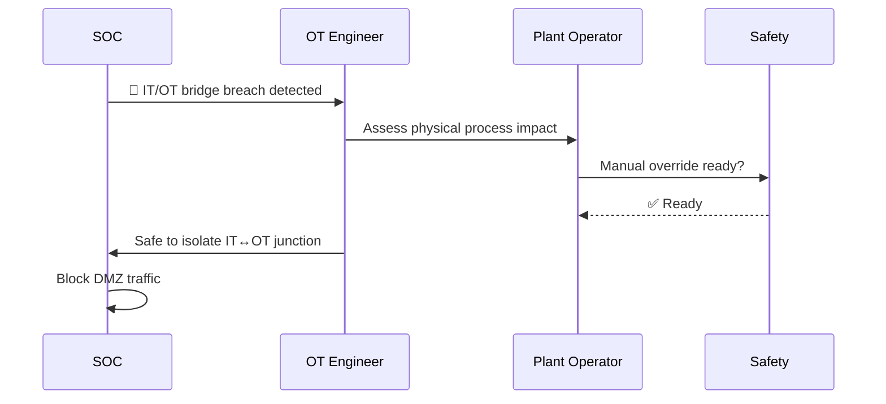
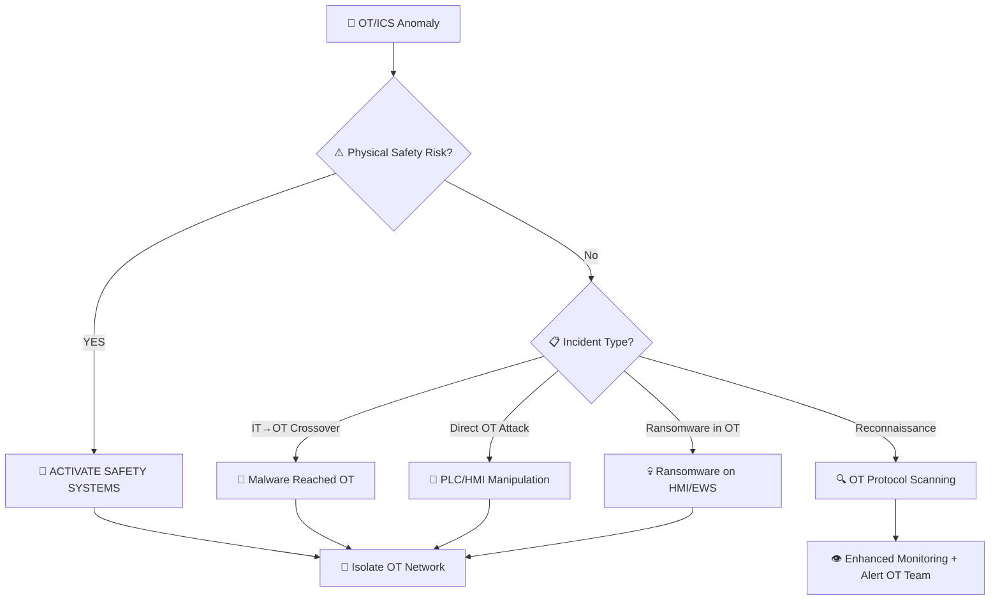
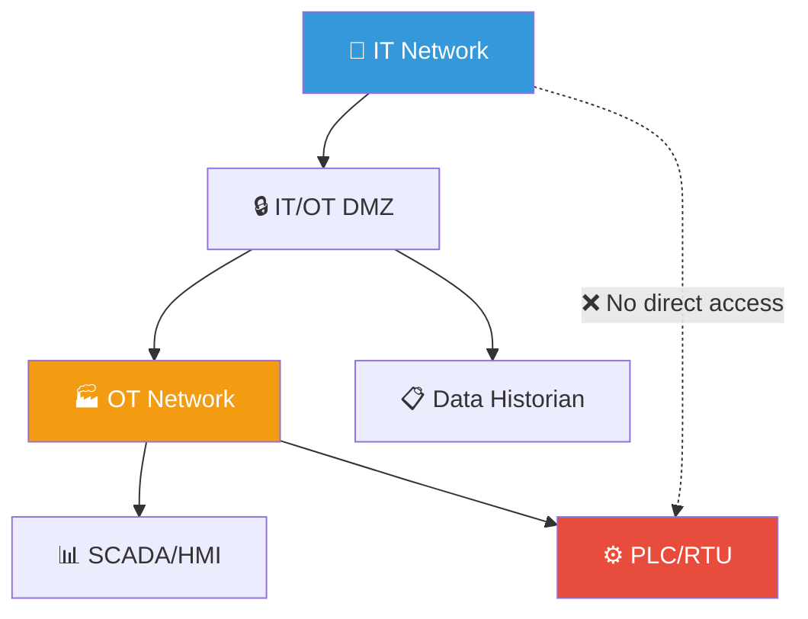
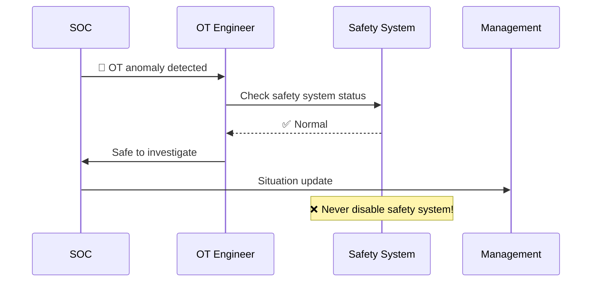

# Playbook: OT/ICS Security Incident

**ID**: PB-33
**Severity**: Critical | **Category**: Operational Technology
**MITRE ATT&CK for ICS**: [T0813](https://attack.mitre.org/techniques/T0813/) (Denial of Control), [T0831](https://attack.mitre.org/techniques/T0831/) (Manipulation of Control)
**Trigger**: OT-IDS alert (Claroty/Nozomi/Dragos), IT-OT boundary firewall alert, HMI anomaly, Safety system activation, Physical process deviation

> 🚨 **ABSOLUTE PRIORITY**: Physical safety of personnel, equipment, and environment takes precedence over ALL investigation activities. If any risk to life — activate Safety Instrumented Systems (SIS) IMMEDIATELY.

### Purdue Model Layers

### Emergency Shutdown Flow

---

## Decision Flow

---

## 1. Analysis

### 1.1 OT Incident Categories

| Category | Examples | Severity |
|:---|:---|:---|
| **IT→OT crossover** | WannaCry/NotPetya reaching HMIs | 🔴 Critical |
| **Direct OT attack** | Stuxnet, TRITON, Industroyer | 🔴 Critical |
| **OT ransomware** | Ransomware on HMI/engineering workstation | 🔴 Critical |
| **OT reconnaissance** | Modbus/OPC scanning from IT network | 🟠 High |
| **Unauthorized access** | Unauthorized remote access to PLC | 🔴 Critical |
| **Configuration change** | Unauthorized PLC logic modification | 🔴 Critical |
| **Safety system attack** | TRITON-style SIS compromise | 🔴 CRITICAL |

### 1.2 Purdue Model Level Assessment

| Level | Systems | Compromised? | Safety Impact |
|:---|:---|:---|:---|
| **Level 5** | Enterprise network | ☐ | Indirect |
| **Level 4** | IT/OT DMZ | ☐ | Gateway |
| **Level 3** | SCADA, Historians | ☐ | Process visibility |
| **Level 2** | HMI, Engineering WS | ☐ | Process control |
| **Level 1** | PLC, RTU, DCS | ☐ | 🔴 Direct process |
| **Level 0** | Physical process, sensors | ☐ | 🔴 Safety critical |
| **SIS** | Safety Instrumented Systems | ☐ | 🔴 Life safety |

### 1.3 Investigation Checklist

| Check | How | Done |
|:---|:---|:---:|
| Affected systems (PLC, HMI, SCADA, EWS) | OT asset inventory | ☐ |
| Did threat cross IT-OT boundary? | Firewall/IDS logs | ☐ |
| OT protocol anomalies (Modbus, DNP3, OPC UA, EtherNet/IP) | OT-IDS (Claroty/Nozomi/Dragos) | ☐ |
| PLC logic changes? Compare to golden baseline | PLC programming software | ☐ |
| Safety system status | SIS diagnostic | ☐ |
| Physical process deviations | Historian, SCADA | ☐ |
| Engineering workstation status | Local inspection | ☐ |
| Remote access sessions (jump host, VPN) | Access logs | ☐ |

---

## 2. Containment

### 2.1 Safety Response (IF physical risk)

| # | Action | Owner | Done |
|:---:|:---|:---|:---:|
| 1 | **Activate SIS / Emergency Shutdown** | OT Engineer / Safety | ☐ |
| 2 | **Switch to manual control** if automated control compromised | OT Engineer | ☐ |
| 3 | **Evacuate** if environmental/chemical/physical hazard | Safety Officer | ☐ |

### 2.2 Network Containment

| # | Action | Done |
|:---:|:---|:---:|
| 1 | **Isolate IT-OT boundary** — disable/restrict DMZ firewall rules | ☐ |
| 2 | **Segment OT zones** — isolate affected Purdue levels | ☐ |
| 3 | **Disable remote access** — VPN, jump hosts, TeamViewer | ☐ |
| 4 | **DO NOT reboot/patch OT devices** during active incident | ☐ |
| 5 | **Capture PCAP** on OT network — DO NOT install agents on PLCs | ☐ |

### 2.3 Critical Rules

| ❌ DO NOT | ✅ DO |
|:---|:---|
| Reboot PLCs/RTUs during incident | Capture network traffic passively |
| Install agents/AV on OT devices | Use out-of-band communication |
| Patch OT systems without OT engineer | Photograph HMI screens |
| Apply IT playbook directly to OT | Engage OT vendor support |

---

## 3. Eradication

| # | Action | Owner | Done |
|:---:|:---|:---|:---:|
| 1 | Restore PLC programs from **offline golden baseline** | OT Engineer | ☐ |
| 2 | Validate PLC ladder logic / function blocks | OT Engineer | ☐ |
| 3 | Verify firmware integrity on PLCs and RTUs | OT Engineer + Vendor | ☐ |
| 4 | Rotate ALL OT credentials (including defaults!) | OT + Security | ☐ |
| 5 | Clean/rebuild engineering workstations and HMIs | OT + IT | ☐ |
| 6 | Address IT-side root cause (malware, compromised jump host) | SOC | ☐ |

---

## 4. Recovery

| # | Action | Done |
|:---:|:---|:---:|
| 1 | **Staged restart** with OT engineers supervising | ☐ |
| 2 | Validate all safety systems operational | ☐ |
| 3 | Compare process values to baseline | ☐ |
| 4 | Harden IT-OT firewall rules (allowlist only) | ☐ |
| 5 | Deploy OT-IDS if not present (Claroty, Nozomi, Dragos) | ☐ |
| 6 | Implement PLC change detection and monitoring | ☐ |
| 7 | Disable unnecessary remote access | ☐ |
| 8 | Monitor OT network for 30 days | ☐ |

---

## 5. Important Contacts

| Role | When to Engage | Contact |
|:---|:---|:---|
| **OT/Plant Engineer** | Immediately — ALL OT incidents | _______ |
| **Safety Officer** | Any physical safety risk | _______ |
| **PLC/SCADA Vendor** | Firmware validation, logic restoration | _______ |
| **Regulator** | Critical infrastructure (energy, water, transport) | _______ |
| **ICS-CERT** | Nation-state or sophisticated attack | _______ |

---

## 6. IoC Collection

| Type | Value | Source |
|:---|:---|:---|
| Compromised OT asset (PLC/HMI/SCADA) | | OT inventory |
| Malicious OT protocol commands | | OT-IDS / PCAP |
| IT-OT boundary breach details | | Firewall / IDS |
| Modified PLC logic (diff) | | PLC comparison |
| Remote access sessions | | Jump host logs |
| Malware samples (IT-side) | | EDR |

---

## 7. Escalation Criteria

| Condition | Escalate To |
|:---|:---|
| Physical safety risk | Safety Officer + Plant Manager immediately |
| PLC logic modified | OT Vendor + CISO |
| Safety system (SIS) targeted | CISO + Regulator + National CERT |
| Critical infrastructure affected | Government regulator |
| Multiple facilities affected | Executive team + National CERT |
| Nation-state indicators | Law enforcement + ICS-CERT |

---

### OT/IT Convergence Risks

### Safety System Decision

## Related Documents

- [IR Framework](../Framework.en.md)
- [Incident Report](../../templates/incident_report.en.md)
- [PB-03 Malware Infection](Malware_Infection.en.md)
- [PB-02 Ransomware](Ransomware.en.md)

## References

- [MITRE ATT&CK for ICS](https://attack.mitre.org/matrices/ics/)
- [NIST SP 800-82r3 — Guide to OT Security](https://csrc.nist.gov/publications/detail/sp/800-82/rev-3/final)
- [IEC 62443 — Industrial Cybersecurity](https://www.iec.ch/cyber-security)
- [CISA — ICS-CERT Advisories](https://www.cisa.gov/topics/industrial-control-systems)
