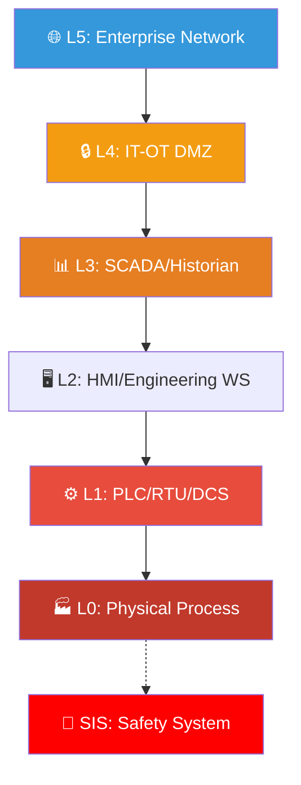
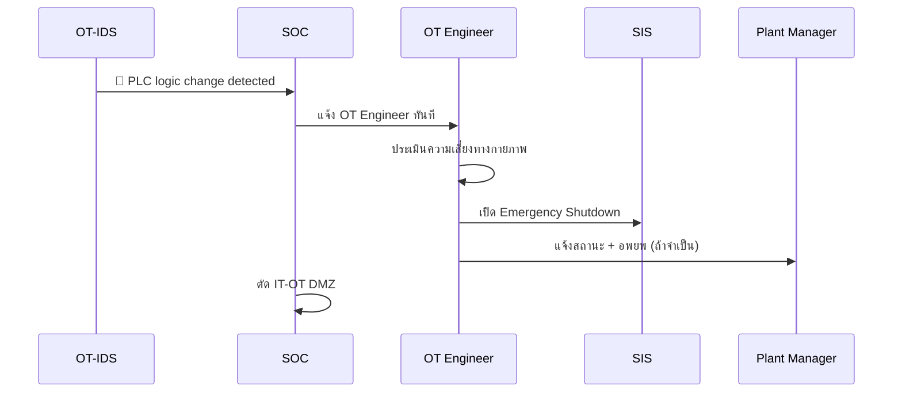
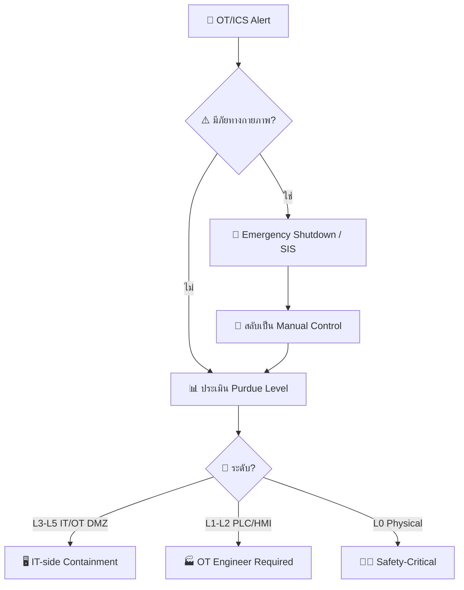
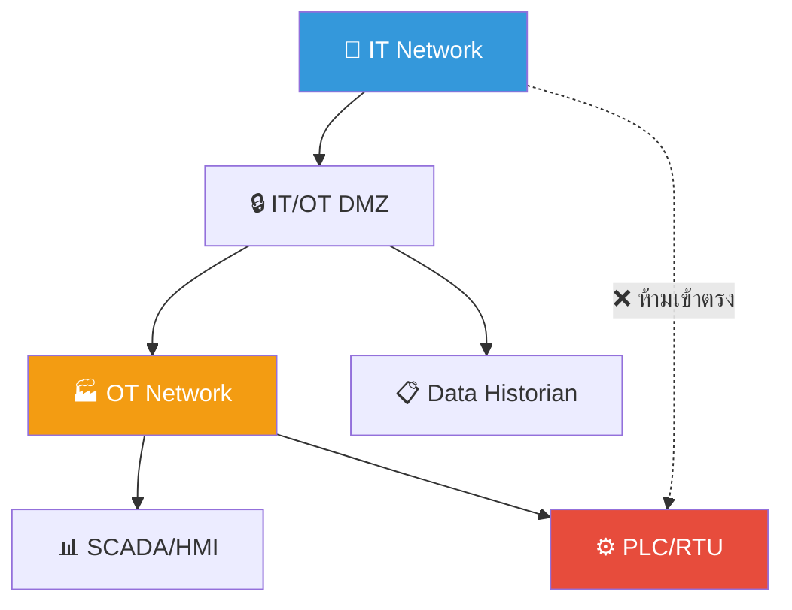
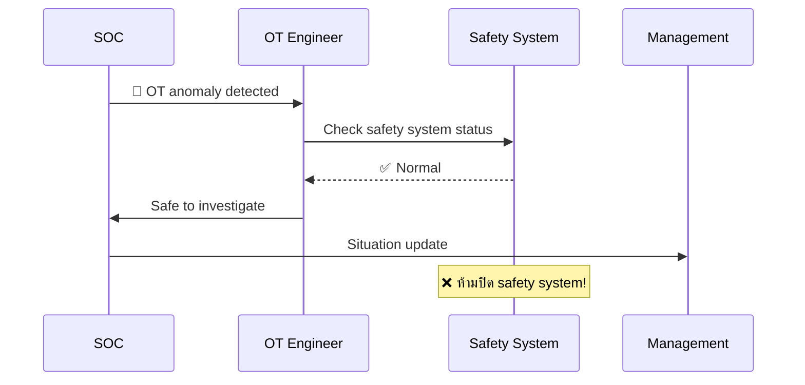

# Playbook: OT/ICS Security Incident

**ID**: PB-33
**ระดับความรุนแรง**: วิกฤต | **หมวดหมู่**: ความปลอดภัย OT/ICS
**MITRE ICS**: [T0813](https://attack.mitre.org/techniques/T0813/) (Denial of Control), [T0831](https://attack.mitre.org/techniques/T0831/) (Manipulation of Control)
**ทริกเกอร์**: OT-IDS alert (Claroty/Nozomi/Dragos), IT-OT firewall alert, HMI anomaly, Safety system activation

> 🚨 **ลำดับสำคัญสูงสุด**: ความปลอดภัยทางกายภาพของบุคลากร อุปกรณ์ และสิ่งแวดล้อม มาก่อนทุกอย่าง

### ผัง Purdue Model

### ผังขั้นตอน Emergency Shutdown

---

## ผังการตัดสินใจ

---

## 1. การวิเคราะห์

### 1.1 ระดับ Purdue Model

| ระดับ | ระบบ | ถูกบุกรุก? | ผู้รับผิดชอบ |
|:---|:---|:---|:---|
| **L5** | Enterprise Network, ERP | ☐ | SOC/IT |
| **L4** | IT-OT DMZ, Data Historian | ☐ | SOC/IT + OT |
| **L3** | SCADA Server, Historian | ☐ | OT Engineer |
| **L2** | HMI, Engineering WS | ☐ | OT Engineer |
| **L1** | PLC, RTU, DCS Controller | ☐ | OT Engineer + Vendor |
| **L0** | Physical Process (valve, motor) | ☐ | Plant Engineer |
| **SIS** | Safety Instrumented System | ☐ | Safety Engineer |

### 1.2 ประเภทเหตุการณ์ OT

| ประเภท | ตัวอย่าง | ความรุนแรง |
|:---|:---|:---|
| **IT → OT lateral movement** | Ransomware ข้าม DMZ | 🔴 วิกฤต |
| **PLC logic change** | Unauthorized logic upload | 🔴 วิกฤต |
| **HMI manipulation** | เปลี่ยนค่า setpoint | 🔴 วิกฤต |
| **SIS tampering** (TRITON-style) | Safety system ถูกปิด | 🔴🔴 Life-threatening |
| **OT malware** | INDUSTROYER, PIPEDREAM | 🔴 วิกฤต |
| **Rogue device** | อุปกรณ์แปลกบน OT network | 🟠 สูง |
| **Remote access abuse** | VPN/jump host ถูกบุกรุก | 🔴 สูง |

### 1.3 รายการตรวจสอบ

| รายการ | วิธีตรวจสอบ | เสร็จ |
|:---|:---|:---:|
| ภัยคุกคามข้าม IT → OT? | Firewall logs | ☐ |
| PLC logic ถูกเปลี่ยน? | OT-IDS / PLC comparison | ☐ |
| Safety System (SIS) ปกติ? | SIS panel / OT engineer | ☐ |
| HMI แสดงค่าผิดปกติ? | HMI / operator | ☐ |
| OT protocol anomalies? (Modbus/OPC/EtherNet/IP) | OT-IDS | ☐ |
| Remote access — มีการเชื่อมต่อใหม่? | VPN / jump host logs | ☐ |
| อุปกรณ์แปลกบน OT network? | OT-IDS asset inventory | ☐ |

---

## 2. การควบคุม

### ⚡ Safety First (หากมีความเสี่ยงทางกายภาพ)

| # | การดำเนินการ | เสร็จ |
|:---:|:---|:---:|
| 1 | **เปิด SIS / Emergency Shutdown** ตาม procedure | ☐ |
| 2 | **สลับเป็น manual control** | ☐ |
| 3 | **อพยพบุคลากร** (ถ้าจำเป็น) | ☐ |

### 🔒 Network Containment

| # | การดำเนินการ | เสร็จ |
|:---:|:---|:---:|
| 1 | **ตัด IT-OT DMZ** (แยก IT / OT networks) | ☐ |
| 2 | **ปิด remote access** ทั้งหมด (VPN, jump host, TeamViewer) | ☐ |
| 3 | **จับ PCAP** บน OT network (**ห้ามติดตั้ง agent บน PLC!**) | ☐ |

> ⛔ **ห้ามทำ**: Reboot PLC, Patch OT devices, Install software บน OT, scan OT network

---

## 3. การกำจัด

| # | การดำเนินการ | เสร็จ |
|:---:|:---|:---:|
| 1 | คืนค่า PLC จาก **golden baseline** (verified offline backup) | ☐ |
| 2 | ตรวจสอบ **firmware integrity** (PLC, RTU) | ☐ |
| 3 | หมุนเวียน OT credentials (**รวม default passwords!**) | ☐ |
| 4 | ทำความสะอาด IT-side (malware, jump host, VPN) | ☐ |
| 5 | ลบ rogue devices ออกจาก OT network | ☐ |

---

## 4. การฟื้นฟู

| # | การดำเนินการ | เสร็จ |
|:---:|:---|:---:|
| 1 | **Staged restart** มี OT engineer ดูแลทุกขั้นตอน | ☐ |
| 2 | Deploy **OT-IDS** (Claroty / Nozomi Networks / Dragos) | ☐ |
| 3 | **IEC 62443** compliance review | ☐ |
| 4 | สร้าง **golden baseline** ใหม่สำหรับ PLC ทั้งหมด | ☐ |
| 5 | เปลี่ยน default passwords ทั้งหมด | ☐ |
| 6 | จำกัด remote access — MFA + jump host + time-limited | ☐ |

---

## 5. ผู้ติดต่อสำคัญ

| บทบาท | เมื่อไหร่ |
|:---|:---|
| **OT/Plant Engineer** | ทันที — ทุกกรณี OT |
| **Safety Officer** | หากมีความเสี่ยงทางกายภาพ |
| **PLC/SCADA Vendor** | Firmware/logic validation |
| **Regulator** | หากเป็น critical infrastructure |
| **CISO** | ทุกเหตุการณ์ OT |
| **National CERT** | Nation-state indicators |

---

### ผัง OT/IT Convergence Risks

### ผัง Safety System Decision

## เอกสารที่เกี่ยวข้อง

- [กรอบการตอบสนองต่อเหตุการณ์](../Framework.th.md)
- [PB-02 Ransomware](Ransomware.th.md)
- [PB-03 มัลแวร์](Malware_Infection.th.md)

## อ้างอิง

- [MITRE ATT&CK for ICS](https://attack.mitre.org/matrices/ics/)
- [NIST SP 800-82r3 — Guide to OT Security](https://csrc.nist.gov/publications/detail/sp/800-82/rev-3/final)
- [IEC 62443 — Industrial Automation Security](https://www.isa.org/standards-and-publications/isa-standards/isa-iec-62443-series-of-standards)
