# Playbook: Phishing Response

**ID**: PB-01
**Severity**: High | **Category**: Email Security
**MITRE ATT&CK**: [T1566](https://attack.mitre.org/techniques/T1566/) (Phishing), [T1566.001](https://attack.mitre.org/techniques/T1566/001/) (Spearphishing Attachment), [T1566.002](https://attack.mitre.org/techniques/T1566/002/) (Spearphishing Link)
**Trigger**: User report, Mail filter alert, Phishing simulation, TI feed

### Phishing IR Flow

```mermaid
graph LR
    Report["📧 Report"] --> Analyze["🔍 Analyze"]
    Analyze --> Contain["🔒 Contain"]
    Contain --> Eradicate["🗑️ Eradicate"]
    Eradicate --> Recover["♻️ Recover"]
    Recover --> Lessons["📝 Lessons"]
    style Report fill:#e74c3c,color:#fff
    style Analyze fill:#f39c12,color:#fff
    style Contain fill:#e67e22,color:#fff
    style Eradicate fill:#27ae60,color:#fff
    style Recover fill:#2980b9,color:#fff
    style Lessons fill:#8e44ad,color:#fff
```

### Email Analysis Workflow

---

## Decision Flow

```mermaid
flowchart TD
    Start["📩 User Reports / Gateway Alert"] --> Header{"🔍 Analyze Headers"}
    Header -->|SPF/DKIM Pass + Known Domain| Legit["✅ Legitimate Email"]
    Header -->|SPF/DKIM Fail or Spoofed| Content{"📎 Malicious Content?"}
    Content -->|Attachment| Sandbox["🧪 Detonate in Sandbox"]
    Content -->|Link| URLCheck["🔗 Check URL Reputation"]
    Content -->|None| Social["📋 Social Engineering Only"]
    Sandbox -->|Malicious| Confirm["🚨 Confirmed Phishing"]
    Sandbox -->|Clean| FP["False Positive"]
    URLCheck -->|Malicious/Credential Harvester| Confirm
    URLCheck -->|Clean| FP
    Social -->|Credential Request| Confirm
    Social -->|Generic Spam| FP
    Confirm --> Clicked{"Did User Click/Submit?"}
    Clicked -->|No| ContainEmail["🛡️ Block & Purge Only"]
    Clicked -->|Yes, Clicked Link| ContainPartial["🛡️ Block + Monitor"]
    Clicked -->|Yes, Entered Credentials| ContainFull["🚨 Full Compromise Response"]
```

---

## 1. Analysis (Triage)

### 1.1 Header Analysis

| Check | How | Tool |
|:---|:---|:---|
| SPF result | Check `Received-SPF` header | Email header analyzer |
| DKIM signature | Verify `DKIM-Signature` validity | Email header analyzer |
| DMARC result | Check `Authentication-Results` | Email header analyzer |
| Return-Path | Compare with From address | Manual inspection |
| Received chain | Trace originating server IP | Manual + GeoIP |
| X-Originating-IP | Identify sender IP | Header inspection |

### 1.2 Content Analysis

| Item | Action | Tool |
|:---|:---|:---|
| **Sender domain** | Search reputation | VirusTotal, AbuseIPDB, WHOIS |
| **URLs** | Extract and check reputation | URLhaus, VirusTotal, urlscan.io |
| **Attachments** | Submit to sandbox (**NEVER open locally**) | Hybrid Analysis, Joe Sandbox, ANY.RUN |
| **File hash** | Check against TI feeds | VirusTotal, ThreatFox |
| **Language/tone** | Assess urgency, grammar, brand impersonation | Manual review |
| **Reply-to** | Compare with From — mismatch = suspicious | Manual inspection |

### 1.3 Scope Assessment

- [ ] How many users received this email?
- [ ] How many users clicked the link / opened the attachment?
- [ ] Any credential submissions on the landing page?
- [ ] Is this part of a targeted campaign or mass phishing?

---

## 2. Containment

### 2.1 Immediate Actions (within 15 minutes)

| # | Action | Tool | Done |
|:---:|:---|:---|:---:|
| 1 | Block sender email/domain in Email Gateway | M365 / Google / Proofpoint | ☐ |
| 2 | Purge email from ALL mailboxes | Search & Purge / Compliance Search | ☐ |
| 3 | Block malicious URLs at proxy/firewall | Web proxy, firewall | ☐ |
| 4 | Block file hash in EDR (if attachment) | CrowdStrike / SentinelOne | ☐ |
| 5 | Add IoCs to SIEM watchlist | SIEM TI integration | ☐ |

### 2.2 If User Clicked Link (No Credential Entry)

| # | Action | Done |
|:---:|:---|:---:|
| 1 | Scan endpoint for malware/persistence | ☐ |
| 2 | Check browser history for redirects | ☐ |
| 3 | Monitor endpoint for 24 hours | ☐ |

### 2.3 If User Entered Credentials (Full Compromise)

| # | Action | Done |
|:---:|:---|:---:|
| 1 | Force password reset immediately | ☐ |
| 2 | Revoke all active sessions/tokens | ☐ |
| 3 | Reset MFA and re-enroll | ☐ |
| 4 | Check for mailbox rules (forwarding, redirect) | ☐ |
| 5 | Check for OAuth app consents | ☐ |
| 6 | Review login history for suspicious access | ☐ |
| 7 | Cross-reference with [PB-05 Account Compromise](Account_Compromise.en.md) | ☐ |

---

## 3. IoC Collection

| Type | Value | Source |
|:---|:---|:---|
| Sender Email | | Email header |
| Sender Domain | | Email header |
| Sender IP | | Received chain |
| URL(s) | | Email body |
| Landing Page IP | | DNS lookup |
| Attachment Name | | Email |
| Attachment Hash (SHA256) | | Sandbox |
| Dropped File Hash | | Sandbox |

---

## 4. Escalation Criteria

| Condition | Escalate To |
|:---|:---|
| > 10 users received the same email | SOC Lead |
| Any user entered credentials | Tier 2 + Account Security |
| Attachment confirmed as malware | Tier 2 + IR |
| Executive/VIP targeted (spear-phishing) | SOC Manager + CISO |
| Part of ongoing campaign | Threat Intel team |
| Data breach suspected | Legal + Compliance |

---

## 5. Recovery

- [ ] Unblock user account after password reset and MFA re-enrollment
- [ ] Confirm no unauthorized mailbox rules remain
- [ ] Verify no OAuth/API keys were created by attacker
- [ ] Remove user from "High Risk" monitoring after 48 hours (if clean)

---

## 6. Post-Incident

- [ ] Update email gateway rules if new pattern identified
- [ ] Submit phishing URL/domain to community blocklists
- [ ] Create/update Sigma detection rule if novel technique
- [ ] Send awareness reminder to affected users
- [ ] Document in [Incident Report](../../templates/incident_report.en.md)

---

### Email Security Stack

```mermaid
graph LR
    Email["📧 Inbound Email"] --> SPF["📋 SPF"]
    SPF --> DKIM["🔏 DKIM"]
    DKIM --> DMARC["🛡️ DMARC"]
    DMARC --> ATP["🔍 ATP Sandbox"]
    ATP --> Inbox["📬 Deliver"]
    ATP --> Quarantine["🗑️ Quarantine"]
    style DMARC fill:#27ae60,color:#fff
    style Quarantine fill:#e74c3c,color:#fff
```

### User Report & Response

```mermaid
sequenceDiagram
    participant User
    participant PhishBtn as Report Phishing Button
    participant SOC
    participant Email_Admin as Email Admin
    User->>PhishBtn: 📧 Report suspicious email
    PhishBtn->>SOC: 🚨 Forward to SOC
    SOC->>SOC: Analyze headers + URLs
    SOC->>Email_Admin: Block sender domain
    SOC-->>User: ✅ Thanks! Phishing confirmed
```

## Detection Rules (Sigma)

| Rule | File |
|:---|:---|
| Suspicious Inbox Rule Created | [cloud_email_inbox_rule.yml](../../08_Detection_Engineering/sigma_rules/cloud_email_inbox_rule.yml) |
| Office Spawning PowerShell | [proc_office_spawn_powershell.yml](../../08_Detection_Engineering/sigma_rules/proc_office_spawn_powershell.yml) |

## Related Documents

- [IR Framework](../Framework.en.md)
- [Incident Report](../../templates/incident_report.en.md)
- [PB-05 Account Compromise](Account_Compromise.en.md)
- [PB-17 BEC](BEC.en.md)
- [Alert Tuning SOP](../../06_Operations_Management/Alert_Tuning.en.md)

## References

- [MITRE ATT&CK T1566 — Phishing](https://attack.mitre.org/techniques/T1566/)
- [CISA Phishing Guidance](https://www.cisa.gov/shields-up/phishing-preventing-email-attacks)
- [NIST SP 800-177 — Email Security](https://csrc.nist.gov/publications/detail/sp/800-177/rev-1/final)
