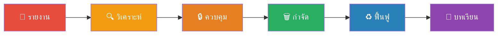
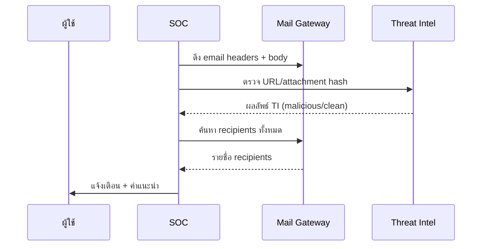
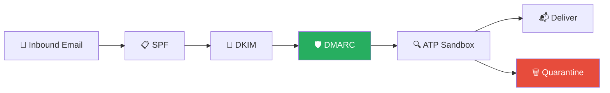
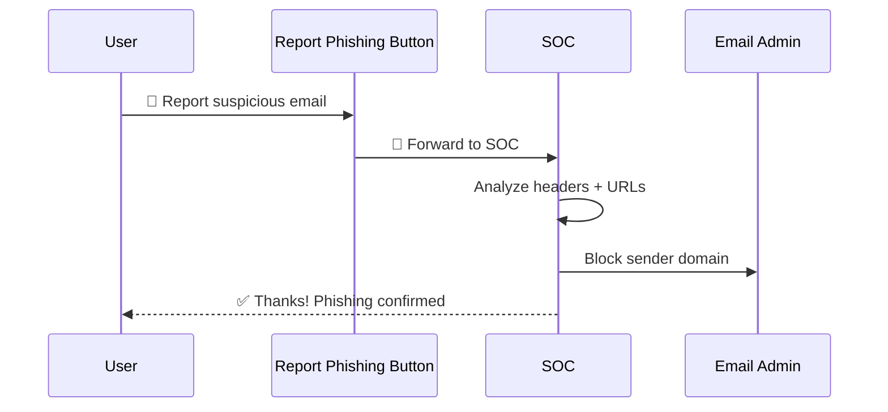

# Playbook: ฟิชชิง (Phishing)

**ID**: PB-01
**ระดับความรุนแรง**: ปานกลาง/สูง | **หมวดหมู่**: ความปลอดภัยอีเมล
**MITRE ATT&CK**: [T1566.001](https://attack.mitre.org/techniques/T1566/001/) (Spearphishing Attachment), [T1566.002](https://attack.mitre.org/techniques/T1566/002/) (Spearphishing Link)
**ทริกเกอร์**: ผู้ใช้รายงาน, Mail gateway block, SIEM correlation, Phishing simulation fail

### ผัง IR สำหรับฟิชชิง



### ผังการวิเคราะห์อีเมล



---

## ผังการตัดสินใจ

```mermaid
graph TD
    Alert["🚨 อีเมล Phishing"] --> Action{"📧 ผู้ใช้ดำเนินการอะไร?"}
    Action -->|รายงาน ไม่คลิก| Report["✅ วิเคราะห์ + บล็อก"]
    Action -->|คลิกลิงก์| Click["🟠 ตรวจสอบเว็บไซต์"]
    Action -->|เปิดไฟล์แนบ| Attach["🔴 EDR / Sandbox"]
    Action -->|กรอก credentials| Creds["🔴 รีเซ็ตทันที"]
    Click --> Harvest{"เป็นหน้า login ปลอม?"}
    Harvest -->|ใช่| Creds
    Harvest -->|ไม่ (redirect/tracking)| Low["🟡 บล็อก URL + ติดตาม"]
    Attach --> Malware{"มัลแวร์?"}
    Malware -->|ใช่| Isolate["🔒 Isolate Host"]
    Creds --> Reset["🔐 รีเซ็ต + เพิกถอน"]
```

---

## 1. การวิเคราะห์

### 1.1 การวิเคราะห์อีเมล

| รายการ | วิธีตรวจสอบ | เสร็จ |
|:---|:---|:---:|
| ผู้ส่ง (From / Return-Path / Envelope) | Email headers | ☐ |
| SPF / DKIM / DMARC ผ่านหรือไม่? | Email headers | ☐ |
| Display name ปลอม (spoofing)? | เปรียบเทียบกับ directory | ☐ |
| ลิงก์ใน email ชี้ไปที่ไหน? | URL analysis | ☐ |
| ไฟล์แนบ — ประเภท, hash | Sandbox / VT | ☐ |
| มีผู้ใช้อื่นได้รับอีเมลเดียวกัน? | Mail log search | ☐ |
| Urgency / pressure tactics? | Content review | ☐ |

### 1.2 ประเภท Phishing

| ประเภท | ลักษณะ | ความรุนแรง |
|:---|:---|:---|
| **Mass Phishing** | ส่งถึงทุกคน, generic content | 🟡 ปานกลาง |
| **Spearphishing** | เจาะจงบุคคล/แผนก | 🟠 สูง |
| **Whaling** | เจาะจงผู้บริหาร | 🔴 วิกฤต |
| **BEC** | ปลอม CEO/CFO, ขอโอนเงิน | 🔴 วิกฤต |
| **QR Phishing (Quishing)** | QR code นำไปหน้าปลอม | 🟠 สูง |

---

## 2. การควบคุม

### 2.1 ไม่มีผู้ใช้คลิก

| # | การดำเนินการ | เสร็จ |
|:---:|:---|:---:|
| 1 | **บล็อก** sender domain/IP ที่ Mail Gateway | ☐ |
| 2 | **บล็อก** URL ที่ Proxy/DNS | ☐ |
| 3 | **ลบ** อีเมลจากทุก mailbox | ☐ |
| 4 | **รายงาน** URL/domain ไปยัง TI platform | ☐ |

### 2.2 ผู้ใช้คลิกลิงก์หรือกรอก Credentials

| # | การดำเนินการ | เสร็จ |
|:---:|:---|:---:|
| 1 | **รีเซ็ตรหัสผ่าน** ทันที | ☐ |
| 2 | **เพิกถอน sessions** และ tokens ทั้งหมด | ☐ |
| 3 | **ตรวจ** sign-in logs สำหรับการเข้าถึงผิดปกติ | ☐ |
| 4 | **ตรวจ** inbox rules — forwarding ถูกสร้างหรือไม่? | ☐ |
| 5 | **ตรวจ** OAuth app consents | ☐ |

### 2.3 ผู้ใช้เปิดไฟล์แนบ

| # | การดำเนินการ | เสร็จ |
|:---:|:---|:---:|
| 1 | **Isolate** host ทันที | ☐ |
| 2 | **สแกน** ด้วย EDR | ☐ |
| 3 | **ส่ง** ไฟล์แนบไป sandbox | ☐ |
| 4 | **Block** hash ที่ EDR | ☐ |

---

## 3. การกำจัด

| # | การดำเนินการ | เสร็จ |
|:---:|:---|:---:|
| 1 | ลบอีเมล phishing จากทุก mailbox (purge) | ☐ |
| 2 | ลบ malware/implant ออกจาก host ที่ติดเชื้อ | ☐ |
| 3 | ลบ inbox rules ที่ผู้โจมตีสร้าง | ☐ |
| 4 | เพิกถอน OAuth apps ที่อันตราย | ☐ |
| 5 | สำรอง forensic evidence | ☐ |

---

## 4. การฟื้นฟู

| # | การดำเนินการ | เสร็จ |
|:---:|:---|:---:|
| 1 | เปิด phishing-resistant MFA (FIDO2) | ☐ |
| 2 | เปิด Safe Links / Safe Attachments | ☐ |
| 3 | ปรับ mail gateway rules | ☐ |
| 4 | ส่ง security awareness ให้ผู้ใช้ที่เกี่ยวข้อง | ☐ |
| 5 | อัปเดต phishing simulation exercises | ☐ |
| 6 | ติดตาม 7 วัน | ☐ |

---

## 5. เกณฑ์การยกระดับ

| เงื่อนไข | ยกระดับไปยัง |
|:---|:---|
| Credentials ถูกขโมยและใช้งาน | [PB-05 บัญชีถูกบุกรุก](Account_Compromise.th.md) |
| ไฟล์แนบ = malware | [PB-03 มัลแวร์](Malware_Infection.th.md) |
| BEC — มีการโอนเงิน | [PB-17 BEC](BEC.th.md) + Legal |
| Whaling — ผู้บริหารถูกโจมตี | CISO ทันที |
| ผู้ใช้ > 10 คน ได้รับ phishing | SOC Lead |

---

### ผัง Email Security Stack



### ผัง User Report & Response



## เอกสารที่เกี่ยวข้อง

- [กรอบการตอบสนองต่อเหตุการณ์](../Framework.th.md)
- [แม่แบบรายงานเหตุการณ์](../../templates/incident_report.th.md)
- [PB-05 บัญชีถูกบุกรุก](Account_Compromise.th.md)
- [PB-26 การหลีกเลี่ยง MFA](MFA_Bypass.th.md)

## อ้างอิง

- [MITRE ATT&CK T1566 — Phishing](https://attack.mitre.org/techniques/T1566/)
