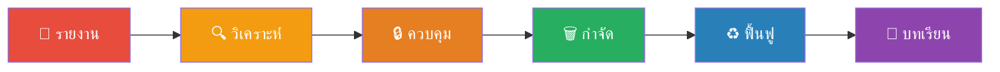
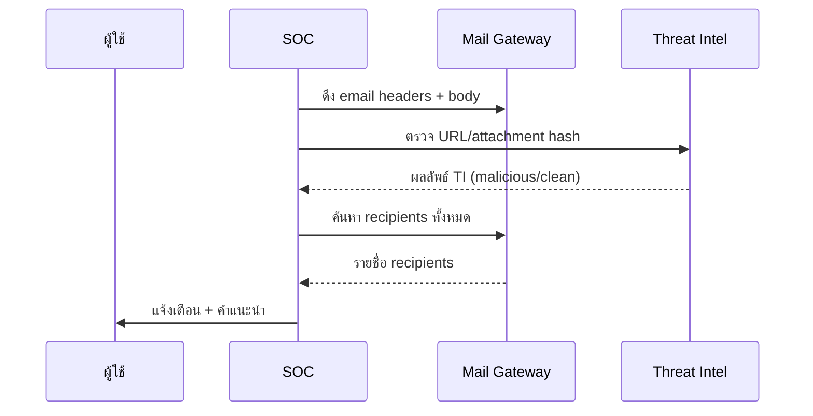
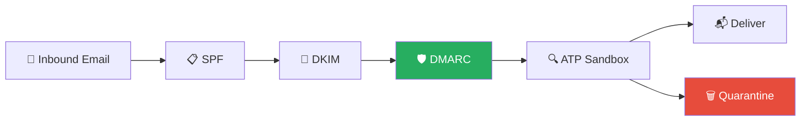
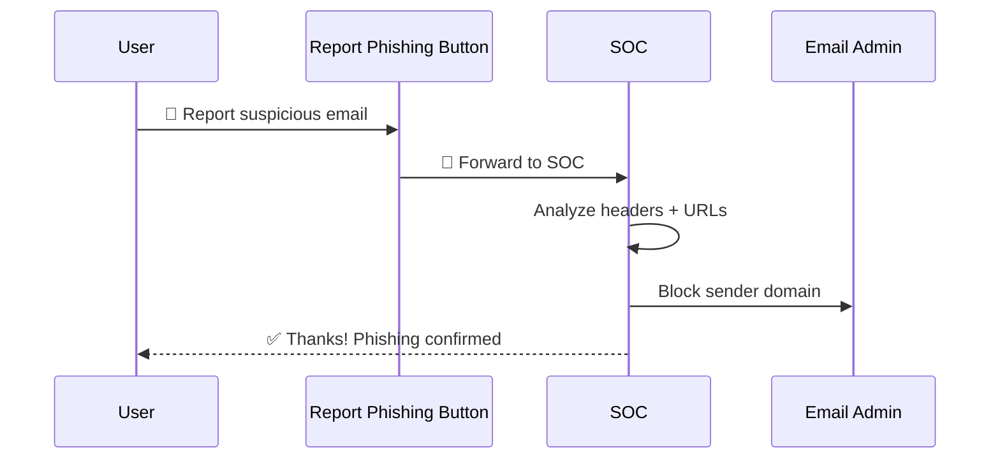

# Playbook: ฟิชชิง (Phishing)

**ID**: PB-01
**ระดับความรุนแรง**: ปานกลาง/สูง | **หมวดหมู่**: ความปลอดภัยอีเมล
**MITRE ATT&CK**: [T1566.001](https://attack.mitre.org/techniques/T1566/001/) (Spearphishing Attachment), [T1566.002](https://attack.mitre.org/techniques/T1566/002/) (Spearphishing Link)
**ทริกเกอร์**: ผู้ใช้รายงาน, Mail gateway block, SIEM correlation, Phishing simulation fail

### ผัง IR สำหรับฟิชชิง

```mermaid
graph LR
    Report["📧 รายงาน"] --> Analyze["🔍 วิเคราะห์"]
    Analyze --> Contain["🔒 ควบคุม"]
    Contain --> Eradicate["🗑️ กำจัด"]
    Eradicate --> Recover["♻️ ฟื้นฟู"]
    Recover --> Lessons["📝 บทเรียน"]
    style Report fill:#e74c3c,color:#fff
    style Analyze fill:#f39c12,color:#fff
    style Contain fill:#e67e22,color:#fff
    style Eradicate fill:#27ae60,color:#fff
    style Recover fill:#2980b9,color:#fff
    style Lessons fill:#8e44ad,color:#fff
```

### ผังการวิเคราะห์อีเมล

```mermaid
sequenceDiagram
    participant User as ผู้ใช้
    participant SOC
    participant Mail as Mail Gateway
    participant TI as Threat Intel
    SOC->>Mail: ดึง email headers + body
    SOC->>TI: ตรวจ URL/attachment hash
    TI-->>SOC: ผลลัพธ์ TI (malicious/clean)
    SOC->>Mail: ค้นหา recipients ทั้งหมด
    Mail-->>SOC: รายชื่อ recipients
    SOC->>User: แจ้งเตือน + คำแนะนำ
```

---

## ผังการตัดสินใจ

```mermaid
graph TD
    Alert["🚨 อีเมล Phishing"] --> Action{"📧 ผู้ใช้ดำเนินการอะไร?"}
    Action -->|รายงาน ไม่คลิก| Report["✅ วิเคราะห์ + บล็อก"]
    Action -->|คลิกลิงก์| Click["🟠 ตรวจสอบเว็บไซต์"]
    Action -->|เปิดไฟล์แนบ| Attach["🔴 EDR / Sandbox"]
    Action -->|กรอก credentials| Creds["🔴 รีเซ็ตทันที"]
    Click --> Harvest{"เป็นหน้า login ปลอม?"}
    Harvest -->|ใช่| Creds
    Harvest -->|ไม่ (redirect/tracking)| Low["🟡 บล็อก URL + ติดตาม"]
    Attach --> Malware{"มัลแวร์?"}
    Malware -->|ใช่| Isolate["🔒 Isolate Host"]
    Creds --> Reset["🔐 รีเซ็ต + เพิกถอน"]
```

---

## 1. การวิเคราะห์

### 1.1 การวิเคราะห์อีเมล

| รายการ | วิธีตรวจสอบ | เสร็จ |
|:---|:---|:---:|
| ผู้ส่ง (From / Return-Path / Envelope) | Email headers | ☐ |
| SPF / DKIM / DMARC ผ่านหรือไม่? | Email headers | ☐ |
| Display name ปลอม (spoofing)? | เปรียบเทียบกับ directory | ☐ |
| ลิงก์ใน email ชี้ไปที่ไหน? | URL analysis | ☐ |
| ไฟล์แนบ — ประเภท, hash | Sandbox / VT | ☐ |
| มีผู้ใช้อื่นได้รับอีเมลเดียวกัน? | Mail log search | ☐ |
| Urgency / pressure tactics? | Content review | ☐ |

### 1.2 ประเภท Phishing

| ประเภท | ลักษณะ | ความรุนแรง |
|:---|:---|:---|
| **Mass Phishing** | ส่งถึงทุกคน, generic content | 🟡 ปานกลาง |
| **Spearphishing** | เจาะจงบุคคล/แผนก | 🟠 สูง |
| **Whaling** | เจาะจงผู้บริหาร | 🔴 วิกฤต |
| **BEC** | ปลอม CEO/CFO, ขอโอนเงิน | 🔴 วิกฤต |
| **QR Phishing (Quishing)** | QR code นำไปหน้าปลอม | 🟠 สูง |

---

## 2. การควบคุม

### 2.1 ไม่มีผู้ใช้คลิก

| # | การดำเนินการ | เสร็จ |
|:---:|:---|:---:|
| 1 | **บล็อก** sender domain/IP ที่ Mail Gateway | ☐ |
| 2 | **บล็อก** URL ที่ Proxy/DNS | ☐ |
| 3 | **ลบ** อีเมลจากทุก mailbox | ☐ |
| 4 | **รายงาน** URL/domain ไปยัง TI platform | ☐ |

### 2.2 ผู้ใช้คลิกลิงก์หรือกรอก Credentials

| # | การดำเนินการ | เสร็จ |
|:---:|:---|:---:|
| 1 | **รีเซ็ตรหัสผ่าน** ทันที | ☐ |
| 2 | **เพิกถอน sessions** และ tokens ทั้งหมด | ☐ |
| 3 | **ตรวจ** sign-in logs สำหรับการเข้าถึงผิดปกติ | ☐ |
| 4 | **ตรวจ** inbox rules — forwarding ถูกสร้างหรือไม่? | ☐ |
| 5 | **ตรวจ** OAuth app consents | ☐ |

### 2.3 ผู้ใช้เปิดไฟล์แนบ

| # | การดำเนินการ | เสร็จ |
|:---:|:---|:---:|
| 1 | **Isolate** host ทันที | ☐ |
| 2 | **สแกน** ด้วย EDR | ☐ |
| 3 | **ส่ง** ไฟล์แนบไป sandbox | ☐ |
| 4 | **Block** hash ที่ EDR | ☐ |

---

## 3. การกำจัด

| # | การดำเนินการ | เสร็จ |
|:---:|:---|:---:|
| 1 | ลบอีเมล phishing จากทุก mailbox (purge) | ☐ |
| 2 | ลบ malware/implant ออกจาก host ที่ติดเชื้อ | ☐ |
| 3 | ลบ inbox rules ที่ผู้โจมตีสร้าง | ☐ |
| 4 | เพิกถอน OAuth apps ที่อันตราย | ☐ |
| 5 | สำรอง forensic evidence | ☐ |

---

## 4. Evidence Checklist

| ประเภทหลักฐาน | สิ่งที่ต้องเก็บ | แหล่งข้อมูล | เหตุผลที่ต้องเก็บ |
|:---|:---|:---|:---|
| อีเมลต้นฉบับ | headers, body, sender metadata, message ID | Mail gateway / mailbox export | ใช้พิสูจน์เส้นทางการ spoof และขอบเขตแคมเปญ |
| หลักฐาน URL | URL เต็ม, redirect chain, resolved IP/domain, screenshot | URL sandbox / proxy / DNS | ยืนยัน credential harvesting หรือช่องทางส่งต่อ |
| หลักฐานไฟล์แนบ | filename, SHA256, sandbox verdict, dropped files | Sandbox / mail gateway | ยืนยันการส่งมัลแวร์และขอบเขตการ block |
| หลักฐานการกระทำของผู้ใช้ | เวลา click, การกรอก credentials, browser history, endpoint ที่ได้รับผลกระทบ | Proxy / IdP / endpoint logs | ใช้แยกว่าเป็น phishing อย่างเดียวหรือกลายเป็น account compromise |
| ขอบเขตของแคมเปญ | recipient list, ผลการ purge, อีเมลลักษณะเดียวกัน, การเจาะกลุ่ม VIP | Mail search / SIEM | รองรับการยกระดับและการสื่อสารภายใน |

---

## 5. Minimum Telemetry Required

| แหล่ง Telemetry | ใช้เพื่ออะไร | ความสำคัญ | Blind Spot ถ้าไม่มี |
|:---|:---|:---:|:---|
| Mail gateway และ secure email logs | วิเคราะห์ผู้ส่ง, เส้นทางการส่ง, ยืนยันผลการ purge | Required | ยืนยันขอบเขตไม่ได้ และไม่รู้ว่าอีเมลถูกส่งถึงใครบ้าง |
| Mailbox audit และ message trace | ตรวจ inbox rule, การกระทำของผู้ใช้, ผลกระทบต่อ mailbox อื่น | Required | พิสูจน์ post-delivery action หรือ mailbox abuse ไม่ได้ |
| Proxy, DNS, และ URL filtering logs | ดู click path, redirect chain, ปลายทางที่ถูกติดต่อ | Required | ยืนยัน phishing destination หรือการเข้าชมต่อเนื่องไม่ได้ |
| Identity provider sign-in logs | ดูผลจาก credential submission, token abuse, MFA change | Required | บอกไม่ได้ว่า phishing กลายเป็น account compromise แล้วหรือยัง |
| Sandbox และ endpoint telemetry | ตรวจการรัน attachment, dropped file, process lineage | Recommended | อาจประเมิน malware delivery ต่ำกว่าความจริงหรือพลาดไปเลย |

---

## 6. False Positive และ Tuning Guide

| Scenario | ทำไมจึงดูน่าสงสัย | วิธีตรวจสอบ | Tuning Action | ต้องยกระดับเมื่อ |
|:---|:---|:---|:---|:---|
| แคมเปญอีเมลประชาสัมพันธ์ที่ถูกต้อง | ผู้รับจำนวนมากและหัวข้อคล้ายกันดูเหมือน phishing blast | ยืนยัน sender ที่อนุมัติ, platform ที่ใช้ส่ง, และ owner ของแคมเปญ | allowlist เฉพาะ sender domain และ mail infrastructure ที่อนุมัติ | ลิงก์, sender path, หรือ branding ไม่ตรงกับแคมเปญที่อนุมัติ |
| การแจ้งเตือนจากระบบ file-share หรือ e-signature | อีเมลที่มี URL มักดูเหมือน credential lure | ตรวจ sender domain, DKIM/SPF alignment, และบริบทธุรกิจ | tune ตาม pattern ของ SaaS ที่อนุมัติและ signed URL | destination domain หรือ redirect chain ไม่อยู่ในรายการที่อนุมัติ |
| การทดสอบ security awareness | ใช้ข้อความและ tracking link แบบ phishing โดยตั้งใจ | ยืนยัน schedule ของการทดสอบและ source platform | suppress เฉพาะ domain ของ simulation และช่วงเวลาทดสอบ | การส่งเกิดนอกช่วง exercise หรือยิงไปยังผู้ใช้ที่ไม่อยู่ใน scope |
| ผู้ใช้เดินทางหรือเปิดลิงก์ผ่านเครือข่ายมือถือ | การ click จาก IP หรือ device ใหม่อาจดูเหมือน compromise | ยืนยัน location, device, และไม่มี credential/token misuse ตามมา | คง click alert เป็น informational ถ้าไม่มี auth anomaly ต่อเนื่อง | พบการกรอก credential, MFA เปลี่ยน, หรือ token abuse |

---

## 7. การฟื้นฟู

| # | การดำเนินการ | เสร็จ |
|:---:|:---|:---:|
| 1 | เปิด phishing-resistant MFA (FIDO2) | ☐ |
| 2 | เปิด Safe Links / Safe Attachments | ☐ |
| 3 | ปรับ mail gateway rules | ☐ |
| 4 | ส่ง security awareness ให้ผู้ใช้ที่เกี่ยวข้อง | ☐ |
| 5 | อัปเดต phishing simulation exercises | ☐ |
| 6 | ติดตาม 7 วัน | ☐ |

---

## 8. เกณฑ์การยกระดับ

| เงื่อนไข | ยกระดับไปยัง |
|:---|:---|
| Credentials ถูกขโมยและใช้งาน | [PB-05 บัญชีถูกบุกรุก](Account_Compromise.th.md) |
| ไฟล์แนบ = malware | [PB-03 มัลแวร์](Malware_Infection.th.md) |
| BEC — มีการโอนเงิน | [PB-17 BEC](BEC.th.md) + Legal |
| Whaling — ผู้บริหารถูกโจมตี | CISO ทันที |
| ผู้ใช้ > 10 คน ได้รับ phishing | SOC Lead |

---

### ผัง Email Security Stack

```mermaid
graph LR
    Email["📧 Inbound Email"] --> SPF["📋 SPF"]
    SPF --> DKIM["🔏 DKIM"]
    DKIM --> DMARC["🛡️ DMARC"]
    DMARC --> ATP["🔍 ATP Sandbox"]
    ATP --> Inbox["📬 Deliver"]
    ATP --> Quarantine["🗑️ Quarantine"]
    style DMARC fill:#27ae60,color:#fff
    style Quarantine fill:#e74c3c,color:#fff
```

### ผัง User Report & Response

```mermaid
sequenceDiagram
    participant User
    participant PhishBtn as Report Phishing Button
    participant SOC
    participant Email_Admin as Email Admin
    User->>PhishBtn: 📧 Report suspicious email
    PhishBtn->>SOC: 🚨 Forward to SOC
    SOC->>SOC: Analyze headers + URLs
    SOC->>Email_Admin: Block sender domain
    SOC-->>User: ✅ Thanks! Phishing confirmed
```

## กฎตรวจจับ (Sigma)

| กฎ | ไฟล์ |
|:---|:---|
| Suspicious Inbox Rule Created | [cloud_email_inbox_rule.yml](../../08_Detection_Engineering/sigma_rules/cloud_email_inbox_rule.yml) |
| Office Spawning PowerShell | [proc_office_spawn_powershell.yml](../../08_Detection_Engineering/sigma_rules/proc_office_spawn_powershell.yml) |

## เอกสารที่เกี่ยวข้อง

- [กรอบการตอบสนองต่อเหตุการณ์](../Framework.th.md)
- [แม่แบบรายงานเหตุการณ์](../../11_Reporting_Templates/incident_report.th.md)
- [PB-05 บัญชีถูกบุกรุก](Account_Compromise.th.md)
- [PB-26 การหลีกเลี่ยง MFA](MFA_Bypass.th.md)

## Phishing Email Analysis Checklist

| Check | How | Tool |
|:---|:---|:---|
| Sender reputation | SPF/DKIM/DMARC | Email headers |
| URL analysis | Sandbox detonation | URLScan/VirusTotal |
| Attachment scan | Hash + sandbox | Any.run/JoeSandbox |
| Header analysis | Examine X-headers | MXToolbox |
| Reply-to mismatch | Compare From vs Reply | Manual |

### Phishing Response Workflow

| Impact Level | Response | Owner |
|:---|:---|:---|
| Clicked link only | Monitor user | SOC Tier 1 |
| Entered credentials | Reset password + MFA | SOC Tier 2 |
| Downloaded malware | Full IR playbook | IR Team |
| Multiple victims | Company-wide alert | SOC + Comms |

### Phishing Impact Assessment

| Level | User Action | Response |
|:---|:---|:---|
| None | Reported only | Close + praise |
| Clicked | Visited URL | Scan + monitor |
| Submitted | Entered creds | Full IR + reset |

## References

- [MITRE ATT&CK T1566 — Phishing](https://attack.mitre.org/techniques/T1566/)
