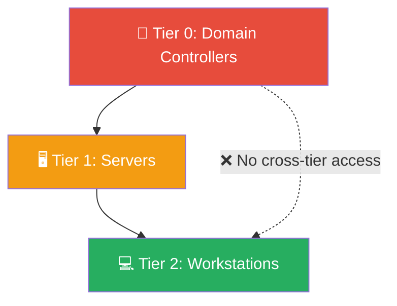
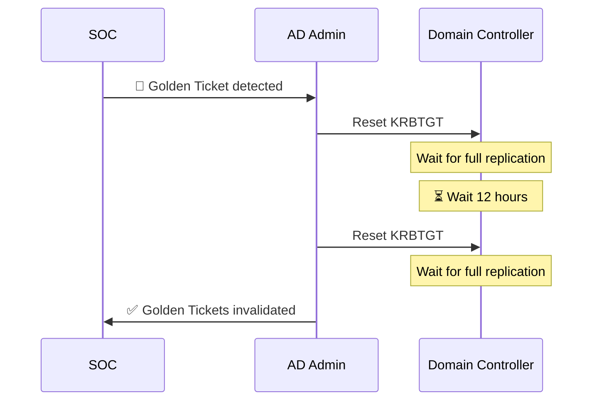
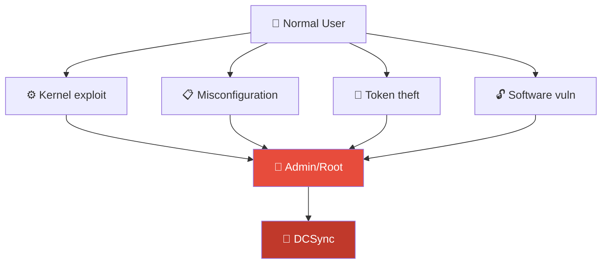
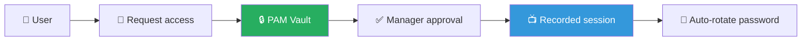

# Playbook: Privilege Escalation

**ID**: PB-07
**Severity**: High/Critical | **Category**: Identity & Access / Endpoint
**MITRE ATT&CK**: [T1068](https://attack.mitre.org/techniques/T1068/) (Exploitation for Privilege Escalation), [T1098](https://attack.mitre.org/techniques/T1098/) (Account Manipulation), [T1078.002](https://attack.mitre.org/techniques/T1078/002/) (Domain Accounts)
**Trigger**: EDR alert, SIEM (Event 4672/4728/4732), PAM alert, sudo anomaly

### Admin Tiering Model

```mermaid
graph TD
    T0["🏰 Tier 0: Domain Controllers"] --> T1["🖥️ Tier 1: Servers"]
    T1 --> T2["💻 Tier 2: Workstations"]
    T0 -.->|❌ No cross-tier access| T2
    style T0 fill:#e74c3c,color:#fff
    style T1 fill:#f39c12,color:#fff
    style T2 fill:#27ae60,color:#fff
```

### KRBTGT Reset Procedure

```mermaid
sequenceDiagram
    participant SOC
    participant AD as AD Admin
    participant DC as Domain Controller
    SOC->>AD: 🚨 Golden Ticket detected
    AD->>DC: Reset KRBTGT #1
    Note over DC: Wait for full replication
    Note over DC: ⏳ Wait 12 hours
    AD->>DC: Reset KRBTGT #2
    Note over DC: Wait for full replication
    AD->>SOC: ✅ Golden Tickets invalidated
```

---

## Decision Flow

```mermaid
graph TD
    Alert["🚨 Privilege Escalation Alert"] --> Method{"⚙️ Escalation Method?"}
    Method -->|Group Membership Change| Group["👥 Added to Admin Group"]
    Method -->|Exploit / Tool| Tool["🔧 Exploit Tool Detected"]
    Method -->|Configuration Change| Config["⚙️ GPO / Policy Modification"]
    Group --> Ticket{"📋 Change Request?"}
    Ticket -->|Yes, Authorized| FP["✅ False Positive"]
    Ticket -->|No| Suspicious["🔴 Unauthorized"]
    Tool --> ToolType{"Which Tool?"}
    ToolType -->|Mimikatz / LSASS Dump| Cred["🔴 Credential Theft"]
    ToolType -->|Local Exploit (CVE)| Vuln["🔴 Vulnerability Exploit"]
    ToolType -->|UAC Bypass| UAC["🟠 UAC Bypass"]
    Config --> Authorized{"Authorized Change?"}
    Authorized -->|No| Suspicious
    Suspicious --> Isolate["🔌 Isolate + Investigate"]
    Cred --> Isolate
    Vuln --> Isolate
    UAC --> Isolate
```

---

## 1. Analysis

### 1.1 Escalation Method Identification

| Method | Detection | Event IDs / Artifacts |
|:---|:---|:---|
| **Domain Admin group add** | SIEM, AD audit | 4728, 4732 (group member added) |
| **Local Admin group add** | SIEM, EDR | 4732 (local group) |
| **Mimikatz / credential dump** | EDR | LSASS access, sekurlsa::\* |
| **Token manipulation** | EDR, Sysmon | Process token changes, SeDebugPrivilege |
| **UAC bypass** | EDR, Sysmon | fodhelper.exe, eventvwr.exe abuse |
| **Kernel exploit (CVE)** | EDR, IDS | Exploit artifacts, crash dumps |
| **Sudo/SUID abuse** | Linux audit | sudo logs, SUID file execution |
| **GPO modification** | AD audit | GPO changes in SYSVOL |
| **Scheduled task as SYSTEM** | Sysmon, SIEM | 4698 (task created), SYSTEM context |

### 1.2 Investigation Checklist

| Check | How | Done |
|:---|:---|:---:|
| What process/tool performed the escalation? | EDR process timeline | ☐ |
| Was it authorized? (Change request, admin work) | ITSM / Change Management | ☐ |
| Which account gained elevated privileges? | AD audit log | ☐ |
| What did the elevated account do next? | SIEM / EDR timeline | ☐ |
| Was the source host already compromised? | EDR alerts, malware presence | ☐ |
| Was credential dumping involved? | LSASS access, process injection | ☐ |
| Were other systems accessed with elevated creds? | [PB-12 Lateral Movement](Lateral_Movement.en.md) | ☐ |

---

## 2. Containment

### 2.1 Immediate Actions

| # | Action | Tool | Done |
|:---:|:---|:---|:---:|
| 1 | **Remove** escalated privileges / group membership | AD / IdP | ☐ |
| 2 | **Disable** the suspicious account | AD / IdP | ☐ |
| 3 | **Isolate** the source host | EDR | ☐ |
| 4 | **Kill** the exploit/tool process | EDR | ☐ |
| 5 | **Block** the exploit hash across all endpoints | EDR global blacklist | ☐ |

### 2.2 If Credential Theft Confirmed

| # | Action | Done |
|:---:|:---|:---:|
| 1 | Reset passwords of ALL accounts accessed from compromised host | ☐ |
| 2 | Check for Pass-the-Hash / Pass-the-Ticket usage | ☐ |
| 3 | If Domain Admin creds dumped, plan KRBTGT reset (twice, 12h apart) | ☐ |
| 4 | Audit all lateral movement from this host → [PB-12](Lateral_Movement.en.md) | ☐ |
| 5 | Check for DCSync (Event ID 4662 with replication GUIDs) | ☐ |

---

## 3. Eradication

| # | Action | Done |
|:---:|:---|:---:|
| 1 | Remove exploit tools / malware from host | ☐ |
| 2 | Patch the vulnerability used for escalation (if CVE-based) | ☐ |
| 3 | Review GPOs for unauthorized modifications | ☐ |
| 4 | Scan for backdoors: new accounts, scheduled tasks, services | ☐ |
| 5 | Check for persistence in registry, WMI, startup | ☐ |
| 6 | Re-image host if Mimikatz/credential dump confirmed | ☐ |

---

## 4. Recovery

| # | Action | Done |
|:---:|:---|:---:|
| 1 | Restore permission baseline from documented standard | ☐ |
| 2 | Full AD audit — compare current vs baseline group memberships | ☐ |
| 3 | Enable Credential Guard on workstations | ☐ |
| 4 | Implement LAPS for local admin passwords | ☐ |
| 5 | Deploy/verify Protected Users group for sensitive accounts | ☐ |
| 6 | Monitor recovered host and accounts for 72 hours | ☐ |

---

## 5. IoC Collection

| Type | Value | Source |
|:---|:---|:---|
| Exploit tool/binary hash | | EDR |
| Escalated account name | | AD audit |
| Process used for escalation | | EDR |
| Source host | | SIEM |
| CVE exploited (if applicable) | | IDS / EDR |
| Lateral movement destinations | | SIEM |

---

## 6. Evidence Checklist

| Evidence Type | What to Collect | Source | Why It Matters |
|:---|:---|:---|:---|
| Privilege evidence | New group memberships, token privileges, sudo/suid misuse, admin rights gained | AD audit / system logs / EDR | Confirms what level of privilege was gained |
| Execution evidence | Process tree, exploit tool, command line, persistence artifacts | EDR / forensic tools | Shows how escalation happened and whether it persists |
| Identity evidence | Account type, credential exposure, ticketing/admin context | IAM / IdP / PAM logs | Distinguishes attack activity from authorized admin work |
| Scope evidence | Other hosts, accounts, or GPOs touched after escalation | SIEM / AD audit | Determines whether escalation led to wider compromise |
| Business impact evidence | Sensitive systems or data reached with elevated rights | Asset inventory / DLP | Supports severity and executive escalation |

---

## 7. Minimum Telemetry Required

| Telemetry Source | Required For | Priority | Blind Spot If Missing |
|:---|:---|:---:|:---|
| Endpoint and EDR telemetry | Exploit tool use, token abuse, process lineage, persistence | Required | Cannot prove how privilege was gained |
| AD, IAM, and PAM audit logs | Group changes, admin rights, token or role grants | Required | Privilege change scope remains unclear |
| System security logs | Local admin, sudo, service, scheduled-task, registry activity | Required | OS-native privilege escalation paths stay hidden |
| Vulnerability and patch context | CVE correlation and missing patch context | Recommended | Analysts may miss exploit-based root cause |
| SIEM correlation across hosts | Follow-on movement and spread after escalation | Recommended | Wider blast radius may be underestimated |

---

## 8. False Positive and Tuning Guide

| Scenario | Why It Looks Suspicious | How to Validate | Tuning Action | Escalate If |
|:---|:---|:---|:---|:---|
| Approved admin elevation | Legitimate maintenance may add temp admin rights | Check PAM request, change ticket, and time window | Suppress only approved user/role/time combinations | Elevation persists or touches unrelated systems |
| Software installer/service deployment | Installers may request elevation and create services | Validate signed package, deployment owner, and path | Allowlist known installers and deployment tools narrowly | Tool also dumps credentials or alters admin groups |
| Security tool or EDR action | Defensive tools can access privileged processes | Confirm tool identity and console action | Suppress documented tool behaviors only | Same host shows unknown binaries or privilege changes outside tool scope |
| Break-glass account use | Emergency admin access can resemble abuse | Validate incident record and approval | Lower severity only for approved break-glass events | Access continues beyond approved duration or scope |

---

## 9. Escalation Criteria

| Condition | Escalate To |
|:---|:---|
| Domain Admin credentials compromised | CISO + External IR |
| Mimikatz / credential dumping confirmed | Tier 2 + Identity team |
| Multiple hosts affected | Major Incident |
| GPO modified without authorization | CISO + AD team |
| Kernel exploit (0-day) | CISO + Vendor |
| Data accessed with elevated privileges | [PB-08](Data_Exfiltration.en.md) + Legal |

---

## 10. Post-Incident

- [ ] Patch vulnerabilities used for privilege escalation
- [ ] Review LAPS configuration for local admin passwords
- [ ] Audit group memberships (Domain Admins, Enterprise Admins)
- [ ] Implement credential guard and LSA protection
- [ ] Review and harden service account permissions
- [ ] Deploy PAM solution for all privileged access
- [ ] Create detection rules for observed escalation technique
- [ ] Document findings in [Incident Report](../../11_Reporting_Templates/incident_report.en.md)

---

### Privilege Escalation Paths

```mermaid
graph TD
    Init["👤 Normal User"] --> Kernel["⚙️ Kernel exploit"]
    Init --> Misconfig["📋 Misconfiguration"]
    Init --> Token["🔑 Token theft"]
    Init --> Vuln["🔓 Software vuln"]
    Kernel --> Admin["👑 Admin/Root"]
    Misconfig --> Admin
    Token --> Admin
    Vuln --> Admin
    Admin --> DCSync["🏰 DCSync"]
    style Admin fill:#e74c3c,color:#fff
    style DCSync fill:#c0392b,color:#fff
```

### PAM Architecture

```mermaid
graph LR
    User["👤 User"] --> Request["📝 Request access"]
    Request --> PAM["🔒 PAM Vault"]
    PAM --> Approve["✅ Manager approval"]
    Approve --> Session["📺 Recorded session"]
    Session --> Rotate["🔄 Auto-rotate password"]
    style PAM fill:#27ae60,color:#fff
    style Session fill:#3498db,color:#fff
```

## Detection Rules (Sigma)

| Rule | File |
|:---|:---|
| User Added to Domain Admins | [win_domain_admin_group_add.yml](../../08_Detection_Engineering/sigma_rules/win_domain_admin_group_add.yml) |
| New Local User Created | [win_new_user_created.yml](../../08_Detection_Engineering/sigma_rules/win_new_user_created.yml) |

## Related Documents

- [IR Framework](../Framework.en.md)
- [Incident Report](../../11_Reporting_Templates/incident_report.en.md)
- [PB-05 Account Compromise](Account_Compromise.en.md)
- [PB-12 Lateral Movement](Lateral_Movement.en.md)
- [PB-15 Rogue Admin](Rogue_Admin.en.md)

## References

- [MITRE ATT&CK T1068 — Exploitation for Privilege Escalation](https://attack.mitre.org/techniques/T1068/)
- [MITRE ATT&CK T1098 — Account Manipulation](https://attack.mitre.org/techniques/T1098/)
- [Microsoft — Securing Privileged Access](https://learn.microsoft.com/en-us/security/compass/securing-privileged-access)
