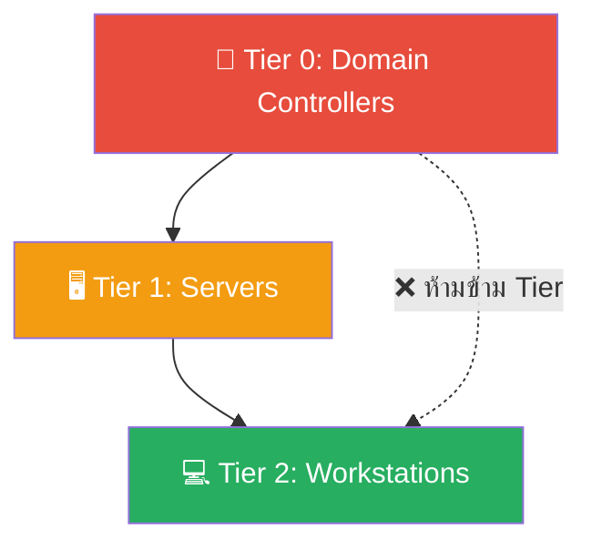
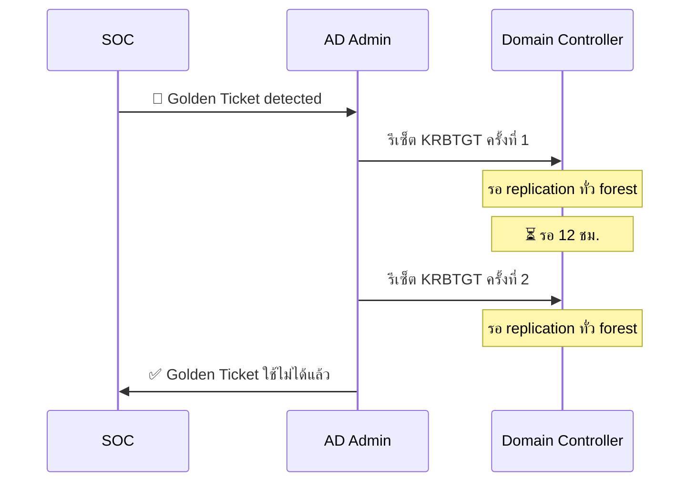
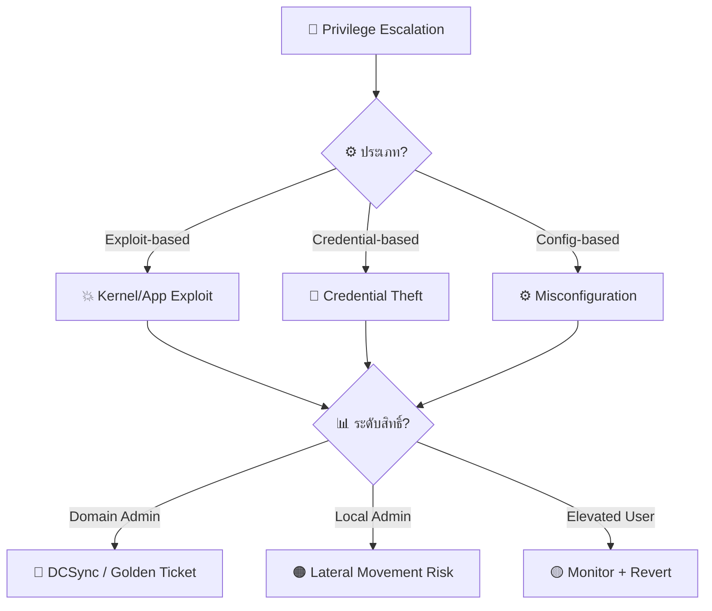
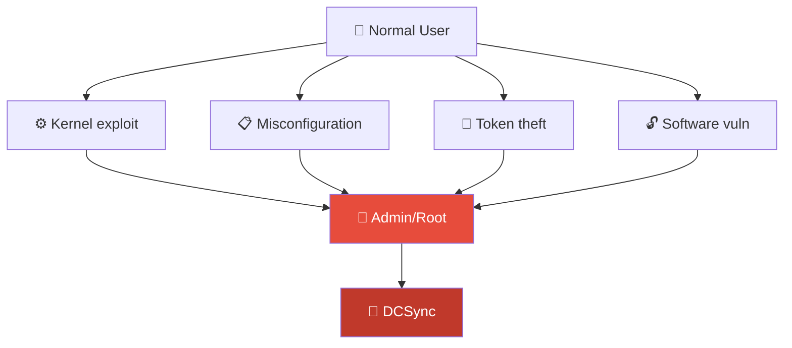

# Playbook: Privilege Escalation / การยกระดับสิทธิ์

**ID**: PB-07
**ระดับความรุนแรง**: สูง/วิกฤต | **หมวดหมู่**: Identity & Access
**MITRE ATT&CK**: [T1068](https://attack.mitre.org/techniques/T1068/) (Exploitation for Privilege Escalation), [T1078](https://attack.mitre.org/techniques/T1078/) (Valid Accounts)
**ทริกเกอร์**: EDR alert, SIEM (Event 4672/4728/4732), PAM alert, sudo anomaly

### ผัง Admin Tiering Model

### ผังขั้นตอนรีเซ็ต KRBTGT

---

## ผังการตัดสินใจ

---

## 1. การวิเคราะห์

### 1.1 เทคนิคการยกระดับสิทธิ์

| เทคนิค | ตัวบ่งชี้ | Event ID | ความรุนแรง |
|:---|:---|:---|:---|
| **Kernel Exploit** | Exploit binary, SYSTEM shell | — | 🔴 วิกฤต |
| **UAC Bypass** | Auto-elevate abuse | — | 🟠 สูง |
| **Token Manipulation** | Token impersonation/theft | 4672 | 🔴 สูง |
| **Sudo/SUID Abuse** (Linux) | sudo misconfig, SUID binary | — | 🟠 สูง |
| **Service Permissions** | Modifiable service path/binary | 7045 | 🟠 สูง |
| **DLL Hijacking** | DLL ใน writable path | — | 🟠 สูง |
| **Group Policy Abuse** | GPO modification | — | 🔴 สูง |
| **DCSync** | Domain replication (mimikatz) | 4662 | 🔴 วิกฤต |
| **Golden Ticket** | Forged Kerberos TGT | — | 🔴 วิกฤต |
| **Silver Ticket** | Forged service ticket | — | 🔴 สูง |

### 1.2 Windows Event IDs สำคัญ

| Event ID | ความหมาย |
|:---|:---|
| **4672** | Special privileges assigned (admin logon) |
| **4728** | Member added to security-enabled global group |
| **4732** | Member added to security-enabled local group |
| **4756** | Member added to universal group |
| **4662** | Operation performed on AD object (DCSync indicator) |
| **7045** | New service installed |

### 1.3 รายการตรวจสอบ

| รายการ | วิธีตรวจสอบ | เสร็จ |
|:---|:---|:---:|
| ผู้ใช้/process ที่ได้รับสิทธิ์สูง | EDR / SIEM | ☐ |
| เทคนิคที่ใช้ (exploit/credential/misconfig) | EDR analysis | ☐ |
| ระดับสิทธิ์ที่ได้ (local admin/domain admin/SYSTEM) | EDR / AD audit | ☐ |
| มี lateral movement ตามมา? | SIEM correlation | ☐ |
| มี DCSync / credential dumping? | Event 4662 / SIEM | ☐ |
| AD group membership เปลี่ยน? | Event 4728/4732 | ☐ |
| มี GPO ถูกแก้ไข? | Group Policy audit | ☐ |
| Entry vector (ได้สิทธิ์เริ่มต้นอย่างไร) | EDR timeline | ☐ |

---

## 2. การควบคุม

### 2.1 Local Privilege Escalation

| # | การดำเนินการ | เสร็จ |
|:---:|:---|:---:|
| 1 | **Isolate** host | ☐ |
| 2 | **Kill** malicious process | ☐ |
| 3 | **ลบ** local admin ที่เพิ่มมา | ☐ |
| 4 | **Patch** vulnerability ที่ใช้ exploit | ☐ |

### 2.2 Domain-level Escalation

| # | การดำเนินการ | เสร็จ |
|:---:|:---|:---:|
| 1 | **รีเซ็ต KRBTGT** password (2 ครั้ง, ห่างกัน 12 ชม.) | ☐ |
| 2 | **รีเซ็ต** compromised Domain Admin password | ☐ |
| 3 | **ลบ** unauthorized group memberships | ☐ |
| 4 | **Revert** GPO changes | ☐ |
| 5 | **Scan** ทุก DC สำหรับ persistence | ☐ |

---

## 3. การกำจัด

| # | การดำเนินการ | เสร็จ |
|:---:|:---|:---:|
| 1 | ลบ exploit tools (mimikatz, Rubeus, SharpHound) | ☐ |
| 2 | ลบ persistence (services, scheduled tasks, registry) | ☐ |
| 3 | หมุนเวียน credentials ทั้งหมดที่เข้าถึงได้ | ☐ |
| 4 | ลบ forged tickets / cached credentials | ☐ |
| 5 | แก้ไข misconfiguration ที่ถูกใช้ (service perms, SUID) | ☐ |

---

## 4. การฟื้นฟู

| # | การดำเนินการ | เสร็จ |
|:---:|:---|:---:|
| 1 | Deploy **LAPS** (Local Admin Password Solution) | ☐ |
| 2 | เปิด **Credential Guard** | ☐ |
| 3 | ใช้ **PAM** (Privileged Access Management) / PIM | ☐ |
| 4 | ใช้ **Admin Tiering** (Tier 0/1/2) | ☐ |
| 5 | เปิด **Protected Users** security group | ☐ |
| 6 | ตรวจ AD permissions ทุกไตรมาส | ☐ |

---

## 5. เกณฑ์การยกระดับ

| เงื่อนไข | ยกระดับไปยัง |
|:---|:---|
| Domain Admin compromise | CISO + Major Incident |
| DCSync / Golden Ticket | CISO + AD team ทันที |
| หลาย host ได้รับ escalation | Major Incident |
| ข้อมูลถูกเข้าถึง | Legal + DPO |
| Lateral movement ตรวจพบ | [PB-09 Lateral Movement](Lateral_Movement.th.md) |

---

### ผัง Privilege Escalation Paths

### ผัง PAM Architecture

## เอกสารที่เกี่ยวข้อง

- [กรอบการตอบสนองต่อเหตุการณ์](../Framework.th.md)
- [PB-09 Lateral Movement](Lateral_Movement.th.md)
- [PB-05 บัญชีถูกบุกรุก](Account_Compromise.th.md)

## อ้างอิง

- [MITRE ATT&CK — Privilege Escalation](https://attack.mitre.org/tactics/TA0004/)
