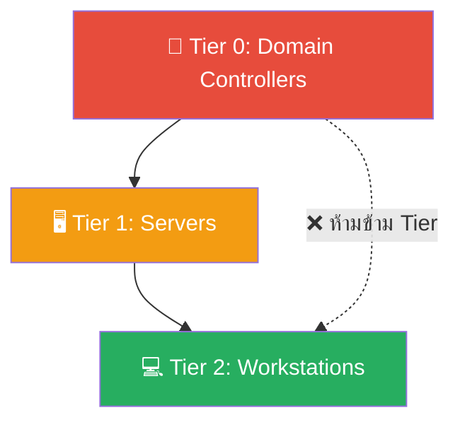
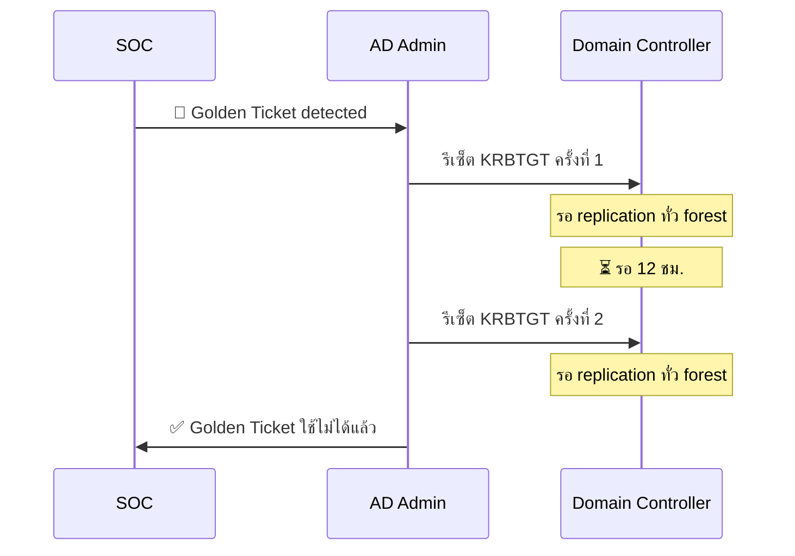
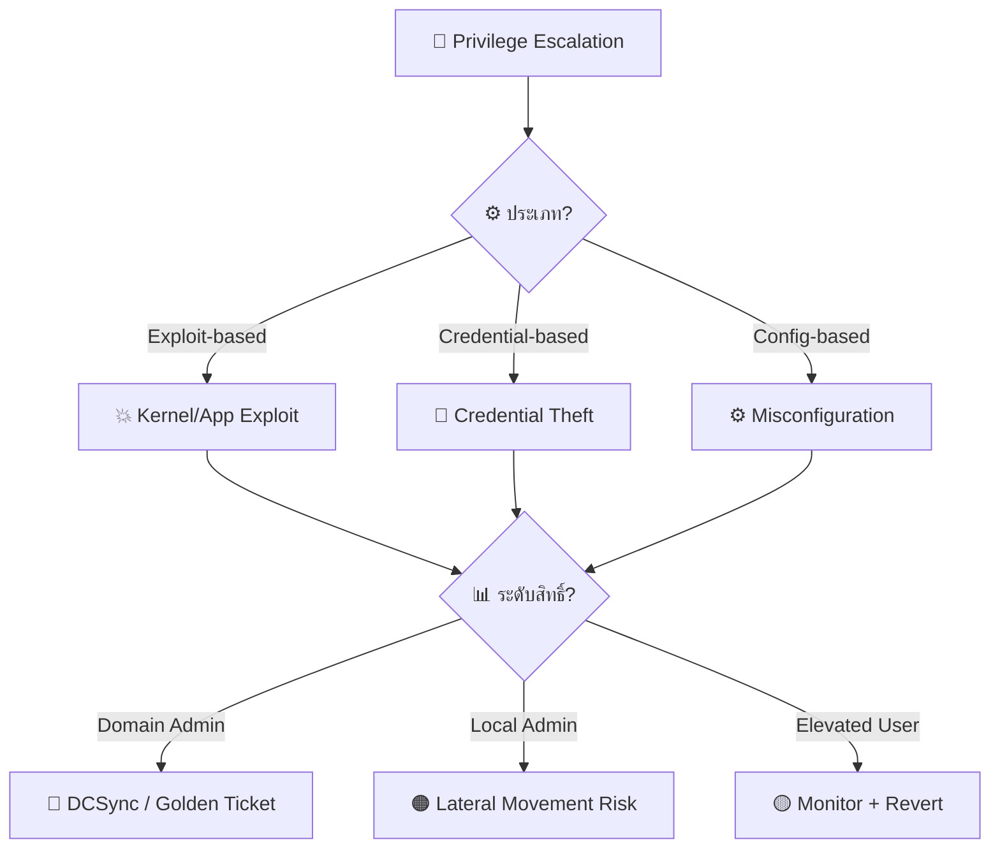
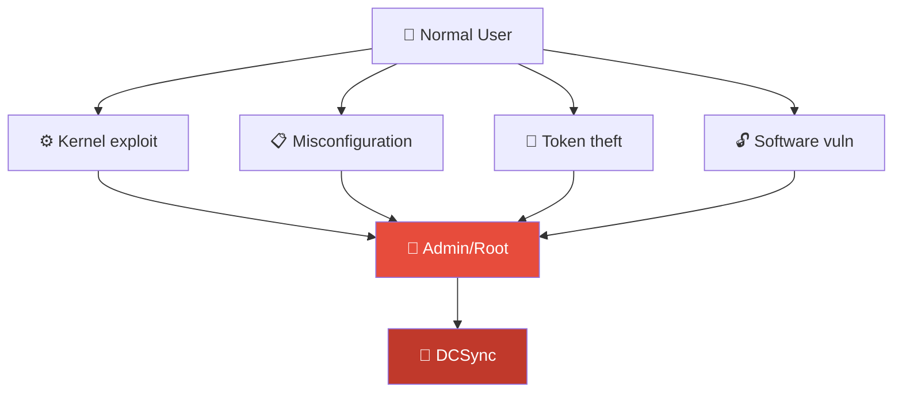
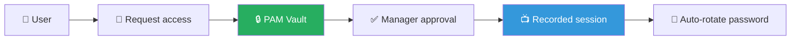

# Playbook: Privilege Escalation / การยกระดับสิทธิ์

**ID**: PB-07
**ระดับความรุนแรง**: สูง/วิกฤต | **หมวดหมู่**: Identity & Access
**MITRE ATT&CK**: [T1068](https://attack.mitre.org/techniques/T1068/) (Exploitation for Privilege Escalation), [T1078](https://attack.mitre.org/techniques/T1078/) (Valid Accounts)
**ทริกเกอร์**: EDR alert, SIEM (Event 4672/4728/4732), PAM alert, sudo anomaly

## หลังเหตุการณ์ (Post-Incident)

- [ ] Patch vulnerability ที่ใช้สำหรับ privilege escalation
- [ ] ทบทวน LAPS configuration
- [ ] ตรวจสอบ group memberships (Domain/Enterprise Admins)
- [ ] ใช้ Credential Guard / LSA protection
- [ ] ใช้ PAM สำหรับ privileged access ทั้งหมด
- [ ] จัดทำ [Incident Report](../../11_Reporting_Templates/incident_report.th.md)

### ผัง Admin Tiering Model

```mermaid
graph TD
    T0["🏰 Tier 0: Domain Controllers"] --> T1["🖥️ Tier 1: Servers"]
    T1 --> T2["💻 Tier 2: Workstations"]
    T0 -.->|❌ ห้ามข้าม Tier| T2
    style T0 fill:#e74c3c,color:#fff
    style T1 fill:#f39c12,color:#fff
    style T2 fill:#27ae60,color:#fff
```

### ผังขั้นตอนรีเซ็ต KRBTGT

```mermaid
sequenceDiagram
    participant SOC
    participant AD as AD Admin
    participant DC as Domain Controller
    SOC->>AD: 🚨 Golden Ticket detected
    AD->>DC: รีเซ็ต KRBTGT ครั้งที่ 1
    Note over DC: รอ replication ทั่ว forest
    Note over DC: ⏳ รอ 12 ชม.
    AD->>DC: รีเซ็ต KRBTGT ครั้งที่ 2
    Note over DC: รอ replication ทั่ว forest
    AD->>SOC: ✅ Golden Ticket ใช้ไม่ได้แล้ว
```

---

## ผังการตัดสินใจ

```mermaid
graph TD
    Alert["🚨 Privilege Escalation"] --> Type{"⚙️ ประเภท?"}
    Type -->|Exploit-based| Exploit["💥 Kernel/App Exploit"]
    Type -->|Credential-based| Cred["🔑 Credential Theft"]
    Type -->|Config-based| Config["⚙️ Misconfiguration"]
    Exploit --> Impact{"📊 ระดับสิทธิ์?"}
    Cred --> Impact
    Config --> Impact
    Impact -->|Domain Admin| Critical["🔴 DCSync / Golden Ticket"]
    Impact -->|Local Admin| High["🟠 Lateral Movement Risk"]
    Impact -->|Elevated User| Medium["🟡 Monitor + Revert"]
```

---

## 1. การวิเคราะห์

### 1.1 เทคนิคการยกระดับสิทธิ์

| เทคนิค | ตัวบ่งชี้ | Event ID | ความรุนแรง |
|:---|:---|:---|:---|
| **Kernel Exploit** | Exploit binary, SYSTEM shell | — | 🔴 วิกฤต |
| **UAC Bypass** | Auto-elevate abuse | — | 🟠 สูง |
| **Token Manipulation** | Token impersonation/theft | 4672 | 🔴 สูง |
| **Sudo/SUID Abuse** (Linux) | sudo misconfig, SUID binary | — | 🟠 สูง |
| **Service Permissions** | Modifiable service path/binary | 7045 | 🟠 สูง |
| **DLL Hijacking** | DLL ใน writable path | — | 🟠 สูง |
| **Group Policy Abuse** | GPO modification | — | 🔴 สูง |
| **DCSync** | Domain replication (mimikatz) | 4662 | 🔴 วิกฤต |
| **Golden Ticket** | Forged Kerberos TGT | — | 🔴 วิกฤต |
| **Silver Ticket** | Forged service ticket | — | 🔴 สูง |

### 1.2 Windows Event IDs สำคัญ

| Event ID | ความหมาย |
|:---|:---|
| **4672** | Special privileges assigned (admin logon) |
| **4728** | Member added to security-enabled global group |
| **4732** | Member added to security-enabled local group |
| **4756** | Member added to universal group |
| **4662** | Operation performed on AD object (DCSync indicator) |
| **7045** | New service installed |

### 1.3 รายการตรวจสอบ

| รายการ | วิธีตรวจสอบ | เสร็จ |
|:---|:---|:---:|
| ผู้ใช้/process ที่ได้รับสิทธิ์สูง | EDR / SIEM | ☐ |
| เทคนิคที่ใช้ (exploit/credential/misconfig) | EDR analysis | ☐ |
| ระดับสิทธิ์ที่ได้ (local admin/domain admin/SYSTEM) | EDR / AD audit | ☐ |
| มี lateral movement ตามมา? | SIEM correlation | ☐ |
| มี DCSync / credential dumping? | Event 4662 / SIEM | ☐ |
| AD group membership เปลี่ยน? | Event 4728/4732 | ☐ |
| มี GPO ถูกแก้ไข? | Group Policy audit | ☐ |
| Entry vector (ได้สิทธิ์เริ่มต้นอย่างไร) | EDR timeline | ☐ |

---

## 2. การควบคุม

### 2.1 Local Privilege Escalation

| # | การดำเนินการ | เสร็จ |
|:---:|:---|:---:|
| 1 | **Isolate** host | ☐ |
| 2 | **Kill** malicious process | ☐ |
| 3 | **ลบ** local admin ที่เพิ่มมา | ☐ |
| 4 | **Patch** vulnerability ที่ใช้ exploit | ☐ |

### 2.2 Domain-level Escalation

| # | การดำเนินการ | เสร็จ |
|:---:|:---|:---:|
| 1 | **รีเซ็ต KRBTGT** password (2 ครั้ง, ห่างกัน 12 ชม.) | ☐ |
| 2 | **รีเซ็ต** compromised Domain Admin password | ☐ |
| 3 | **ลบ** unauthorized group memberships | ☐ |
| 4 | **Revert** GPO changes | ☐ |
| 5 | **Scan** ทุก DC สำหรับ persistence | ☐ |

---

## 3. การกำจัด

| # | การดำเนินการ | เสร็จ |
|:---:|:---|:---:|
| 1 | ลบ exploit tools (mimikatz, Rubeus, SharpHound) | ☐ |
| 2 | ลบ persistence (services, scheduled tasks, registry) | ☐ |
| 3 | หมุนเวียน credentials ทั้งหมดที่เข้าถึงได้ | ☐ |
| 4 | ลบ forged tickets / cached credentials | ☐ |
| 5 | แก้ไข misconfiguration ที่ถูกใช้ (service perms, SUID) | ☐ |

---

## 4. การฟื้นฟู

| # | การดำเนินการ | เสร็จ |
|:---:|:---|:---:|
| 1 | Deploy **LAPS** (Local Admin Password Solution) | ☐ |
| 2 | เปิด **Credential Guard** | ☐ |
| 3 | ใช้ **PAM** (Privileged Access Management) / PIM | ☐ |
| 4 | ใช้ **Admin Tiering** (Tier 0/1/2) | ☐ |
| 5 | เปิด **Protected Users** security group | ☐ |
| 6 | ตรวจ AD permissions ทุกไตรมาส | ☐ |

---

## 5. Evidence Checklist

| ประเภทหลักฐาน | สิ่งที่ต้องเก็บ | แหล่งข้อมูล | เหตุผลที่ต้องเก็บ |
|:---|:---|:---|:---|
| หลักฐานด้านสิทธิ์ | group membership ใหม่, token privilege, sudo/suid misuse, สิทธิ์ admin ที่ได้เพิ่ม | AD audit / system logs / EDR | ใช้ยืนยันว่าได้สิทธิ์ระดับใด |
| หลักฐานการทำงาน | process tree, exploit tool, command line, persistence artifact | EDR / forensic tools | ใช้ดูว่า escalation เกิดขึ้นอย่างไรและยังคงอยู่หรือไม่ |
| หลักฐานด้านตัวตน | account type, credential exposure, admin/ticket context | IAM / IdP / PAM logs | ใช้แยก attack ออกจากงาน admin ที่ได้รับอนุมัติ |
| หลักฐานด้านขอบเขต | host, account, หรือ GPO อื่นที่ถูกแตะหลัง escalation | SIEM / AD audit | ใช้ประเมินการลุกลาม |
| หลักฐานผลกระทบธุรกิจ | ระบบหรือข้อมูลสำคัญที่เข้าถึงได้ด้วยสิทธิ์สูง | Asset inventory / DLP | ใช้ประกอบ severity และการยกระดับถึงผู้บริหาร |

---

## 6. Minimum Telemetry Required

| แหล่ง Telemetry | ใช้เพื่ออะไร | ความสำคัญ | Blind Spot ถ้าไม่มี |
|:---|:---|:---:|:---|
| Endpoint และ EDR telemetry | ดู exploit tool, token abuse, process lineage, persistence | Required | พิสูจน์เส้นทางการยกระดับสิทธิ์ไม่ได้ |
| AD, IAM, และ PAM audit logs | ดู group change, admin rights, token/role grant | Required | ขอบเขตการเปลี่ยนสิทธิ์ไม่ชัด |
| System security logs | ดู local admin, sudo, service, scheduled task, registry activity | Required | พลาด escalation path ฝั่ง OS |
| Vulnerability และ patch context | ใช้โยงกับ CVE และช่องโหว่ที่ยังไม่ patch | Recommended | หา root cause จาก exploit-based escalation ช้าลง |
| SIEM correlation ข้ามหลาย host | ดู movement หรือ spread หลังยกระดับสิทธิ์ | Recommended | อาจประเมิน blast radius ต่ำเกินจริง |

---

## 7. False Positive และ Tuning Guide

| Scenario | ทำไมจึงดูน่าสงสัย | วิธีตรวจสอบ | Tuning Action | ต้องยกระดับเมื่อ |
|:---|:---|:---|:---|:---|
| งาน admin elevation ที่ได้รับอนุมัติ | maintenance จริงอาจเพิ่มสิทธิ์ชั่วคราว | ตรวจ PAM request, change ticket, และ time window | suppress เฉพาะ user/role/time ที่อนุมัติ | สิทธิ์ค้างอยู่หรือไปแตะระบบที่ไม่เกี่ยวข้อง |
| software installer หรือ service deployment | installer อาจขอสิทธิ์สูงและสร้าง service | ยืนยัน signed package, deployment owner, และ path | allowlist installer และ deployment tool ที่รู้จักแบบแคบ | มี credential dumping หรือแก้ admin group ร่วมด้วย |
| การทำงานของ security tool หรือ EDR | defensive tool อาจแตะ process สิทธิ์สูง | ยืนยัน tool identity และ console action | suppress เฉพาะพฤติกรรมของเครื่องมือที่ documented | host เดียวกันมี binary แปลกหรือ privilege change นอก scope |
| break-glass account use | emergency admin access ดูเหมือน abuse | ยืนยัน incident record และ approval | ลด severity เฉพาะ break-glass ที่อนุมัติ | ใช้นานเกินเวลา หรือเกินขอบเขตที่อนุมัติ |

---

## 8. เกณฑ์การยกระดับ

| เงื่อนไข | ยกระดับไปยัง |
|:---|:---|
| Domain Admin compromise | CISO + Major Incident |
| DCSync / Golden Ticket | CISO + AD team ทันที |
| หลาย host ได้รับ escalation | Major Incident |
| ข้อมูลถูกเข้าถึง | Legal + DPO |
| Lateral movement ตรวจพบ | [PB-09 Lateral Movement](Lateral_Movement.th.md) |

---

### ผัง Privilege Escalation Paths

```mermaid
graph TD
    Init["👤 Normal User"] --> Kernel["⚙️ Kernel exploit"]
    Init --> Misconfig["📋 Misconfiguration"]
    Init --> Token["🔑 Token theft"]
    Init --> Vuln["🔓 Software vuln"]
    Kernel --> Admin["👑 Admin/Root"]
    Misconfig --> Admin
    Token --> Admin
    Vuln --> Admin
    Admin --> DCSync["🏰 DCSync"]
    style Admin fill:#e74c3c,color:#fff
    style DCSync fill:#c0392b,color:#fff
```

### ผัง PAM Architecture

```mermaid
graph LR
    User["👤 User"] --> Request["📝 Request access"]
    Request --> PAM["🔒 PAM Vault"]
    PAM --> Approve["✅ Manager approval"]
    Approve --> Session["📺 Recorded session"]
    Session --> Rotate["🔄 Auto-rotate password"]
    style PAM fill:#27ae60,color:#fff
    style Session fill:#3498db,color:#fff
```

## กฎตรวจจับ (Sigma)

| กฎ | ไฟล์ |
|:---|:---|
| User Added to Domain Admins | [win_domain_admin_group_add.yml](../../08_Detection_Engineering/sigma_rules/win_domain_admin_group_add.yml) |
| New Local User Created | [win_new_user_created.yml](../../08_Detection_Engineering/sigma_rules/win_new_user_created.yml) |

## เอกสารที่เกี่ยวข้อง

- [กรอบการตอบสนองต่อเหตุการณ์](../Framework.th.md)
- [PB-09 Lateral Movement](Lateral_Movement.th.md)
- [PB-05 บัญชีถูกบุกรุก](Account_Compromise.th.md)

## Privilege Escalation Techniques

| Technique | OS | Detection Event |
|:---|:---|:---|
| UAC bypass | Windows | Sysmon Event 1 |
| Sudo abuse | Linux | auth.log |
| Token manipulation | Windows | Event 4672 |
| Kernel exploit | Both | EDR behavioral |
| Misconfigured SUID | Linux | find command audit |

### Response Priority

| Escalation Type | Severity | Response |
|:---|:---|:---|
| Domain Admin gained | Critical | Immediate IR |
| Local admin gained | High | Investigate + contain |
| Service account abuse | High | Rotate + monitor |
| Application privilege | Medium | Review + fix |

## References

- [MITRE ATT&CK — Privilege Escalation](https://attack.mitre.org/tactics/TA0004/)
