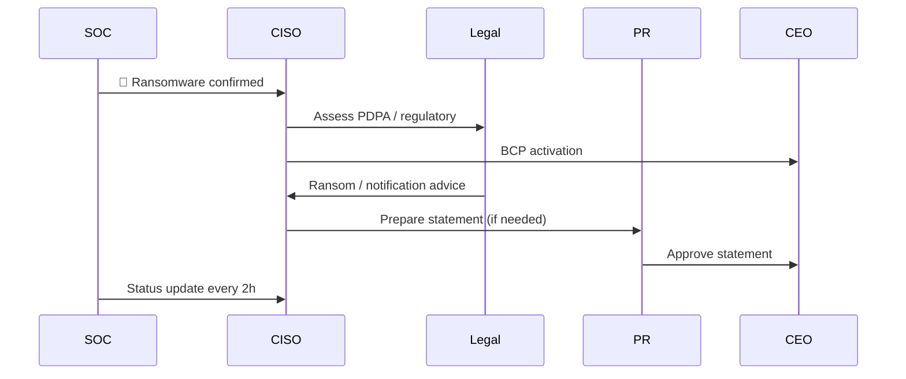
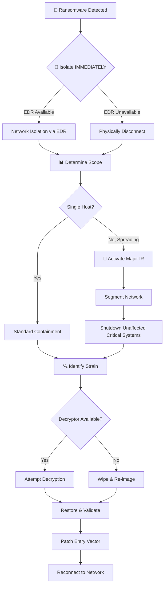
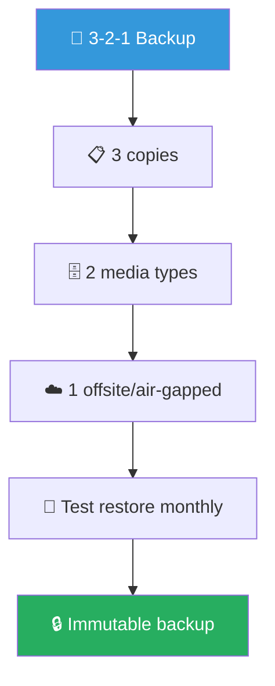
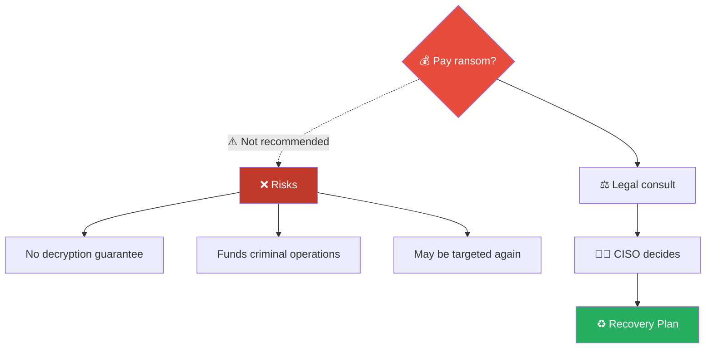

# Playbook: Ransomware Response

**ID**: PB-02
**Severity**: Critical | **Category**: Malware / Impact
**MITRE ATT&CK**: [T1486](https://attack.mitre.org/techniques/T1486/) (Data Encrypted for Impact), [T1490](https://attack.mitre.org/techniques/T1490/) (Inhibit System Recovery)
**Trigger**: EDR alert, User report (ransom note), SIEM (mass file rename/encrypt pattern)

> ⚠️ **CRITICAL**: Do NOT pay the ransom. Do NOT negotiate without Legal/CISO approval. Time is critical — every minute counts.

### Recovery Priority Order

```mermaid
graph LR
    A["1️⃣ AD/DC"] --> B["2️⃣ DNS/DHCP"]
    B --> C["3️⃣ Critical Servers"]
    C --> D["4️⃣ Business Apps"]
    D --> E["5️⃣ Workstations"]
    style A fill:#ff4444,color:#fff
    style B fill:#ff6600,color:#fff
    style C fill:#ff9900,color:#fff
    style D fill:#ffcc00,color:#000
    style E fill:#88cc00,color:#000
```

### Incident Communication Flow

```mermaid
sequenceDiagram
    participant SOC
    participant CISO
    participant Legal
    participant PR
    participant CEO
    SOC->>CISO: 🚨 Ransomware confirmed
    CISO->>Legal: Assess PDPA / regulatory
    CISO->>CEO: BCP activation
    Legal->>CISO: Ransom / notification advice
    CISO->>PR: Prepare statement (if needed)
    PR->>CEO: Approve statement
    SOC->>CISO: Status update every 2h
```

---

## Decision Flow

```mermaid
graph TD
    Alert["🚨 Ransomware Detected"] --> Isolate{"🔌 Isolate IMMEDIATELY"}
    Isolate -->|EDR Available| NetworkIso["Network Isolation via EDR"]
    Isolate -->|EDR Unavailable| Physical["Physically Disconnect"]
    NetworkIso --> Scope["📊 Determine Scope"]
    Physical --> Scope
    Scope --> Single{"Single Host?"}
    Single -->|Yes| Contain["Standard Containment"]
    Single -->|No, Spreading| Activate["🚨 Activate Major IR"]
    Activate --> Segment["Segment Network"]
    Segment --> Shutdown["Shutdown Unaffected Critical Systems"]
    Contain --> Identify["🔍 Identify Strain"]
    Shutdown --> Identify
    Identify --> Decrypt{"Decryptor Available?"}
    Decrypt -->|Yes| DecryptFiles["Attempt Decryption"]
    Decrypt -->|No| Wipe["Wipe & Re-image"]
    DecryptFiles --> Restore["Restore & Validate"]
    Wipe --> Restore
    Restore --> Patch["Patch Entry Vector"]
    Patch --> Reconnect["Reconnect to Network"]
```

---

## 1. Analysis (First 15 Minutes)

### 1.1 Immediate Verification

| Check | How | Done |
|:---|:---|:---:|
| Ransom note present? | Check Desktop, affected folders | ☐ |
| File extensions changed? | Look for `.encrypted`, `.locked`, `.crypt` | ☐ |
| Shadow copies deleted? | Check `vssadmin list shadows` | ☐ |
| Encryption still active? | Monitor file system activity | ☐ |

### 1.2 Scope Assessment

| Check | How | Done |
|:---|:---|:---:|
| Number of affected hosts | SIEM query for similar alerts | ☐ |
| Network shares encrypted? | Check SMB/CIFS share status | ☐ |
| Lateral movement evidence? | RDP/SMB/WMI/PsExec logs from affected host | ☐ |
| Data exfiltrated before encryption? | Firewall/DLP logs for large outbound transfers | ☐ |
| Backup integrity | Verify offline/immutable backups are intact | ☐ |

### 1.3 Strain Identification

| Method | Tool |
|:---|:---|
| Ransom note text | [ID Ransomware](https://id-ransomware.malwarehunterteam.com/) |
| Encrypted file sample | [No More Ransom](https://www.nomoreransom.org/) |
| File hash (malware binary) | VirusTotal, ThreatFox |
| C2 domain/IP | TI feeds, OSINT |

---

## 2. Containment

### 2.1 Immediate (within 5 minutes)

| # | Action | Tool | Done |
|:---:|:---|:---|:---:|
| 1 | **Network isolate** all affected hosts | EDR | ☐ |
| 2 | Disable affected user accounts | AD / IdP | ☐ |
| 3 | Block C2 IPs/domains at firewall | Firewall | ☐ |
| 4 | Block malware hash across all endpoints | EDR | ☐ |
| 5 | Disable RDP/SMB if spreading laterally | GPO / Firewall | ☐ |

### 2.2 If Spreading (Major Incident)

| # | Action | Done |
|:---:|:---|:---:|
| 1 | Activate Major Incident Response plan | ☐ |
| 2 | Segment network (isolate affected VLAN) | ☐ |
| 3 | Shut down critical servers pre-emptively | ☐ |
| 4 | Disable domain-wide SMBv1 | ☐ |
| 5 | Notify CISO, Legal, and executive team | ☐ |

---

## 3. Eradication & Recovery

### 3.1 Eradication

| # | Action | Done |
|:---:|:---|:---:|
| 1 | **Wipe & re-image** — do NOT attempt to clean | ☐ |
| 2 | Remove persistence mechanisms (scheduled tasks, services, registry) | ☐ |
| 3 | Scan all connected systems for dormant payloads | ☐ |
| 4 | Reset all potentially compromised credentials | ☐ |

### 3.2 Recovery

| # | Action | Done |
|:---:|:---|:---:|
| 1 | Restore from last known good backup (offline/immutable) | ☐ |
| 2 | Validate restored data integrity (hash comparison) | ☐ |
| 3 | Patch the entry vector (RDP, VPN, phishing gap) | ☐ |
| 4 | Re-enable network connectivity in stages | ☐ |
| 5 | Monitor recovered systems for 72 hours | ☐ |

---

## 4. Notification & Legal

| Stakeholder | When | Channel |
|:---|:---|:---|
| SOC Lead / Manager | Immediately | Chat + Phone |
| CISO | Within 30 minutes | Phone |
| Legal / Compliance | Within 1 hour | Email + Phone |
| CEO / Board (if major) | Within 4 hours | Briefing |
| Regulatory (PDPA/GDPR) | Within 72 hours if data breach | Official notification |
| Law enforcement | As directed by Legal | Official channels |

> ⚠️ Do NOT communicate details on potentially compromised channels (email may be monitored by attacker).

---

## 5. IoC Collection

| Type | Value | Source |
|:---|:---|:---|
| Malware Binary Hash | | EDR / Forensics |
| Ransom Note Filename | | Affected host |
| Encrypted File Extension | | Affected host |
| C2 IP/Domain | | Network logs |
| Initial Access Vector | | Investigation |
| Lateral Movement Tool | | EDR logs |

---

## 6. Evidence Checklist

| Evidence Type | What to Collect | Source | Why It Matters |
|:---|:---|:---|:---|
| Host impact evidence | Ransom note, encrypted extensions, affected hostnames, timestamps | Endpoint / EDR | Confirms strain behavior and spread timing |
| Malware evidence | Binary hash, execution path, persistence artifacts, process tree | EDR / forensic tools | Supports eradication and block actions |
| Lateral movement evidence | RDP/SMB/WMI/PsExec activity, authentication events | SIEM / Windows logs / EDR | Shows how the attack propagated |
| Recovery impact evidence | Backup status, immutable snapshot status, restore test results | Backup console / DR team | Determines recovery path and executive decisions |
| Legal and business impact evidence | Exfiltration indicators, affected systems, downtime, critical services impacted | DLP / NetFlow / asset inventory | Supports notification and business continuity decisions |

---

## 7. Minimum Telemetry Required

| Telemetry Source | Required For | Priority | Blind Spot If Missing |
|:---|:---|:---:|:---|
| Endpoint detection and forensic telemetry | Encryption behavior, process lineage, persistence, spread indicators | Required | Cannot confirm patient zero or active encryption behavior |
| Windows or system authentication logs | Lateral movement, credential abuse, privileged access | Required | Cannot trace propagation across hosts or accounts |
| Network telemetry and DNS logs | C2, staging, remote encryption activity, exfiltration clues | Required | Cannot scope external communication or propagation path |
| Backup, snapshot, and recovery logs | Restore viability, immutable copy status, recovery timing | Required | Recovery planning becomes guesswork |
| Asset inventory and business service mapping | Critical system impact and outage prioritization | Recommended | Executive prioritization and service recovery order become weak |

---

## 8. False Positive and Tuning Guide

| Scenario | Why It Looks Suspicious | How to Validate | Tuning Action | Escalate If |
|:---|:---|:---|:---|:---|
| Approved software deployment or patching | Large file changes and process execution can resemble encryption activity | Confirm deployment window, package source, and signed installer lineage | Suppress only the known package/process combination for the maintenance window | File rename/write behavior persists outside the approved package path |
| Backup, compression, or archival jobs | High file I/O and extension changes can look like ransomware staging | Validate service account, job schedule, destination, and expected host list | Tune thresholds for approved backup/compression binaries and service accounts | Unexpected user context, shadow copy deletion, or ransom notes appear |
| Security scanning or EDR remediation | Mass file touches or quarantine actions can appear destructive | Confirm scanner/remediation job ID and source console actions | Suppress by tool process name plus management server correlation | The same host also shows lateral movement or unknown payload execution |
| Lab, sandbox, or malware analysis environment | Intentional ransomware detonation for testing looks real in telemetry | Validate isolated asset tag, analyst owner, and lab network segment | Scope exceptions to isolated lab assets only | Activity escapes the lab boundary or reaches production identities/systems |

---

## 9. Post-Incident

- [ ] Conduct lessons learned within 5 business days
- [ ] Update endpoint hardening (disable macros, restrict PowerShell)
- [ ] Verify backup strategy (3-2-1 rule with immutable copy)
- [ ] Create/update detection rules for the attack chain
- [ ] Brief all SOC analysts on lessons learned
- [ ] Document in [Incident Report](../../11_Reporting_Templates/incident_report.en.md)

---

### 3-2-1 Backup Strategy

```mermaid
graph TD
    Backup["💾 3-2-1 Backup"] --> Three["📋 3 copies"]
    Three --> Two["🗄️ 2 media types"]
    Two --> One["☁️ 1 offsite/air-gapped"]
    One --> Test["🧪 Test restore monthly"]
    Test --> Immutable["🔒 Immutable backup"]
    style Backup fill:#3498db,color:#fff
    style Immutable fill:#27ae60,color:#fff
```

### Ransom Payment Decision

```mermaid
graph TD
    Pay{"💰 Pay ransom?"} -.->|⚠️ Not recommended| Risks["❌ Risks"]
    Pay --> Legal["⚖️ Legal consult"]
    Risks --> R1["No decryption guarantee"]
    Risks --> R2["Funds criminal operations"]
    Risks --> R3["May be targeted again"]
    Legal --> CISO["🧑‍💼 CISO decides"]
    CISO --> Recovery["♻️ Recovery Plan"]
    style Pay fill:#e74c3c,color:#fff
    style Risks fill:#c0392b,color:#fff
    style Recovery fill:#27ae60,color:#fff
```

## Detection Rules (Sigma)

| Rule | File |
|:---|:---|
| Ransomware Bulk Renaming | [file_bulk_renaming_ransomware.yml](../../08_Detection_Engineering/sigma_rules/file_bulk_renaming_ransomware.yml) |
| PowerShell Encoded Command | [proc_powershell_encoded.yml](../../08_Detection_Engineering/sigma_rules/proc_powershell_encoded.yml) |
| Execution from Temp/Downloads | [proc_temp_folder_execution.yml](../../08_Detection_Engineering/sigma_rules/proc_temp_folder_execution.yml) |

## Related Documents

- [IR Framework](../Framework.en.md)
- [Incident Report](../../11_Reporting_Templates/incident_report.en.md)
- [PB-12 Lateral Movement](Lateral_Movement.en.md)
- [PB-08 Data Exfiltration](Data_Exfiltration.en.md)
- [Disaster Recovery / BCP](../Disaster_Recovery_BCP.en.md)

## References

- [MITRE ATT&CK T1486 — Data Encrypted for Impact](https://attack.mitre.org/techniques/T1486/)
- [CISA Ransomware Guide](https://www.cisa.gov/stopransomware/ransomware-guide)
- [No More Ransom Project](https://www.nomoreransom.org/)
- [ID Ransomware](https://id-ransomware.malwarehunterteam.com/)
