# Playbook: Ransomware Response

**ID**: PB-02
**Severity**: Critical | **Category**: Malware / Impact
**MITRE ATT&CK**: [T1486](https://attack.mitre.org/techniques/T1486/) (Data Encrypted for Impact), [T1490](https://attack.mitre.org/techniques/T1490/) (Inhibit System Recovery)
**Trigger**: EDR alert, User report (ransom note), SIEM (mass file rename/encrypt pattern)

> ⚠️ **CRITICAL**: Do NOT pay the ransom. Do NOT negotiate without Legal/CISO approval. Time is critical — every minute counts.

---

## Decision Flow

```mermaid
graph TD
    Alert["🚨 Ransomware Detected"] --> Isolate{"🔌 Isolate IMMEDIATELY"}
    Isolate -->|EDR Available| NetworkIso["Network Isolation via EDR"]
    Isolate -->|EDR Unavailable| Physical["Physically Disconnect"]
    NetworkIso --> Scope["📊 Determine Scope"]
    Physical --> Scope
    Scope --> Single{"Single Host?"}
    Single -->|Yes| Contain["Standard Containment"]
    Single -->|No, Spreading| Activate["🚨 Activate Major IR"]
    Activate --> Segment["Segment Network"]
    Segment --> Shutdown["Shutdown Unaffected Critical Systems"]
    Contain --> Identify["🔍 Identify Strain"]
    Shutdown --> Identify
    Identify --> Decrypt{"Decryptor Available?"}
    Decrypt -->|Yes| DecryptFiles["Attempt Decryption"]
    Decrypt -->|No| Wipe["Wipe & Re-image"]
    DecryptFiles --> Restore["Restore & Validate"]
    Wipe --> Restore
    Restore --> Patch["Patch Entry Vector"]
    Patch --> Reconnect["Reconnect to Network"]
```

---

## 1. Analysis (First 15 Minutes)

### 1.1 Immediate Verification

| Check | How | Done |
|:---|:---|:---:|
| Ransom note present? | Check Desktop, affected folders | ☐ |
| File extensions changed? | Look for `.encrypted`, `.locked`, `.crypt` | ☐ |
| Shadow copies deleted? | Check `vssadmin list shadows` | ☐ |
| Encryption still active? | Monitor file system activity | ☐ |

### 1.2 Scope Assessment

| Check | How | Done |
|:---|:---|:---:|
| Number of affected hosts | SIEM query for similar alerts | ☐ |
| Network shares encrypted? | Check SMB/CIFS share status | ☐ |
| Lateral movement evidence? | RDP/SMB/WMI/PsExec logs from affected host | ☐ |
| Data exfiltrated before encryption? | Firewall/DLP logs for large outbound transfers | ☐ |
| Backup integrity | Verify offline/immutable backups are intact | ☐ |

### 1.3 Strain Identification

| Method | Tool |
|:---|:---|
| Ransom note text | [ID Ransomware](https://id-ransomware.malwarehunterteam.com/) |
| Encrypted file sample | [No More Ransom](https://www.nomoreransom.org/) |
| File hash (malware binary) | VirusTotal, ThreatFox |
| C2 domain/IP | TI feeds, OSINT |

---

## 2. Containment

### 2.1 Immediate (within 5 minutes)

| # | Action | Tool | Done |
|:---:|:---|:---|:---:|
| 1 | **Network isolate** all affected hosts | EDR | ☐ |
| 2 | Disable affected user accounts | AD / IdP | ☐ |
| 3 | Block C2 IPs/domains at firewall | Firewall | ☐ |
| 4 | Block malware hash across all endpoints | EDR | ☐ |
| 5 | Disable RDP/SMB if spreading laterally | GPO / Firewall | ☐ |

### 2.2 If Spreading (Major Incident)

| # | Action | Done |
|:---:|:---|:---:|
| 1 | Activate Major Incident Response plan | ☐ |
| 2 | Segment network (isolate affected VLAN) | ☐ |
| 3 | Shut down critical servers pre-emptively | ☐ |
| 4 | Disable domain-wide SMBv1 | ☐ |
| 5 | Notify CISO, Legal, and executive team | ☐ |

---

## 3. Eradication & Recovery

### 3.1 Eradication

| # | Action | Done |
|:---:|:---|:---:|
| 1 | **Wipe & re-image** — do NOT attempt to clean | ☐ |
| 2 | Remove persistence mechanisms (scheduled tasks, services, registry) | ☐ |
| 3 | Scan all connected systems for dormant payloads | ☐ |
| 4 | Reset all potentially compromised credentials | ☐ |

### 3.2 Recovery

| # | Action | Done |
|:---:|:---|:---:|
| 1 | Restore from last known good backup (offline/immutable) | ☐ |
| 2 | Validate restored data integrity (hash comparison) | ☐ |
| 3 | Patch the entry vector (RDP, VPN, phishing gap) | ☐ |
| 4 | Re-enable network connectivity in stages | ☐ |
| 5 | Monitor recovered systems for 72 hours | ☐ |

---

## 4. Notification & Legal

| Stakeholder | When | Channel |
|:---|:---|:---|
| SOC Lead / Manager | Immediately | Chat + Phone |
| CISO | Within 30 minutes | Phone |
| Legal / Compliance | Within 1 hour | Email + Phone |
| CEO / Board (if major) | Within 4 hours | Briefing |
| Regulatory (PDPA/GDPR) | Within 72 hours if data breach | Official notification |
| Law enforcement | As directed by Legal | Official channels |

> ⚠️ Do NOT communicate details on potentially compromised channels (email may be monitored by attacker).

---

## 5. IoC Collection

| Type | Value | Source |
|:---|:---|:---|
| Malware Binary Hash | | EDR / Forensics |
| Ransom Note Filename | | Affected host |
| Encrypted File Extension | | Affected host |
| C2 IP/Domain | | Network logs |
| Initial Access Vector | | Investigation |
| Lateral Movement Tool | | EDR logs |

---

## 6. Post-Incident

- [ ] Conduct lessons learned within 5 business days
- [ ] Update endpoint hardening (disable macros, restrict PowerShell)
- [ ] Verify backup strategy (3-2-1 rule with immutable copy)
- [ ] Create/update detection rules for the attack chain
- [ ] Brief all SOC analysts on lessons learned
- [ ] Document in [Incident Report](../../templates/incident_report.en.md)

---

## Related Documents

- [IR Framework](../Framework.en.md)
- [Incident Report](../../templates/incident_report.en.md)
- [PB-12 Lateral Movement](Lateral_Movement.en.md)
- [PB-08 Data Exfiltration](Data_Exfiltration.en.md)
- [Disaster Recovery / BCP](../Disaster_Recovery_BCP.en.md)

## References

- [MITRE ATT&CK T1486 — Data Encrypted for Impact](https://attack.mitre.org/techniques/T1486/)
- [CISA Ransomware Guide](https://www.cisa.gov/stopransomware/ransomware-guide)
- [No More Ransom Project](https://www.nomoreransom.org/)
- [ID Ransomware](https://id-ransomware.malwarehunterteam.com/)
