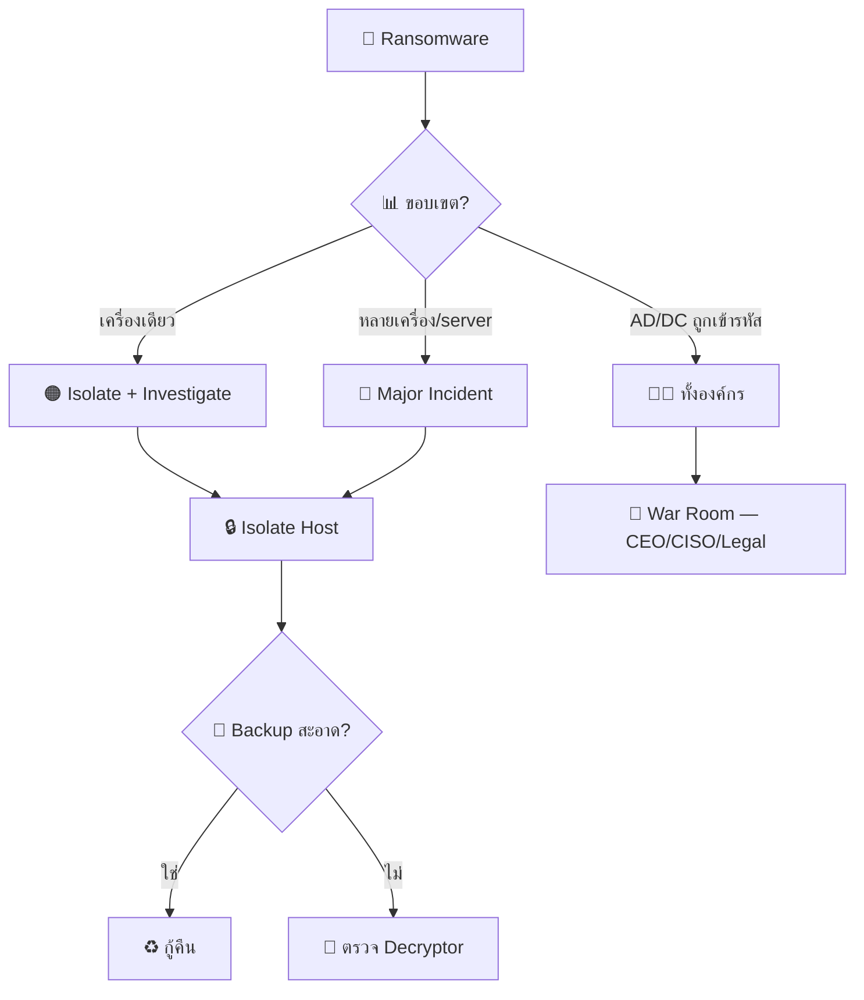
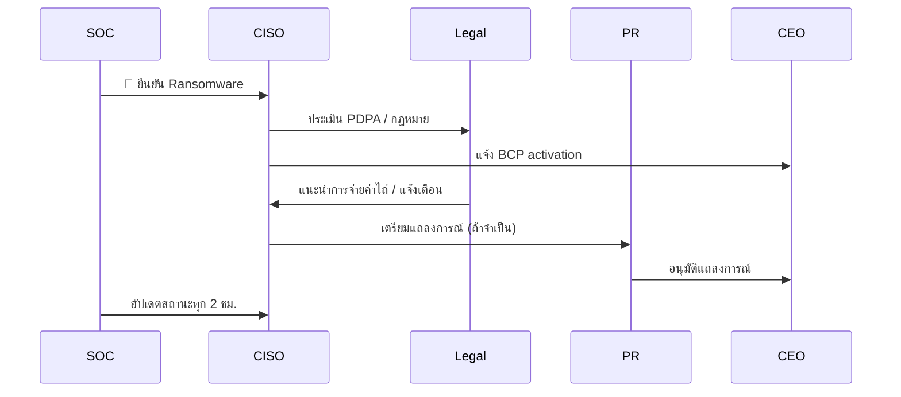
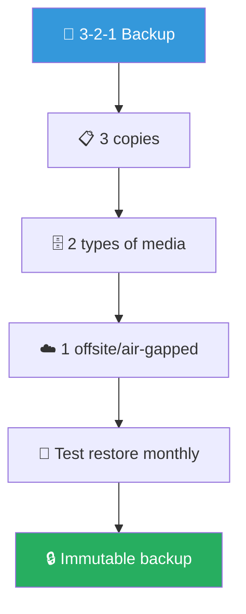
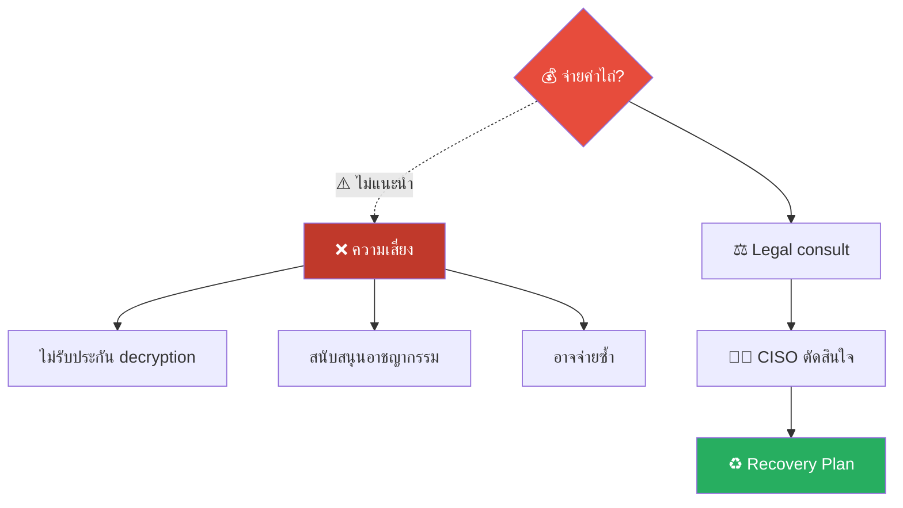

# Playbook: แรนซัมแวร์ (Ransomware)

**ID**: PB-02
**ระดับความรุนแรง**: วิกฤต | **หมวดหมู่**: การโจมตี
**MITRE ATT&CK**: [T1486](https://attack.mitre.org/techniques/T1486/) (Data Encrypted for Impact), [T1489](https://attack.mitre.org/techniques/T1489/) (Service Stop)
**ทริกเกอร์**: EDR alert, ผู้ใช้รายงานไฟล์ถูกเข้ารหัส, Ransom note, Canary file triggered

> 🚨 **ห้ามจ่ายค่าไถ่** โดยไม่ปรึกษา Legal + CISO — การจ่ายไม่รับประกันการกู้คืน

---

## ผังการตัดสินใจ

---

## 1. การวิเคราะห์

### 1.1 รายการตรวจสอบ

| รายการ | วิธีตรวจสอบ | เสร็จ |
|:---|:---|:---:|
| ตระกูลแรนซัมแวร์ (ชื่อ, ransom note) | ID Ransomware | ☐ |
| จำนวนเครื่อง/server ที่ได้รับผลกระทบ | EDR / SIEM | ☐ |
| Entry vector (phishing/RDP/exploit) | EDR timeline | ☐ |
| มี data exfiltration ก่อนเข้ารหัส? (double extortion) | Netflow / DLP | ☐ |
| Backup ปลอดภัย? (offline / immutable?) | Backup team | ☐ |
| AD/DC ได้รับผลกระทบ? | AD admin | ☐ |
| มี decryptor ฟรี? | [NoMoreRansom.org](https://www.nomoreransom.org/) | ☐ |

### 1.2 กลุ่มแรนซัมแวร์และพฤติกรรม

| กลุ่ม | Double Extortion | สร้างบน |
|:---|:---|:---|
| LockBit 3.0 | ✅ | Builder leaked |
| BlackCat/ALPHV | ✅ | Rust |
| Cl0p | ✅ (MOVEit, GoAnywhere) | File transfer exploit |
| PLAY | ✅ | — |
| Royal/BlackSuit | ✅ | — |

---

## 2. การควบคุม

| # | การดำเนินการ | เสร็จ |
|:---:|:---|:---:|
| 1 | **Isolate** ทุกเครื่องที่ได้รับผลกระทบ (EDR networkquarantine) | ☐ |
| 2 | **ตัด** internet access ขาออก (ป้องกันเข้ารหัสเพิ่ม) | ☐ |
| 3 | **รีเซ็ตรหัสผ่าน** KRBTGT (2 ครั้ง) ถ้า AD ถูกบุกรุก | ☐ |
| 4 | **ปิด RDP** ภายนอกทั้งหมด | ☐ |
| 5 | **ตรวจ** backup — ยังสะอาด? Disconnect backup! | ☐ |
| 6 | **แจ้ง** Executive / Legal ทันที | ☐ |

---

## 3. การกำจัด

| # | การดำเนินการ | เสร็จ |
|:---:|:---|:---:|
| 1 | ลบมัลแวร์ + persistence ทั้งหมด | ☐ |
| 2 | ล้าง GPO/script ที่ใช้กระจายมัลแวร์ | ☐ |
| 3 | หมุนเวียน credentials ทั้งหมด (admin, service accounts) | ☐ |
| 4 | รีเซ็ต KRBTGT (ถ้ายังไม่ได้ทำ) | ☐ |

### ผังลำดับการกู้คืน

### ผังสื่อสารระหว่างเหตุการณ์

---

## 4. การฟื้นฟู

| # | การดำเนินการ | เสร็จ |
|:---:|:---|:---:|
| 1 | กู้คืนจาก backup (ตรวจสอบว่าสะอาดก่อน) | ☐ |
| 2 | กู้คืน AD/DC ก่อน → จากนั้น server → workstation | ☐ |
| 3 | ใช้ immutable backups (3-2-1 rule) | ☐ |
| 4 | Deploy EDR ทุกเครื่อง + ปิด RDP ภายนอก | ☐ |
| 5 | Tabletop exercise ทุก 6 เดือน | ☐ |

---

## 5. เกณฑ์การยกระดับ

| เงื่อนไข | ยกระดับไปยัง |
|:---|:---|
| ยืนยัน ransomware | CISO + Major Incident ทันที |
| AD/DC ถูกเข้ารหัส | CEO, Legal, PR |
| Data exfiltration (double extortion) | Legal + DPO (PDPA 72 ชม.) |
| ธุรกิจหยุดชะงัก | BCP team + Executive |
| กลุ่ม ransomware เผยแพร่ข้อมูล | PR + Legal + Law Enforcement |

---

### ผัง 3-2-1 Backup Strategy

### ผังตัดสินใจ Ransom Payment

## เอกสารที่เกี่ยวข้อง

- [กรอบการตอบสนองต่อเหตุการณ์](../Framework.th.md)
- [แม่แบบรายงานเหตุการณ์](../../templates/incident_report.th.md)
- [PB-03 มัลแวร์](Malware_Infection.th.md)
- [PB-09 Lateral Movement](Lateral_Movement.th.md)

## อ้างอิง

- [CISA — Ransomware Guide](https://www.cisa.gov/stopransomware)
- [NoMoreRansom.org](https://www.nomoreransom.org/)
- [MITRE ATT&CK T1486](https://attack.mitre.org/techniques/T1486/)
