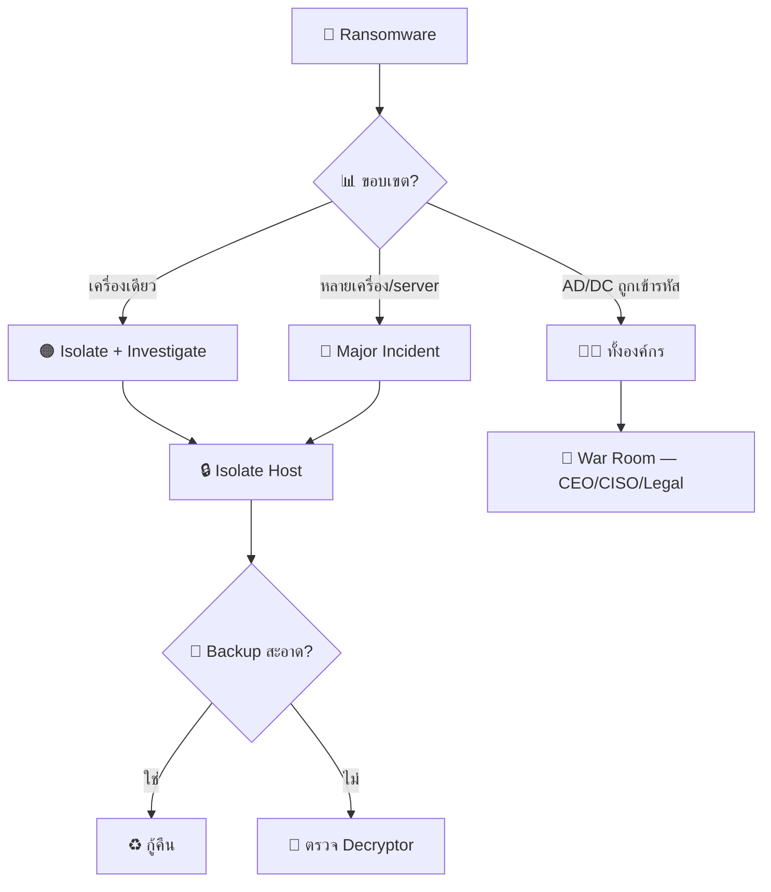
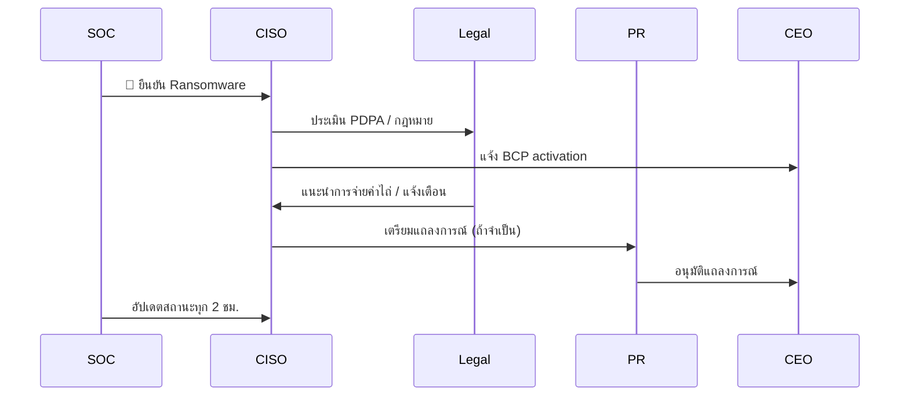
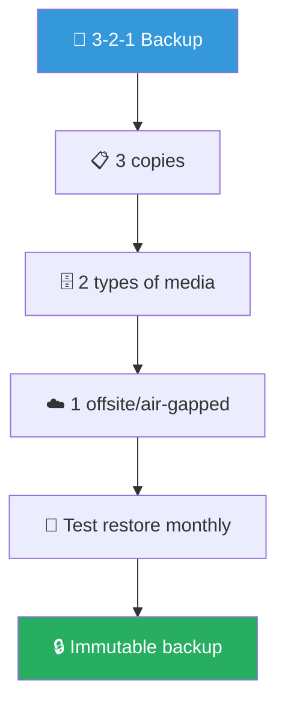
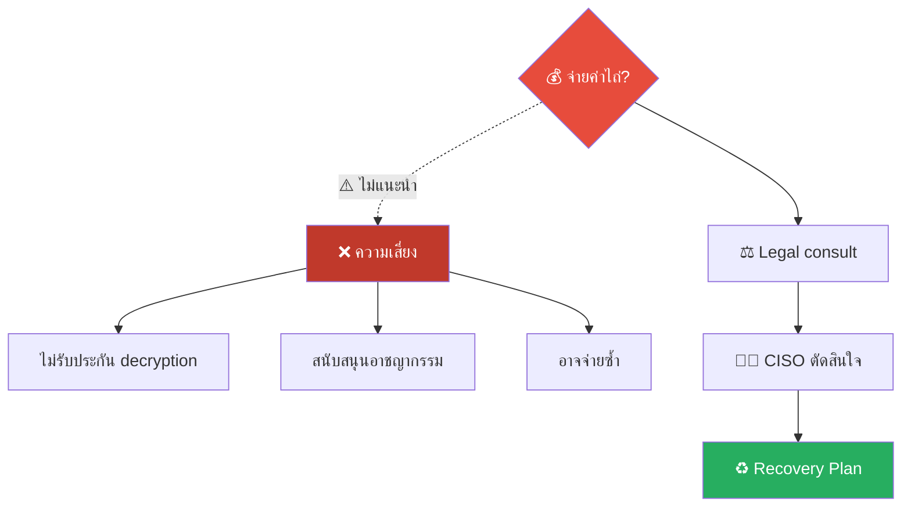

# Playbook: แรนซัมแวร์ (Ransomware)

**ID**: PB-02
**ระดับความรุนแรง**: วิกฤต | **หมวดหมู่**: การโจมตี
**MITRE ATT&CK**: [T1486](https://attack.mitre.org/techniques/T1486/) (Data Encrypted for Impact), [T1489](https://attack.mitre.org/techniques/T1489/) (Service Stop)
**ทริกเกอร์**: EDR alert, ผู้ใช้รายงานไฟล์ถูกเข้ารหัส, Ransom note, Canary file triggered

> 🚨 **ห้ามจ่ายค่าไถ่** โดยไม่ปรึกษา Legal + CISO — การจ่ายไม่รับประกันการกู้คืน

---

## ผังการตัดสินใจ


```mermaid
graph TD
    Alert["🚨 Ransomware"] --> Scope{"📊 ขอบเขต?"}
    Scope -->|เครื่องเดียว| Single["🟠 Isolate + Investigate"]
    Scope -->|หลายเครื่อง/server| Multi["🔴 Major Incident"]
    Scope -->|AD/DC ถูกเข้ารหัส| Critical["🔴🔴 ทั้งองค์กร"]
    Single --> Contain["🔒 Isolate Host"]
    Multi --> Contain
    Critical --> War["🏢 War Room — CEO/CISO/Legal"]
    Contain --> Backup{"💾 Backup สะอาด?"}
    Backup -->|ใช่| Restore["♻️ กู้คืน"]
    Backup -->|ไม่| Decrypt["🔑 ตรวจ Decryptor"]
```

---

## หลังเหตุการณ์ (Post-Incident)

- [ ] ทดสอบการ restore จาก backup ให้สมบูรณ์
- [ ] ใช้ 3-2-1 backup strategy
- [ ] ทบทวน endpoint hardening (macros, RDP, PowerShell)
- [ ] ใช้ network segmentation ป้องกัน lateral movement
- [ ] จัด awareness training เรื่อง phishing/ransomware
- [ ] จัดทำ [Incident Report](../../11_Reporting_Templates/incident_report.th.md)


## 1. การวิเคราะห์

### 1.1 รายการตรวจสอบ

| รายการ | วิธีตรวจสอบ | เสร็จ |
|:---|:---|:---:|
| ตระกูลแรนซัมแวร์ (ชื่อ, ransom note) | ID Ransomware | ☐ |
| จำนวนเครื่อง/server ที่ได้รับผลกระทบ | EDR / SIEM | ☐ |
| Entry vector (phishing/RDP/exploit) | EDR timeline | ☐ |
| มี data exfiltration ก่อนเข้ารหัส? (double extortion) | Netflow / DLP | ☐ |
| Backup ปลอดภัย? (offline / immutable?) | Backup team | ☐ |
| AD/DC ได้รับผลกระทบ? | AD admin | ☐ |
| มี decryptor ฟรี? | [NoMoreRansom.org](https://www.nomoreransom.org/) | ☐ |

### 1.2 กลุ่มแรนซัมแวร์และพฤติกรรม

| กลุ่ม | Double Extortion | สร้างบน |
|:---|:---|:---|
| LockBit 3.0 | ✅ | Builder leaked |
| BlackCat/ALPHV | ✅ | Rust |
| Cl0p | ✅ (MOVEit, GoAnywhere) | File transfer exploit |
| PLAY | ✅ | — |
| Royal/BlackSuit | ✅ | — |

---

## 2. การควบคุม

| # | การดำเนินการ | เสร็จ |
|:---:|:---|:---:|
| 1 | **Isolate** ทุกเครื่องที่ได้รับผลกระทบ (EDR networkquarantine) | ☐ |
| 2 | **ตัด** internet access ขาออก (ป้องกันเข้ารหัสเพิ่ม) | ☐ |
| 3 | **รีเซ็ตรหัสผ่าน** KRBTGT (2 ครั้ง) ถ้า AD ถูกบุกรุก | ☐ |
| 4 | **ปิด RDP** ภายนอกทั้งหมด | ☐ |
| 5 | **ตรวจ** backup — ยังสะอาด? Disconnect backup! | ☐ |
| 6 | **แจ้ง** Executive / Legal ทันที | ☐ |

---

## 3. การกำจัด

| # | การดำเนินการ | เสร็จ |
|:---:|:---|:---:|
| 1 | ลบมัลแวร์ + persistence ทั้งหมด | ☐ |
| 2 | ล้าง GPO/script ที่ใช้กระจายมัลแวร์ | ☐ |
| 3 | หมุนเวียน credentials ทั้งหมด (admin, service accounts) | ☐ |
| 4 | รีเซ็ต KRBTGT (ถ้ายังไม่ได้ทำ) | ☐ |

### ผังลำดับการกู้คืน


```mermaid
graph LR
    A["1️⃣ AD/DC"] --> B["2️⃣ DNS/DHCP"]
    B --> C["3️⃣ Critical Servers"]
    C --> D["4️⃣ Business Apps"]
    D --> E["5️⃣ Workstations"]
    style A fill:#ff4444,color:#fff
    style B fill:#ff6600,color:#fff
    style C fill:#ff9900,color:#fff
    style D fill:#ffcc00,color:#000
    style E fill:#88cc00,color:#000
```

### ผังสื่อสารระหว่างเหตุการณ์


```mermaid
sequenceDiagram
    participant SOC
    participant CISO
    participant Legal
    participant PR
    participant CEO
    SOC->>CISO: 🚨 ยืนยัน Ransomware
    CISO->>Legal: ประเมิน PDPA / กฎหมาย
    CISO->>CEO: แจ้ง BCP activation
    Legal->>CISO: แนะนำการจ่ายค่าไถ่ / แจ้งเตือน
    CISO->>PR: เตรียมแถลงการณ์ (ถ้าจำเป็น)
    PR->>CEO: อนุมัติแถลงการณ์
    SOC->>CISO: อัปเดตสถานะทุก 2 ชม.
```

---

## 4. การฟื้นฟู

| # | การดำเนินการ | เสร็จ |
|:---:|:---|:---:|
| 1 | กู้คืนจาก backup (ตรวจสอบว่าสะอาดก่อน) | ☐ |
| 2 | กู้คืน AD/DC ก่อน → จากนั้น server → workstation | ☐ |
| 3 | ใช้ immutable backups (3-2-1 rule) | ☐ |
| 4 | Deploy EDR ทุกเครื่อง + ปิด RDP ภายนอก | ☐ |
| 5 | Tabletop exercise ทุก 6 เดือน | ☐ |

---

## 5. เกณฑ์การยกระดับ

| เงื่อนไข | ยกระดับไปยัง |
|:---|:---|
| ยืนยัน ransomware | CISO + Major Incident ทันที |
| AD/DC ถูกเข้ารหัส | CEO, Legal, PR |
| Data exfiltration (double extortion) | Legal + DPO (PDPA 72 ชม.) |
| ธุรกิจหยุดชะงัก | BCP team + Executive |
| กลุ่ม ransomware เผยแพร่ข้อมูล | PR + Legal + Law Enforcement |

---

## 6. Evidence Checklist

| ประเภทหลักฐาน | สิ่งที่ต้องเก็บ | แหล่งข้อมูล | เหตุผลที่ต้องเก็บ |
|:---|:---|:---|:---|
| หลักฐานผลกระทบที่เครื่อง | ransom note, encrypted extensions, hostname ที่ได้รับผลกระทบ, timestamp | Endpoint / EDR | ยืนยันพฤติกรรมของสายพันธุ์และเวลาเริ่มกระจาย |
| หลักฐานมัลแวร์ | binary hash, execution path, persistence artifacts, process tree | EDR / forensic tools | ใช้กำจัดและ block การกลับมาอีก |
| หลักฐาน lateral movement | กิจกรรม RDP/SMB/WMI/PsExec, authentication events | SIEM / Windows logs / EDR | ใช้ระบุวิธีการกระจายภายใน |
| หลักฐานด้านการกู้คืน | สถานะ backup, immutable snapshot, ผล restore test | Backup console / DR team | ใช้ตัดสินใจเส้นทาง recovery |
| หลักฐานผลกระทบทางธุรกิจและกฎหมาย | ตัวบ่งชี้ exfiltration, ระบบที่ได้รับผลกระทบ, downtime, critical services | DLP / NetFlow / asset inventory | ใช้ตัดสินใจเรื่อง notification และ BCP |

---

## 7. Minimum Telemetry Required

| แหล่ง Telemetry | ใช้เพื่ออะไร | ความสำคัญ | Blind Spot ถ้าไม่มี |
|:---|:---|:---:|:---|
| Endpoint detection และ forensic telemetry | ดู encryption behavior, process lineage, persistence, การแพร่กระจาย | Required | ยืนยัน patient zero หรือการเข้ารหัสที่ยัง active อยู่ไม่ได้ |
| Windows หรือ system authentication logs | ดู lateral movement, credential abuse, privileged access | Required | ไล่เส้นทางการแพร่ข้ามเครื่องหรือข้ามบัญชีไม่ได้ |
| Network telemetry และ DNS logs | ดู C2, staging, remote encryption activity, exfiltration clue | Required | scope การสื่อสารภายนอกหรือ propagation path ไม่ครบ |
| Backup, snapshot, และ recovery logs | ประเมิน restore viability, immutable copy, เวลา recovery | Required | วางแผนกู้คืนแบบมีข้อมูลรองรับไม่ได้ |
| Asset inventory และ business service mapping | ดูผลกระทบต่อระบบสำคัญและลำดับการกู้คืน | Recommended | จัดลำดับความสำคัญให้ผู้บริหารและทีมปฏิบัติการได้ไม่ดี |

---

## 8. False Positive และ Tuning Guide

| Scenario | ทำไมจึงดูน่าสงสัย | วิธีตรวจสอบ | Tuning Action | ต้องยกระดับเมื่อ |
|:---|:---|:---|:---|:---|
| งาน deploy software หรือ patching ที่ได้รับอนุมัติ | การเขียนไฟล์จำนวนมากและ process execution ดูเหมือน encryption | ยืนยัน maintenance window, package source, และ signed installer lineage | suppress เฉพาะ package/process ที่รู้จักในช่วง maintenance window | การ rename/write ไฟล์ยังเกิดต่อนอก path ของ package ที่อนุมัติ |
| งาน backup, compression, หรือ archival | file I/O สูงและ extension change ดูเหมือน ransomware staging | ยืนยัน service account, schedule, destination, และ host list | tune threshold สำหรับ binary และ service account ที่อนุมัติ | มี user context แปลก, shadow copy deletion, หรือ ransom note |
| Security scanning หรือ EDR remediation | การแตะไฟล์จำนวนมากหรือการกักกันไฟล์อาจดูเหมือนความเสียหาย | ยืนยัน job ID และ action จาก console ของเครื่องมือ | suppress ตามชื่อ process ของเครื่องมือร่วมกับ management server correlation | เครื่องเดียวกันมี lateral movement หรือ payload ที่ไม่รู้จักร่วมด้วย |
| Lab, sandbox, หรือ malware analysis environment | การระเบิด ransomware ในห้องทดสอบดูเหมือนเหตุจริง | ยืนยัน asset tag, owner, และ network segment ของห้องทดสอบ | จำกัด exception เฉพาะ asset ใน lab ที่แยกจาก production | พฤติกรรมหลุดออกจาก lab boundary หรือแตะระบบ production |

---

### ผัง 3-2-1 Backup Strategy


```mermaid
graph TD
    Backup["💾 3-2-1 Backup"] --> Three["📋 3 copies"]
    Three --> Two["🗄️ 2 types of media"]
    Two --> One["☁️ 1 offsite/air-gapped"]
    One --> Test["🧪 Test restore monthly"]
    Test --> Immutable["🔒 Immutable backup"]
    style Backup fill:#3498db,color:#fff
    style Immutable fill:#27ae60,color:#fff
```

### ผังตัดสินใจ Ransom Payment


```mermaid
graph TD
    Pay{"💰 จ่ายค่าไถ่?"} -.->|⚠️ ไม่แนะนำ| Risks["❌ ความเสี่ยง"]
    Pay --> Legal["⚖️ Legal consult"]
    Risks --> R1["ไม่รับประกัน decryption"]
    Risks --> R2["สนับสนุนอาชญากรรม"]
    Risks --> R3["อาจจ่ายซ้ำ"]
    Legal --> CISO["🧑‍💼 CISO ตัดสินใจ"]
    CISO --> Recovery["♻️ Recovery Plan"]
    style Pay fill:#e74c3c,color:#fff
    style Risks fill:#c0392b,color:#fff
    style Recovery fill:#27ae60,color:#fff
```

## กฎตรวจจับ (Sigma)

| กฎ | ไฟล์ |
|:---|:---|
| Ransomware Bulk Renaming | [file_bulk_renaming_ransomware.yml](../../08_Detection_Engineering/sigma_rules/file_bulk_renaming_ransomware.yml) |
| PowerShell Encoded Command | [proc_powershell_encoded.yml](../../08_Detection_Engineering/sigma_rules/proc_powershell_encoded.yml) |
| Execution from Temp/Downloads | [proc_temp_folder_execution.yml](../../08_Detection_Engineering/sigma_rules/proc_temp_folder_execution.yml) |

## เอกสารที่เกี่ยวข้อง

- [กรอบการตอบสนองต่อเหตุการณ์](../Framework.th.md)
- [แม่แบบรายงานเหตุการณ์](../../11_Reporting_Templates/incident_report.th.md)
- [PB-03 มัลแวร์](Malware_Infection.th.md)
- [PB-09 Lateral Movement](Lateral_Movement.th.md)

## Ransomware Decision Framework

| Question | Yes | No |
|:---|:---|:---|
| Backups available? | Restore from backup | Assess alternatives |
| Backups verified clean? | Begin restore | Scan backups first |
| Ransom affordable? | Legal consult | Focus on recovery |
| Decryptor available? | Use ID Ransomware | Continue assessment |
| Critical data affected? | Escalate to CEO | Standard IR |

### Recovery Priority Matrix

| System | Priority | RTO | Restore Method |
|:---|:---|:---|:---|
| Domain Controllers | P1 | 4 hrs | DSRM restore |
| Core databases | P1 | 8 hrs | Backup restore |
| Email servers | P2 | 12 hrs | Cloud failover |
| File servers | P2 | 24 hrs | Backup restore |
| Workstations | P3 | 48 hrs | Reimage |

### Post-Ransomware Hardening

```
Hardening Checklist:
━━━━━━━━━━━━━━━━━━━
☐ Patch all systems to current
☐ Reset ALL credentials
☐ Enable MFA everywhere
☐ Segment network (micro)
☐ Deploy EDR on all endpoints
☐ Implement backup 3-2-1 rule
☐ Test restore procedures
```

### Encryption Assessment

| Check | Method | Result |
|:---|:---|:---|
| Encrypted file count | Dir scan | [N] files |
| Decryptor available | nomoreransom.org | Yes/No |
| Backup integrity | Restore test | Verified/Failed |

## References

- [CISA — Ransomware Guide](https://www.cisa.gov/stopransomware)
- [NoMoreRansom.org](https://www.nomoreransom.org/)
- [MITRE ATT&CK T1486](https://attack.mitre.org/techniques/T1486/)
