# Playbook: New Rogue Admin Account

**ID**: PB-15
**Severity**: Critical | **Category**: Privilege Escalation / Persistence
**MITRE ATT&CK**: [T1098](https://attack.mitre.org/techniques/T1098/) (Account Manipulation), [T1136](https://attack.mitre.org/techniques/T1136/) (Create Account)
**Trigger**: PAM alert, AD audit anomaly, Whistleblower report, UEBA, SOD violation

### Behavioral Indicators

```mermaid
graph TD
    Monitor["👁️ UEBA/PAM"] --> A["🕐 Off-hours access"]
    Monitor --> B["📋 Bypass Change Mgmt"]
    Monitor --> C["🔑 Create backdoor account"]
    Monitor --> D["🗑️ Delete audit logs"]
    Monitor --> E["📤 Export data"]
    A --> Score["⚠️ High Risk Score"]
    B --> Score
    C --> Score
    D --> Score
    E --> Score
    Score --> SOC["🚨 Alert SOC"]
```

### Covert Investigation

---

## Decision Flow

```mermaid
graph TD
    Alert["🚨 New Admin Account Detected"] --> Ticket{"📋 Approved Change Request?"}
    Ticket -->|Yes, RFC exists| Verify["✅ Verify RFC details match"]
    Ticket -->|No RFC| Creator{"🔍 Who Created It?"}
    Verify -->|Match| FP["Close — Authorized"]
    Verify -->|Mismatch| Creator
    Creator --> CheckAcct{"Creator Account Status?"}
    CheckAcct -->|Compromised Indicators| Critical["🚨 Assume Breach"]
    CheckAcct -->|Legitimate Admin| Justify{"Business Justification?"}
    Justify -->|Valid| Policy["⚠️ Policy Violation — Educate"]
    Justify -->|None| Critical
    Critical --> DisableAll["🔒 Disable Rogue + Reset Creator"]
```

---

## 1. Analysis

### 1.1 Initial Checks

| Check | How | Done |
|:---|:---|:---:|
| RFC / Change request exists? | ITSM / Change Management system | ☐ |
| Who created the account? | Event ID 4720 (account created) + 4732/4728 (group add) | ☐ |
| When was it created? | Event timestamp — during business hours? | ☐ |
| From which system? | Source workstation / server in event log | ☐ |
| What groups was it added to? | Domain Admins, Enterprise Admins, Schema Admins? | ☐ |

### 1.2 Creator Account Investigation

| Check | How | Done |
|:---|:---|:---:|
| Creator's recent login locations | SIEM — impossible travel? New devices? | ☐ |
| Creator's recent admin actions | AD audit log — unusual activity? | ☐ |
| Other accounts created by same user | SIEM query: EventID 4720 by creator | ☐ |
| Was creator account accessed from compromised host? | Cross-reference with EDR alerts | ☐ |

### 1.3 Scope Assessment

- [ ] Were any other accounts created by the same actor?
- [ ] Were group memberships changed on existing accounts?
- [ ] Were any GPOs modified?
- [ ] Signs of lateral movement from the new admin account?
- [ ] Any data access from the rogue account?

---

## 2. Containment

### 2.1 Immediate Actions

| # | Action | Tool | Done |
|:---:|:---|:---|:---:|
| 1 | **Disable** the rogue admin account | AD / IdP | ☐ |
| 2 | **Reset** the creator's password | AD / IdP | ☐ |
| 3 | **Revoke** all sessions for both accounts | IdP | ☐ |
| 4 | **Remove** rogue account from all privileged groups | AD | ☐ |
| 5 | **Block** source IP (if external access) | Firewall | ☐ |

### 2.2 Extended Containment

| # | Action | Done |
|:---:|:---|:---:|
| 1 | Audit ALL privileged group memberships (Domain Admins, Enterprise Admins, Schema Admins, local Admins) | ☐ |
| 2 | Check for additional new accounts or group changes in past 72 hours | ☐ |
| 3 | Review GPO modifications in same timeframe | ☐ |
| 4 | Check for Golden Ticket / Silver Ticket indicators | ☐ |

---

## 3. Eradication

| # | Action | Done |
|:---:|:---|:---:|
| 1 | **Delete** the rogue account (after forensic preservation) | ☐ |
| 2 | Remove any persistence created by the rogue account (scheduled tasks, services, GPOs) | ☐ |
| 3 | Reset KRBTGT password (if Domain Admin compromise suspected) — **twice, 12 hours apart** | ☐ |
| 4 | Rotate all service account passwords that may have been exposed | ☐ |
| 5 | Scan creator's workstation for malware | ☐ |

---

## 4. Recovery

| # | Action | Done |
|:---:|:---|:---:|
| 1 | Conduct full privileged access review | ☐ |
| 2 | Enable enhanced monitoring for privileged group changes (SIEM rule) | ☐ |
| 3 | Implement PAM / Just-In-Time admin if not already in place | ☐ |
| 4 | Brief all Domain Admins on incident | ☐ |

---

## 5. IoC Collection

| Type | Value | Source |
|:---|:---|:---|
| Rogue account name | | AD event log |
| Creator account | | Event ID 4720 |
| Source workstation | | Event log |
| Creation timestamp | | Event log |
| Groups added to | | Event ID 4728/4732 |
| Attacker IP (if external) | | VPN / RDP logs |

---

## 6. Escalation Criteria

| Condition | Escalate To |
|:---|:---|
| Domain Admin group compromised | CISO immediately |
| Multiple rogue accounts found | Major Incident |
| KRBTGT compromise suspected (Golden Ticket) | External IR + Microsoft DART |
| GPO modifications detected | CISO + AD team |
| Creator was a service account | Application owner + Security |

---

## 7. Post-Incident

- [ ] Review all administrator accounts and remove unnecessary privileges
- [ ] Implement PIM/PAM for all admin-level access
- [ ] Enable command-line logging for all admin sessions
- [ ] Review and update separation of duties policies
- [ ] Conduct access recertification for all privileged accounts
- [ ] Implement break-glass procedure for emergency admin access
- [ ] Review background check policies for admin-level personnel
- [ ] Document findings in [Incident Report](../../templates/incident_report.en.md)

---

### Admin Access Control

```mermaid
graph TD
    Admin["👑 Admin Access"] --> PIM["🔑 PIM: JIT activation"]
    Admin --> MFA["📱 MFA enforced"]
    Admin --> PAW["💻 PAW: dedicated device"]
    Admin --> Log["📋 Audit every action"]
    PIM --> Review["👁️ Monthly review"]
    MFA --> Review
    PAW --> Review
    style Admin fill:#e74c3c,color:#fff
    style PIM fill:#27ae60,color:#fff
```

### Evidence Preservation

```mermaid
sequenceDiagram
    participant SOC
    participant Legal
    participant Forensics
    participant HR
    SOC->>Legal: 🔒 Request legal hold
    Legal-->>SOC: ✅ Approved
    SOC->>Forensics: Preserve logs + screenshots
    Forensics->>Forensics: Chain of custody
    Forensics-->>SOC: 📋 Evidence package
    SOC->>HR: Submit evidence
    Note over SOC: ⚠️ Do not let suspect delete data!
```

## Related Documents

- [IR Framework](../Framework.en.md)
- [Incident Report](../../templates/incident_report.en.md)
- [PB-05 Account Compromise](Account_Compromise.en.md)
- [PB-07 Privilege Escalation](Privilege_Escalation.en.md)
- [PB-12 Lateral Movement](Lateral_Movement.en.md)

## References

- [MITRE ATT&CK T1098 — Account Manipulation](https://attack.mitre.org/techniques/T1098/)
- [MITRE ATT&CK T1136 — Create Account](https://attack.mitre.org/techniques/T1136/)
- [Microsoft Securing Privileged Access](https://learn.microsoft.com/en-us/security/compass/securing-privileged-access)
