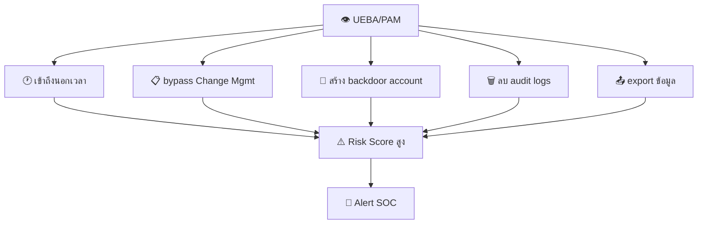
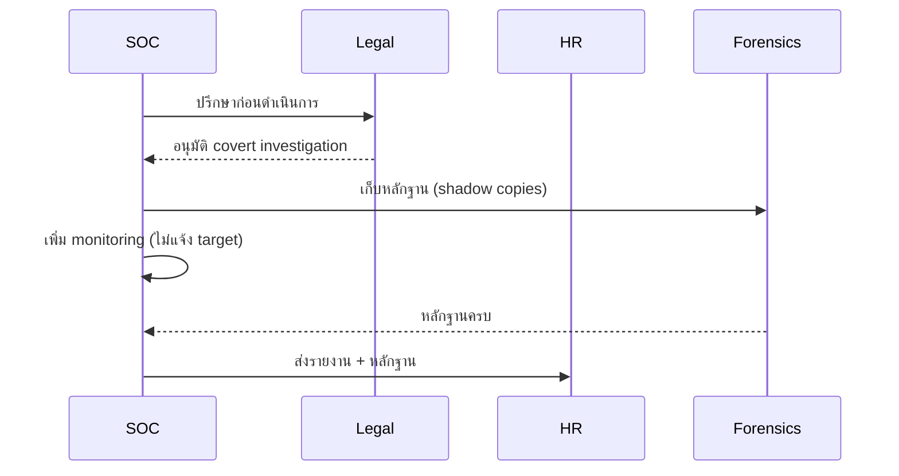
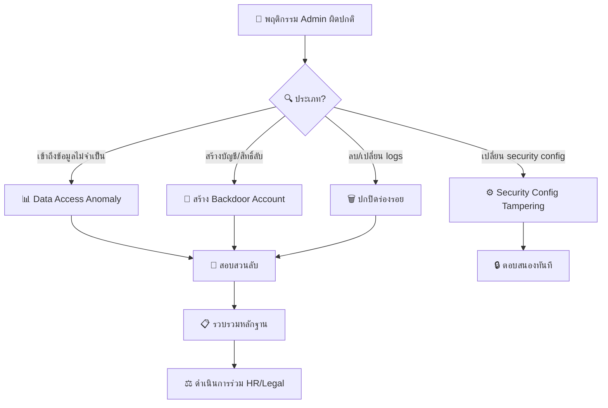
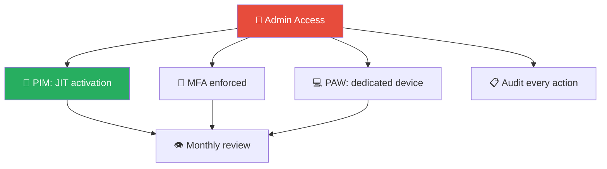
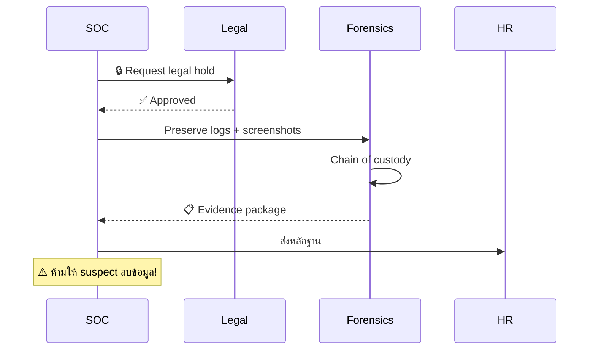

# Playbook: แอดมินกระทำผิด / Insider Admin

**ID**: PB-20
**ระดับความรุนแรง**: วิกฤต | **หมวดหมู่**: ภัยคุกคามจากภายใน
**MITRE ATT&CK**: [T1078.002](https://attack.mitre.org/techniques/T1078/002/) (บัญชีโดเมน), [T1098](https://attack.mitre.org/techniques/T1098/) (การจัดการบัญชี)
**ทริกเกอร์**: PAM alert, AD audit anomaly, whistleblower report, UEBA, SOD violation

### ผังตัวบ่งชี้พฤติกรรม

### ผัง Covert Investigation

---

## ผังการตัดสินใจ

---

## 1. การวิเคราะห์

### 1.1 ตัวบ่งชี้พฤติกรรม

| ตัวบ่งชี้ | ความเสี่ยง | การตรวจจับ |
|:---|:---|:---|
| เข้าถึงข้อมูลนอกขอบเขตหน้าที่ | 🔴 สูง | UEBA / DLP |
| สร้างบัญชีหรือ service account ลับ | 🔴 สูง | AD audit |
| เพิ่มสิทธิ์ให้ตัวเองหรือผู้อื่นโดยไม่ได้รับอนุมัติ | 🔴 สูง | IAM audit |
| ลบหรือแก้ไข logs | 🔴 วิกฤต | SIEM integrity |
| ปิดการ monitoring / เปลี่ยน security config | 🔴 วิกฤต | Change management |
| ส่งออกข้อมูลจำนวนมาก | 🔴 สูง | DLP / Netflow |
| เข้าถึงนอกเวลาทำงานบ่อยๆ | 🟡 ปานกลาง | SIEM |

### 1.2 รายการตรวจสอบ (ดำเนินการอย่างลับ)

| รายการ | วิธีตรวจสอบ | เสร็จ |
|:---|:---|:---:|
| ระบุบัญชี admin ที่เกี่ยวข้อง | SIEM / AD audit | ☐ |
| กิจกรรมที่ผิดปกติคืออะไร? | UEBA / Logs | ☐ |
| มีบัญชีลับถูกสร้างหรือไม่? | AD / IAM audit | ☐ |
| มีสิทธิ์ถูกเปลี่ยนแปลงหรือไม่? | IAM / RBAC audit | ☐ |
| มีข้อมูลถูกส่งออกหรือไม่? | DLP / Netflow | ☐ |
| มี logs ถูกลบหรือแก้ไขหรือไม่? | SIEM log integrity | ☐ |
| ประวัติด้านวินัยหรือ HR? | HR consultation | ☐ |
| กำลังลาออก (notice period)? | HR | ☐ |

> ⚠️ **สำคัญ**: ห้ามแจ้งผู้ต้องสงสัยจนกว่าจะรวบรวมหลักฐานเสร็จและหารือกับ HR/Legal แล้ว

---

## 2. การควบคุม

### 2.1 การสอบสวนลับ (พบ: เข้าถึงข้อมูล / ส่งออก)

| # | การดำเนินการ | เสร็จ |
|:---:|:---|:---:|
| 1 | เพิ่ม monitoring ลับบนบัญชี admin | ☐ |
| 2 | บันทึก session recordings (หากมี PAM) | ☐ |
| 3 | สำรอง forensic image ของเครื่องที่ใช้ | ☐ |
| 4 | แจ้ง HR + Legal อย่างลับๆ | ☐ |
| 5 | ตรวจสอบ second admin/peer review บัญชี | ☐ |

### 2.2 การตอบสนองทันที (พบ: ลบ logs / เปลี่ยน security / backdoor)

| # | การดำเนินการ | เสร็จ |
|:---:|:---|:---:|
| 1 | **ปิดบัญชี admin** ทันที | ☐ |
| 2 | **ลบ** backdoor accounts / service accounts ที่สร้าง | ☐ |
| 3 | **คืนค่า** security configurations | ☐ |
| 4 | **ทบทวน** syslog forwarding / SIEM integrity | ☐ |
| 5 | **สำรอง forensic image** | ☐ |

---

## 3. การกำจัด

| # | การดำเนินการ | เสร็จ |
|:---:|:---|:---:|
| 1 | ลบบัญชี/สิทธิ์ที่ไม่ได้รับอนุมัติทั้งหมด | ☐ |
| 2 | คืนค่า configurations ที่ถูกเปลี่ยน | ☐ |
| 3 | หมุนเวียน credentials ที่ admin เข้าถึงได้ | ☐ |
| 4 | ตรวจสอบว่ามี persistence mechanisms อื่นหรือไม่ | ☐ |

---

## 4. การฟื้นฟู

| # | การดำเนินการ | เสร็จ |
|:---:|:---|:---:|
| 1 | ใช้ PAM (Privileged Access Management) สำหรับบัญชี admin ทั้งหมด | ☐ |
| 2 | บังคับ admin MFA + session recording | ☐ |
| 3 | ใช้ JIT (Just-In-Time) admin access | ☐ |
| 4 | ใช้ dual-approval สำหรับ security-critical changes | ☐ |
| 5 | ตรวจสอบสิทธิ์ admin ทุกไตรมาส | ☐ |

---

## 5. เกณฑ์การยกระดับ

| เงื่อนไข | ยกระดับไปยัง |
|:---|:---|
| ข้อมูลลูกค้าถูกส่งออก | Legal + DPO (PDPA 72 ชม.) |
| Logs ถูกลบ/แก้ไข | CISO ทันที |
| Backdoor account สร้างขึ้น | CISO + IT Director |
| ทำร่วมกับบุคคลภายนอก | Law Enforcement |
| Domain Admin / Root ถูกใช้ในทางที่ผิด | Major Incident |

---

### ผัง Admin Access Control

### ผัง Evidence Preservation

## เอกสารที่เกี่ยวข้อง

- [กรอบการตอบสนองต่อเหตุการณ์](../Framework.th.md)
- [แม่แบบรายงานเหตุการณ์](../../templates/incident_report.th.md)
- [PB-14 ภัยคุกคามจากภายใน](Insider_Threat.th.md)
- [PB-15 การลบ Log](Log_Clearing.th.md)

## อ้างอิง

- [MITRE ATT&CK T1078 — Valid Accounts](https://attack.mitre.org/techniques/T1078/)
- [NIST SP 800-53 — AC-6 Least Privilege](https://csrc.nist.gov/publications/detail/sp/800-53/rev-5/final)
