# Playbook: Rootkit / Bootkit Response

**ID**: PB-45
**Severity**: Critical | **Category**: Defense Evasion / Persistence
**MITRE ATT&CK**: [T1014](https://attack.mitre.org/techniques/T1014/) (Rootkit), [T1542](https://attack.mitre.org/techniques/T1542/) (Pre-OS Boot), [T1542.003](https://attack.mitre.org/techniques/T1542/003/) (Bootkit)
**Trigger**: EDR alert (kernel-level hooking), AV (rootkit detection), system instability with hidden processes, UEFI integrity check failure

> ⚠️ **CRITICAL**: Rootkits operate below the OS — standard tools CANNOT detect them. Bootkits survive OS reinstallation. Specialized tools and hardware reimaging may be required.

### Rootkit / Bootkit Taxonomy


### Known Rootkit Families


---

## Decision Flow

```mermaid
graph TD
    Alert["🚨 Suspected Rootkit/Bootkit"] --> Source{"Detection method?"}
    Source -->|"EDR"| EDR["Kernel hooking detected\nSuspicious driver loaded"]
    Source -->|"AV/UEFI scan"| AV["Rootkit signature match\nor integrity failure"]
    Source -->|"Anomaly"| Anomaly["Hidden processes\nMissing disk space\nUnexplained network traffic"]
    EDR --> Confirm["Run offline rootkit scanner"]
    AV --> Confirm
    Anomaly --> Confirm
    Confirm --> Found{"Rootkit confirmed?"}
    Found -->|"User-mode"| UserR["🟠 Medium\nRemovable with AV"]
    Found -->|"Kernel-mode"| KernelR["🔴 Critical\nReimage required"]
    Found -->|"UEFI/Bootkit"| UEFIR["💀 Catastrophic\nReflash firmware"]
    Found -->|"Not found"| FP["Continue monitoring\nSchedule deep scan"]
    KernelR --> Isolate["ISOLATE — preserve for forensics"]
    UEFIR --> Isolate
    style Alert fill:#660000,color:#fff
    style UEFIR fill:#660000,color:#fff
    style KernelR fill:#cc0000,color:#fff
```



### Detection Challenge Visualization

```mermaid
graph TD
    subgraph "Visibility Layers"
        L1["Application Layer\n✅ Standard AV can see"]
        L2["User-mode API\n⚠️ API hooks can hide"]
        L3["Kernel / Drivers\n🔴 Kernel rootkits hide here"]
        L4["Boot Process\n💀 Bootkits load before OS"]
        L5["Firmware/UEFI\n💀 Nearly invisible"]
    end
    L1 --> L2 --> L3 --> L4 --> L5
    style L1 fill:#00aa00,color:#fff
    style L2 fill:#ffcc00,color:#000
    style L3 fill:#ff4444,color:#fff
    style L4 fill:#cc0000,color:#fff
    style L5 fill:#660000,color:#fff
```



### Investigation Workflow

```mermaid
sequenceDiagram
    participant EDR
    participant SOC as SOC Analyst
    participant IR as IR Team
    participant Forensics
    participant IT as IT Ops

    EDR->>SOC: 🚨 Kernel-level anomaly detected
    SOC->>SOC: Verify with offline scan tool
    SOC->>IR: Escalate — rootkit suspected
    IR->>Forensics: Boot from clean USB, scan offline
    Forensics->>IR: Confirm rootkit type & family
    IR->>IT: Isolate — do NOT reboot (may destroy evidence)
    IR->>Forensics: Memory dump + disk image
    Forensics->>IR: Full analysis report
    IR->>IT: Reimage (kernel) or reflash (UEFI)
```



### Rootkit Persistence Depth

```mermaid
graph TD
    Persist["Persistence Depth"] --> AppP["Application\nRestart survives reboot"]
    Persist --> ServiceP["Service/Driver\nSurvives reboot"]
    Persist --> BootP["Boot Sector\nSurvives OS reinstall"]
    Persist --> FirmP["Firmware/UEFI\nSurvives disk replacement"]
    AppP --> Reset1["🟢 Reset: Remove app/service"]
    ServiceP --> Reset2["🟡 Reset: Reimage OS"]
    BootP --> Reset3["🔴 Reset: Wipe disk + reimage"]
    FirmP --> Reset4["💀 Reset: Reflash firmware\nor replace hardware"]
    style FirmP fill:#660000,color:#fff
    style Reset4 fill:#660000,color:#fff
```



### Response Timeline


---

## 1. Immediate Actions (First 30 Minutes)

| # | Action | Owner |
|:---|:---|:---|
| 1 | **DO NOT REBOOT** — rootkit may alter behavior on reboot | SOC T1 |
| 2 | Network-isolate the endpoint (EDR or physical) | SOC T1 |
| 3 | Acquire memory dump BEFORE any remediation | IR Team |
| 4 | Acquire disk image for forensic analysis | IR Team |
| 5 | Run offline rootkit scanner from clean USB | IR Team |
| 6 | Check UEFI/Secure Boot integrity | IT Ops |

## 2. Investigation Checklist

### Rootkit Detection Tools
- [ ] Run GMER or TDSSKiller (offline)
- [ ] Check loaded kernel drivers: `driverquery /v`
- [ ] Compare running processes (task manager vs API-level tools)
- [ ] Check for hidden files with forensic tools (FTK Imager)
- [ ] Verify MBR/VBR integrity (compare with known-good hash)
- [ ] Check UEFI firmware hash against manufacturer baseline

### Behavioral Indicators
- [ ] Processes visible in memory dump but not in Task Manager
- [ ] Network connections not shown by `netstat`
- [ ] Disk space usage doesn't match visible files
- [ ] System clock anomalies
- [ ] AV/EDR agent crashes or cannot update
- [ ] Blue screens with unusual stop codes

### Persistence Analysis
- [ ] Kernel drivers loaded from unusual paths
- [ ] Services with no corresponding binary
- [ ] MBR/VBR modified from known-good state
- [ ] UEFI variables or EFI partition modified
- [ ] Secure Boot status (enabled/disabled/bypassed)

## 3. Containment

| Scope | Action |
|:---|:---|
| **Network** | Full isolation — no connectivity |
| **Endpoint** | Do NOT reboot, preserve state |
| **Evidence** | Memory dump + full disk image |
| **Spread** | Check same hardware model for similar infection |

## 4. Eradication & Recovery

### By Rootkit Type
| Type | Recovery Method |
|:---|:---|
| User-mode | AV removal → verify → monitor |
| Kernel-mode | Full disk wipe + OS reimage |
| Bootkit (MBR) | Wipe disk + reimage + verify MBR |
| UEFI rootkit | Reflash firmware from manufacturer + reimage |
| Firmware rootkit | Replace hardware if reflash impossible |

### Recovery Verification
1. Boot from known-clean media
2. Run offline rootkit scan on reimaged system
3. Verify UEFI/Secure Boot settings
4. Monitor for re-infection indicators (7 days)
5. Deploy additional kernel protection (HVCI, VBS)

## 5. Post-Incident

| Question | Answer |
|:---|:---|
| How was the rootkit delivered? | [Vector] |
| Was Secure Boot enabled? | [Yes/No] |
| Was driver signing enforced? | [Yes/No] |
| How long was the rootkit active? | [Duration] |
| Were other systems affected? | [Count] |

## 6. Detection Rules (Sigma)

```yaml
title: Suspicious Kernel Driver Loaded
logsource:
    product: windows
    service: system
detection:
    selection:
        EventID: 7045
        ServiceType: 'kernel mode driver'
    filter:
        ImagePath|startswith:
            - 'C:\Windows\System32\drivers\'
    condition: selection and not filter
    level: critical
```

```yaml
title: Unsigned Driver Load Attempt
logsource:
    product: windows
    category: driver_load
detection:
    selection:
        Signed: 'false'
    condition: selection
    level: high
```

## Related Documents
- [IR Framework](../Framework.en.md)
- [Sigma Rules Index](../../08_Detection_Engineering/sigma_rules/)
- [Malware Infection Playbook](Malware_Infection.en.md)
- [Credential Dumping Playbook](Credential_Dumping.en.md)
- [Wiper Attack Playbook](Wiper_Attack.en.md)
- [Tier 3 Runbook](../Runbooks/Tier3_Runbook.en.md)

## References
- [MITRE T1014 — Rootkit](https://attack.mitre.org/techniques/T1014/)
- [MITRE T1542 — Pre-OS Boot](https://attack.mitre.org/techniques/T1542/)
- [ESET — UEFI Threats](https://www.welivesecurity.com/)
