# Playbook: SIM Swap / SIM Hijacking Response

**ID**: PB-46
**Severity**: Critical | **Category**: Credential Access / Social Engineering
**MITRE ATT&CK**: [T1111](https://attack.mitre.org/techniques/T1111/) (Multi-Factor Authentication Interception), [T1078](https://attack.mitre.org/techniques/T1078/) (Valid Accounts)
**Trigger**: User report (phone service lost), MFA SMS failures, carrier fraud alert, account takeover after phone number transfer

> ⚠️ **CRITICAL**: SIM swap bypasses SMS-based MFA completely. The attacker takes your phone number, receives all your OTPs, and takes over email, banking, and crypto accounts.

### SIM Swap Attack Chain

```mermaid
graph LR
    A["1️⃣ OSINT/Social\nGather victim info"] --> B["2️⃣ Carrier Contact\nImpersonate victim"]
    B --> C["3️⃣ SIM Transfer\nNumber on new SIM"]
    C --> D["4️⃣ MFA Intercept\nReceive all SMS OTPs"]
    D --> E["5️⃣ Account Takeover\nEmail, banking, crypto"]
    E --> F["6️⃣ Financial Theft\nWire transfer, crypto drain"]
    style A fill:#ffcc00,color:#000
    style C fill:#ff6600,color:#fff
    style E fill:#ff4444,color:#fff
    style F fill:#660000,color:#fff
```



### SIM Swap Impact Map

```mermaid
graph TD
    SIM["📱 SIM Swap Successful"] --> SMS["Receive all SMS\nOTPs, verification codes"]
    SMS --> Email["Email Takeover\nPassword reset via SMS"]
    SMS --> Bank["Banking Access\nOTP for wire transfers"]
    SMS --> Crypto["Crypto Wallet\nSMS 2FA bypass"]
    SMS --> Social["Social Media\nAccount hijacking"]
    Email --> Chain["🔴 Chain Attack\nEmail → reset ALL accounts"]
    Bank --> Loss["💀 Financial Loss\nDirect theft"]
    Crypto --> Loss
    style SIM fill:#ff4444,color:#fff
    style Chain fill:#cc0000,color:#fff
    style Loss fill:#660000,color:#fff
```



---

## Decision Flow


### Response Coordination

```mermaid
sequenceDiagram
    participant User
    participant SOC as SOC/IT Security
    participant Carrier as Mobile Carrier
    participant IAM as IAM Team
    participant Bank as Banking/Finance

    User->>SOC: 🚨 Phone lost service, accounts locked
    SOC->>Carrier: Verify SIM swap — was it authorized?
    Carrier->>SOC: Unauthorized SIM swap confirmed
    SOC->>Carrier: Emergency freeze + reverse swap
    SOC->>IAM: Lock ALL accounts linked to phone number
    IAM->>IAM: Disable SMS MFA, switch to FIDO2/app
    SOC->>Bank: Alert — potential wire/crypto theft
    Bank->>Bank: Freeze transactions, flag account
    SOC->>User: Provide new secure MFA method
```



### MFA Method Risk Comparison


### Timeline


---

## 1. Immediate Actions (First 15 Minutes)

| # | Action | Owner |
|:---|:---|:---|
| 1 | Contact mobile carrier — confirm unauthorized SIM swap | User / SOC |
| 2 | Request carrier to freeze number and reverse swap | SOC |
| 3 | Lock all accounts using phone number for MFA | IAM Team |
| 4 | Check email for password reset notifications | SOC T1 |
| 5 | Alert banking/finance for potential fraud | Finance |
| 6 | Change passwords on all critical accounts | User / IAM |

## 2. Investigation Checklist

### Carrier Investigation
- [ ] When did the SIM swap occur? (exact timestamp)
- [ ] Which carrier store/channel processed the swap?
- [ ] What identity documents were used?
- [ ] Was it in-person, online, or phone channel?
- [ ] Can carrier provide caller/visitor information?

### Account Impact Assessment
- [ ] Which accounts use SMS MFA linked to this number?
- [ ] Were any password resets triggered during the swap window?
- [ ] Check email sent/deleted items for attacker activity
- [ ] Check banking/crypto for unauthorized transactions
- [ ] Check social media for unauthorized posts/messages

## 3. Containment

| Scope | Action |
|:---|:---|
| **Phone number** | Carrier freeze + reverse swap |
| **Email** | Change password + revoke sessions |
| **Banking** | Freeze account + report fraud |
| **Crypto** | Transfer to cold wallet if still accessible |
| **MFA** | Switch ALL accounts from SMS to FIDO2/app |

## 4. Post-Incident

| Question | Answer |
|:---|:---|
| How did attacker obtain victim's info? | [OSINT/phishing/breach] |
| Was carrier's identity verification sufficient? | [Assessment] |
| Which accounts were compromised? | [List] |
| What financial losses occurred? | [Amount] |
| Has SMS MFA been eliminated? | [Status] |

## 6. Detection Rules (Sigma)

```yaml
title: Multiple MFA SMS Delivery Failures
logsource:
    product: iam
    service: authentication
detection:
    selection:
        event_type: 'mfa_sms_delivery_failed'
    timeframe: 15m
    condition: selection | count(target_user) > 3
    level: high
```

## Related Documents
- [Account Compromise Playbook](Account_Compromise.en.md)
- [MFA Bypass Playbook](MFA_Bypass.en.md)
- [BEC Playbook](BEC.en.md)

## References
- [FBI — SIM Swap Alert](https://www.ic3.gov/Media/Y2022/PSA220208)
- [NIST — MFA Guidance](https://pages.nist.gov/800-63-3/)
